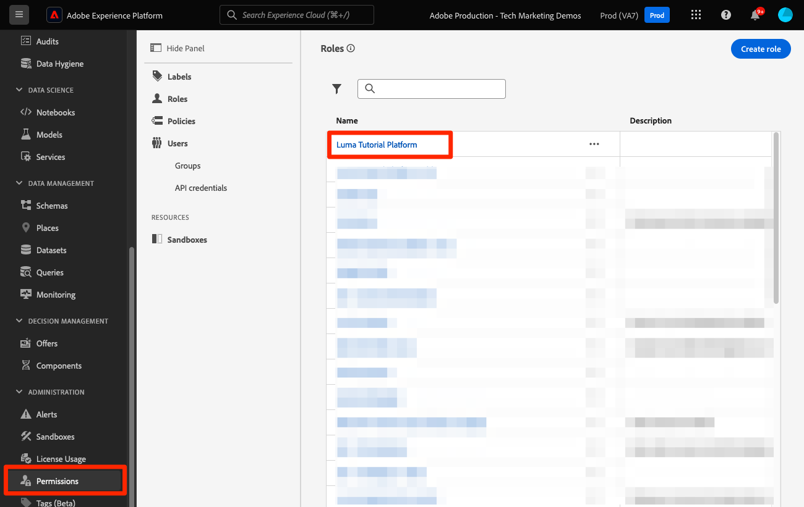

# Configurare Console sviluppatori e [!DNL Postman]

<!--30min-->

In questa lezione, configurerai un progetto nella console Adobe Developer e lo scaricherai [!DNL Postman] affinché tu possa iniziare a utilizzare le API di Platform.

Per completare gli esercizi API descritti in questa esercitazione, [scarica l’app Postman per il tuo sistema operativo.](https://www.postman.com/downloads/) Anche se non è necessario per utilizzare le API Experience Platform, Postman semplifica i flussi di lavoro API e Adobe Experience Platform fornisce decine di raccolte Postman per aiutarti a eseguire chiamate API e a imparare come funzionano. Il resto di questo tutorial presuppone una certa conoscenza operativa di Postman. Per assistenza, fai riferimento a [Documentazione di Postman](https://learning.postman.com/).

La piattaforma è stata creata prima in base alle API. Sebbene esistano opzioni di interfaccia anche per tutte le attività principali, a un certo punto potresti voler utilizzare l’API di Platform. Ad esempio, per acquisire i dati, spostare gli elementi da una sandbox all’altra, automatizzare le attività di routine o utilizzare le nuove funzioni di Platform prima che l’interfaccia utente sia stata generata.

**Architetti di dati** e **Ingegneri dati** potrebbe essere necessario utilizzare l’API di Platform al di fuori di questa esercitazione.

## Autorizzazioni richieste

In [Configurare le autorizzazioni](configure-permissions.md) Per completare questa lezione, è necessario impostare tutti i controlli di accesso necessari.

<!--
* Permission item Sandboxes > `Luma Tutorial`
* Developer-role access to the `Luma Tutorial Platform` product profile
-->

## Configurare la console Adobe Developer

La console Adobe Developer è la destinazione per sviluppatori che consente di accedere a API e SDK Adobe, ascoltare eventi in tempo reale, eseguire funzioni in fase di esecuzione o creare plug-in o applicazioni App Builder. Lo utilizzerai per accedere all’API Experience Platform. Per ulteriori dettagli, vedi [Documentazione della console Adobe Developer](https://www.adobe.io/apis/experienceplatform/console/docs.html)

1. Crea una cartella sul computer locale denominata `Luma Tutorial Assets` per i file utilizzati nell’esercitazione.

1. Apri [Console Adobe Developer](https://console.adobe.io){target="_blank"}

1. Accedi e verifica di essere nell’organizzazione corretta

1. Seleziona **[!UICONTROL Crea nuovo progetto]** in [!UICONTROL Guida rapida] menu.

   

1. Nel progetto appena creato, seleziona la **[!UICONTROL Modifica Progetto]** pulsante
1. Modificare il **[!UICONTROL Titolo progetto]** a `Luma Tutorial API Project` (aggiungi il tuo nome alla fine, se più persone della tua azienda stanno seguendo questo tutorial)
1. Seleziona **[!UICONTROL Salva]**

   

1. Seleziona **[!UICONTROL Aggiungi API]**

   

1. Filtra l’elenco selezionando **[!UICONTROL Adobe Experience Platform]**

1. Nell’elenco delle API disponibili, seleziona **[!UICONTROL API EXPERIENCE PLATFORM]** e seleziona **[!UICONTROL Successivo]**.

   

1. Seleziona **[!UICONTROL OAuth Server-to-Server]** come credenziali e seleziona **[!UICONTROL Successivo]**.
   

1. Seleziona la `AEP-Default-All-Users` profilo di prodotto e seleziona **[!UICONTROL Salva API configurata]**

   

1. Ora il progetto Console sviluppatori è stato creato.

1. In **[!UICONTROL Provatelo]** sezione della pagina, seleziona **[!UICONTROL Scarica per Postman]** e quindi seleziona **[!UICONTROL OAuth Server-to-Server]** per scaricare [!DNL Postman] file json dell’ambiente. Salva il `oauth_server_to_server.postman_environment.json` nel tuo `Luma Tutorial Assets` cartella.

   

## Chiedi a un amministratore di sistema di aggiungere le credenziali API al ruolo

Per utilizzare le credenziali API per interagire con Experience Platform, è necessario che un amministratore di sistema assegni le credenziali API al ruolo creato nella lezione precedente.  Se non sei un amministratore di sistema, puoi inviarli:

1. Il [!UICONTROL Nome] delle credenziali API (`Credential in Luma Tutorial API Project`)
1. Il [!UICONTROL E-mail account tecnico] delle credenziali (in questo modo l’amministratore di sistema potrà trovare le credenziali)

   ![[!UICONTROL Nome] e [!UICONTROL E-mail account tecnico] delle credenziali](assets/postman-credentialDetails.png)

Seguono le istruzioni per l’amministratore di sistema:

1. Accedi a [Adobe Experience Platform](https://platform.adobe.com)
1. Seleziona **[!UICONTROL Autorizzazioni]** nella barra di navigazione a sinistra, che consente di accedere al [!UICONTROL Ruoli] screen
1. Apri `Luma Tutorial Platform` ruolo
   
1. Seleziona la **[!UICONTROL Credenziali API]** scheda
1. Seleziona **[!UICONTROL Aggiungi credenziali API]**
   
1. Trova il `Credential in Luma Tutorial API Project` credenziali, filtro con [!UICONTROL E-mail account tecnico] fornito dal partecipante all’esercitazione, se l’elenco è lungo
1. Seleziona le credenziali
1. Seleziona **[!UICONTROL Salva]**

   

## Configurare Postman

>[!CAUTION]
>
>L’interfaccia di Postman viene aggiornata regolarmente. Le schermate di questo tutorial sono state scattate con Postman v10.15.1 per Mac, ma le opzioni dell’interfaccia potrebbero essere cambiate.

1. Scarica e installa [[!DNL Postman]](https://www.postman.com/downloads/)
1. Apri [!DNL Postman] e creare un’area di lavoro
   

1. Importare il file di ambiente json scaricato `oauth_server_to_server.postman_environment.json`
   
1. In entrata [!DNL Postman], seleziona l’ambiente nel menu a discesa

1. Seleziona l’icona per visualizzare le variabili di ambiente:

   

### Aggiungere il nome della sandbox e l’ID tenant

Il `SANDBOX_NAME` e `TENANT_ID` e `CONTAINER_ID` Le variabili non sono incluse nell’esportazione della console Adobe Developer, per cui le aggiungiamo manualmente:

1. In entrata [!DNL Postman], apri **Variabili di ambiente**
1. Seleziona la **Modifica** collegamento a destra del nome dell’ambiente
1. In **Aggiungi nuovo campo variabile**, immetti `SANDBOX_NAME`
1. In entrambi i campi valore, immetti `luma-tutorial`, il nome che abbiamo dato alla sandbox nella lezione precedente. Se hai utilizzato un nome diverso per la sandbox, ad esempio luma-tutorial-ignatiusjreilly, assicurati di utilizzare tale valore.
1. In **Aggiungi nuovo campo variabile**, immetti `TENANT_ID`
1. Passa al browser web e cerca l’ID tenant della tua azienda andando nell’interfaccia di Experience Platform ed estraendo la porzione dell’URL *dopo il simbolo @*. Ad esempio, il mio ID tenant è `techmarketingdemos` ma il tuo è diverso:

   

1. Copia questo valore e torna al [!DNL Postman] Schermata Gestisci ambienti
1. Incolla l’ID tenant in entrambi i campi valore
1. In **Aggiungi nuovo campo variabile**, immetti `CONTAINER_ID`
1. Invio `global` in entrambi i campi valore

   >[!NOTE]
   >
   >`CONTAINER_ID` è un campo il cui valore viene modificato più volte durante l’esercitazione. Quando `global` interagisce con gli elementi forniti da Adobe nell’account Platform. Quando `tenant` Se viene utilizzato, l’API interagisce con i tuoi elementi personalizzati.

1. Seleziona **Salva**

   

## Effettuare chiamate API

### Recuperare un token di accesso

Adobe fornisce un set completo di [!DNL Postman] raccolte per esplorare le API di Experience Platform. Queste raccolte sono nel [Adobe Experience Platform Postman: esempi di archivio GitHub](https://github.com/adobe/experience-platform-postman-samples). Applica un segnalibro a questo archivio, in quanto lo utilizzerai numerose volte durante questa esercitazione e in seguito durante l’implementazione di Experience Platform per la tua azienda.

La prima raccolta funziona con le API Adobe Identity Management Service (IMS). È un modo pratico per recuperare un token di accesso da Postman.

Per generare il token di accesso:

1. Scarica il file [Raccolta API del servizio Identity Management](https://github.com/adobe/experience-platform-postman-samples/blob/master/apis/ims/Identity%20Management%20Service.postman_collection.json) al tuo `Luma Tutorial Assets` cartella
1. Importa la raccolta in [!DNL Postman]
1. Seleziona la richiesta **oAuth: richiedi token di accesso** richiedi e seleziona **Invia**
1. Dovresti ricevere un `200 OK` risposta con un token di accesso nella risposta

   

1. Il token di accesso deve essere memorizzato automaticamente come **ACCESS_TOKEN** variabile di ambiente del [!DNL Postman] ambiente.

   

### Interagire con un’API di Platform

Effettuiamo ora una chiamata API Platform per confermare che tutto è stato configurato correttamente.

Apri [Experience Platform [!DNL Postman] raccolte in GitHub](https://github.com/adobe/experience-platform-postman-samples/tree/master/apis/experience-platform). In questa pagina sono presenti molte raccolte, per diverse API di Platform. Raccomando vivamente di segnalibro.

Ora effettuiamo la nostra prima chiamata API:

1. Scarica il file [Raccolta API del registro dello schema](https://raw.githubusercontent.com/adobe/experience-platform-postman-samples/master/apis/experience-platform/Schema%20Registry%20API.postman_collection.json) al tuo `Luma Tutorial Assets` cartella
1. Importa in [!DNL Postman]
1. Apri **Schema Registry API > Schemi > Elenca schemi**
1. Osserva la **Parametri** e **Intestazioni** e annota come includono alcune delle variabili di ambiente immesse in precedenza.
1. Tieni presente che **Intestazioni > Campo Accetta valore** è impostato su `application/vnd.adobe.xed-id+json`. Le API del registro dello schema richiedono una di queste [valori di intestazione Accept specificati](https://experienceleague.adobe.com/docs/experience-platform/xdm/api/getting-started.html?lang=en#accept) che forniscono formati diversi nella risposta.
1. Seleziona **Invia** per effettuare la tua prima chiamata API Platform.

Speriamo che tu abbia avuto successo `200 OK` risposta contenente un elenco degli schemi XDM forniti dall’Adobe disponibili nella sandbox, come illustrato di seguito.

Se la chiamata non ha avuto esito positivo, attendi un attimo a eseguire il debug utilizzando i dettagli della risposta di errore della chiamata API e controlla i passaggi precedenti. Se si blocca, richiedere assistenza nella [Forum della community](https://experienceleaguecommunities.adobe.com/t5/adobe-experience-platform/ct-p/adobe-experience-platform-community) In alternativa, utilizza il collegamento sul lato destro della pagina per &quot;Segnalare un problema&quot;.

Con le autorizzazioni della piattaforma, la sandbox e [!DNL Postman] , è possibile eseguire le operazioni seguenti: [dati modello negli schemi](model-data-in-schemas.md)!
