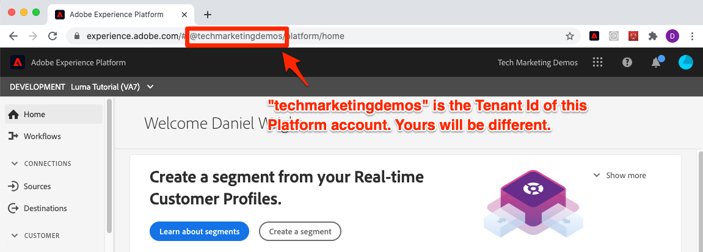

# Configurare Developer Console e [!DNL Postman]

<!--30min-->

In questa lezione, configurerai un progetto nella console Adobe Developer e lo scaricherai [!DNL Postman] raccolte per iniziare a utilizzare le API di Platform.

Per completare gli esercizi API in questa esercitazione, [scarica l’app Postman per il tuo sistema operativo.](https://www.postman.com/downloads/) Sebbene non sia necessario per utilizzare le API di Experience Platform, Postman semplifica i flussi di lavoro API e Adobe Experience Platform fornisce decine di raccolte Postman per aiutarti a eseguire le chiamate API e imparare come funzionano. Il resto di questa esercitazione presuppone una buona conoscenza di Postman. Per assistenza, fare riferimento al [Documentazione di Postman](https://learning.postman.com/).

Platform è la prima API integrata. Sebbene esistano anche opzioni di interfaccia per tutte le attività principali, a un certo punto potrebbe essere utile utilizzare l’API di Platform. Ad esempio, per acquisire i dati, spostare gli elementi tra le sandbox, automatizzare le attività di routine o utilizzare nuove funzioni di Platform prima che l’interfaccia utente sia stata creata.

**Architetti dei dati** e **Ingegneri dati** potrebbe essere necessario utilizzare l’API di Platform al di fuori di questa esercitazione.

## Autorizzazioni necessarie

In [Configurare le autorizzazioni](configure-permissions.md) per completare la lezione, è necessario impostare tutti i controlli di accesso necessari.

<!--
* Permission item Sandboxes > `Luma Tutorial`
* Developer-role access to the `Luma Tutorial Platform` product profile
-->

## Configurazione della console Adobe Developer

Adobe Developer Console è la destinazione per sviluppatori per accedere alle API e agli SDK di Adobe, ascoltare eventi in tempo reale, eseguire funzioni in Runtime o creare plug-in o app App Builder. Lo utilizzerai per accedere all’API Experience Platform. Per ulteriori dettagli, consulta la sezione [Documentazione della console Adobe Developer](https://www.adobe.io/apis/experienceplatform/console/docs.html)

1. Crea una cartella nel computer locale denominata `Luma Tutorial Assets` per i file utilizzati nell’esercitazione.

1. Apri [Console Adobe Developer](https://console.adobe.io)

1. Accedi e conferma di essere nell&#39;organizzazione corretta

1. Seleziona **[!UICONTROL Crea nuovo progetto]** in [!UICONTROL Guida introduttiva] menu.

   

1. Nel nuovo progetto creato, seleziona la **[!UICONTROL Aggiungi a progetto]** quindi seleziona **[!UICONTROL API]**

   

1. Filtrare l’elenco selezionando **[!UICONTROL Adobe Experience Platform]**

1. Nell’elenco delle API disponibili, seleziona **[!UICONTROL API Experience Platform]** e seleziona **[!UICONTROL Successivo]**.

   

1. Per l&#39;autenticazione da sistemi esterni come [!DNL Postman], è necessaria una coppia di chiavi pubblica/privata. Per generare una nuova coppia di chiavi, seleziona **[!UICONTROL Opzione 1]**  e premere **[!UICONTROL Genera coppia di chiavi]** pulsante

   

1. Quando le chiavi sono pronte, potrebbe essere richiesto di scaricare le chiavi sul computer locale. Salva le chiavi incluse in `config.zip` nella cartella `Luma Tutorial Assets`. Ne avremo bisogno nel prossimo esercizio.

1. Una volta generata la chiave, la chiave pubblica verrà aggiunta automaticamente al progetto come mostrato nella schermata . Seleziona la **[!UICONTROL Successivo]** pulsante .

   

1. Seleziona la `Luma Tutorial Platform` profilo di prodotto e seleziona il **[!UICONTROL Salva API configurata]** pulsante

   

1. Ora è stato creato il tuo progetto Console per sviluppatori .

1. In **[!UICONTROL Provate]** della pagina, seleziona **[!UICONTROL Scarica per Postman]** quindi seleziona **[!UICONTROL Account di servizio (JWT)]** per scaricare [!DNL Postman] file json di ambiente. Salva il `service.postman_environment.json` nel tuo `Luma Tutorial Assets` cartella.

   

   >[!NOTE]
   >
   >Gli amministratori di sistema della tua organizzazione possono visualizzare il progetto come &quot;Credenziale API&quot; nel profilo di prodotto nell’Admin Console
   >
   >

Avrete notato che al progetto è stato assegnato un numero, ad esempio &quot;Progetto 12&quot;:

1. Seleziona il numero del progetto nella breadcrumb.
1. Seleziona la **[!UICONTROL Modifica progetto]** pulsante
1. Modificare la **[!UICONTROL Titolo del progetto]** a `Luma Tutorial API Project` (aggiungi il tuo nome alla fine, se più persone della tua azienda stanno seguendo questa esercitazione)
1. Seleziona il pulsante **[!UICONTROL Salva]**

   

## Configurazione Postman

>[!CAUTION]
>
>L’interfaccia di Postman viene aggiornata regolarmente. Le schermate in questa esercitazione sono state scattate con Postman v9.0.5 per Mac, ma le opzioni di interfaccia potrebbero essere cambiate.

1. Scarica e installa [[!DNL Postman]](https://www.postman.com/downloads/)
1. Apri [!DNL Postman] e importare il file di ambiente json scaricato, `service.postman_environment.json`
   
1. In [!DNL Postman], seleziona l’ambiente nel menu a discesa

   
1. Seleziona la **occhio** per visualizzare le variabili di ambiente:

   

### Aggiorna nome ambiente

Poiché il nome esportato dell’ambiente da Developer Console viene generato in modo casuale, assegnagli un nome più descrittivo in modo da non confondere gli ambienti in un secondo momento quando inizi a lavorare sull’implementazione effettiva di Platform:

1. Con la schermata delle variabili di ambiente ancora aperta, seleziona **Modifica** in alto a destra
1. Aggiorna **Nome dell&#39;ambiente** a `Luma Tutorial`
1. Esci **Gestire gli ambienti** apertura modale in modalità di modifica, in quanto la modificheremo ulteriormente nel passaggio successivo

   

### Aggiungi la chiave privata

Ora è il momento di aggiungere il valore PRIVATE_KEY all’ambiente Postman

1. Estrai il download `config.zip` file generato nell’esercizio precedente durante la creazione del progetto Console per sviluppatori. Questo file zip contiene due file:
   * `private.key`
   * `certificate_pub.crt`
1. Apri `private.key` in un editor di testo e copia il contenuto.
1. In Postman, sul **Gestire gli ambienti** > **Modifica** modale ancora aperto dall&#39;ultimo esercizio, incolla i valori copiati davanti a **PRIVATE_KEY** in **Valore iniziale** e **Valore corrente** colonne.
1. Seleziona **Salva**

   

### Aggiungi i token JWT e Access

Adobe fornisce un set completo di [!DNL Postman] raccolte per esplorare le API di Experience Platform. Queste raccolte sono nel [Archivio GitHub per esempi di Adobe Experience Platform Postman](https://github.com/adobe/experience-platform-postman-samples). Aggiungi ai segnalibri questo repository in quanto lo utilizzi più volte durante questo tutorial e successivamente durante l&#39;implementazione di Experience Platform per la tua azienda.

La prima raccolta funziona con le API Adobe Identity Management Service (IMS). È un modo conveniente per popolare JWT_TOKEN e ACCESS_TOKEN da Postman *destinati a casi d&#39;uso non di produzione* ad esempio, per completare questa esercitazione nella sandbox. In alternativa, puoi generare il token JWT all’interno della console Adobe Developer. Tuttavia, poiché scade regolarmente, l’utilizzo di questa raccolta consente di aggiornarla senza dover ripetere la visita alla console Adobe Developer durante il completamento di questa esercitazione.

>[!WARNING]
>
>Come rilevato nella sezione [README API di Adobe Identity Management Service](https://github.com/adobe/experience-platform-postman-samples/tree/master/apis/ims), i metodi di generazione indicati sono idonei per uso non di produzione. La firma locale carica una libreria JavaScript da un host di terze parti e la firma remota invia la chiave privata a un servizio Web di proprietà e gestito da Adobe. Sebbene Adobe non memorizzi questa chiave privata, le chiavi di produzione non devono mai essere condivise con nessuno.

Per generare i token:

1. Scarica la [Raccolta per la generazione di token di accesso alla Console per sviluppatori](https://raw.githubusercontent.com/adobe/experience-platform-postman-samples/master/apis/ims/Identity%20Management%20Service.postman_collection.json) al tuo `Luma Tutorial Assets` cartella
1. Importa la raccolta in [!DNL Postman]
1. Seleziona la richiesta **IMS: JWT Genera + Auth tramite token utente** e seleziona **Invia**

   
1. La **JWT_TOKEN** e **ACCESS_TOKEN** compilazione automatica nelle variabili di ambiente di [!DNL Postman].

   

### Aggiungere il nome della sandbox e l’ID tenant

La `SANDBOX_NAME` e `TENANT_ID` e `CONTAINER_ID` le variabili non sono incluse nell’esportazione della console Adobe Developer, pertanto le aggiungiamo manualmente:

1. In [!DNL Postman], apri **Variabili di ambiente**
1. Seleziona la **Modifica** collegamento a destra del nome dell’ambiente
1. In **Aggiungi nuovo campo variabile**, inserisci `SANDBOX_NAME`
1. In entrambi i campi di valore, immetti `luma-tutorial`, il nome che abbiamo dato alla sandbox nella lezione precedente. Se hai usato un nome diverso per la sandbox, ad esempio luma-tutorial-ignatiusjreilly, assicurati di utilizzare tale valore.
1. In **Aggiungi nuovo campo variabile**, inserisci `TENANT_ID`
1. Passa al browser web e cerca l’ID tenant della tua azienda andando nell’interfaccia di Experience Platform ed estraendo la parte dell’URL *dopo il simbolo @*. Ad esempio, l’ID tenant è `techmarketingdemos` ma il tuo è diverso:

   

1. Copia questo valore e torna al [!DNL Postman] Schermata Gestisci ambienti
1. Incolla l’ID tenant in entrambi i campi del valore
1. In **Aggiungi nuovo campo variabile**, inserisci `CONTAINER_ID`
1. Invio `global` in entrambi i campi valore

   >[!NOTE]
   >
   >`CONTAINER_ID` è un campo il cui valore viene modificato più volte durante l’esercitazione. Quando `global` viene utilizzato, l’API interagisce con gli elementi forniti da Adobe nel tuo account Platform. Quando `tenant` viene utilizzato e l’API interagisce con i tuoi elementi personalizzati.

1. Seleziona **Salva**

   

## Effettuare una chiamata API Platform

Ora effettuiamo una chiamata API Platform per confermare che abbiamo configurato tutto correttamente.

Apri [Experience Platform [!DNL Postman] raccolte in GitHub](https://github.com/adobe/experience-platform-postman-samples/tree/master/apis/experience-platform). Ci sono molte raccolte in questa pagina, per diverse API di Platform. Raccomando vivamente di segnalarlo.

Ora, effettuiamo la nostra prima chiamata API:

1. Scarica la [Raccolta API del Registro di sistema dello schema](https://raw.githubusercontent.com/adobe/experience-platform-postman-samples/master/apis/experience-platform/Schema%20Registry%20API.postman_collection.json) al tuo `Luma Tutorial Assets` cartella
1. Importa in [!DNL Postman]
1. Apri **API del Registro di schema > Classi > Elenca classi**
1. Guarda il **Parametri** e **Intestazioni** e noterai come includono alcune delle variabili di ambiente immesse in precedenza.
1. Tieni presente che **Intestazioni > Campo valore Accetta** è impostato su `application/vnd.adobe.xed-id+json`. Le API del Registro di sistema dello schema richiedono una di queste [valori di intestazione Accept specificati](https://experienceleague.adobe.com/docs/experience-platform/xdm/api/getting-started.html?lang=en#accept) che forniscono formati diversi nella risposta.
1. Seleziona **Invia** per effettuare la tua prima chiamata API Platform .

Speriamo che tu abbia avuto successo `200 OK` risposta contenente un elenco delle classi XDM standard disponibili nella sandbox, come illustrato di seguito.

Se la chiamata non è riuscita, effettua il debug utilizzando i dettagli della risposta dell’errore nella chiamata API e controlla i passaggi precedenti. Se ti trovi bloccato, chiedi aiuto nel [Forum della community](https://experienceleaguecommunities.adobe.com/t5/adobe-experience-platform/ct-p/adobe-experience-platform-community) oppure utilizza il collegamento sul lato destro della pagina per &quot;Segnalare un problema&quot;.

Con le autorizzazioni Platform, sandbox e [!DNL Postman] configurare, è possibile [dati del modello negli schemi](model-data-in-schemas.md)!
