# Acquisire dati in streaming

<!--1hr-->

In questa lezione verrà illustrato lo streaming dei dati tramite Adobe Experience Platform Web SDK.

>[!WARNING]
>
> Il sito web Luma utilizzato in questa esercitazione dovrebbe essere sostituito durante la settimana del 16 febbraio 2026. Il lavoro svolto come parte di questo tutorial potrebbe non essere applicabile al nuovo sito web.

Esistono due attività principali per la raccolta dei dati:

* Implementa Web SDK sul sito web Luma per inviare in streaming gli eventi dei clienti ad Experience Platform Edge Network.

* Configura un flusso di dati per indicare ad Edge Network di inoltrare i dati al nostro `Luma Web Events Dataset` in Experience Platform.

**I Data Engineer** dovranno acquisire i dati in streaming all&#39;esterno di questa esercitazione. Anche se, gli sviluppatori web in genere implementano Web SDK in un sito web, è importante sapere come funziona il processo. Anche se non sei uno sviluppatore web, dovresti essere in grado di completare questa implementazione di base.

Prima di iniziare gli esercizi, guarda questi due brevi video per ulteriori informazioni sull’acquisizione di dati in streaming e sul Web SDK:

>[!VIDEO](https://video.tv.adobe.com/v/28425?learn=on&enablevpops)

>[!VIDEO](https://video.tv.adobe.com/v/34141?learn=on&enablevpops)

>[!NOTE]
>
>Questo tutorial è incentrato sull&#39;acquisizione in streaming da siti Web con Web SDK, ma è anche possibile eseguire lo streaming dei dati utilizzando [Mobile SDK](https://experienceleague.adobe.com/it/docs/platform-learn/implement-mobile-sdk/overview), [Edge Network Server API](https://experienceleague.adobe.com/it/docs/platform-learn/data-collection/server-api/overview) e [HTTP API](https://experienceleague.adobe.com/it/docs/experience-platform/sources/connectors/streaming/http).

## Autorizzazioni obbligatorie

Nella lezione [Configurare le autorizzazioni](configure-permissions.md) è possibile impostare tutti i controlli di accesso necessari per completare la lezione.

## Configurare lo stream di dati

Innanzitutto configureremo lo stream di dati. Un flusso di dati indica ad Experience Platform Edge Network dove inviare i dati dopo averli ricevuti dalla chiamata al Web SDK. Ad esempio, desideri inviare i dati ad Experience Platform, Adobe Analytics o Adobe Target?

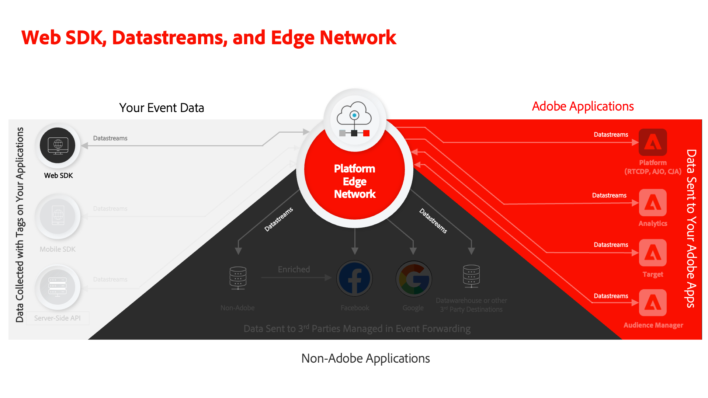

Per creare il [!UICONTROL flusso di dati]:

1. Assicurati di essere ancora nella sandbox ` Luma Tutorial`
1. Seleziona **[!UICONTROL Datastreams]** nel menu di navigazione a sinistra
1. Seleziona il pulsante **[!UICONTROL Nuovo flusso di dati]** nell&#39;angolo superiore destro

   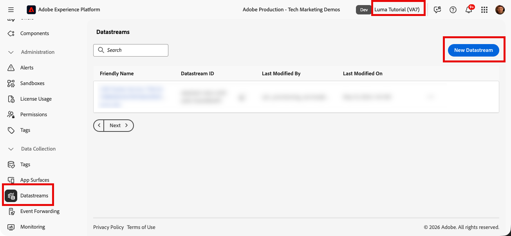

1. Per **[!UICONTROL Name]**, immetti `Luma Platform Tutorial` (aggiungi il tuo nome alla fine, se più persone della tua azienda stanno seguendo questa esercitazione)
1. Seleziona il pulsante **[!UICONTROL Salva]**

   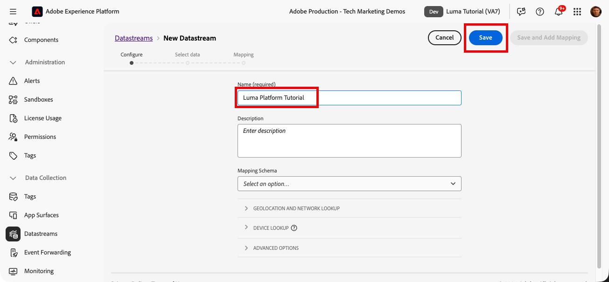

Una volta arrivati i dati ad Edge, [!UICONTROL Datastream] li inoltra ai [!UICONTROL Servizi] configurati. Per inviare dati ad Experience Platform:

1. Seleziona **[!UICONTROL Aggiungi servizio]**
   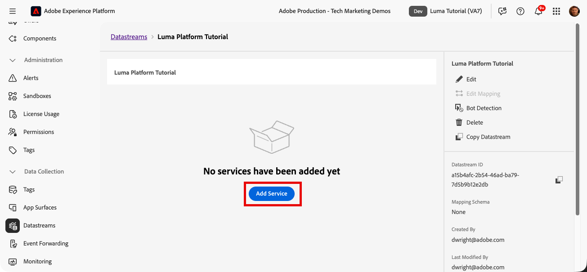

1. Seleziona `Adobe Experience Platform`
1. Seleziona `Luma Web Events Dataset`
1. Seleziona **[!UICONTROL Salva]**

   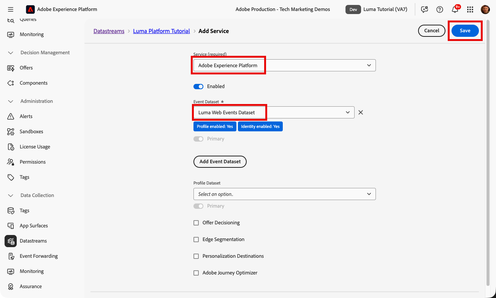

Anche se nella configurazione dello stream di dati è presente un’opzione Set di dati profilo, questa non deve essere utilizzata per inviare dati XDM del profilo individuale normale a Platform. Questa impostazione deve essere utilizzata solo per inviare il consenso, il token push e i dettagli dell’area di attività utente.

Le caselle di controllo per [!UICONTROL Offer Decisioning], [!UICONTROL Segmentazione Edge], [!UICONTROL Destinazioni Personalization] e [!UICONTROL Adobe Journey Optimizer] consentono di attivare dati in Edge, ma non sono utilizzate in questa esercitazione.

## Implementare Web SDK

### Aggiungi una proprietà

Innanzitutto, è necessario creare una proprietà tag (in precedenza una proprietà tag ). Una proprietà è un contenitore per tutte le JavaScript, le regole e le altre funzioni necessarie per raccogliere i dettagli da una pagina web e inviarli a varie posizioni.

Per creare una proprietà:

1. Vai a **[!UICONTROL Tag]** nel menu di navigazione a sinistra
1. Seleziona **[!UICONTROL Nuova proprietà]**
   
1. Come **[!UICONTROL Nome]**, immetti `Luma Platform Tutorial` (aggiungi il tuo nome alla fine, se più persone della tua azienda stanno seguendo questa esercitazione)
1. Come **[!UICONTROL Domini]**, immetti `enablementadobe.com` (spiegato più tardi)
1. Seleziona **[!UICONTROL Salva]**
   

### Aggiungere estensioni alla proprietà

Ora che disponi di una proprietà puoi aggiungere il Web SDK utilizzando un’estensione. Un’estensione è un pacchetto di codice che aggiunge funzionalità alla proprietà e all’implementazione del tag. Per aggiungere l&#39;estensione:

1. Apri la proprietà tag
1. Vai a **[!UICONTROL Estensioni]** nel menu di navigazione a sinistra
1. Passa alla scheda **[!UICONTROL Catalogo]**
1. Sono disponibili molte estensioni per i tag. Filtra il catalogo con il termine `Web SDK`
1. Seleziona l&#39;estensione **[!UICONTROL Adobe Experience Platform Web SDK]** per aprire il pannello laterale
1. Seleziona il pulsante **[!UICONTROL Installa]**
   
1. Sono disponibili diverse configurazioni per l’estensione Web SDK, ma ne verranno configurate solo due per questa esercitazione. Aggiorna il dominio **[!UICONTROL Edge]** in `data.enablementadobe.com`. Questa impostazione ti consente di impostare cookie di prime parti con l’implementazione di Web SDK, il che è consigliato. Quando implementi Web SDK sul tuo sito Web, ti consigliamo di creare un CNAME per le tue finalità di raccolta dati, ad esempio `data.YOUR_DOMAIN.com`
1. Nella sezione **[!UICONTROL Datastreams]**, per l&#39;ambiente di produzione, seleziona la sandbox `Luma Tutorial` e lo stream di dati `Luma Platform Tutorial`.
1. Puoi esaminare le altre opzioni di configurazione (ma non modificarle!), quindi seleziona **[!UICONTROL Salva]**
   

Dalla schermata Catalogo estensioni, installa l’estensione Adobe Client Data Layer. Questa estensione ci aiuterà a leggere il livello dati dal sito web Luma:

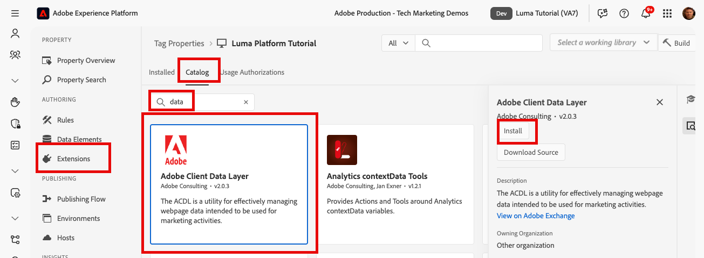

Non sono necessarie configurazioni nell&#39;estensione, quindi è sufficiente salvarla nella libreria.

## Creare una regola per inviare dati

Ora creeremo una regola per inviare dati a Platform. Una regola è una combinazione di eventi, condizioni e azioni che indicano ai tag di eseguire un’operazione. Per creare una regola:

1. Passa a **[!UICONTROL Regole]**
1. Seleziona il pulsante **[!UICONTROL Crea nuova regola]**
   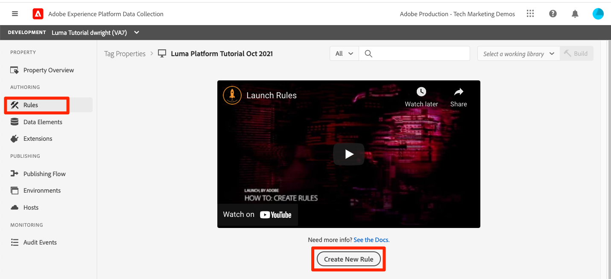
1. Denomina la regola `adobeDataLayer event`
1. In **[!UICONTROL Eventi]**, seleziona il pulsante **[!UICONTROL Aggiungi]**
   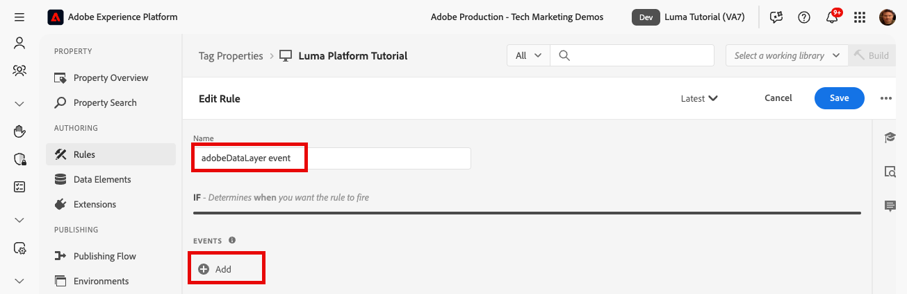
1. Utilizza **[!UICONTROL Adobe Client Data Layer]** **[!UICONTROL Estensione]** e seleziona **[!UICONTROL Dati inviati]** come **[!UICONTROL Tipo evento]**.
1. Seleziona **[!UICONTROL Ascolta]**. **[!UICONTROL Tutti gli eventi]**.
1. Seleziona **[!UICONTROL Mantieni modifiche]** per tornare alla schermata della regola principale
   
1. In **[!UICONTROL Azioni]**, seleziona il pulsante **[!UICONTROL Aggiungi]**
1. Utilizza **[!UICONTROL Adobe Experience Platform Web SDK]** **[!UICONTROL Estensione]** e seleziona **[!UICONTROL Invia evento]** come **[!UICONTROL Tipo azione]**
1. A destra, seleziona **[!UICONTROL Visualizzazioni pagina Web Webpagedetails]** dal menu a discesa **[!UICONTROL Tipo]**. Questo popola il campo eventType del nostro `Luma Web Events Schema`
1. Seleziona **[!UICONTROL Mantieni modifiche]** per tornare alla schermata della regola principale
   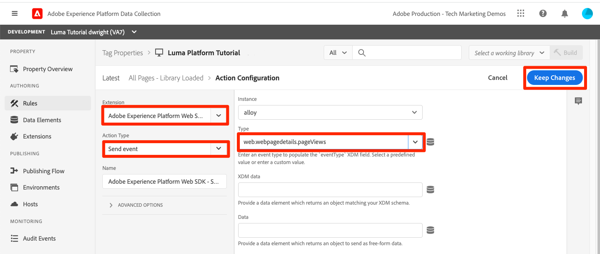
1. Seleziona **[!UICONTROL Salva]** per salvare la regola\
   

## Pubblicare la regola in una libreria

Ora pubblicheremo la regola nel nostro ambiente di sviluppo in modo da poter verificare che funzioni.

Per creare una libreria:

1. Vai a **[!UICONTROL Flusso di pubblicazione]** nel menu di navigazione a sinistra
1. Seleziona **[!UICONTROL Aggiungi libreria]**
   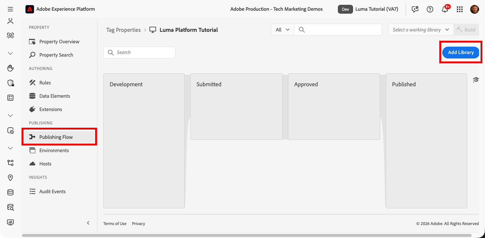
1. Per **[!UICONTROL Name]**, immetti `Luma Platform Tutorial`
1. Per l&#39;**[!UICONTROL ambiente]**, selezionare `Development`
1. Selezionare il pulsante **[!UICONTROL Aggiungi tutte le risorse modificate]**. Oltre all&#39;estensione [!UICONTROL Adobe Experience Platform Web SDK] e alla regola `adobeDataLayer event`, verrà aggiunta l&#39;estensione [!UICONTROL Core] che contiene il JavaScript di base richiesto da tutte le proprietà Web dei tag.
1. Seleziona il pulsante **[!UICONTROL Salva e genera per sviluppo]**
   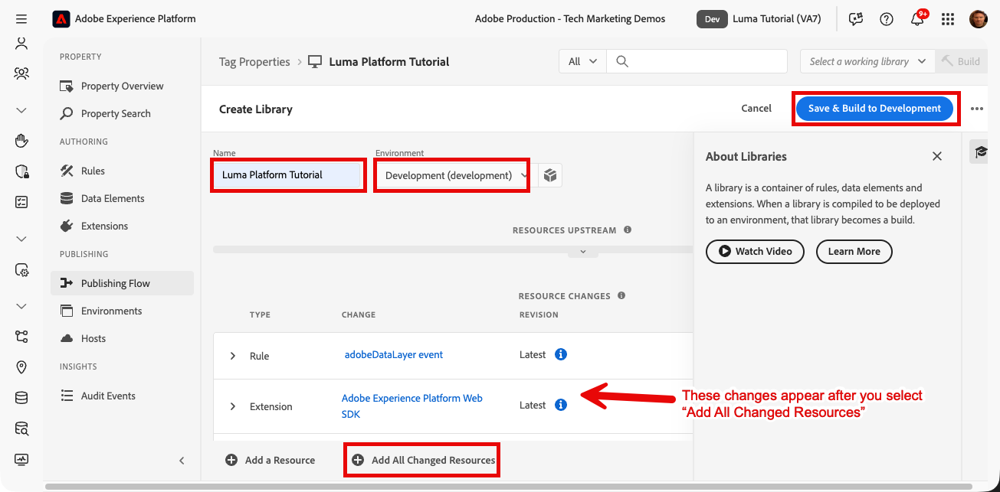

La creazione della libreria potrebbe richiedere alcuni minuti e al termine viene visualizzato un punto verde a sinistra del nome della libreria:
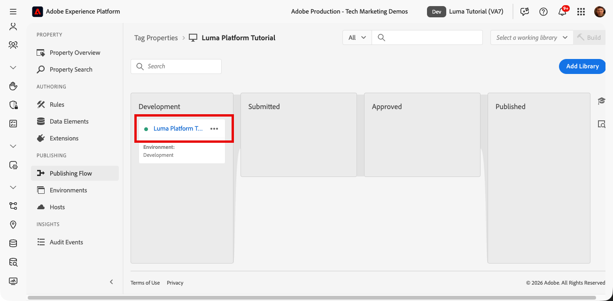

Come puoi vedere nella schermata [!UICONTROL Flusso di pubblicazione], il processo di pubblicazione richiede molto di più, il che va oltre l&#39;ambito di questa esercitazione. Utilizzeremo un’unica libreria nel nostro ambiente di sviluppo.

## Convalidare i dati nella richiesta

### Aggiungere Adobe Experience Platform Debugger

Experience Platform Debugger è un’estensione disponibile per Chrome che consente di visualizzare la tecnologia Adobe implementata nelle pagine web. Scarica la versione per il browser preferito:

* [Estensione Chrome](https://chrome.google.com/webstore/detail/adobe-experience-platform/bfnnokhpnncpkdmbokanobigaccjkpob)

Se non hai mai utilizzato Debugger prima, guarda questo video introduttivo di cinque minuti:

>[!VIDEO](https://video.tv.adobe.com/v/32156?learn=on&enablevpops)

### Apri il sito web Luma.

Per questo tutorial, utilizziamo una versione del sito web demo Luma in hosting pubblico. Apriamolo e aggiungiamo un segnalibro:

1. In una nuova scheda del browser, apri il [sito Web Luma](https://newluma.enablementadobe.com).
1. Aggiungi ai segnalibri la pagina da utilizzare nel resto dell’esercitazione

Per questo sito in hosting abbiamo utilizzato `enablementadobe.com` nel campo [!UICONTROL Domini] della configurazione iniziale della proprietà tag e `data.enablementadobe.com` come dominio di prime parti nell&#39;estensione [!UICONTROL Adobe Experience Platform Web SDK]. Vedi, avevo un piano!

### Utilizza Experience Platform Debugger per eseguire il mapping alla proprietà tag

Experience Platform Debugger dispone di una funzione interessante che consente di sostituire una proprietà tag esistente con una diversa. Questo è utile per la convalida e ci consente di saltare molti passaggi di implementazione in questa esercitazione.

1. Assicurati di avere aperto il sito Luma e seleziona l’icona dell’estensione Experience Platform Debugger
1. Debugger si aprirà e mostrerà alcuni dettagli dell’implementazione hardcoded, che non è correlata a questa esercitazione (potrebbe essere necessario ricaricare il sito Luma dopo aver aperto Debugger)
1. Verifica che il debugger sia &quot;**[!UICONTROL connesso a Luma]**&quot; come illustrato di seguito, quindi seleziona l&#39;icona &quot;**[!UICONTROL blocca]**&quot; per bloccare il debugger sul sito Luma.
1. Seleziona il pulsante **[!UICONTROL Accedi]** in alto a destra per eseguire l&#39;autenticazione.
1. Vai ora a **[!UICONTROL Tag Experience Platform]** nel menu di navigazione a sinistra
1. Seleziona la scheda Configurazione.
1. A destra della visualizzazione dei **[!UICONTROL Codici di incorporamento pagina]**, apri il menu a discesa **[!UICONTROL Azioni]** e seleziona **[!UICONTROL Sostituisci]**
   
1. Poiché sei autenticato, il Debugger estrae le proprietà e gli ambienti dei tag disponibili. Seleziona la proprietà `Luma Platform Tutorial`
1. Seleziona l&#39;ambiente `Development`
1. Seleziona il pulsante **[!UICONTROL Applica]**
   
1. Il sito Web Luma ricaricherà _con la tua proprietà tag_.
   
1. Vai a **[!UICONTROL Riepilogo]** nella barra di navigazione a sinistra per visualizzare i dettagli della proprietà [!UICONTROL tag]
   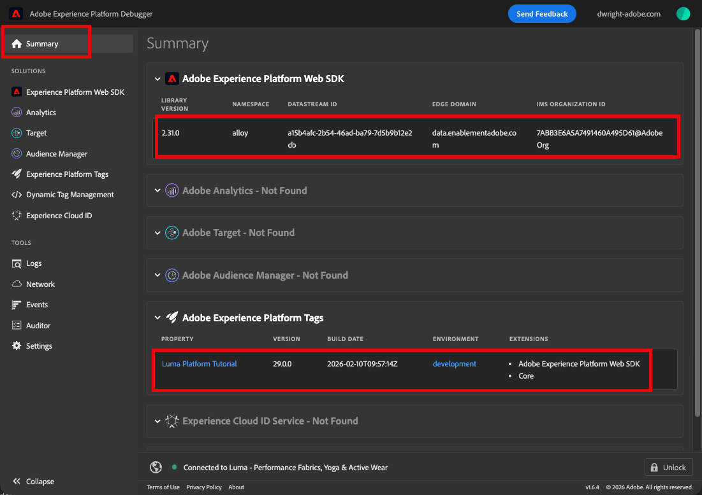
1. Vai ora a **[!UICONTROL Experience Platform Web SDK]** nella barra di navigazione a sinistra per visualizzare le **[!UICONTROL richieste di rete]**
1. Seleziona la riga **[!UICONTROL eventi]**

   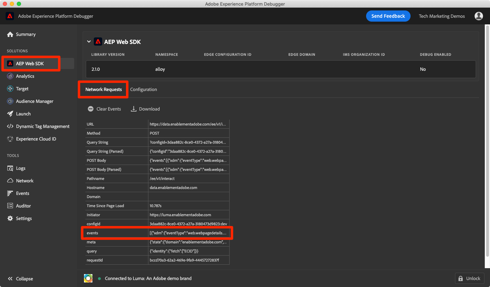

1. Nota come è possibile visualizzare il tipo di evento `web.webpagedetails.pageView` specificato nell&#39;azione [!UICONTROL Invia evento]
   

1. I dettagli della richiesta sono visibili anche nella scheda Strumenti per sviluppatori Web del browser **Rete**. Apri e ricarica la pagina. Filtra le chiamate con `interact` per individuare la chiamata, selezionala e cerca nella scheda **Intestazioni**, **Payload richiesta**.
   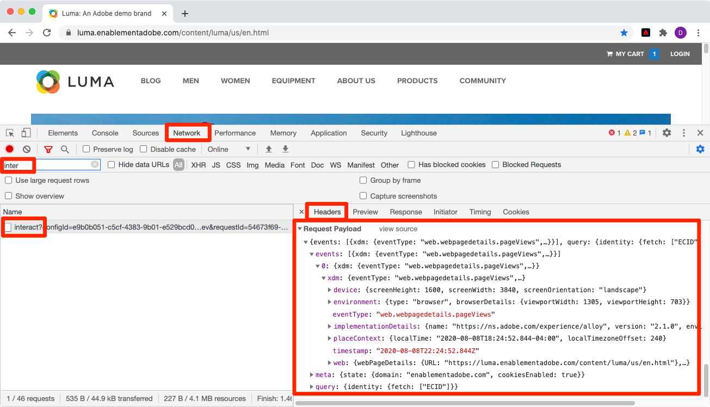
1. Vai alla scheda **Risposta** e osserva come il valore ECID è incluso nella risposta. Copia questo valore così come lo utilizzerai per convalidare le informazioni sul profilo nell’esercizio successivo.
   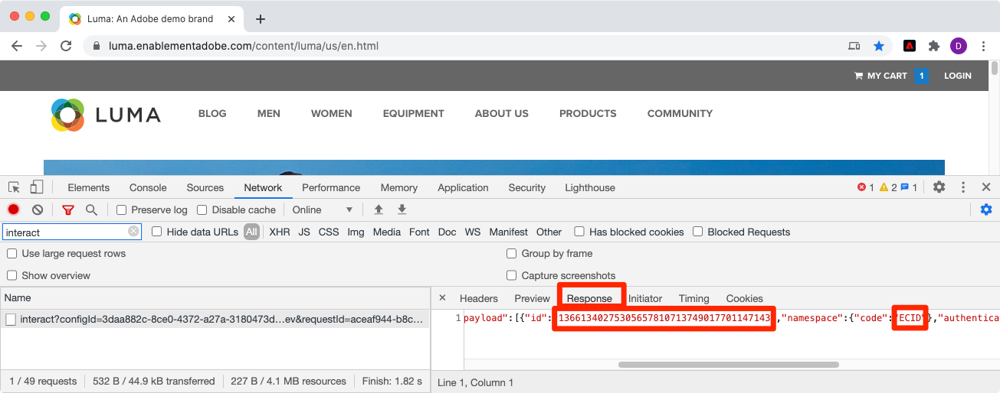

## Convalidare i dati in Experience Platform

È possibile verificare che i dati siano in arrivo in Platform osservando i batch di dati in arrivo in `Luma Web Events Dataset`. (Lo so, si chiama acquisizione di dati in streaming, ma ora sto dicendo che arriva in batch! Viene inviato in streaming al profilo in tempo reale, quindi può essere utilizzato per la segmentazione e l’attivazione in tempo reale, ma viene inviato in batch ogni 15 minuti al data lake.)

Per convalidare i dati:

1. Nell&#39;interfaccia utente di Platform, vai a **[!UICONTROL Set di dati]** nell&#39;area di navigazione a sinistra
1. Aprire `Luma Web Events Dataset` e verificare che sia arrivato un batch. Ricordati che vengono inviati ogni 15 minuti, quindi potrebbe essere necessario attendere la visualizzazione del batch.
1. Seleziona il pulsante **[!UICONTROL Anteprima set di dati]**
   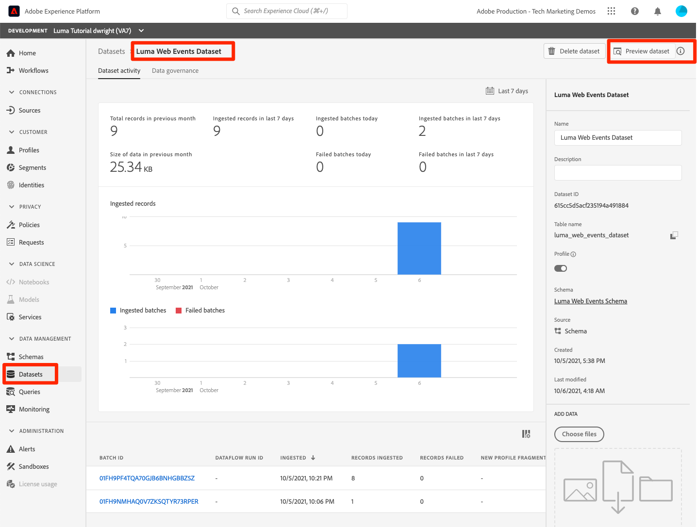
1. Nella finestra modale di anteprima, tieni presente come selezionare diversi campi dello schema a sinistra per visualizzare in anteprima tali punti dati specifici:
   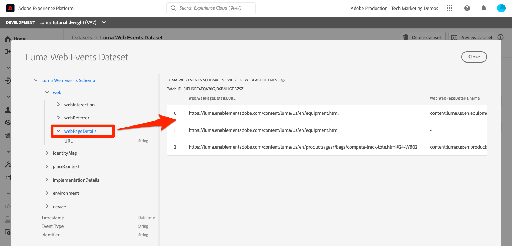

Puoi anche verificare che il nuovo profilo sia visualizzato:

1. Nell&#39;interfaccia utente di Platform, vai a **[!UICONTROL Profili]** nell&#39;area di navigazione a sinistra
1. Seleziona lo spazio dei nomi **[!UICONTROL ECID]** e cerca il valore ECID (copialo dalla risposta). Il profilo avrà un proprio ID, separato dall’ECID.
1. Seleziona **[!UICONTROL ID profilo]** per aprire il profilo
   
1. Seleziona la scheda **[!UICONTROL Eventi]** per visualizzare le pagine visualizzate
   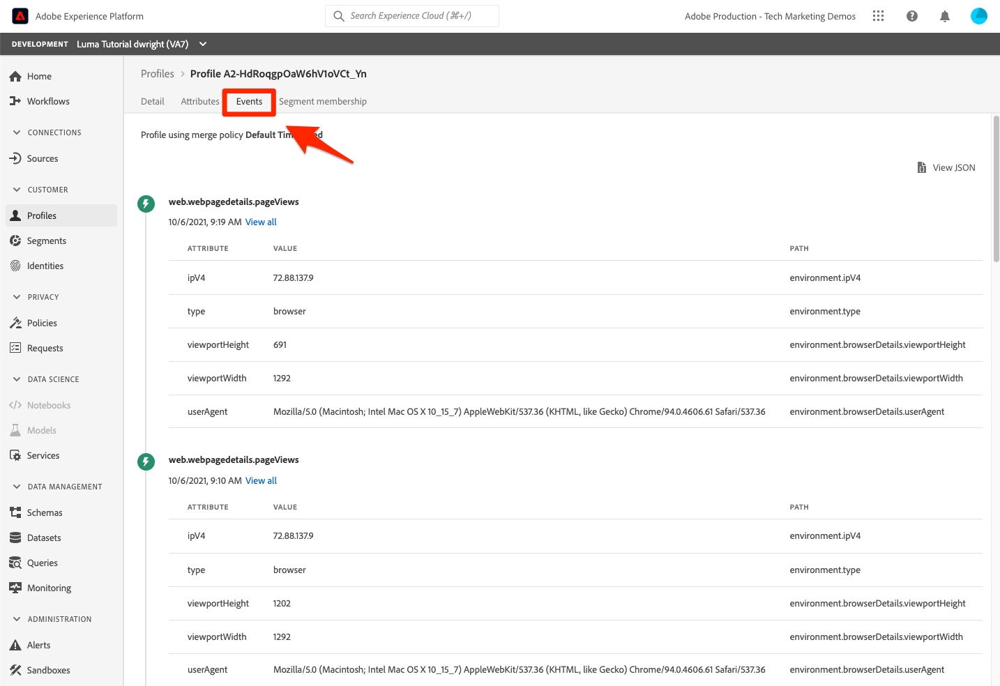\
   <!---->

## Aggiungere dati personalizzati all’evento

Web SDK compila automaticamente molti campi XDM, ma sarà inevitabilmente necessario personalizzare l’implementazione per raccogliere campi aggiuntivi dal sito web. Questo aspetto è molto importante, ma ecco alcuni semplici esempi.

### Creare un elemento dati per memorizzare i dati XDM

1. Torna alla proprietà tag `Luma Platform Tutorial`
1. Apri il menu a discesa **[!UICONTROL Seleziona una libreria di lavoro]** e seleziona la libreria `Luma Platform Tutorial`. Questa impostazione semplifica la pubblicazione di aggiornamenti aggiuntivi alla libreria.
1. Vai ora a **[!UICONTROL Elementi dati]** nel menu di navigazione a sinistra
1. Seleziona il pulsante **[!UICONTROL Crea nuovo elemento dati]**

   

Nella pagina **[!UICONTROL Elementi dati]**:

1. Come **[!UICONTROL Nome]**, immetti `XDM data`
1. Come **[!UICONTROL Estensione]**, seleziona `Adobe Experience Platform Web SDK`
1. Come **[!UICONTROL Tipo di elemento dati]**, selezionare `Variable`
1. Seleziona la sandbox **[!UICONTROL come]** Sandbox`Luma Tutorial`
1. Come **[!UICONTROL Schema]**, seleziona `Luma Web Events Schema`
1. Assicurarsi che `Luma Platform Tutorial` sia selezionato come libreria di lavoro
1. Seleziona **[!UICONTROL Salva nella libreria]**
   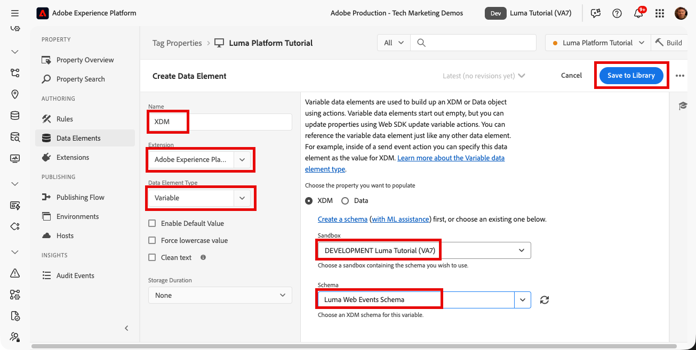

### Creare un elemento dati per nome pagina

1. Creare un nuovo elemento dati
1. Come **[!UICONTROL Nome]**, immetti `Page Name`
1. Come **[!UICONTROL Tipo di elemento dati]**, selezionare `JavaScript Variable`
1. Come **[!UICONTROL nome variabile JavaScript]**, immetti `adobeDataLayer.0.page.name`
1. Per semplificare la standardizzazione del formato dei valori, selezionare le caselle per **[!UICONTROL Forza valori minuscoli]** e **[!UICONTROL Pulisci testo]**
1. Seleziona **[!UICONTROL Salva nella libreria]**
   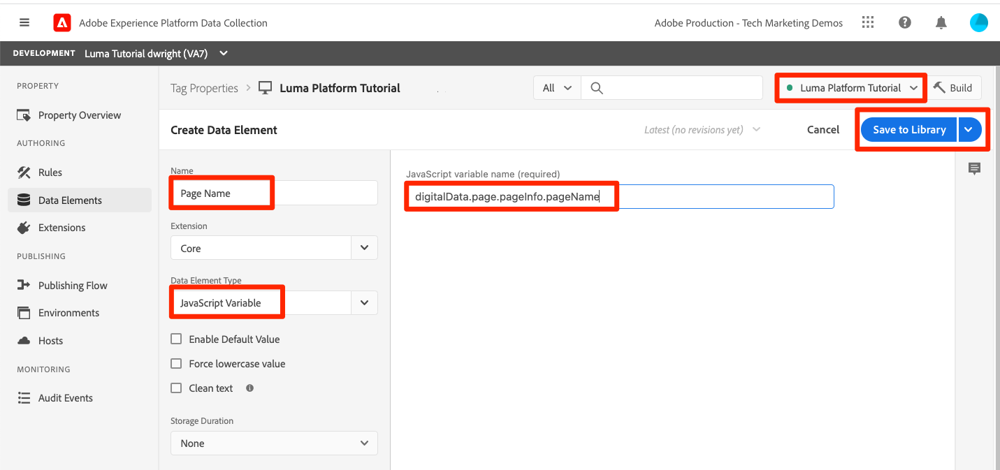

### Aggiungere i dati XDM all’azione Invia evento

Ora che hai mappato i dati sui campi XDM, puoi includerli nell’azione Invia evento:

1. Vai alla schermata **[!UICONTROL Regole]**
1. Apri la regola `adobeDataLayer event`
1. Apri l&#39;azione `Adobe Experience Platform Web SDK - Send Event`
1. Come **[!UICONTROL XDM]**, seleziona l&#39;icona per aprire la selezione modale dell&#39;elemento dati e scegli l&#39;elemento dati `XDM data`
1. Seleziona **[!UICONTROL Mantieni modifiche]**
   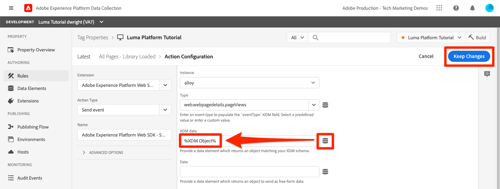

1. Aggiungi una nuova azione alla regola
1. Seleziona l&#39;`Adobe Experience Platform Web SDK` **[!UICONTROL estensione]**
1. Seleziona `Update Variable` **[!UICONTROL Tipo azione]**
1. Popola l&#39;elemento dati `Page Name` come `web.webPageDetails.name`
1. Seleziona **[!UICONTROL Mantieni modifiche]**
   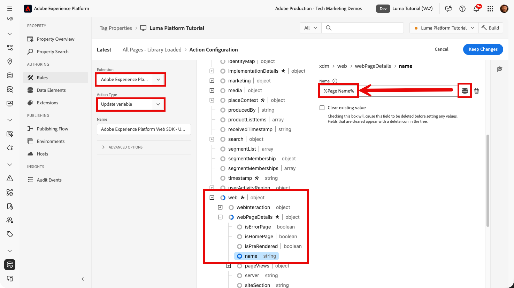

1. Ridisponi le [!UICONTROL Azioni] in modo che [!UICONTROL Aggiorna variabile] venga attivata prima dell&#39;[!UICONTROL Invia evento]
1. Ora, poiché hai selezionato `Luma Platform Tutorial` come libreria di lavoro per gli ultimi esercizi, le modifiche recenti sono state salvate direttamente nella libreria. Invece di pubblicare le modifiche tramite la schermata Flusso di pubblicazione, puoi aprire il menu a discesa e selezionare **[!UICONTROL Salva nella libreria e genera]**
   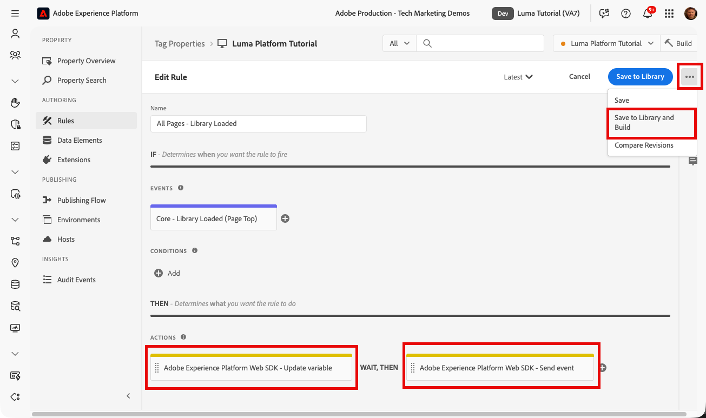

Inizia a creare una nuova libreria di tag con le tre modifiche appena apportate.

### Convalidare i dati XDM

Ora dovresti essere in grado di ricaricare la pagina home di Luma, mentre sei mappato sulla proprietà tag utilizzando il Debugger come hai imparato in precedenza, e vedere che il campo del nome pagina si popola nella richiesta.

Puoi anche verificare che i dati del nome della pagina siano stati ricevuti in Platform, visualizzando in anteprima il set di dati e il profilo.

## Invia identità aggiuntive

L’implementazione del Web SDK sta ora inviando eventi con Experience Cloud ID (ECID) come identificatore primario. L’ECID viene generato automaticamente dal Web SDK ed è univoco per dispositivo e browser. Un singolo cliente può avere più ECID a seconda del dispositivo e del browser in uso. Come possiamo ottenere una visione unificata di questo cliente e collegare la sua attività online ai nostri dati di gestione delle relazioni con i clienti, fedeltà e acquisto offline? Per farlo, raccogliamo identità aggiuntive durante la loro sessione e consentiamo al servizio Identity di collegarle in modo deterministico.

Se ricordi, ho detto che avremmo utilizzato l&#39;ECID e l&#39;ID del sistema di gestione delle relazioni con i clienti come identità per i nostri dati web nella lezione [Mappa identità](map-identities.md). Quindi raccogliamo l’ID del sistema di gestione delle relazioni con i clienti con il Web SDK!

### Aggiungi elemento dati per l’ID CRM

Innanzitutto, memorizziamo l’ID del sistema di gestione delle relazioni con i clienti in un elemento dati:

1. Nell&#39;interfaccia dei tag, aggiungere un elemento dati denominato `CRM Id`
1. Come **[!UICONTROL Tipo di elemento dati]**, seleziona **[!UICONTROL Variabile JavaScript]**
1. Come **[!UICONTROL nome variabile JavaScript]**, immetti `adobeDataLayer.0.user.id`
1. Seleziona il pulsante **[!UICONTROL Salva nella libreria]** (`Luma Platform Tutorial` deve essere ancora la libreria di lavoro)
   

### Aggiungere l’ID del sistema di gestione delle relazioni con i clienti all’elemento dati della Mappa identità

Dopo aver acquisito il valore ID CRM, è necessario associarlo a un tipo di elemento dati speciale denominato elemento dati [!UICONTROL Identity Map]:

1. Aggiungi un elemento dati denominato `Identity Map`
1. Come **[!UICONTROL Estensione]**, seleziona **[!UICONTROL Adobe Experience Platform Web SDK]**
1. Come **[!UICONTROL Tipo elemento dati]**, selezionare **[!UICONTROL Mappa identità]**
1. Come **[!UICONTROL Spazio dei nomi]**, seleziona o digita `Luma CRM Id`, che è lo [!UICONTROL spazio dei nomi] creato in una lezione precedente.

1. Come **[!UICONTROL ID]**, seleziona l&#39;icona per aprire la selezione modale dell&#39;elemento dati e scegli l&#39;elemento dati `CRM Id`
1. Come **[!UICONTROL Stato autenticato]**, selezionare **[!UICONTROL Stato autenticato]**
1. Seleziona **[!UICONTROL primario]**

   >[!TIP]
   >
   > Adobe consiglia di inviare identità che rappresentano una persona, ad esempio `Luma CRM Id`, come identità [!UICONTROL primaria].
   >
   > Se la mappa delle identità contiene l&#39;identificatore della persona, ad esempio `Luma CRM Id`, l&#39;identificatore della persona diventa l&#39;identità [!UICONTROL primaria]. In caso contrario, `ECID` diventa l&#39;identità [!UICONTROL primary].

1. Seleziona il pulsante **[!UICONTROL Salva nella libreria]** (`Luma Platform Tutorial` deve essere ancora la libreria di lavoro)
   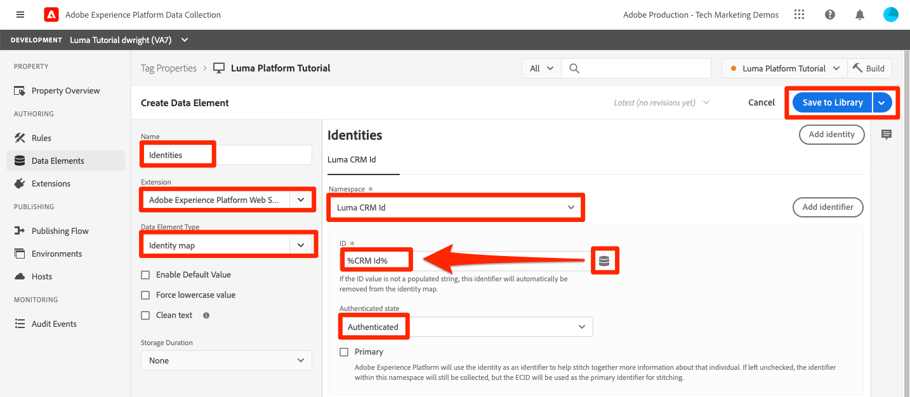

>[!NOTE]
>
>È possibile trasmettere più identificatori utilizzando il tipo di dati [!UICONTROL Identity map].

### Aggiungere l’elemento dati Identity Map alla variabile XDM

Ora è necessario aggiornare l’azione Variabile XDM nella regola per includere Identity Map. Non preoccuparti, questa lezione è quasi finita!

1. Apri la regola `adobeDataLayer event`
1. Apri l&#39;azione `Update variable`
1. Seleziona l&#39;elemento dati `Identity Map` per il campo XDM `identityMap`.
1. Seleziona **[!UICONTROL Mantieni modifiche]**
   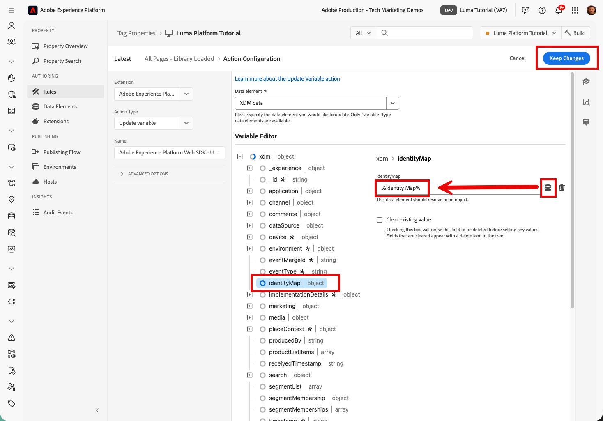
1. Poiché hai selezionato `Luma Platform Tutorial` come libreria di lavoro per gli ultimi esercizi, seleziona **[!UICONTROL Salva nella libreria e genera]**

   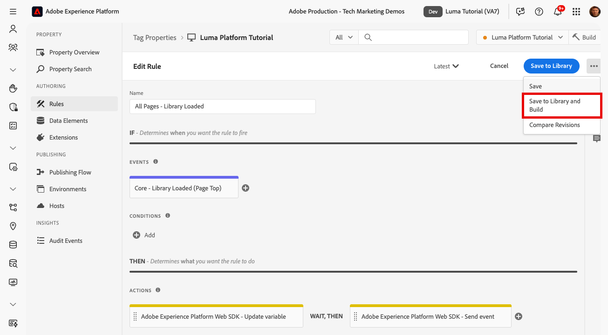

<!--U1770721295408-->

### Convalidare l’identità

Per verificare che l’ID del sistema di gestione delle relazioni con i clienti sia ora inviato dal Web SDK:

1. Apri il [sito Web Luma](https://luma.enablementadobe.com/content/luma/us/en.html)
1. Mappare il file alla proprietà tag utilizzando Debugger, come indicato nelle istruzioni precedenti
1. Seleziona il collegamento **Accesso** in alto a destra nel sito Web Luma
1. Accedi utilizzando le credenziali `test@test.com`/`test`
1. Dopo l&#39;autenticazione, esaminare la chiamata di Experience Platform Web SDK nel debugger (**[!UICONTROL Adobe Experience Platform Web SDK]** > **[!UICONTROL Richieste di rete]** > **[!UICONTROL eventi]** della richiesta più recente) e visualizzare `lumaCrmId`:
   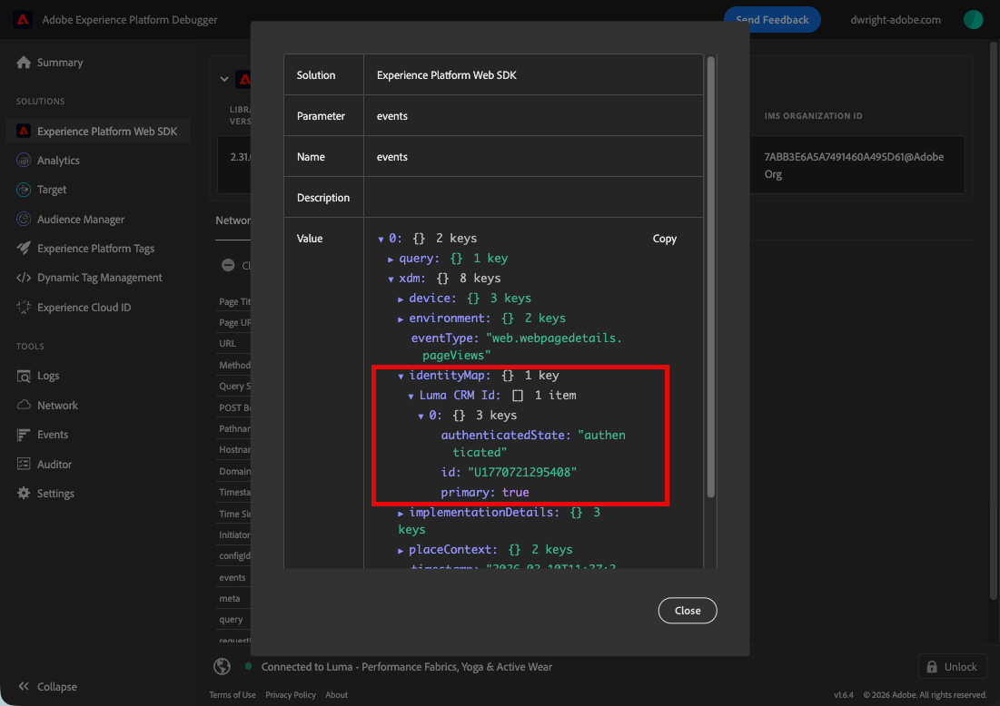
1. Cerca di nuovo il profilo utente utilizzando lo spazio dei nomi e il valore ECID. Nel profilo troverai l’ID del sistema di gestione delle relazioni con i clienti, l’ID fedeltà e i dettagli del profilo, come il nome e il numero di telefono. Tutte le identità e i dati sono stati uniti in un unico profilo cliente in tempo reale.
   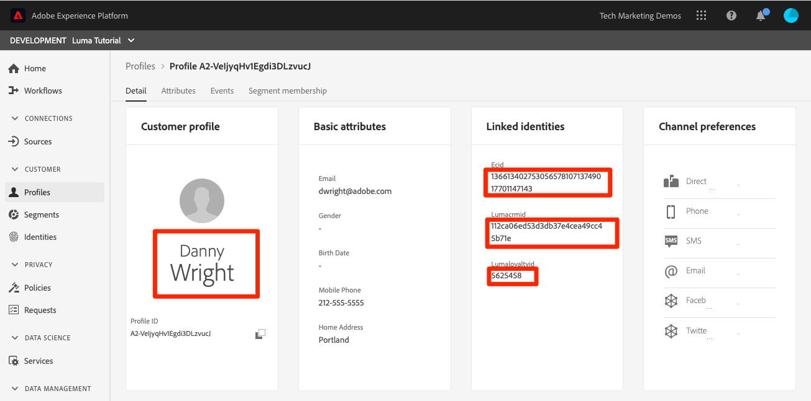

## Risorse aggiuntive

* [Implementare Adobe Experience Cloud con Web SDK](/help/tutorial-web-sdk/overview.md)
* [Documentazione sull&#39;acquisizione in streaming](https://experienceleague.adobe.com/docs/experience-platform/ingestion/streaming/overview.html?lang=it)
* [Riferimento API Streaming Ingestion](https://developer.adobe.com/experience-platform-apis/references/streaming-ingestion/)

Ottimo lavoro! Queste erano molte informazioni sul Web SDK e sui tag. L’implementazione completa richiede molto più lavoro, ma queste sono le nozioni di base per aiutarti a iniziare e visualizzare i risultati in Platform.

>[!NOTE]
>
>Ora che hai terminato la lezione Streaming Ingestion, puoi rimuovere la sandbox [!UICONTROL Prod] dal tuo profilo di prodotto `Luma Tutorial Platform`

Ingegneri dati, se lo desideri puoi passare alla lezione [eseguire query](run-queries.md).

Architetti di dati, puoi passare a [criteri di unione](create-merge-policies.md).
