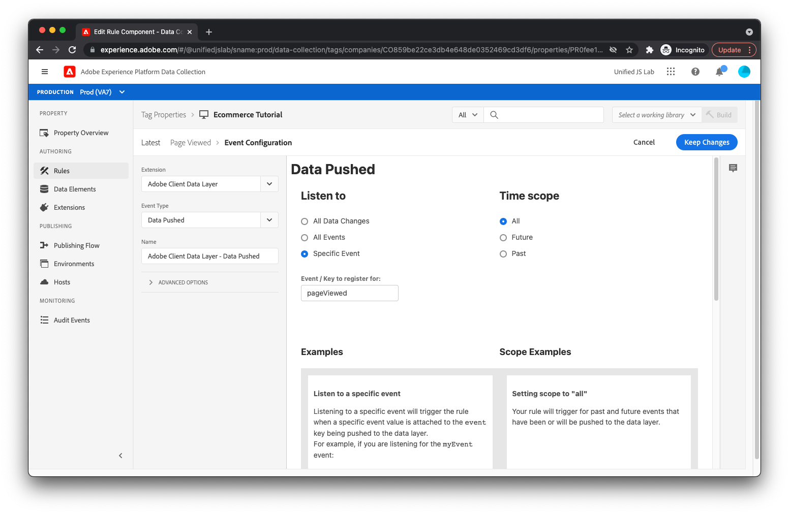

# Creare regole per il tracciamento della visualizzazione della pagina e degli eventi di e-commerce

Per tenere traccia della visualizzazione della pagina del prodotto da parte dell’utente, crea una regola in Adobe Experience Platform [!DNL Tags].

1. Fai clic su **[!UICONTROL Regole]** nella navigazione a sinistra, fai clic su **[!UICONTROL Crea nuova regola]**.

1. Per il nome della regola, immetti **_Pagina visualizzata_**.

## Aggiungere un evento

1. Fai clic sul pulsante **[!UICONTROL Aggiungi]** pulsante sotto [!UICONTROL Eventi]. Ora puoi visualizzare la visualizzazione dell’evento. Per [!UICONTROL Estensione] campo , seleziona **[!UICONTROL Livello dati client di Adobe]**. Per [!UICONTROL Tipo evento] campo , seleziona **[!UICONTROL Dati scaricati]**.
1. Perché desideri che questa regola venga attivata solo quando `pageViewed` l&#39;evento viene inviato al livello dati, seleziona **[!UICONTROL Evento specifico]** sotto [!UICONTROL Ascolta] e tipo **_pageViewed_** nel [!UICONTROL Evento / Chiave per la registrazione] campo di testo.
1. Fai clic su **[!UICONTROL Mantieni modifiche]**.
   

## Aggiungi un&#39;azione

Ora che sei tornato alla vista delle regole:

1. Fai clic sul pulsante **[!UICONTROL Aggiungi]** pulsante sotto [!UICONTROL Azioni]. Ora dovresti essere nella visualizzazione delle azioni. Per [!UICONTROL Estensione] campo , seleziona **[!UICONTROL Adobe Experience Platform Web SDK]**. Per [!UICONTROL Tipo di azione] campo , seleziona **[!UICONTROL Invia evento]**. Questa azione ti consente di inviare un evento di esperienza a Adobe Experience Platform Edge Network.
1. Al centro dello schermo, trova la [!UICONTROL Tipo] campo e seleziona **`web.webpagedetails.pageViews`**. Questo è uno dei tipi di evento esperienza canonico forniti da Adobe Experience Platform. Rappresenta una visualizzazione di pagina.
1. Per [!UICONTROL Dati XDM] campo, immettere **`%event.fullState%`**. Indica che lo stato calcolato (noto anche come stato completo) del livello dati, che viene acquisito al momento dell&#39;attivazione della regola. Questo deve essere inviato come parte dell’evento di esperienza.
1. Fai clic sul pulsante **[!UICONTROL Mantieni modifiche.]**
   

Se i dati inviati dal sito web al livello dati non sono conformi allo schema XDM o se desideri inviare solo una parte dello stato calcolato del livello dati, utilizza il [!UICONTROL Oggetto XDM] tipo di elemento dati (fornito dall&#39;estensione Adobe Experience Platform Web SDK) per creare un oggetto appropriato che corrisponda allo schema.

## Salva la regola

1. Salva la regola facendo clic su **[!UICONTROL Salva]**.
   

## Ripeti il processo

Ripeti il processo descritto sopra per creare regole per quando un prodotto viene visualizzato, viene aperto un carrello e viene aggiunto un prodotto al carrello. Le uniche differenze tra le regole sono il nome della regola e il valore inserito nella [!UICONTROL Evento / Chiave per la registrazione] nel campo [!UICONTROL Dati scaricati] e [!UICONTROL Tipo] nel campo [!UICONTROL Invia evento] azione. Di seguito sono riportati i valori per ogni regola:

Regola visualizzata dal prodotto:

* **Nome della regola**: _Prodotto visualizzato_
* **Evento / Chiave per la registrazione** entro [!UICONTROL Dati scaricati] evento: `productViewed`
* **Tipo** entro [!UICONTROL Invia evento] azione: `commerce.productViews`

Regola aperta del carrello:

* **Nome della regola**: _Carrello aperto_
* **Evento / Chiave per la registrazione** entro [!UICONTROL Dati scaricati] evento: `cartOpened`
* **Tipo** entro [!UICONTROL Invia evento] azione: `commerce.productListOpens`

Prodotto aggiunto alla regola del carrello:

* **Nome della regola**: _Prodotto Aggiunto Al Carrello_
* **Evento / Chiave per la registrazione** entro [!UICONTROL Dati scaricati] evento: `productAddedToCart`
* **Tipo** entro [!UICONTROL Invia evento] azione: `commerce.productListAdds`

Successivamente, gestiamo i clic di tracciamento [!UICONTROL Scaricare l’app] link.

[Avanti: ](create-a-data-element-and-rule-for-tracking-app-downloads.md)

>[!NOTE]
>
>Grazie per aver investito il tuo tempo nell&#39;apprendimento della Raccolta dati. In caso di domande, se desideri condividere feedback generali o se hai suggerimenti su contenuti futuri, condividi questi su questo [Experience League Articolo di discussione della Comunità](https://experienceleaguecommunities.adobe.com/t5/adobe-experience-platform-launch/tutorial-discussion-use-adobe-experience-platform-data/m-p/543877)
