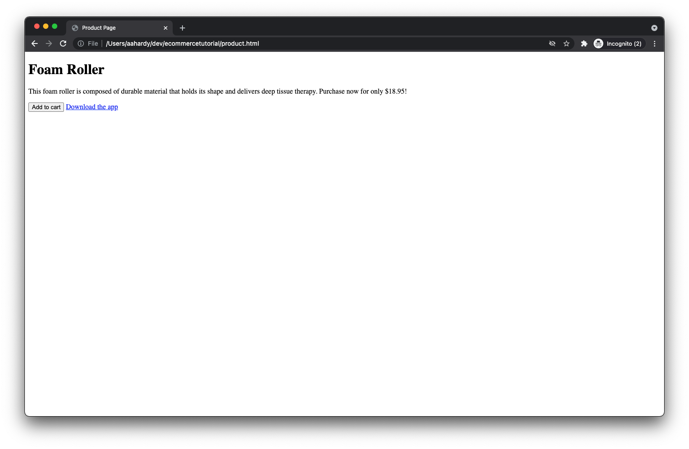

# Verificare l’implementazione

Ora che la pagina web è configurata e la libreria di tag Adobe Experience Platform è implementata, è il momento di testare l’implementazione.

1. Apri la pagina del prodotto nel browser. Per eseguire questa operazione, fai clic su _File_ then _Apri file..._ nel browser o puoi ospitare la pagina su un server web e immettere l’URL appropriato.

Dopo il caricamento della pagina, dovresti vedere qualcosa di simile a questo:

Non è carino, ma fa il lavoro.

## Inspect: eventi di visualizzazione della pagina e del prodotto

1. Apri gli strumenti per sviluppatori nel browser e fai clic sul pannello di rete. Aggiorna la pagina.
A questo punto, dovresti vedere quattro richieste:
* product.html - La tua pagina web.
* launch-############-development.js - La libreria Launch.
* interact: evento di visualizzazione della pagina inviato al server.
* interact: evento di visualizzazione del prodotto inviato al server.
Inspect il payload di ogni richiesta:
1. Per il primo `interact` puoi visualizzare il payload inviato con un `eventType` di `web.webpagedetails.pageViews`.
   
1. Per il secondo `interact` puoi visualizzare il payload inviato con un `eventType` di `commerce.productViews`.
   
1. Esamina il resto dei dati inviati, comprese le informazioni sul prodotto.

## Inspect il carrello aperto e aggiungi agli eventi del carrello

1. Ora fai clic su **_Aggiungi al carrello_**pulsante.

Dovresti visualizzare due richieste aggiuntive, la prima con un `eventType` di `commerce.productListOpens` (per l&#39;apertura di un nuovo carrello) e la seconda con un `eventType` di `commerce.productListAdds` (per aggiungere il prodotto al carrello).

## Inspect evento clic collegamento app download

A seconda del browser, è possibile che il pannello di rete venga cancellato facendo clic su un collegamento che ti allontana dalla pagina corrente. Poiché desideri controllare la richiesta di rete per l’evento di clic del collegamento che si verifica immediatamente prima di allontanarti dalla pagina, devi configurare il browser per mantenere i registri di rete tra le pagine.

1. Conserva i registri di rete selezionando una **_Conserva registro_** nel pannello di rete (Chrome, Safari, Edge) o fai clic su un’icona a forma di ingranaggio e seleziona un **_Registri persistenti_** nel menu visualizzato (Firefox).
1. Fai clic sul pulsante **_Scaricare l’app_** link. Dovresti vederne un altro `interact` richiesta visualizzata nel pannello di rete.
1. Individua la richiesta con un `eventType` di `web.webinteraction.linkClicks`e controlla i dettagli del collegamento su cui hai fatto clic.

## Verifica che i dati arrivino nel set di dati Adobe Experience Platform

Ora che le richieste vengono inviate, controlla se i dati arrivano in modo sicuro nel set di dati Adobe Experience Platform che hai creato.

1. Passa a **[!UICONTROL Set di dati]** visualizzazione in Adobe Experience Platform.
1. Seleziona la [set di dati](configure-the-server/create-a-dataset.md) creato per questa esercitazione.
Potrebbe essere necessario attendere alcuni minuti, ma presto dovresti vedere le indicazioni dei dati in fase di elaborazione e inserimento nel set di dati. È inoltre necessario verificare se l&#39;elaborazione è riuscita o non è riuscita. Se non è riuscito, puoi vedere perché ha fallito. In genere si verificano errori perché i dati inviati non corrispondono allo schema e devi regolare di conseguenza i dati o lo schema.
   

## Utilizzare l’estensione Adobe Experience Platform Debugger

Per ulteriori informazioni sul comportamento dell’implementazione sia sul browser che sui server di Adobe, consulta l’estensione del browser Adobe Experience Platform Debugger .

[Estensione Adobe Experience Platform Debugger per Chrome](https://chrome.google.com/webstore/detail/adobe-experience-platform/bfnnokhpnncpkdmbokanobigaccjkpob)

[Estensione Adobe Experience Platform Debugger per Firefox](https://addons.mozilla.org/it/firefox/addon/adobe-experience-platform-dbg/)

[Avanti: ](summary.md)

>[!NOTE]
>
>Grazie per aver investito il tuo tempo nell&#39;apprendimento della Raccolta dati. In caso di domande, se desideri condividere feedback generali o se hai suggerimenti su contenuti futuri, condividi questi su questo [Experience League Articolo di discussione della Comunità](https://experienceleaguecommunities.adobe.com/t5/adobe-experience-platform-launch/tutorial-discussion-use-adobe-experience-platform-data/m-p/543877)