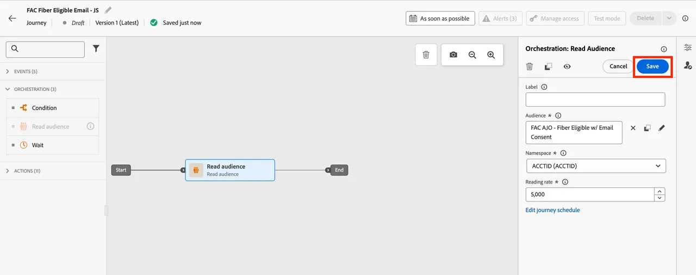

# Creare un Percorso con Federated Audience Data

In questa lezione imparerai come un pubblico federato può essere utilizzato nei percorsi all’interno di Adobe Journey Optimizer (AJO). Ciò include l’utilizzo degli attributi interrogati da Federated Audience Composition per personalizzare la messaggistica. Per continuare con la storia del cliente SecurFinancial e affrontare il caso di utilizzo del retargeting e della personalizzazione del cliente, orchestriamo un percorso per i clienti prequalificati. L’obiettivo è quello di inviare un’e-mail personalizzata in base agli attributi federati dal Data Warehouse di SecurFinancial.

## Passaggi

### Creare un Percorso con un pubblico di lettura

1. Passare al portale **Percorsi** e fare clic sul pulsante **Crea Percorso**.

   

2. Aggiornare le proprietà del Percorso con un nuovo nome: `SecurFinancial - Home Loan Offer - [your lab user ID]`.

3. Fai clic su **Orchestrazione**, quindi trascina il riquadro **Read audience** nell&#39;area di lavoro.

4. Fai clic sull&#39;**icona a forma di matita** accanto alla casella Pubblico sul lato destro dello schermo.

5. Nella barra di ricerca, cerca `SecureFinancial Customers - No Loans, Good Credit`, quindi fai clic su **Salva**.

   

6. Lascia tutte le impostazioni predefinite nel menu a destra, quindi fai clic su **Salva**.

   

### Personalizzazione e-mail

1. Fai clic su **Azioni**, quindi fai clic e trascina il riquadro **E-mail** nell&#39;area di lavoro.

2. Nel menu a destra, fai clic su **Configurazione e-mail** e seleziona **EmailMarketing**. Quindi fare clic su **Modifica contenuto**.

3. Nella riga dell&#39;oggetto, aggiungi: `Learn more about SecurFinancial Home Loan`. Quindi fai clic su **Modifica corpo dell&#39;e-mail**.

4. Fai clic sul pulsante **Modello di contenuto** in alto a destra. Trova e seleziona `SecureFinancial Template`, quindi fai clic su **Conferma**.

   

   

5. Rivedi il modello e fai clic su **Usa modello**.

6. Ora accederai a E-mail Designer. Passa il puntatore del mouse sulla macro `{profile.person.name.firstName}` e fai clic sull&#39;**avatar di personalizzazione**.

7. Nella finestra di personalizzazione, espandere il percorso della cartella seguente: `[sandbox] > audienceEnrichment > CustomerAudienceUpload`

8. Fai clic sulla cartella **Read audience**. Gli attributi di arricchimento del pubblico federato si trovano qui.

9. Selezionare l&#39;attributo **First Name** per il generatore di espressioni. L’e-mail esprimerà dinamicamente il valore del nome del cliente per personalizzare l’e-mail.

10. Fai clic su **Salva**.

11. Ora che è stata aggiunta la personalizzazione del nome, aggiungi `Hi, ` davanti alla variabile di personalizzazione. Quindi fai clic su **Salva**.

    

12. Fai clic due volte sul pulsante **Indietro** per tornare all&#39;area di lavoro del percorso. Quindi nel menu **Azione: e-mail** a destra, fai clic su **Salva**.

   

Congratulazioni! Hai creato un percorso in AJO utilizzando un pubblico federato e attributi di arricchimento federati.

Ora vedremo come [arricchire i tipi di pubblico esistenti](audience-enrichment-demo.md) in Experience Platform con dati federati provenienti dal data warehouse.
