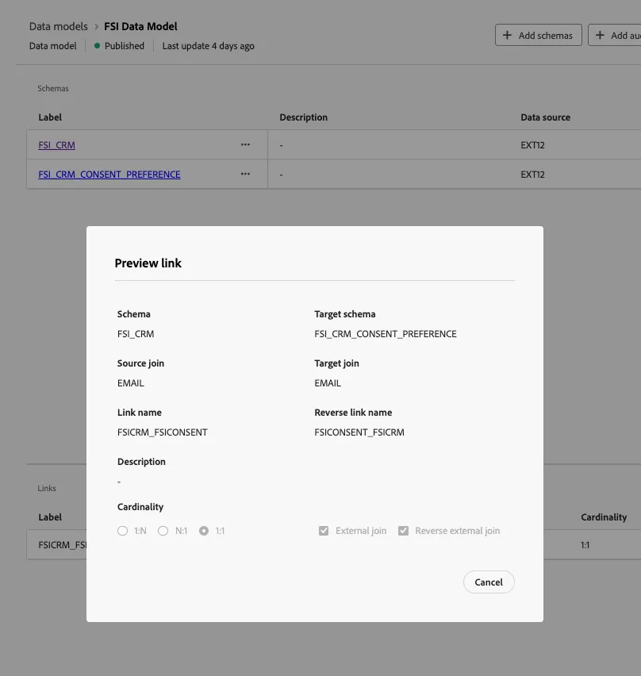

# Connessione Data Warehouse

In questa lezione, configuriamo una connessione tra Adobe Experience Platform e il tuo Data Warehouse aziendale per abilitare Federated Audience Composition. Questo consente di eseguire query sui dati direttamente dai warehouse supportati senza replica. Vengono inoltre creati schemi e modelli dati basati sulle tabelle di Data Warehouse.

Per questo laboratorio, ci connettiamo a un account Snowflake. Federated Audience Composition supporta un elenco crescente di connessioni a cloud warehouse. Visualizza l&#39;[elenco aggiornato delle integrazioni](https://experienceleague.adobe.com/it/docs/federated-audience-composition/using/start/access-prerequisites){target="_blank"}.

## Passaggi

1. Passare alla sezione **FEDERATED DATA** nella barra a sinistra.
2. Nel collegamento **Database federati**, fare clic sul pulsante **Aggiungi database federato**.
3. Aggiungi un nome e seleziona **Snowflake**.
4. Immettere i dettagli, fare clic sul pulsante **Verifica connessione** e quindi sul pulsante **Distribuisci funzioni**.

   

   

   

## Creare uno schema

Per creare schemi in Federated Audience Composition, segui questi passaggi:

1. Nella sezione **FEDERATED DATA**, fare clic su **Models**.
2. Sfoglia la scheda **Schema** e fai clic sul pulsante **Crea schema**.
3. Selezionare il database di origine nell&#39;elenco e fare clic sulla scheda **Aggiungi tabelle**.
4. Selezionare le tabelle seguenti:
   - FSI_CRM
   - FSI_CRM_CONSENT_PREFERENCE

   

   

Dopo aver selezionato le tabelle, esaminare le colonne di ogni tabella e selezionare la chiave primaria. Per questo esercizio, verrà selezionato **EMAIL** come chiave primaria in entrambe le tabelle.

## Anteprima dei dati in uno schema

Per visualizzare l&#39;anteprima dei dati nella tabella rappresentata dallo schema, passare alla scheda **Dati**.

Fai clic sul collegamento **Calcola** per visualizzare in anteprima il numero totale di record.

## Creare un modello dati

I modelli dati consentono di creare un collegamento tra tabelle. È possibile creare il collegamento tra tabelle dello stesso database, ad esempio tabelle di Snowflake, o tra tabelle di database diversi, ad esempio un collegamento tra una tabella di Snowflake e una tabella di Amazon Redshift.

Per creare un modello di dati in Federated Audience Composition, segui questi passaggi:

1. Nella sezione **FEDERATED DATA**, fai clic su **Models**, quindi su **Data Model**.
2. Fare clic sul pulsante **Crea modello dati**.
3. Immetti un nome per il modello dati.
4. Fai clic su **Aggiungi schemi** e seleziona **FSI_CRM** e **FSI_CRM_CONSENT_PREFERENCE** schemi.
5. Creare un collegamento tra queste tabelle facendo clic su **Crea collegamenti**.

Quando crei un collegamento, scegli la cardinalità applicabile:

- **1-N**: una occorrenza della tabella di origine può avere diverse occorrenze corrispondenti della tabella di destinazione, ma una occorrenza della tabella di destinazione può avere al massimo una occorrenza corrispondente della tabella di origine.
- **N-1**: una occorrenza della tabella di destinazione può avere diverse occorrenze corrispondenti della tabella di origine, ma una occorrenza della tabella di origine può avere al massimo una occorrenza corrispondente della tabella di destinazione.
- **1-1**: una occorrenza della tabella di origine può avere al massimo una occorrenza corrispondente della tabella di destinazione.

Di seguito è riportata un&#39;anteprima del collegamento creato per gli esercizi di laboratorio. Il collegamento abilita un join tra il CRM e le tabelle di consenso, utilizzando la chiave primaria di **EMAIL** per eseguire un join.

Ora [crea e pubblica](audience-creation-exercise.md).
