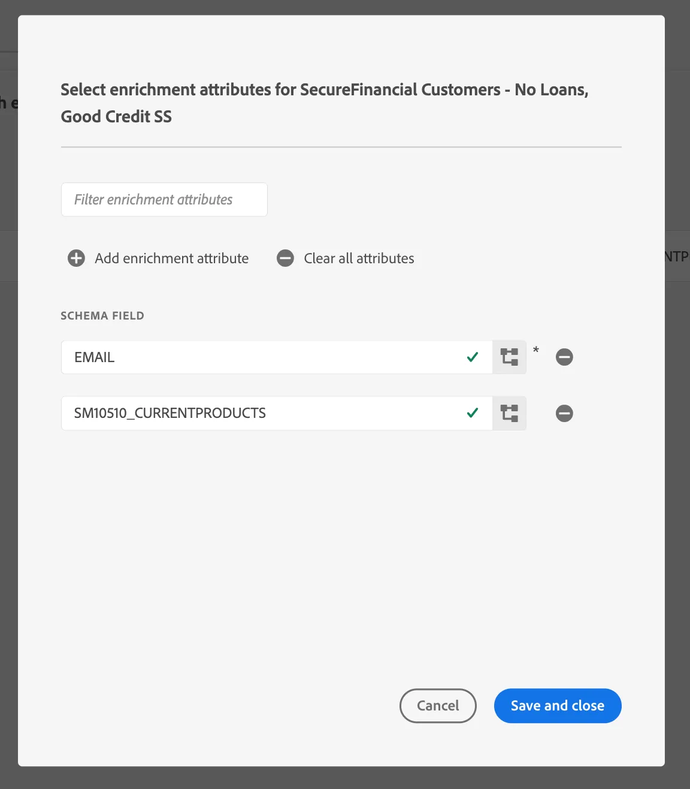

# Mappare Federated Audience su S3 per sfruttare gli attributi di pubblico per l’arricchimento

In questo esercizio imparerai a sfruttare gli attributi del pubblico nel data warehouse per arricchire l&#39;esperienza del pubblico nei flussi di lavoro di attivazione a valle che utilizzano le destinazioni RTCDP. Per SecurFinancial, questi attributi federati possono essere utilizzati per migliorare l’esperienza di personalizzazione offline del pubblico cliente. In questo esempio, il pubblico federato verrà mappato su una destinazione Amazon S3 preconfigurata.

## Passaggi

1. Passa al portale **Destinazioni**.

2. Fai clic sul pulsante **3 dot menu** accanto alla destinazione Amazon S3 preconfigurata, quindi fai clic su **Attiva pubblico**.

   

3. Seleziona la **destinazione S3**, quindi fai clic su **Successivo**.

   

4. Selezionare il pubblico **SecureFinancial Customers - No Loans, Good Credit**.

   

5. Nella sezione **Pianificazione**, lascia tutte le impostazioni predefinite e fai clic su **Avanti**.

6. Nel passaggio **Mappatura**, accertati che quanto segue sia incluso e selezionato come **Chiave di deduplicazione**. Quindi fai clic su **Avanti**:
   - `xdm: personalEmail.address`

   

7. Nel passaggio di mappatura seguente, puoi selezionare gli attributi di arricchimento in base alle mappature dei campi del pubblico nella composizione del pubblico federato. Fai clic sull&#39;icona **matita (modifica)** per visualizzare gli attributi preselezionati.

   

   

8. Rivedi la mappatura del pubblico e premi **Fine**.

Siamo pronti a passare alla [creazione di un percorso](build-journey-federated-audience.md).
