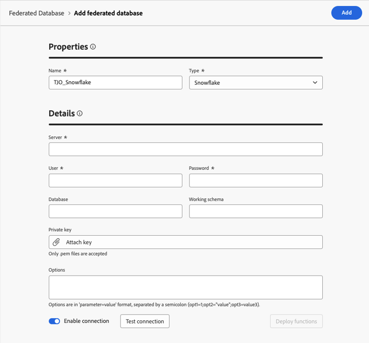

# Connessione data warehouse

Per iniziare, configuriamo una connessione tra Adobe Experience Platform e Enterprise Data Warehouse. Utilizziamo schemi e modelli di dati in base al modo in cui i dati risiedono in Data Warehouse per supportare la creazione di query.

A dimostrazione di ciò, ci connettiamo a un account Snowflake. Federated Audience Composition supporta un elenco crescente di connessioni a data warehouse. Visualizza l&#39;[elenco aggiornato delle integrazioni](https://experienceleague.adobe.com/en/docs/federated-audience-composition/using/start/access-prerequisites){target="_blank"}.

## Passaggi

1. Passare alla sezione **FEDERATED DATA** nella barra a sinistra.
2. Nel collegamento **Database federati**, fare clic sul pulsante **Aggiungi database federato**.
3. Aggiungi un nome e seleziona **Snowflake**.
4. Immettere i dettagli, fare clic sul pulsante **Verifica connessione** e quindi sul pulsante **Distribuisci funzioni**.

   

   

   

## Creare uno schema

Per creare schemi in Federated Audience Composition, segui questi passaggi:

### Passaggi

1. Nella sezione **FEDERATED DATA**, fare clic su **Models**.
2. Sfoglia la scheda **Schema** e fai clic sul pulsante **Crea schema**.
3. Selezionare il database di origine nell&#39;elenco e fare clic sulla scheda **Aggiungi tabelle**.
4. Scegliere le tabelle dall&#39;origine federata. Nel nostro esempio:
   - FSI_CRM
   - FSI_CRM_CONSENT_PREFERENCE

   

   

Dopo aver selezionato le tabelle, esaminare le colonne di ogni tabella e selezionare la chiave primaria. Per supportare il caso di business, **EMAIL** è selezionata come chiave primaria in entrambe le tabelle.

## Creare un modello dati

I modelli dati consentono di creare un collegamento tra tabelle. È possibile creare il collegamento tra tabelle dello stesso database, ad esempio tabelle di Snowflake, o tra tabelle di database diversi, ad esempio un collegamento tra una tabella di Snowflake e una tabella di Amazon Redshift.

### Passaggi

1. Nella sezione **FEDERATED DATA**, fai clic su **Models**, quindi su **Data Model**.
2. Fare clic sul pulsante **Crea modello dati**.
3. Immetti un nome per il modello dati.
4. Fai clic su **Aggiungi schemi** e seleziona i nuovi schemi di dati federati. In questo esempio vengono selezionati gli schemi **FSI_CRM** e **FSI_CRM_CONSENT_PREFERENCE**.
5. Creare un collegamento tra queste tabelle facendo clic su **Crea collegamenti**.

Quando crei un collegamento, scegli la cardinalità applicabile:

- **1-N**: una occorrenza della tabella di origine può avere diverse occorrenze corrispondenti della tabella di destinazione, ma una occorrenza della tabella di destinazione può avere al massimo una occorrenza corrispondente della tabella di origine.
- **N-1**: una occorrenza della tabella di destinazione può avere diverse occorrenze corrispondenti della tabella di origine, ma una occorrenza della tabella di origine può avere al massimo una occorrenza corrispondente della tabella di destinazione.
- **1-1**: una occorrenza della tabella di origine può avere al massimo una occorrenza corrispondente della tabella di destinazione.

Di seguito è riportata un’anteprima del collegamento creato in base ai passaggi precedenti. Il collegamento abilita un join tra il CRM e le tabelle di consenso, utilizzando la chiave primaria di **EMAIL** per eseguire un join.

Ora siamo pronti a [creare un pubblico federato](create-a-federated-audience.md).
