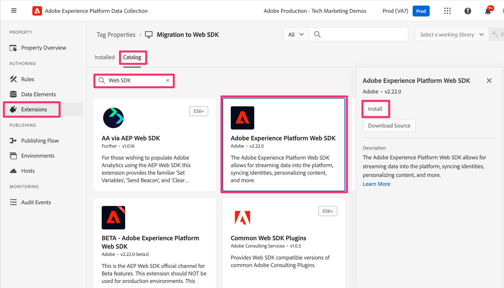

# Aggiungere e configurare l&#39;estensione Web SDK

Scopri come aggiungere e configurare l’estensione Web SDK nella proprietà Tags, per fornirti le funzionalità necessarie in ulteriori lezioni per completare la migrazione.
Per aggiungere e configurare l&#39;estensione, segui la procedura riportata di seguito:

1. Passa a Raccolta dati di Experience Platform. Ciò può essere realizzato in uno dei due modi seguenti:
   1. Vai all&#39;[interfaccia Adobe Experience Platform](https://platform.adobe.com/), quindi seleziona **[!UICONTROL Tag]** nella parte inferiore della barra di navigazione a sinistra.

      
   1. Se non hai accesso a Platform, puoi utilizzare il selettore dell’applicazione (9 punti) in alto a destra nella finestra e selezionare Raccolta dati (dopo aver effettuato l’accesso a Experience.Adobe.com).

      
1. Individuare e selezionare la proprietà tag di cui si sta eseguendo la migrazione al Web SDK.
1. Nella barra di navigazione a sinistra della proprietà tag, seleziona **[!UICONTROL Estensioni]**.
1. Seleziona **[!UICONTROL Catalogo]** nella parte superiore per visualizzare un elenco di tutte le estensioni disponibili.
1. Cerca e seleziona l&#39;estensione **[!UICONTROL Adobe Experience Platform Web SDK]**, quindi fai clic su **[!UICONTROL Installa]** a destra.

   {style="border:1px solid lightslategray"}

1. Vengono visualizzate le impostazioni di configurazione dell’estensione. Individua la sezione Flussi di dati e imposta la sandbox di Experience Platform da utilizzare per questa migrazione (menu a discesa &quot;Ambiente&quot; per tutti e tre gli ambienti). Se stai eseguendo solo la migrazione di Adobe Analytics e non invierai dati a Adobe Experience Platform, scegli la sandbox **Produzione**. Se invii questi dati di analisi comportamentale all’Experience Platform per utilizzarli nelle applicazioni, scegli la sandbox da utilizzare per tale operazione. Probabilmente all’inizio vorrai selezionare una sandbox di sviluppo fino a quando non avrai completato la migrazione e completato l’aggiunta/test del servizio Platform.
1. Fatto molto importante, connetti il codice e le impostazioni qui in Tag a Edge selezionando gli stream di dati creati nel passaggio precedente per gli ambienti di produzione, staging e sviluppo.

   {style="border:1px solid lightslategray"}

1. Scorri verso il basso e osserva che le impostazioni **Identità** sono selezionate per impostazione predefinita. Lasciare queste caselle di controllo selezionate, in quanto consentono di identificare correttamente i visitatori del sito durante la migrazione al Web SDK. Ulteriori informazioni sono disponibili nella documentazione, al collegamento seguente.

1. Seleziona **[!UICONTROL Salva]**.

>[!NOTE]
>
>L&#39;installazione e la configurazione di base dell&#39;estensione Web SDK sono ora disponibili per la proprietà Tags. Durante questa esercitazione sulla migrazione utilizzeremo parti dell&#39;estensione Web SDK per la creazione o la modifica di elementi di dati e regole, ma non modificheremo altri elementi di configurazione delle estensioni nell&#39;esercitazione. Ulteriori elementi di configurazione possono e devono essere utilizzati per casi d’uso aggiuntivi. Per informazioni dettagliate su queste configurazioni, vedere [Configurare l&#39;estensione tag Web SDK](https://experienceleague.adobe.com/it/docs/experience-platform/tags/extensions/client/web-sdk/web-sdk-extension-configuration).
