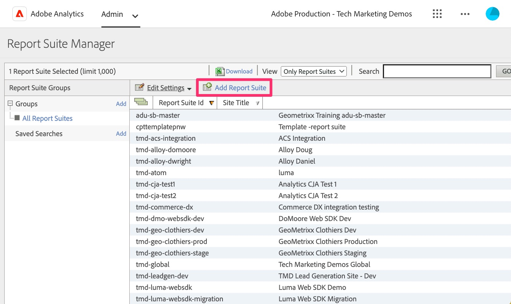

# Creare una suite di rapporti di convalida

Crea una suite di rapporti in Adobe Analytics che puoi utilizzare per convalidare i dati di Web SDK durante la migrazione dei siti dalla vecchia implementazione.

A seconda delle dimensioni e della complessità dell’implementazione di Analytics, la migrazione al Web SDK potrebbe richiedere del tempo. Durante questo periodo, dovrai convalidare il tuo lavoro, assicurandoti che i dati fluiscano correttamente nei rapporti di Adobe Analytics. Invece di inserire i dati in una suite di rapporti insieme ai dati di produzione, o anche con altri dati di sviluppo, è consigliabile creare una nuova suite di rapporti da utilizzare per questa migrazione. Nella prossima lezione verranno creati e configurati nuovi &quot;flussi di dati&quot; per lo sviluppo, la gestione temporanea e la produzione. Dopo questa operazione, dovremo conoscere l’ID suite di rapporti per la configurazione.

## Creare la nuova suite di rapporti

1. Apri Adobe Analytics e passa alle impostazioni della **suite di rapporti** nell&#39;Admin Console

   .

1. Seleziona **[!UICONTROL Aggiungi suite di rapporti]**

   

1. Compila il modulo per creare una nuova suite di rapporti. Sebbene sia possibile scegliere di creare la nuova suite di rapporti da un modello, anche da un modello vuoto, probabilmente sarà meglio scegliere l&#39;opzione **Duplica una suite di rapporti esistente** e scegliere la suite di rapporti di cui si sta eseguendo la migrazione a Web SDK. In questo modo è possibile disporre degli stessi nomi e impostazioni utilizzati per testare i dati appena migrati, semplificando così la convalida. Compila tutti i campi obbligatori e salva la nuova suite di rapporti per lo sviluppo della migrazione.

   

1. Prendi nota dell’ID della nuova suite di rapporti, in quanto sarà necessario nella prossima lezione quando configuri i flussi di dati per l’implementazione di Web SDK. Anche il titolo del sito sarà utile da ricordare, poiché può essere utilizzato in Analysis Workspace per scegliere la suite di rapporti per lo sviluppo della migrazione nel progetto Analytics.

>[!TIP]
>
>Per un video sulla creazione di suite di rapporti, vedi [Informazioni e creazione di suite di rapporti](https://experienceleague.adobe.com/it/docs/analytics-learn/tutorials/intro-to-analytics/analytics-basics/understanding-and-creating-report-suites){target="_blank"}.

