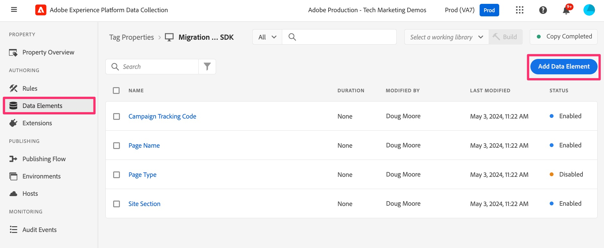

# Creare un elemento dati Variable

Aggiungi un elemento dati che verrà creato su più regole e quindi inviato all’Edge Network e inoltrato ad Adobe Analytics.

Questo elemento dati creerà l’oggetto &quot;Data&quot;, che verrà utilizzato per passare nuovamente le variabili di Adobe Analytics (proprietà, eVar, eventi, ecc.) in Adobe Analytics e Adobe Target. Quindi, proprio come per la creazione dell’&quot;oggetto s&quot; in un’implementazione di AppMeasurement in Analytics, verrà creato questo tipo: Oggetto variabile da accedere e aggiornare in più regole e può essere utilizzato per popolare proprietà ed eVar in Analytics.

1. Nell&#39;interfaccia della raccolta dati, fare clic su **Elementi dati** nell&#39;area di navigazione a sinistra.

   Viene visualizzata la pagina di destinazione degli elementi dati, in cui sono disponibili tutti gli elementi dati preesistenti. È necessario creare un nuovo elemento dati per facilitare la migrazione. Fare clic su **Aggiungi elemento dati**.

   

1. Configura l’elemento dati.
   1. Denomina l&#39;elemento dati come preferisci: qualcosa che ti aiuterà a ricordare che si tratta della creazione di dati sulla pagina e che questo sarà il tipo &quot;Variabile&quot;. Per questo tutorial, verrà chiamato **Variabile dati visualizzazione pagina**.
   1. Selezionare **Adobe Experience Platform Web SDK** dal menu a discesa Estensione.
   1. Seleziona **Variabile** dal menu a discesa **Tipo di elemento dati**.
   1. Nel pannello di destra, seleziona il pulsante di scelta **Dati**.
   1. Controlla la soluzione **Adobe Analytics** e una delle altre soluzioni di cui stai eseguendo la migrazione. Esempio: **Adobe Target** visualizzato in questa schermata.
1. Fai clic su **Salva**.

   
