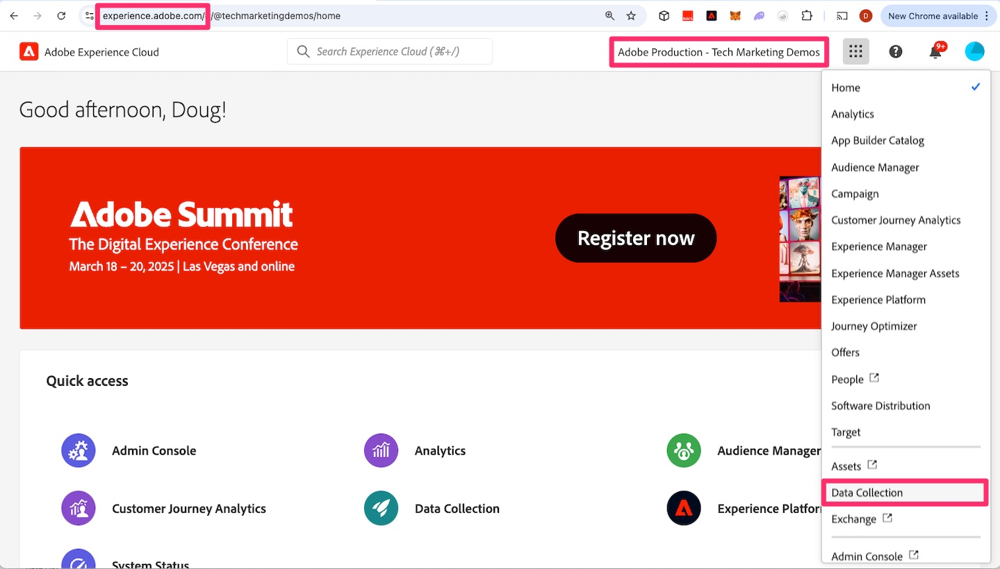
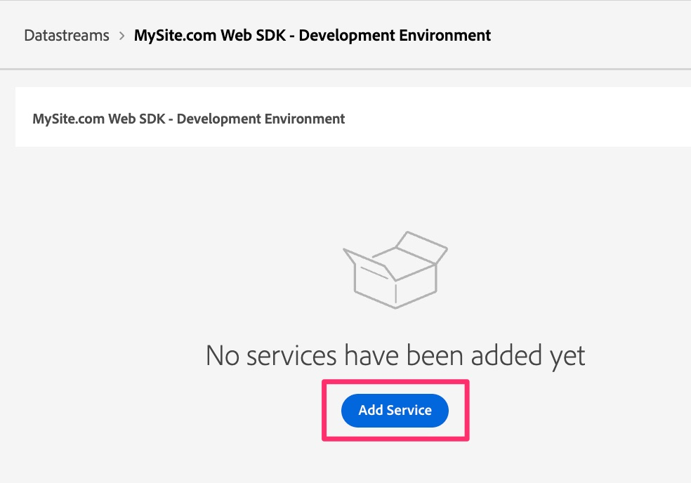

# Creare e configurare uno stream di dati

Scopri come creare e configurare un nuovo stream di dati in modo che i dati del sito web possano essere instradati ad Adobe Analytics.

In questa lezione imparerai a creare e configurare il sistema in modo che i tuoi dati fluiscano dal sito web ad Adobe Edge e quindi vengano indirizzati da lì ad Adobe Analytics.

## Creare un nuovo stream di dati di sviluppo

1. Aprire l’interfaccia di Adobe Data Collection
   1. Vai su https://experience.adobe.com nel browser
   1. Assicurati che la tua organizzazione corretta sia selezionata nella parte superiore della pagina (ad es. Produzione di Adobe - Demo di marketing tecnologico nell’immagine seguente)
   1. Fai clic sul pulsante &quot;nove punti&quot;, ossia sul commutatore dell&#39;applicazione, quindi seleziona **Raccolta dati**

      

1. Vai a **[!UICONTROL Datastreams]** nel menu di navigazione a sinistra
1. Seleziona **[!UICONTROL Nuovo flusso di dati]**
1. Immettere il **[!UICONTROL Nome]** desiderato e includere un indicatore che verrà utilizzato per l&#39;ambiente di sviluppo Web SDK. Ad esempio, puoi denominarlo dopo il sito, come illustrato di seguito. Prendi nota di questo dato, poiché in seguito viene fatto riferimento a questo nome quando configuri l’estensione Web SDK nella proprietà tag. Se necessario, immetti una descrizione.

   >[!NOTE]
   >
   >È sufficiente selezionare uno schema se si utilizza la funzionalità [Preparazione dati per raccolta dati](https://experienceleague.adobe.com/en/docs/platform-learn/data-collection/edge-network/data-prep), operazione che non verrà eseguita in questa esercitazione. Per ulteriori informazioni, visita il collegamento.

1. Seleziona **[!UICONTROL Salva]**

   

1. Una volta salvato lo stream di dati, viene visualizzata una nuova schermata che ti informa che non hai ancora configurato alcun servizio. In altre parole, i dati arriveranno ai server di Edge, ma non verranno inviati ad alcuna applicazione fino a quando non verrà aggiunto un servizio. Ora configureremo lo stream di dati per inviare i dati ad Adobe Analytics. Fare clic su **[!UICONTROL Aggiungi servizio]**.
   
1. Nel menu a discesa del servizio, seleziona **[!UICONTROL Adobe Analytics]**.
1. Nel campo ID suite di rapporti, immetti l&#39;ID (non il titolo, ma l&#39;ID suite di rapporti) della suite di rapporti di convalida creata nell&#39;attività [Crea una suite di rapporti di convalida](create-a-validation-report-suite.md). Fai clic su **[!UICONTROL Salva]**.

## Datastream di staging e produzione

Ora vorrai **ripetere gli stessi passaggi** altre due volte: una per l&#39;ambiente di staging e una per l&#39;ambiente di produzione. Di seguito sono riportate alcune note sulla configurazione di questi due flussi di dati aggiuntivi.

### Lo stream di dati di staging

* Quando si assegna un nome allo stream di dati (e quando si aggiunge la descrizione), è possibile/dovuto usare lo stesso nome con la differenza che si aggiunge &quot;staging&quot; invece di &quot;sviluppo&quot;.
* Aggiungi il servizio Adobe Analytics, come hai fatto in precedenza, e imposta la suite di rapporti sulla stessa suite di rapporti per lo sviluppo.
* Se desideri un ambiente più pulito per esaminare i numeri di staging nei rapporti di Adobe Analytics, puoi creare una nuova suite di rapporti solo per la staging e quindi assicurarti di puntare a tale suite di rapporti nel servizio Analytics di questo flusso di dati.

### Lo stream di dati di produzione

* Quando si assegna un nome allo stream di dati (e quando si aggiunge la descrizione), è possibile/dovuto usare lo stesso nome con la differenza che si aggiunge &quot;produzione&quot; invece di &quot;sviluppo&quot;.
* Quando scegli la suite di rapporti in cui mappare i dati, invece di scegliere la suite di rapporti di sviluppo o anche una nuova suite di rapporti, puoi mappare questo flusso di dati alla suite di rapporti di produzione **corrente** alimentata dall&#39;implementazione di AppMeasurement. In questo modo, dopo aver completato la migrazione e averla testata e soddisfatto dei numeri, puoi rimuovere il vecchio codice di AppMeasurement, inviare le librerie di tag alla produzione e inserire i nuovi dati di produzione nella stessa suite di rapporti di produzione, in modo da garantire la continuità tra le implementazioni vecchie e nuove.
