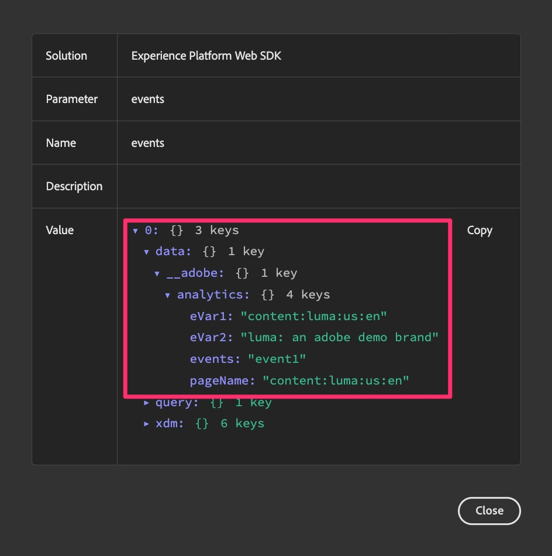

# Debug e convalida della migrazione di Web SDK

In questo esercizio verrà illustrato come eseguire il debug e convalidare i dati durante la migrazione al Web SDK. Vogliamo incoraggiare due diverse attività di convalida che possono aiutarti a garantire che tutto scorra correttamente:

1. **L&#39;attività di convalida #1** sta eseguendo l&#39;Adobe Experience Platform Debugger, che è un&#39;estensione del browser, e consente di verificare il corretto invio dei dati ad Analytics. Si consiglia di eseguire questa attività spesso, quando si apportano modifiche alla proprietà dei tag e si pubblicano le modifiche in una libreria di sviluppo.
1. **L&#39;attività di convalida #2** verrà avviata in Adobe Analytics, configurando uno o più progetti per ricevere dati da Web SDK (tramite la suite di rapporti per la migrazione appena creata) e verificando che i dati vengano effettivamente inseriti correttamente nei rapporti quando si fa clic sul sito, ecc.

## L’Adobe Experience Platform Debugger

Questo debugger è un’estensione del browser ed è disponibile sul Chrome store. È disponibile un [tutorial video](https://experienceleague.adobe.com/it/docs/platform-learn/data-collection/debugger/overview) che spiega come scaricare e utilizzare il debugger. È consigliabile eseguire prima questa esercitazione per conoscere l&#39;utilizzo di base.

Una volta che il debugger è in esecuzione, puoi utilizzarlo per assicurarti che i dati scorrano correttamente dal sito e attraverso l’Edge Network. Questo tutorial continuerà a essere usato di base, ma utilizza il debugger a tutta la sua capacità per controllare i tuoi dati.

**Ipotesi (sempre pericolosa, ma si spera che vada bene in questo caso):** Poiché in questo esempio si sta eseguendo la migrazione della proprietà tags al Web SDK, non è necessario inserire un nuovo codice di incorporamento nel sito. Ci sarà già stato. Tuttavia, se decidi di adottare un approccio di tipo &quot;incremento e spostamento&quot; per una proprietà dei tag completamente nuova, avrai a disposizione nuovi codici da incorporare negli ambienti di sviluppo, staging e produzione. Nel caso di questo tutorial, finché l’estensione Web SDK è installata e configurata con le regole che inviano i dati in, i dati verranno visualizzati nel debugger.

### Visualizzare i dati di Web SDK nel debugger

Dopo aver migrato la regola di pagina predefinita (o se ne è stata migrata una) e averla pubblicata in una libreria nell’ambiente di sviluppo, dovresti essere in grado di eseguire il sito e visualizzare i dati che fluiscono nel debugger.

Passaggi per visualizzare i dati:

1. Apri l’ambiente di sviluppo del sito nel browser
1. Apri il debugger facendo clic sull’estensione del browser nella barra delle estensioni nella parte superiore della finestra del browser

   

   >[!TIP]
   >
   >Nell’angolo in basso a destra del debugger c’è un’etichetta e un’icona &quot;Blocca&quot;, e a sinistra puoi vedere quale pagina stai eseguendo il debug. Quando si trova sul sito, fai clic sull’icona del lucchetto, che blocca il debugger nella finestra del sito. In caso contrario, se si fa clic su una scheda/finestra del browser diversa, il debugger risponderà a tale sito. Durante il debug del sito, è più semplice assicurarsi che il debugger fornisca sempre informazioni sul sito.

1. Verifica di essere nella pagina **Riepilogo** del debugger (icona &quot;Home&quot; in alto a sinistra). **Aggiorna il sito** nella finestra del browser. Se il debugger raccoglie il codice da incorporare sul sito e non hai eliminato il codice di Analytics (come da questa esercitazione), verranno visualizzate indicazioni dell’esistenza di codice sia per Adobe Experience Platform Web SDK che per Adobe Analytics, nonché per i tag di Adobe Experience Platform. Altri saranno disattivati.

   

1. Per visualizzare i dati aggiunti tramite il Web SDK, fai clic sul collegamento **Experience Platform Web SDK** nella barra a sinistra
1. Fai clic su **Cancella eventi** per eliminare eventuali hit
1. Aggiorna nuovamente il sito e torna al debugger
1. Quindi fai clic sul campo dati accanto a **eventi** nella tabella

   

1. Nel campo Valore, espandi verso il basso fino a 0, dati, __adobe e analytics
1. Dovresti visualizzare le variabili impostate nelle regole che vengono attivate sulla pagina, inclusa la regola di caricamento pagina predefinita ed eventuali regole speciali.

   

1. Esegui questi passaggi ogni volta che hai modificato qualcosa nella proprietà dei tag e pubblicato le modifiche allo sviluppo, in modo da poter vedere l’effetto delle modifiche apportate all’implementazione di Analytics.

## Convalidare i dati in Analysis Workspace

Il contenuto principale di questo consiglio è quello di raccogliere i dati di analisi correnti provenienti dall’implementazione dei tag tramite l’estensione Adobe Analytics e confrontarli con gli stessi rapporti che verranno ora compilati dal Web SDK.
Ci sono possibilmente diversi modi per impostare questi confronti, ma vi darò due esempi di come farlo.

### Opzione 1: confrontare i dati utilizzando due pannelli in un unico progetto

1. Crea un nuovo progetto in Analysis Workspace e aggiungi due pannelli
1. Imposta la suite di rapporti nel pannello 1 sulla suite di rapporti di produzione di Adobe Analytics corrente.
1. Imposta la suite di rapporti nel pannello 2 sulla nuova suite di rapporti per lo sviluppo di Web SDK
1. Inserisci lo stesso rapporto in entrambi i pannelli, utilizzando un periodo di tempo che include giorni interi solo se i dati sono stati inviati a entrambe le suite di rapporti
1. Confrontare i dati

Questo potrebbe essere simile al seguente (supponendo che non vi siano dati in queste suite di rapporti demo vuote):

Come puoi vedere, il rapporto è lo stesso in entrambi i pannelli e anche il calendario è lo stesso. La differenza sta nella suite di rapporti, come indicato nei passaggi precedenti.
**Vantaggio di questa opzione:** puoi passare uno per uno con report/dimensioni e testare esattamente ciò che desideri verificare, mentre apporti modifiche nell&#39;implementazione.

### Opzione 2: confrontare i dati utilizzando due progetti

1. Apri un progetto esistente che utilizza i dati correnti dell&#39;estensione Adobe Analytics
1. Eseguire un&#39;operazione Salva con nome per creare una copia del progetto, denominandolo ad esempio progetto di convalida della migrazione di Web SDK
1. Modifica la suite di rapporti per il progetto copiato in modo che punti alla suite di rapporti per lo sviluppo di Web SDK
1. Aprire ogni progetto in una finestra diversa e ridimensionarlo in modo da poterlo visualizzare l&#39;uno accanto all&#39;altro sul monitor
1. Confrontare i dati

Assomiglia molto all’immagine precedente, con la differenza che ogni pannello si trova nel proprio progetto e in una finestra diversa.
**Vantaggio di questa opzione:** In questo caso non è necessario aggiungere e configurare di nuovo tutti i rapporti, ma è possibile visualizzare l&#39;aspetto dei rapporti correnti utilizzando la nuova estensione Web SDK con una configurazione minima.

È possibile che vogliate fare entrambe le cose, che è anche un&#39;altra grande opzione.

>[!IMPORTANT]
>
>Dopo aver completato la convalida della regola di caricamento pagina predefinita, puoi proseguire nell’esercitazione. Tuttavia, ti imploriamo di testare/convalidare spesso, probabilmente almeno ogni volta che modifichi una regola o apporti altre modifiche significative. Ricorda che se riscontri un problema mentre procedi, sarai più felice se dovrai solo controllare UNA cosa invece di testare diverse modifiche apportate dall’ultima convalida.

Buona convalida!
