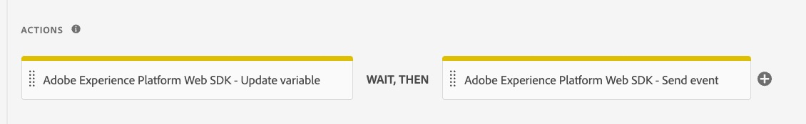

# Eliminare gli elementi dell’estensione Adobe Analytics

Al termine del debug e della convalida, rimuovi tutti i riferimenti agli elementi dell’estensione Adobe Analytics e l’estensione stessa.

## Panoramica

Una volta effettuata la migrazione di tutto nella proprietà al Web SDK e dopo aver completato il debug e la convalida (nell&#39;ambiente di sviluppo), puoi rimuovere i riferimenti all&#39;estensione Adobe Analytics. Spetta a te decidere quanto velocemente rimuovere questi elementi e quante volte eseguire il test mentre lo fai. Se desiderate essere più attenti, rimuovete lentamente i riferimenti e provate tra una rimozione e l&#39;altra. Se si è certi che tutto funzioni correttamente e che sia stata eseguita correttamente la migrazione, è possibile rimuovere la fascetta e rimuovere tutti gli elementi. Naturalmente, consiglieremmo comunque di eseguire i test alla fine dell&#39;esercizio.

## Rimuovi le vecchie azioni dalle regole

Di nuovo, supponiamo che abbiate già testato tutto e che funzioni correttamente. A questo punto puoi accedere alle tue regole una alla volta e rimuovere le azioni che appartengono all&#39;estensione Adobe Analytics.

1. Apri una delle tue regole, ad esempio la regola predefinita di caricamento pagina.
1. Dopo aver eseguito la migrazione per questa regola, probabilmente hai 4 (o più) azioni.

   

1. Puoi vedere che i primi due hanno l&#39;identificatore &quot;Adobe Analytics&quot; su di loro. Queste sono le azioni che desideri eliminare.
1. Passa il puntatore del mouse sul primo, come nell’azione &quot;Adobe Analytics - Imposta variabili&quot;, e viene visualizzata una X che consente l’eliminazione. Fai clic sulla X e osserva come l’azione scompare. Rimuovi una o tutte le azioni di Adobe Analytics nella regola, in questo caso l&#39;azione Imposta variabile e l&#39;azione Invia beacon.
1. Rimangono solo le azioni di Web SDK

   

1. Salva nella libreria
1. Crea la libreria e verifica il sito, per assicurarti che non vi siano nuovi errori e che tutto funzioni correttamente
1. Ripeti questa azione per le altre regole, creando nella libreria di sviluppo e sottoponendo a test ogni rimozione (o con la frequenza desiderata). Puoi testare nel debugger o anche controllare i rapporti nella suite di rapporti sulla migrazione, ancora una volta a seconda del livello di comfort.

## Rimuovere le estensioni

Dopo aver rimosso i riferimenti all’estensione Adobe Analytics, puoi rimuovere (o disabilitare) l’estensione, nonché tutte le altre estensioni che la utilizzano o che dipendono da essa. Personalmente mi piace un approccio attento, e quindi &quot;disabilitare&quot; è la mia scelta invece di disinstallare, almeno inizialmente.

1. Seleziona **Estensioni** dalla barra a sinistra nell&#39;interfaccia utente.
1. Verificare che la scheda **Installato** sia selezionata.
1. Seleziona l&#39;estensione Adobe Analytics.
1. Nella barra a destra, scegli di disabilitare l’estensione (o fai clic sui tre punti e, se preferisci, disinstalla).

   

1. Effettua le stesse operazioni per l’estensione del servizio ID di Experience Cloud, in quanto non sarà più necessaria. L&#39;estensione Web SDK gestisce l&#39;ID e quindi non è necessaria l&#39;estensione aggiuntiva.
1. Fai lo stesso per tutte le altre estensioni associate all’estensione Adobe Analytics, ma solo dopo aver apportato le modifiche di migrazione necessarie.
1. Apporta le modifiche all’ambiente di sviluppo.

