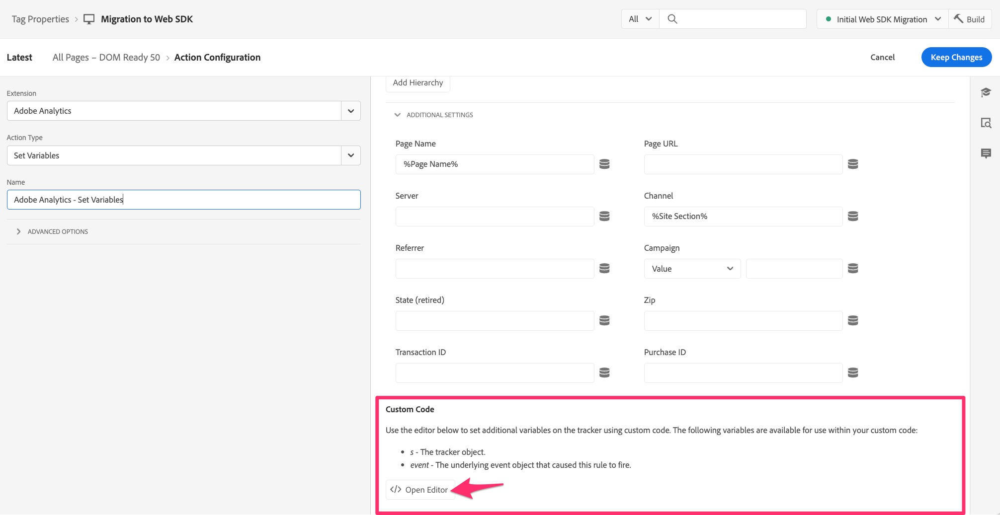
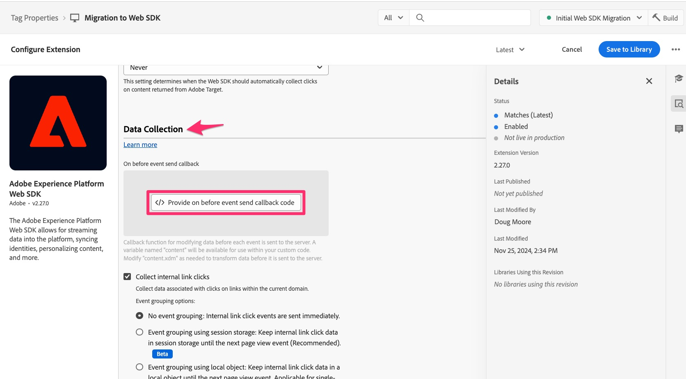

# Migrare il codice personalizzato al Web SDK

In questo esercizio imparerai a migrare il codice personalizzato dall’estensione Adobe Analytics all’estensione Adobe Experience Platform Web SDK in Experience Platform Tags.

## Il grande disclaimer

Sono sicuro che non sarete sorpresi di aggiungere qualcosa di simile a questo a un documento che inizia a dirvi il modo migliore/più semplice/più efficace per lavorare con il codice. Esistono chiaramente molti modi diversi per scrivere, modificare e gestire il codice. In questo esercizio ti fornirò un modo per prendere facilmente il codice che hai in una regola esistente e copiarlo, aggiungere una modifica e farlo funzionare per la regola migrata. Se pensate a un modo migliore di farlo, è fantastico, e non solo vi do il benvenuto ad usarlo, ma a condividerlo con noi e con i vostri colleghi della community di Experienci League (specialmente nel post della community relativo a questo tutorial). Lo stesso vale per la parte inferiore della pagina, quando si lavora con i plug-in di implementazione. Suggerirò un modo per arrivare qui, e poi farai quello che ti fa stare bene. OK, entriamo nei dettagli.

>[!IMPORTANT]
>
>Nello spirito dell’ultimo paragrafo, è inoltre importante consigliare di sfruttare questa opportunità durante la migrazione a Web SDK per esaminare il codice e verificare se è necessario aggiornarlo o eliminarlo. Nei paragrafi e nei passaggi seguenti vedrai come migrare il tuo codice, e anche se è più facile semplicemente spostarlo tutto in un colpo solo, mi mancherebbe di non raccomandare una pulizia di primavera, per così dire.

## Migrazione del codice?

Il codice che verrà risolto in questa sezione è il codice che potrebbe essere presente nella finestra &quot;Codice personalizzato&quot; in qualsiasi azione di Adobe Analytics, incluse le azioni **Imposta variabile**. In altre parole, apri una delle tue regole e controlla in basso nella sezione delle azioni. Se disponi di un’azione &quot;Adobe Analytics - Imposta variabili&quot;, fai clic su per aprirla.


Quindi scorri verso il basso, a destra, fino in fondo e visualizzerai il pulsante &quot;Apri editor&quot; per la finestra Codice personalizzato. Fai clic per aprire.



Se il codice è presente, sarà necessario eseguirne la migrazione in modo che possa essere eseguito e inviato ad Adobe Analytics utilizzando il Web SDK.
L&#39;idea principale è che convertiamo l&#39;oggetto &quot;s&quot; in &quot;content&quot;.__adobe.analytics&quot;.

Sarà sufficiente aggiungere del codice prima della prima chiamata all’oggetto s, in modo che possa essere compreso e gestito dal Web SDK. Il punto in cui viene aggiunto il codice appena modificato è la finestra Codice personalizzato dell’azione &quot;Adobe Experience Platform Web SDK - Aggiorna variabile&quot;.

Ad esempio, supponiamo che nella finestra del codice personalizzato sia presente il seguente blocco di codice:

```javascript
const products = window.digitalData.products;
const productIndex = event.element.dataset.productIndex;
const product = products[productIndex];
s.products = [
product.cat3Tag,
product.id,
1,
product.price
].join(";");
```

Il codice da includere è il seguente:

```javascript
content.__adobe = content.__adobe || {};
content.__adobe.analytics = content.__adobe.analytics || {};
const s = content.__adobe.analytics;
```

Pertanto, per migrare il codice personalizzato, segui la procedura riportata di seguito:

1. Copia il codice personalizzato dalla finestra nell’azione Imposta variabili di Adobe Analytics
1. Chiudi la finestra del codice e chiudi (annulla) l’azione.
1. Apri il Web SDK - Aggiorna azione variabile facendo clic su di esso (o, se non ne hai ancora uno, aggiungine uno).

   

1. Seleziona l’oggetto di analisi nella parte superiore della finestra a destra

   

1. Scorri verso il basso e apri la finestra Codice personalizzato

   

1. Incolla il codice trasferito dalla finestra del codice personalizzato di Analytics
1. Posizionare le nuove righe di codice al centro del codice esistente, in modo che sia sopra la prima menzione dell&#39;oggetto s, come nell&#39;esempio seguente:


Ora puoi salvare il codice nella finestra Codice personalizzato e mantenere le modifiche nell&#39;azione Aggiorna variabili. Potrai anche salvare la regola e pubblicare le nuove modifiche nella libreria di lavoro.

## E i plug-in?

Se utilizzi un’implementazione &quot;appMeasurement&quot; di Adobe Analytics con l’estensione Analytics in Experience Platform Tags (precedentemente nota come &quot;Launch&quot;), è probabile che tu stia utilizzando uno o più &quot;plug-in&quot; di JavaScript per impostare le variabili o per eseguire altre attività. Se queste funzioni e chiamate di JavaScript si trovano in una finestra di codice all&#39;interno di una regola, le informazioni precedenti in questa pagina dovrebbero essere utili per migrare il codice a Web SDK.
Tuttavia, è anche più probabile che il codice del plug-in si trovi nella finestra del codice nella configurazione dell’estensione Adobe Analytics stessa. Per verificare se disponi di plug-in e altro codice per la migrazione, apri l&#39;estensione Analytics accedendo a Raccolta dati e tag, apri la proprietà e fai clic su **Estensioni** nel menu di navigazione a sinistra.

1. Seleziona la scheda **Installato** nella parte superiore della pagina, quindi fai clic sull&#39;estensione Adobe Analytics.
1. Quindi, sul lato destro della pagina, fai clic su **Configura**

   

1. Espandi la sezione **Configura tracker utilizzando codice personalizzato**
1. Fai clic per **aprire l&#39;editor**

   

A questo punto, potrai vedere il codice che hai dentro e potresti avere &quot;plug-in&quot; di JavaScript, ovvero snippet di codice che ti aiutano a ottenere alcuni dati desiderati e assegnarli a dimensioni personalizzate, ecc.

Non tutti in questa finestra di codice possono essere considerati plug-in nel vero senso di Adobe Analytics. Questo sarà importante da capire quando decidi come migrare il codice.

### Consiglio per la migrazione del codice dalla finestra del codice principale dell’estensione

Beh, di nuovo, non tutto nella finestra del codice potrebbe essere un plug-in ufficiale creato da Adobe Consulting. Potrebbe trattarsi in parte di codice che hai scritto, che lo chiami o meno un plug-in. È consigliabile apportare due modifiche. Devono utilizzare una nuova estensione e anche copiare e incollare il resto del codice in una nuova posizione.

**Primo**, nei tag è disponibile un&#39;estensione denominata **Common Web SDK Plugins**. Questa estensione è un sottoinsieme dell’elenco totale dei plug-in di implementazione elencati nella documentazione di Adobe Analytics. Installando questa estensione nella proprietà Tags, stai installando il codice dei plug-in inclusi. Quindi, per utilizzare questi plug-in, puoi trovarli durante la creazione di nuovi **elementi dati**. Tra poco ne parleremo di più.

**Secondo**, nella configurazione dell&#39;estensione Web SDK è presente una finestra di codice in cui è possibile inserire tutto o parte del codice, SE si desidera che il codice venga eseguito immediatamente prima che gli eventi vengano inviati ad Adobe Analytics. Passaggi per trovare che la finestra del codice è:

1. Se hai già aggiunto l&#39;estensione Web SDK alla tua proprietà, passa a **Estensioni** e seleziona la scheda **Installato**
1. Seleziona l&#39;estensione **Adobe Experience Platform Web SDK** e aprila facendo clic su **Configura** nella barra a destra.

   

1. Scorri verso il basso fino alla sezione **Raccolta dati** e fai clic per aprire la finestra del codice per **onBeforeEventSend**.

   

In questa posizione verrà incollato tutto il codice che si desidera eseguire immediatamente prima che l’evento venga inviato in Analytics dal Web SDK. Questo è sostanzialmente ciò che faceva la funzione doPlugins nella tua vecchia implementazione di Analytics.

**buone notizie** è che deve essere eseguito **in qualsiasi momento**. Pertanto, sia che si verifichi al caricamento della pagina o con un collegamento personalizzato, è necessario eseguire il codice, impostare le variabili e così via.

#### Devo cambiare il mio codice?

Beh, sì e no. Sì, è necessario modificare alcune piccole modifiche, ma no, non sarà necessario modificare la maggior parte del codice, purché si modifichino queste piccole modifiche:

_&#x200B;**Modifica codice 1:**&#x200B;_
Dopo (o prima di) aver incollato il codice &quot;plug-in&quot; nella finestra del codice nell&#39;estensione Web SDK, **rimuovere** le righe &quot;doPlugin&quot; dal codice. Non ne avrai bisogno e causeranno un errore poiché fanno parte di appMeasurement.js ma non del codice Web SDK.


_&#x200B;**Modifica codice 2:**&#x200B;_
L’altra modifica che dovrai fare è aggiungere del codice in modo che l’oggetto &quot;s&quot; sia definito, in modo molto simile a quanto discusso in precedenza per quanto riguarda il codice nelle azioni della regola. In questo caso, dovremo definire il codice in modo leggermente diverso, aggiungendo un nodo &quot;dati&quot; già definito nell’azione della regola, ma non qui.
Questa definizione deve essere posizionata nella parte superiore della finestra del codice. Il codice da copiare (quando si inserisce il codice nell&#39;estensione Web SDK) è il seguente:

```javascript
content.data.__adobe = content.data.__adobe || {};
content.data.__adobe.analytics = content.data.__adobe.analytics || {};
const s = content.data.__adobe.analytics;
```

_&#x200B;**Con entrambe le modifiche al codice:**&#x200B;_
Di seguito è riportato il codice elencato in precedenza, ma con entrambe le modifiche abbiamo appena discusso:


### Passaggi per migrare il codice dell’estensione principale a Web SDK

Come indicato sopra, il consiglio è duplice: utilizzare la nuova estensione Common Web SDK Plugins e anche copiare e incollare il codice dalla configurazione dell’estensione Analytics nella configurazione dell’estensione Web SDK. Tenendo presente questo aspetto, insieme alla nota importante nella parte superiore della pagina per pulire il codice, ecco i passaggi consigliati a un livello elevato:

1. Copia tutto il codice dalla finestra del codice di configurazione dell’estensione Analytics e incollalo nella finestra onBeforeEventSend nella configurazione dell’estensione Web SDK (anche se è possibile che si stia copiando del codice che deve essere rimosso o aggiornato, effettueremo alcuni passaggi al codice nella nuova finestra).
1. Esaminare il codice nell&#39;estensione Web SDK e cercare le chiamate ai plug-in o la definizione della funzione per i plug-in definiti nell&#39;estensione **Common Web SDK Plugins**. L&#39;elenco dei plug-in è disponibile nella finestra di definizione dell&#39;elemento dati di Web SDK dopo l&#39;installazione dell&#39;estensione dei plug-in. Puoi trovarlo anche nella [documentazione per tale estensione](https://exchange.adobe.com/apps/ec/108520).
1. Per ciascuno dei plug-in trovati nella nuova estensione dei plug-in Web SDK, rimuovi l’estensione e la chiamata dal codice; assicurati quindi di compensare tale rimozione creando un elemento dati e chiamando quindi tale elemento dati nella regola appropriata per impostare le variabili, ecc.
1. Ora fai un passaggio attraverso il codice per vedere se ci sono chiamate a funzioni definite NEL file appMeasurement.js. **La modifica del codice 1** di cui sopra ne è un esempio e, se non lo hai già fatto, puoi effettuare questa rimozione del codice doPlugins in questo momento. Per altre istanze, questo sarà più evidente quando si dispone di una chiamata a una funzione che non è definita in alcun punto del codice. Puoi anche verificare con l’Assistenza clienti di Adobe o con colleghi della community di Experience League che questo sia il caso per quel codice.
1. Quindi, aggiorna o elimina il codice precedente che non si applica più alle tue esigenze di analisi, come consigliato nella parte superiore della pagina.
1. Ora esegui **la modifica al codice 2** elencata sopra, aggiungendo le righe aggiuntive in modo che eventuali riferimenti all&#39;oggetto s non causino errori nel codice.
1. Infine, ma non meno importante, prova, verifica e prova ancora un po’. Dopodiché, riprova. Assicurati che il codice fornisca i risultati previsti sia nel debugger di Experience Platform che nei rapporti in Adobe Analytics.

>[!NOTE]
>
>Due ultime considerazioni sui passaggi qui sopra.
>Innanzitutto, è possibile che sia più semplice lasciare all&#39;interno tutto il codice del plug-in anziché rimuoverlo e utilizzare la nuova estensione Common Web SDK Plugins. Questo è vero e corretto, ma utilizzando l’estensione potrai sfruttare i vantaggi dell’utilizzo di un’interfaccia utente, della definizione di un elemento dati riutilizzabile e della ricezione automatica di eventuali aggiornamenti del codice in futuro. Probabilmente vale la pena fare il cambio.
>
>In secondo luogo, parlando di &quot;fare lo switch&quot;, potresti anche decidere ora di aggiornare TUTTO il codice personalizzato in modo che non faccia riferimento al vecchio oggetto &quot;s&quot;, che è una sorta di estensione del passaggio 5 precedente. Naturalmente, è assolutamente accettabile ed è una grande idea. Questo tutorial sulla migrazione sta cercando di semplificare leggermente la migrazione del codice personalizzato, nel caso in cui tu ne abbia molti e non disponga delle risorse per aggiornarlo completamente al momento. Sta a te decidere.

Termineremo questa lezione nel modo in cui l&#39;abbiamo iniziata, riconoscendo che ci sono molti modi per scrivere il codice, e questo documento ti fornisce alcuni passaggi da seguire se vuoi farlo in questo modo. La cosa principale è che il tuo codice funziona e ti ottiene i risultati che ti aspetti, quindi sentiti libero di farlo a modo tuo, e ho detto che dovresti testare?
