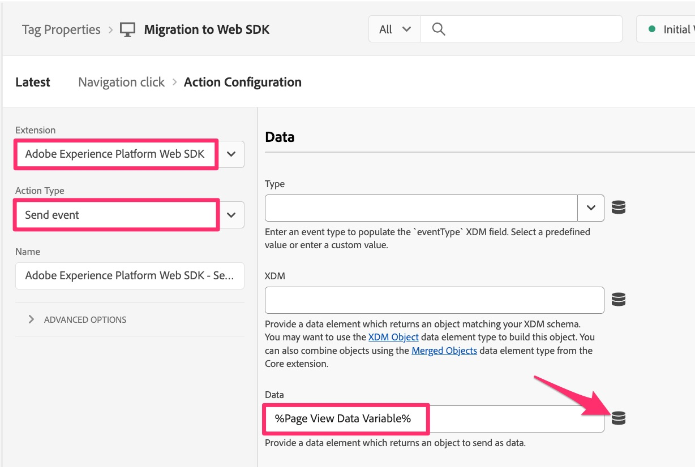

# Migrare le regole di collegamento personalizzate

In questo esercizio imparerai a migrare le regole che inviano gli hit di collegamento personalizzati (anziché le visualizzazioni di pagina).

## Panoramica

Quando invii un hit di collegamento personalizzato utilizzando l&#39;estensione Analytics, o codice di AppMeasurement, quando configuri l&#39;azione **Invia beacon**, scegli anche se invii un hit di visualizzazione della pagina o un hit di collegamento personalizzato; se scegli un hit di collegamento personalizzato, ti chiederà di specificare **Nome collegamento** e **Tipo collegamento** per tale hit. Se non invii altri dati di variabili oltre al nome e al tipo del collegamento, non è necessario disporre di un’azione aggiuntiva che imposti le variabili (proprietà, eVar ed eventi).
Per questo motivo, durante la migrazione delle regole che sono regole di collegamento personalizzate, si verificherà **uno dei due** scenari seguenti nelle regole:

1. La regola esistente conterrà un&#39;azione **Adobe Analytics - Imposta variabili** che imposta proprietà, eVar, eventi e così via, e quindi contiene un&#39;azione **Adobe Analytics - Invia beacon** che imposta l&#39;hit su un hit di collegamento personalizzato (alias s.tl() hit), imposta il nome e il tipo di collegamento e invia i dati.
   1. In questo caso, probabilmente conterrà anche un&#39;azione finale denominata **Adobe Analytics - Cancella variabili**, per &quot;azzerare&quot; il valore dalle variabili dopo l&#39;invio dei dati ad Adobe Server.
1. La regola esistente conterrà solo l&#39;azione **Adobe Analytics - Invia beacon** che imposta l&#39;hit su un hit di collegamento personalizzato, imposta il nome e il tipo di collegamento e invia i dati.

### Un cambiamento importante

Questo è il motivo per cui è importante durante la migrazione dell’implementazione di Adobe Analytics al Web SDK:
L’impostazione del nome e del tipo di collegamento, necessaria affinché l’hit sia un hit di collegamento personalizzato, NON è nell’azione &quot;Invia equivalente beacon&quot; (evento Invia). L’impostazione del nome e del tipo di collegamento si trova invece nell’azione &quot;Imposta variabili-equivalenti&quot; (Aggiorna variabile).
Di conseguenza, indipendentemente dal fatto che si disponga dello scenario 1 o 2 di cui sopra, sarà necessario ottenere sia un’azione Aggiorna variabile che un’azione Invia evento.

Di seguito è riportata una rappresentazione visiva di questa differenza nelle implementazioni.

## Passaggi di migrazione

Apri la regola di collegamento personalizzato della regola e identifica se assomiglia allo scenario 1 o allo scenario 2 dall&#39;alto.
**Se la regola assomiglia allo scenario 1:**

1. Apri l’azione Imposta variabili e annota tutte le variabili (proprietà, eVar, eventi, ecc.) impostate in tale azione (ad esempio, nell’immagine precedente, event10 è impostato).
1. Apri l’azione Invia beacon e verifica che sia impostata per inviare un hit s.tl(). Annotare i valori Tipo di collegamento e Nome collegamento.
1. Nella sezione Azioni della regola di collegamento personalizzata, fai clic sull’icona più per aggiungere un’altra regola.

   

1. Configurare l’azione
   1. Imposta l&#39;estensione **Extension** su Adobe Experience Platform Web SDK
   1. Imposta **Tipo azione** per aggiornare la variabile
   1. Seleziona l&#39;oggetto **Analytics**
   1. Imposta proprietà, eVar ed eventi dall’azione Imposta variabili di Analytics (in questo esempio, event10).

      

   1. Nella stessa regola, scorri verso il basso fino al campo a discesa **Proprietà aggiuntiva** e aggiungi il campo **Nome collegamento**, impostandolo sul valore estratto dalla regola Invia beacon. Nell’immagine seguente, l’esempio imposta il nome sul valore stringa &quot;menu click&quot;.
   1. Aggiungi anche il campo **Tipo di collegamento** dallo stesso elenco a discesa, aggiungendo &quot;o&quot; come valore (supponendo che il tipo di collegamento nell&#39;azione Invia beacon sia &quot;Collegamento personalizzato&quot;). Verrà inviato il tipo di collegamento &quot;altro&quot;, che equivale a un collegamento personalizzato. Se il tipo di collegamento era un collegamento di download, scegliere &quot;d&quot; per il valore in questo campo del nuovo tipo di collegamento e, se il tipo di collegamento era un collegamento di uscita, scegliere &quot;e&quot; per il valore in questo campo del nuovo tipo di collegamento.

      

1. Sotto le proprietà aggiuntive verrà visualizzata una casella di controllo con etichetta **Cancella valore esistente**. Se la regola esistente dispone di un&#39;azione **Adobe Analytics - Cancella variabili** (come mostrato sopra nel passaggio 3), è sufficiente selezionare questa casella e non sarà necessario aggiungere un&#39;azione cancella variabili per il Web SDK.

   

1. Per aggiungere un’altra azione, fai clic sull’icona più.
1. Configurare l’azione Invia evento
   1. Imposta l&#39;estensione **Extension** su Adobe Experience Platform Web SDK
   1. Imposta il **Tipo azione** per l&#39;evento Inviato
   1. Fai clic sull&#39;icona dell&#39;elemento dati e scegli l&#39;elemento dati **Variabile dati visualizzazione pagina**

   

1. **Mantieni le modifiche**, **Salva nella libreria** e puoi **Creare** la libreria dalla stessa pagina, poiché è già stata impostata una libreria di lavoro.

## Conclusioni importanti sulla migrazione

* In questa lezione, hai imparato a migrare le regole di collegamento personalizzate.
* Nell&#39;esercizio [Migrare la regola di caricamento pagina predefinita](migrate-your-default-page-load-rule.md) hai imparato a migrare le regole che impostano le variabili e inviano anche un beacon Analytics.
* Nella lezione [Migrare regole di pagina aggiuntive](migrate-additional-page-rules.md), hai imparato a migrare le regole che impostano le variabili ma non inviano un beacon in Adobe Analytics.

Come puoi immaginare, gli stessi metodi possono essere utilizzati in molte regole diverse per migrare l’estensione Analytics al Web SDK.
Nella maggior parte dei casi, stai semplicemente **aggiornando le azioni** nelle regole. Non stai modificando l’evento o le condizioni in cui viene attivato. Stai modificando solo ciò che accade nella sezione delle azioni quando le regole vengono attivate.
La maggior parte delle regole, se non tutte, rientrerà in queste categorie. Se disponi di una regola che non lo fa, considera lo stesso paradigma di migrazione dell’azione e non quello che ha attivato la regola.
