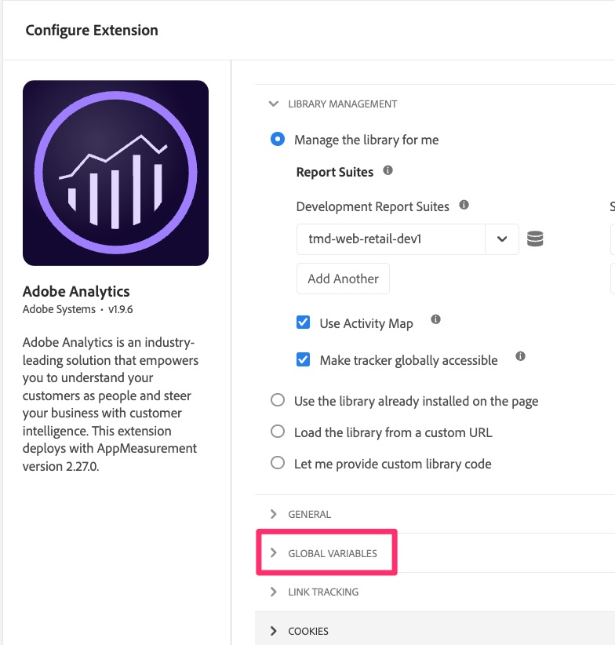

# Migrare le variabili globali

Questo esercizio illustra come migrare le variabili globali dalla configurazione dell’estensione Analytics a Web SDK.

## Panoramica

Nell&#39;estensione Adobe Analytics è presente una sezione di configurazione denominata &quot;Variabili globali&quot;.

Le variabili globali sono variabili impostate sull&#39;oggetto di tracciamento Analytics quando tale oggetto è inizializzato sulla pagina. Tutte le variabili impostate qui verranno impostate al momento della creazione dell&#39;oggetto di tracciamento in ogni pagina.

Se hai impostato delle variabili qui, dobbiamo migrarle anche al Web SDK.

## Dove aggiungere variabili globali nel Web SDK

In questo caso, **bottom line** è che non esiste un&#39;area equivalente nella configurazione dell&#39;estensione Web SDK, quindi non sarà facile come copiare semplicemente le variabili come è stato fatto nell&#39;esercizio Default Page Load Rule.
La risposta breve è invece: **Creare una nuova regola che venga eseguita prima delle altre regole in ogni pagina e impostare le variabili in essa contenute.**

Se non è necessario definire i passaggi, procedere in questo modo e completare la lezione. Per assistenza, continuare...

### Passaggi per la migrazione di variabili globali a Web SDK

1. Apri la configurazione dell&#39;estensione Adobe Analytics.

   

1. Scorri verso il basso fino alla sezione Variabili globali (immagine qui sopra), aprila e prendi nota di una o più delle variabili impostate. Sarà necessario conoscere queste variabili e questi valori in un passaggio successivo.
1. Annulla per uscire dall’estensione Analytics.
1. Seleziona **Regole** nell&#39;area di navigazione a sinistra e fai clic su **Aggiungi regola**.
1. Denomina la nuova regola &quot;Variabili globali&quot;.
1. Fai clic sul pulsante Aggiungi in Eventi.

   

1. Configura l’evento da attivare prima delle altre regole. Dovrai conoscere il tipo di evento e l’ordine utilizzati in altre regole. Valori di esempio:
   1. Imposta l&#39;estensione **Extension** su Core
   1. **Il tipo di evento** può essere DOM Ready, a seconda dell&#39;implementazione
   1. Espandi **Opzioni avanzate**
   1. Imposta **Ordine** su un numero inferiore rispetto alle altre regole, in modo che venga eseguito per primo.
      
      >[!NOTE]
      >
      >La cosa principale è che questa regola si attiva prima della regola di caricamento pagina predefinita, in modo che tutte le variabili impostate in questa regola possano essere inviate ad Analytics tramite la regola sendEvent. Tuttavia, si consiglia di eseguire questa regola **first** in generale, perché le variabili impostate nella sezione Variabili globali nell&#39;estensione Analytics potrebbero essere modificate in altre regole. Stiamo imitando quella funzionalità. Nell’esempio precedente, supponiamo che &quot;10&quot; sia un numero di ordine inferiore rispetto a qualsiasi altra regola. Se non è corretto, impostare un numero inferiore rispetto alle altre regole.
1. Seleziona **Mantieni modifiche** per salvare il lavoro.
1. Non è necessario aggiungere condizioni a questa regola, pertanto puoi lasciare da sola quella sezione della creazione della regola.
1. Fai clic sull&#39;icona più sotto la sezione **Azioni**
1. Configurare la nuova azione
   1. Scegli l&#39;estensione **Adobe Experience Platform Web SDK**
   1. Per **Tipo azione**, scegliere Aggiorna variabile
   1. A destra, scegli la variabile **Data Element** (per questa esercitazione era denominata &quot;Page View Data Element&quot;, ma il nome potrebbe variare)
   1. Seleziona **Analytics** nell&#39;oggetto dati
   1. Popola le variabili salvate dalla sezione Variabili globali nella configurazione dell&#39;estensione di Analytics (nell&#39;esempio di questo tutorial, impostando eVar10 sull&#39;elemento dati Page Type)

   

1. Mantieni modifiche
1. Salvare la regola nella libreria di lavoro e generare

Le variabili globali vengono ora migrate a Web SDK e verranno attivate al caricamento di qualsiasi pagina.
