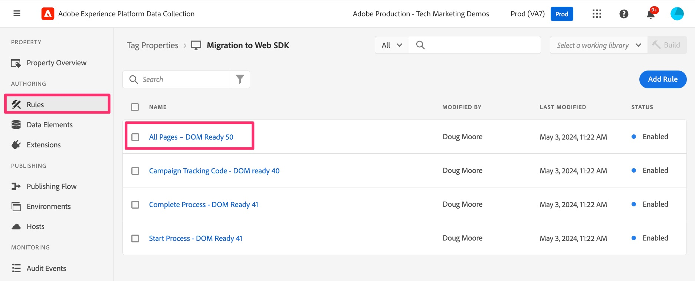
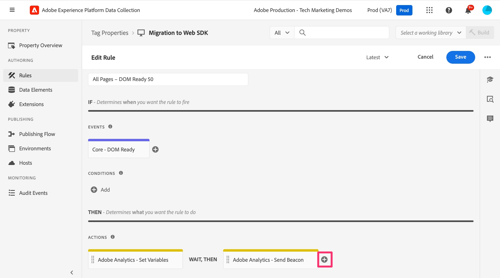

# Migrare la regola di caricamento pagina predefinita

In questo esercizio scoprirai come migrare una regola predefinita per il caricamento delle pagine nei Tag di Adobe Experience Cloud dall’estensione Analytics all’estensione Web SDK.

## Panoramica

Torniamo un po&#39; indietro. È probabile che in Tag (precedentemente noto come &quot;Launch&quot;) sia presente una regola attivata su ogni pagina, ovvero una regola che imposta una o più variabili predefinite e quindi attiva un beacon o un hit in Adobe Analytics. Questa regola sta attualmente utilizzando le &quot;azioni&quot; nell’estensione Adobe Analytics per eseguire queste operazioni. Durante la migrazione della nostra implementazione a Web SDK, dobbiamo essere in grado di rimuovere eventuali riferimenti (come le azioni) all’estensione Analytics e sostituirli con azioni che appartengono a Web SDK. Nei passaggi seguenti, supponiamo quanto sopra; ovvero che disponi di una regola di caricamento pagina predefinita che imposta le variabili e invia un beacon di tracciamento ad Analytics.

## Migrare l’azione Imposta variabili

In questa attività verrà creata un&#39;azione Web SDK equivalente all&#39;azione **Imposta variabili** nell&#39;estensione Adobe Analytics.

1. Nell&#39;interfaccia utente di Data Collection e nella proprietà, vai alla schermata **[!UICONTROL Regole]** selezionandola nell&#39;area di navigazione a sinistra.
1. Seleziona la regola che è la **regola di caricamento predefinita di Analytics**. Se non sai quale regola è la tua regola di caricamento predefinita, parla con qualcuno che ha una conoscenza delle regole e di ciò che contiene. Di nuovo, stiamo cercando una regola che viene eseguita su ogni pagina, imposta alcune variabili predefinite (ad esempio il nome della pagina) e quindi invia un beacon ad Analytics. Apporteremo modifiche a questa regola. Il mio si chiama &quot;All Pages - DOM Ready 50&quot;, ma il tuo potrebbe essere chiamato qualsiasi cosa.

   

1. Per migrare le azioni correnti dall’estensione Analytics all’estensione Web SDK, è necessario sapere quali variabili vengono impostate. Pertanto, fai clic sull&#39;azione **Adobe Analytics - Imposta variabili** per vedere quali variabili vengono impostate (ad esempio NomePagina, prop, eVar, eventi e così via).

   
   1. Osserva quali variabili vengono impostate in tale regola
      

1. Nella parte superiore della pagina, modifica il pulsante di opzione in **Fornisci JSON**. Verrà visualizzata una visualizzazione del codice delle variabili impostate. Questa vista codice e quella interfaccia utente sono intercambiabili e quando imposti un elemento in un’interfaccia utente, questo verrà aggiornato anche nell’altra.

   

1. Copiare i dati negli Appunti o salvarli in un file da utilizzare immediatamente, perché nei passaggi successivi si incollerà il codice in una nuova azione di Web SDK.
1. Annulla l’azione Imposta variabili di Analytics per tornare alla regola.

   >[!IMPORTANT]
   >
   >In questo passaggio sono disponibili opzioni, tra cui:
   >1. Invece di aggiungere una nuova azione, puoi semplicemente modificare le azioni esistenti; se vengono salvate, tutti i dati vengono immediatamente trasferiti alla nuova suite di rapporti di Web SDK e non vengono più visualizzati nella suite di rapporti di Analytics corrente.
   >1. Puoi creare una nuova azione per inviare i dati ad Analytics tramite il Web SDK, lasciando l’azione Analytics attiva per il momento. In questo modo puoi confrontare i dati nella nuova suite di rapporti di Web SDK con quelli della suite di rapporti di Analytics corrente. **Questa è l&#39;operazione che eseguiremo in questa esercitazione.** Tieni presente che questo metodo darà luogo a doppi hit durante il confronto dei dati, determinando anche un costo per le chiamate server aggiuntive, fino a quando non rimuoverai le azioni della vecchia estensione Analytics. Ovviamente non vorrai mantenere le azioni dell’estensione Analytics all’interno di per sempre, ma piuttosto abbastanza a lungo per verificare che i dati fluiscano correttamente nella nuova suite di rapporti dell’estensione Web SDK.

1. Fai clic sul pulsante **più** per aggiungere una nuova azione Web SDK.

   

1. Selezionare **Adobe Experience Platform Web SDK** dal menu a discesa Estensione.
1. Selezionare **Aggiorna variabile** dal menu a discesa Tipo azione.
1. Nel pannello di destra, seleziona l&#39;oggetto **Analytics** all&#39;interno dell&#39;oggetto dati
1. Inoltre, assicurati che l’elemento Dati elencato in alto nel pannello di destra sia effettivamente il tuo nuovo elemento dati di tipo variabile.

   

1. Ora modifica il pulsante di scelta in **Fornisci JSON o Elemento dati** e incolla nella finestra del codice il codice copiato nel passaggio precedente da Imposta variabili. Ricorda che quello che stiamo mostrando qui nell&#39;esercitazione sono solo esempi. Stai copiando e incollando le tue variabili.

   
Questo strumento di copia JSON è stato creato appositamente per semplificare la migrazione e sono sicuro che potrai vedere quanto è facile, invece di dover prendere appunti dalla vecchia azione e applicarli alla nuova azione.

1. Puoi, in qualsiasi momento, spostare il pulsante di opzione avanti e indietro per visualizzare i valori nella versione del codice (mostrata sopra) o nella versione dell’interfaccia utente per visualizzare gli attributi. Selezionare il pulsante di opzione **Fornisci attributi individuali** per visualizzare gli attributi compilati.

   
   

1. Quando le variabili sono impostate correttamente, fai clic su **Mantieni modifiche/Salva.**

## Migrare l’azione Invia beacon

In questa attività verrà creato un equivalente Web SDK dell&#39;azione &quot;Invia beacon&quot; di Analytics, denominata **Invia evento**.

1. Torna alla regola di pagina predefinita in cui eri appena.
1. Nella sezione delle azioni, fai clic sul pulsante **più** per aggiungere un&#39;altra azione. Questa sarà l&#39;azione **Invia evento**.

   

1. Per configurare l&#39;azione, selezionare **Adobe Experience Platform Web SDK** dal menu a discesa Estensione.
1. Selezionare **Invia evento** dal tipo di azione.
1. Nel pannello di destra, seleziona l&#39;icona elemento dati accanto all&#39;oggetto **Dati**.

   

1. Seleziona la Variabile di dati Visualizzazione pagina (o qualsiasi elemento denominato nuovo elemento di dati di tipo &quot;dati&quot;), quindi fai clic sul pulsante **Seleziona**.

   

1. Fai clic su **Mantieni modifiche/Salva**.
1. Ora dovresti visualizzare tutte e quattro le azioni (due vecchie e due nuove) nella regola

   

## È necessario eliminare le azioni dell&#39;estensione Analytics?

Ottima domanda. La risposta sta nel decidere se convalidare o meno le nuove azioni prima di eliminare quelle precedenti. Come accennato in precedenza, se esci dalle azioni Analytics e Web SDK che inviano i dati (Invia beacon ed Invia evento), come abbiamo scelto di fare in questa esercitazione, gli stessi dati verranno inseriti in due suite di rapporti (vale a dire, la suite di rapporti di produzione dell&#39;estensione Analytics e la nuova suite di rapporti di convalida dell&#39;estensione Web SDK). Questo comporta il raddoppio delle chiamate server in Analytics ed è associato a un costo. Tuttavia, questo è il numero di clienti che scelgono di farlo, in modo da poter convalidare i nuovi dati prima di spegnere i dati obsoleti. Alla fine di questa esercitazione si terrà un esercizio che mostrerà come ripulire le vecchie operazioni una volta completata la convalida, ma se desideri eseguirla ora per salvare le chiamate al server e non preoccuparti della convalida, puoi passare alla fine dell&#39;esercitazione oppure eliminare le azioni dell&#39;estensione Analytics dalle regole man mano che procedi.
