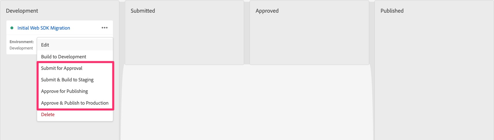

# Publish: migrazione a staging e produzione

Una volta completato tutto lo sviluppo per la migrazione e la convalida, crea nell’ambiente di staging e quindi pubblica nell’ambiente di produzione quando è pronto.

## Panoramica

Questo è veramente l’ultimo passaggio principale della migrazione ed è spostare la libreria che hai utilizzato per sviluppare e testare la migrazione lungo l’ambiente di staging per il test finale lì e quindi nell’ambiente di produzione.

Se torni alla lezione [Creare e configurare un datastream](create-and-configure-the-analytics-datastream.md), vedrai alla fine che abbiamo puntato il datastream di staging per inviare i dati di analisi alla stessa suite di rapporti di sviluppo (o in alternativa a una nuova suite di rapporti di staging). Ti verrà inoltre ricordato che abbiamo indicato il flusso di dati di produzione per inviare dati alla suite di rapporti di produzione esistente che stavi utilizzando.
Queste sono solo informazioni buone per avere mentre inviamo la libreria migrata lungo il percorso di pubblicazione a staging e produzione.

## Push in ambienti di staging e produzione

Di seguito sono riportati i passaggi che spingeranno la nostra libreria negli ambienti di staging e produzione:

1. Nell’interfaccia Tag, seleziona Flusso di pubblicazione nel menu di navigazione a sinistra
1. Dovresti visualizzare la libreria di migrazione in Sviluppo (il nome corrisponde a quello scelto all’inizio del processo di migrazione).

   

1. Se sei sicuro di aver già aggiunto ogni singola modifica alla libreria, puoi spostare la libreria in avanti sotto i tre punti e saltare i passaggi successivi. Se non sei sicuro, segui i cinque passaggi successivi.
1. Fai clic sul nome della libreria per passare ai dettagli della libreria
1. Verifica di essere nella libreria corretta tramite il nome
1. Seleziona Aggiungi tutte le risorse modificate nella parte inferiore della pagina
1. Quindi fai clic su Salva e genera in sviluppo per aggiungere tutte le modifiche in coda alla libreria

   

1. Questo ti riporterà all’interfaccia del flusso di pubblicazione e, se la build viene completata correttamente, accanto alla libreria sarà presente un punto verde.
1. Puoi quindi spostare la libreria in avanti nel processo di pubblicazione, in base alle tue esigenze. Puoi impostarlo per le approvazioni, spostarlo direttamente nell’ambiente di staging per eseguire il test e l’approvazione oppure spostarlo per l’approvazione o la pubblicazione direttamente nell’ambiente di produzione. Anche in questo caso, ciò dipende dalle esigenze di pubblicazione della tua organizzazione.

   

Congratulazioni! A questo punto, l’implementazione di Analytics è completamente sul Web SDK.

Aggiungerò una nota importante che avevamo all&#39;inizio di questo tutorial:

>[!IMPORTANT]
>
>È importante notare che uno dei motivi principali per cui stai eseguendo questa migrazione dell’implementazione è quello di prepararti all’utilizzo di applicazioni Adobe Experience Platform, come Customer Journey Analytics, Real-Time CDP o Journey Optimizer (come indicato in #3 sopra). L’utilizzo dei dati del sito web a questo scopo includerà passaggi aggiuntivi non inclusi in questa esercitazione, ma questa esercitazione sarà sicuramente un prerequisito per quell’ulteriore avanzamento dell’implementazione. Pertanto, completa questa esercitazione e poi puoi eseguire i passaggi necessari per inviare gli stessi dati del sito web all’Experience Platform.

Buona fortuna per il tuo percorso con analisi e altri contenuti e attività di marketing!
