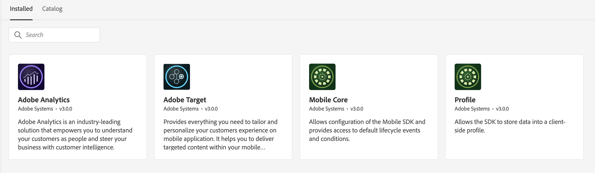

# Eseguire l’impostazione iniziale della raccolta dati

La migrazione da Target SDK a Optimize SDK richiede una configurazione iniziale per abilitare l’acquisizione dati, le funzioni e le caratteristiche corrette di Optimize SDK. Prima di apportare qualsiasi modifica all’implementazione del sito web, è necessario completare i seguenti passaggi:

- [Configurare le autorizzazioni appropriate](https://experienceleague.adobe.com/en/docs/platform-learn/implement-web-sdk/overview#permissions){target="_blank"} in Adobe Admin Console per la raccolta dati
- [Configure an XDM schema](https://experienceleague.adobe.com/en/docs/platform-learn/implement-mobile-sdk/initial-configuration/create-schema){target="_blank"} for passing structured data to the Edge Network
- [Configure the schema](https://experienceleague.adobe.com/en/docs/platform-learn/implement-mobile-sdk/experience-cloud/target#update-your-schema){target="_blank"} to receive Adobe Target data
- [Configure an identity namespace](https://experienceleague.adobe.com/en/docs/platform-learn/implement-mobile-sdk/app-implementation/identity#set-up-a-custom-identity-namespace){target="_blank"} for cross-device personalization and mbox3rdPartyId functionality
- [Create a datastream](https://experienceleague.adobe.com/en/docs/platform-learn/implement-mobile-sdk/initial-configuration/create-datastream){target="_blank"} to enable forwarding of data from Edge Network
- [Configure the datastream](https://experienceleague.adobe.com/en/docs/platform-learn/implement-mobile-sdk/experience-cloud/target#update-datastream-configuration){target="_blank"} to enable forwarding of data to Adobe Target
- [Configure the Tag property](https://experienceleague.adobe.com/en/docs/platform-learn/implement-mobile-sdk/experience-cloud/target#install-adobe-journey-optimizer---decisioning-tags-extension){target="_blank"} for Decisioning extension

## Configurazione dell&#39;estensione

>[!BEGINTABS]

>[!TAB Decisioning extension]

Estensioni di tag installate quando si utilizza l’estensione Decisioning:

1. Adobe Journey Optimizer - Decisioning
1. Adobe Experience Platform Edge Network
1. Mobile Core
1. Profilo
1. Consenso
1. Identità
1. AEP Assurance (Optional, needed for debugging)

>[!TAB Estensione Target]

Estensioni di tag installate quando si utilizza l’estensione Target:

1. Adobe Target
1. Mobile Core
1. Profilo
1. Adobe Analytics (facoltativo, necessario se si utilizza Adobe Analytics come origine per la generazione di rapporti per le attività di Adobe Target)

>[!ENDTABS]

## Datastream configuration

The Target extension has [configurable settings](https://developer.adobe.com/client-sdks/solution/adobe-target/#configure-the-target-extension-in-the-data-collection-ui) which with the Decision extension are [configured in the datastream](https://developer.adobe.com/client-sdks/edge/adobe-journey-optimizer-decisioning/#adobe-experience-platform-data-collection-setup).

| Estensione Target | Estensione Decisioning | Note |
| --- | --- | --- | 
| Codice client | n/d | Impostato automaticamente dal bordo utilizzando i dettagli dell’organizzazione IMS |
| ID ambiente | ID ambiente di destinazione | Configurato nello stream di dati |
| Target Workspace, proprietà | Token proprietà | Configurato nello stream di dati |
| Timeout | Timeout | Configurabile nell’estensione Decisioning e in Ottimizza SDK. The default timeout is 10 seconds. |
| Dominio server | Dominio Edge Network | Impostato nell’estensione Adobe Experience Platform Edge Network |

Next, learn how to [replace the Target SDK](replace-sdk.md).

>[!NOTE]
>
>Ci impegniamo ad aiutarti ad effettuare con successo la migrazione di Target mobile dall’estensione Target all’estensione Decisioning. Se incontri ostacoli con la migrazione o pensi che in questa guida manchino informazioni critiche, inviaci [questa discussione della community](https://experienceleaguecommunities.adobe.com/t5/adobe-experience-platform-data/tutorial-discussion-migrate-adobe-target-to-mobile-sdk-on-edge/m-p/747484#M625).
