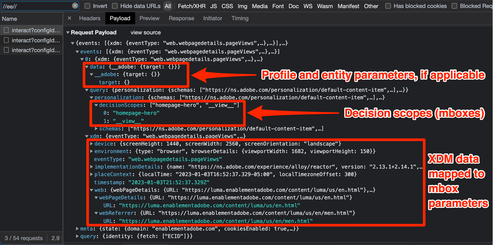

# Debug di Target con Platform Web SDK

Verifica delle attività di Target e debug di Web SDK per risolvere i problemi di implementazione, distribuzione di contenuti o qualificazione del pubblico. Questa pagina della guida alla migrazione spiega le differenze tra il debug con at.js e Platform Web SDK.

La tabella seguente riepiloga le funzionalità e il supporto per gli approcci di test e debug.

| Feature o strumento | Supporto di at.js | Supporto di Platform Web SDK |
| --- | --- | --- |
| URL di controllo qualità delle attività | Sì | Sì |
| Parametro URL `mboxDisable` | Sì | Fai riferimento alle informazioni di seguito per [disabilitare la funzionalità di Target](#disable-target-functionality) |
| Parametro URL `mboxDebug` | Sì | Usa il parametro `alloy_debug` per informazioni di debug simili |
| Parametro URL `mboxTrace` | Sì | Utilizza l’estensione del browser Experience Platform Debugger |
| Estensione Adobe Experience Platform Debugger | Sì | Sì |
| Parametro URL `alloy_debug` | Non applicabile | Sì |
| Adobe Experience Platform Assurance | Non applicabile | Sì |

## Estensione browser Adobe Experience Platform Debugger

L’estensione di Adobe Experience Platform Debugger per Chrome e Firefox esamina le pagine web e ti aiuta a convalidare le implementazioni Adobe Experience Cloud.

Puoi eseguire Platform Debugger su qualsiasi pagina web e l’estensione ha accesso ai dati pubblici. Per accedere ai dati non pubblici tramite l&#39;estensione, ad esempio le informazioni di traccia di Target, è necessario eseguire l&#39;autenticazione in Experience Cloud tramite il collegamento **[!UICONTROL Accedi]**.

### Ottenere e installare l’Adobe Experience Platform Debugger

L’Adobe Experience Platform Debugger può essere installato nei browser Google Chrome o Mozilla Firefox. Per installare l’estensione sul browser preferito, segui il collegamento appropriato riportato di seguito:

- [Chrome](https://chrome.google.com/webstore/detail/adobe-experience-platform/bfnnokhpnncpkdmbokanobigaccjkpob)
- [Firefox](https://addons.mozilla.org/it/firefox/addon/adobe-experience-platform-dbg/)

Dopo aver installato l&#39;estensione Chrome o il componente aggiuntivo Firefox, viene aggiunta un&#39;icona () alla barra delle estensioni. Fai clic su questa icona per aprire l&#39;estensione.

Per ulteriori informazioni sull&#39;estensione [Adobe Experience Platform Debugger](https://experienceleague.adobe.com/docs/experience-platform/debugger/home.html?lang=it) e su come eseguire il debug di tutte le applicazioni Web Adobe, fare riferimento alla guida dedicata.

## Anteprima delle attività Target con URL di controllo qualità

Sia at.js che Platform Web SDK consentono di visualizzare in anteprima le attività Target utilizzando gli URL di controllo qualità di Target ed entrambi i metodi di implementazione supportano le stesse funzioni di controllo qualità.

Gli URL di controllo qualità di Target funzionano informando at.js o Platform Web SDK di scrivere un cookie specifico nel browser denominato `at_qa_mode`. Questo cookie viene utilizzato per forzare la qualificazione per una particolare attività ed esperienza.

>[!CAUTION]
>
>La funzionalità della modalità di controllo qualità di Target è supportata da Platform Web SDK versione 2.13.0 o successiva. La modalità di controllo qualità di Target è abilitata in base al valore `xdm.web.webPageDetails.URL` passato nella chiamata `sendEvent`. Eventuali modifiche a questo valore, come l’utilizzo di lettere minuscole per tutti i caratteri, potrebbero impedire il corretto funzionamento della modalità di controllo qualità di Target.

Per ulteriori informazioni su [Controllo qualità attività di Target](https://experienceleague.adobe.com/docs/target/using/activities/activity-qa/activity-qa.html?lang=it), consulta la guida dedicata.

## Implementazione di Debug Target

La tabella seguente illustra le differenze tra le tattiche di debug di at.js e Platform Web SDK:

| Funzione at.js | Equivalente di Platform Web SDK |
| --- | --- |
| **Mbox Disable** - Disattiva il recupero e il rendering di Target per verificare se la pagina è interrotta senza interazioni di Target  Carica la pagina con il parametro URL: `mboxDisable=true` | Nessun equivalente diretto. Puoi bloccare tutte le richieste di Platform Web SDK con gli strumenti per sviluppatori del browser. |
| **Debug mbox** - registra ogni azione at.js nella console del browser per risolvere eventuali problemi di rendering  Carica pagina con parametro URL: `mboxDebug=true` | **Alloy Debug** - registra le azioni dettagliate dell&#39;SDK, incluse le azioni di personalizzazione Target, ma senza limitazioni.  Carica la pagina con il parametro URL: `alloy_debug=true`   Oppure esegui `alloy("setDebug", { "enabled": true });` nella console per sviluppatori |
| **Traccia di destinazione** - con un token di traccia mbox generato nell&#39;interfaccia utente di Target, un oggetto di traccia con i dettagli che hanno partecipato al processo decisionale è disponibile nell&#39;oggetto `window.___target_trace`.  Carica pagina con parametro URL: `mboxTrace=window&authorization={TOKEN}` | Utilizza l’estensione Adobe Experience Platform debugger o Platform Assurance. |

>[!NOTE]
>
>Tutte le funzioni di debug di at.js elencate qui sopra sono disponibili con funzionalità avanzate in Adobe Experience Platform Debugger.

### Disabilita funzionalità di Target

Platform Web SDK non dispone attualmente di una funzione per eliminare selettivamente le risposte di Target. Tuttavia, è possibile eliminare le richieste Platform Web SDK con gli strumenti di sviluppo del browser, diverse estensioni del browser o applicazioni di terze parti. Ad esempio, per bloccare Platform Web SDK con Google Chrome:

1. Fai clic con il pulsante destro del mouse in un punto qualsiasi della pagina e seleziona **Inspect**
1. Seleziona la scheda **Rete**
1. Filtra in base alla stringa `//ee//` per visualizzare solo le chiamate di Platform Web SDK
1. Ricarica la pagina
1. Fai clic con il pulsante destro del mouse su una delle richieste di rete filtrate e seleziona **Blocca dominio richiesta**
1. Ricarica la pagina e osserva che la richiesta di rete è bloccata
1. Al termine del debug, fare clic con il pulsante destro del mouse sulla richiesta di rete bloccata e selezionare **Sblocca** oppure chiudere il pannello Strumenti di sviluppo

### Visualizza registrazione debug

La registrazione di debug per at.js utilizzando il parametro URL `mboxDebug=true` mostra informazioni dettagliate su ogni richiesta, risposta e tentativo di rendering del contenuto nella pagina di Target. Platform Web SDK dispone di una registrazione di debug simile utilizzando il parametro URL `alloy_debug=true`.

| Informazioni registrate | at.js (`mboxDebug=true`) | Platform Web SDK (`alloy_debug=true`) |
| --- | --- | --- |
| Prefisso di registrazione per il filtro | `AT:` | `[alloy]` |
| Dettagli della richiesta di caricamento pagina | Sì | Sì |
| Dettagli della richiesta mbox o ambito | Sì | Sì |
| Stato della richiesta | Sì | Sì |
| Dettagli risposta | Sì | Sì |
| Stato rendering | Operazioni riuscite ed errori | Solo errori |
| Dettagli rendering | Sì | Sì |

>[!NOTE]
>
>I registri di debug per at.js e Platform Web SDK forniscono un livello di dettaglio simile, con la notevole eccezione che Web SDK notifica solo gli errori di rendering dovuti a selettori non validi. Al momento la registrazione di debug non conferma che il rendering sia stato eseguito correttamente.

### Visualizza tracce di destinazione

Le tracce di Target forniscono informazioni dettagliate sulle qualifiche dell&#39;attività e sul profilo di Target del visitatore. Poiché le tracce di Target contengono informazioni non disponibili pubblicamente, la loro visualizzazione richiede un token di autorizzazione o l’autenticazione nella finestra dell’estensione del browser Adobe Experience Platform Debugger.

| Metodo di traccia di Target | at.js | SDK Web per Platform |
| --- | --- | --- |
| Parametro URL `mboxTrace` | Sì | No |
| Estensione browser Adobe Experience Platform Debugger | Sì | Sì |
| Adobe Experience Platform Assurance | No | Sì |

Per visualizzare le tracce di Platform Web SDK Target con l’Adobe Experience Platform Debugger, effettua le seguenti operazioni:

1. Passa a una pagina del sito in cui Target è stato implementato con Platform Web SDK
1. Aprire l&#39;estensione Adobe Experience Platform Debugger selezionando l&#39;icona () nella barra di navigazione del browser
1. Seleziona il collegamento **[!UICONTROL Accedi]**
1. Autenticazione tramite l’accesso a Adobe Experience Cloud
1. Seleziona la scheda **[!UICONTROL Registri]** a sinistra
1. Seleziona la scheda **[!UICONTROL Edge]** in alto
1. Se necessario, assegna un nome alla sessione di debug e fai clic sul pulsante **[!UICONTROL Connetti]**
1. Ricarica la pagina e il registro deve contenere informazioni dettagliate sulle interazioni della rete Edge
1. Concentrati sulle voci di registro che iniziano con &quot;Target Traces&quot; nella descrizione e seleziona **[!UICONTROL Visualizza]** per visualizzare i dettagli della traccia di Target

{zoomable="yes"}

Dopo aver selezionato **[!UICONTROL Visualizza]**, verrà visualizzata una sovrapposizione che consente di visualizzare le seguenti informazioni relative alla richiesta:

- Attività corrispondenti
- Attività senza corrispondenza
- Dettagli richiesta
- Snapshot del profilo

Per ulteriori informazioni sulle tracce di Target, consulta la guida dedicata al [debug della consegna dei contenuti di Target](https://experienceleague.adobe.com/docs/target/using/activities/troubleshoot-activities/content-trouble.html?lang=it).

### Risoluzione dei problemi con Assurance

Le informazioni di traccia di Target possono essere visualizzate sia nell’estensione del browser Adobe Experience Platform Debugger che nell’applicazione Assurance (precedentemente nota come Project Griffon). Per visualizzare le tracce di Target all’interno di Assurance, effettua le seguenti operazioni:

1. Apri l’estensione del browser Adobe Experience Platform Debugger e connetti una sessione di debug remoto come descritto in precedenza
1. Seleziona il collegamento con il nome della sessione sopra il registro di debug
1. Platform Assurance si carica e mostra una registrazione dettagliata per tutte le applicazioni Adobe configurate nel flusso di dati per la tua implementazione
1. Filtra il registro per `adobe.target`
1. Selezionare una voce di registro di tipo `com.adobe.target.trace`
1. Espandere i dettagli del payload e visualizzare le informazioni in `context > targetTrace`

{zoomable="yes"}

## Esamina richieste e risposte di rete

Il payload della richiesta e la risposta delle chiamate dell’SDK web di Platform `sendEvent` differiscono da at.js. La struttura seguente dovrebbe aiutarti a comprendere la struttura della richiesta e della risposta durante l’esame delle chiamate di rete con gli strumenti di sviluppo del browser.

### Payload di richiesta del contenuto

{zoomable="yes"}

- Profilo, entità e altri parametri non mbox passati nell&#39;array degli eventi in `data.__adobe.target`
- Gli ambiti decisionali si trovano nell&#39;array degli eventi in `query.personalization.decisionScopes`
- I dati XDM mappati ai parametri mbox a valle si trovano nell&#39;array degli eventi in `xdm`

### Corpo della risposta al contenuto

{zoomable="yes"}

- Platform Web SDK restituisce azioni per tutte le applicazioni Adobe sotto l&#39;oggetto `handle`
- L&#39;azione `personalization:decisions` indica una risposta da Target o offer decisioning
- Le proposte di Target vengono presentate come un array, ciascuno con un ID di proposta univoco preceduto dal prefisso `AT:`
- I dettagli relativi all’ambito decisionale e all’attività si trovano all’interno dell’array delle proposte
- I dettagli dell&#39;offerta si trovano nell&#39;array `items` in `data`
- I token di risposta si trovano nell&#39;array `items` in `meta`

### Payload dell’evento della proposta

{zoomable="yes"}

- Gli eventi SDK specifici di Target sono `decisioning.propositionDisplay` per un&#39;impression o `decisioning.propositionInteract` per un&#39;interazione, ad esempio un clic
- I dettagli dell&#39;evento di proposta si trovano nell&#39;array degli eventi in `xdm._experience.decisioning`
- L’ID proposta dell’evento di visualizzazione o interazione deve corrispondere all’ID proposta del contenuto restituito da Target

Congratulazioni, hai raggiunto la fine dell&#39;esercitazione. Buona fortuna a migrare l’implementazione di Adobe Target a Web SDK!

>[!NOTE]
>
>Ci impegniamo ad aiutarti con la migrazione di Target da at.js a Web SDK. Se incontri ostacoli con la migrazione o pensi che in questa guida manchino informazioni critiche, inviaci [questa discussione della community](https://experienceleaguecommunities.adobe.com/t5/adobe-experience-platform-data/tutorial-discussion-migrate-target-from-at-js-to-web-sdk/m-p/575587#M463).
