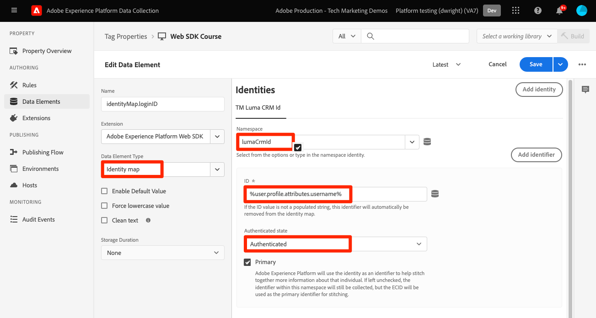
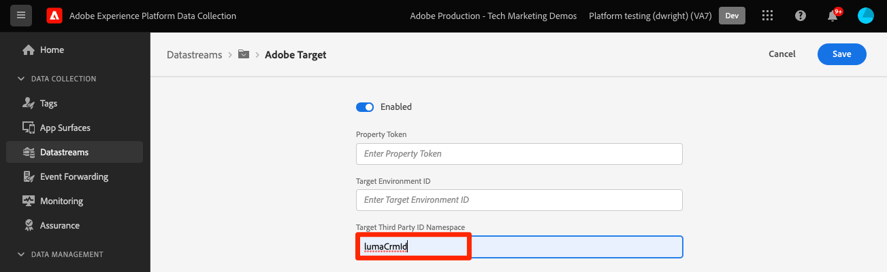

# Inviare parametri a Target tramite Platform Web SDK

Le implementazioni di Target differiscono tra i siti web a causa dell’architettura del sito, dei requisiti di business e delle funzionalità utilizzate. La maggior parte delle implementazioni di Target include il passaggio di vari parametri per informazioni contestuali, tipi di pubblico e consigli sui contenuti.

Utilizziamo una semplice pagina dei dettagli del prodotto e una pagina di conferma dell’ordine per dimostrare le differenze tra le librerie durante la trasmissione dei parametri a Target.

Prendi in considerazione le due pagine di esempio seguenti che utilizzano at.js:

+++at.js in una pagina Dettagli prodotto:

```HTML
<!doctype html>
<html>
<head>
  <title>Product Details - Men's Shirt</title>
  <!--Target parameters -->
  <script>
    targetPageParams = function() {
      return {
        // Property token
        "at_property": "5a0fd9bb-67de-4b5a-0fd7-9cc09f50a58d",
        // Mbox parameters
        "pageName": "product detail",
        // Profile parameters
        "profile.gender": "male",
        "user.categoryId": "clothing",
        // Entity parameters for Target Recomendations
        "entity.id": "SKU-00001-LARGE",
        "entity.categoryId": "clothing,shirts",
        "entity.customEntity": "some value",
        "cartIds": "SKU-00002,SKU-00003",
        "excludedIds": "SKU-00001-SMALL",
        // Customer ID for cross-device profile synching and Customer Attributes
        "mbox3rdPartyId": "TT8675309",
      };
    };
  </script>
  <!--Target at.js library loaded asynchonously-->
  <script src="/libraries/at.js" async></script>
</head>
<body>
  <h1 id="title">Men's Large Shirt</h1>
  <p>SKU: SKU-00001-LARGE</p>
</body>
</html>
```

+++


+++at.js in una pagina di conferma d’ordine:

```HTML
<!doctype html>
<html>
<head>
  <title>Order Confirmation</title>-->
  <!--Target parameters -->
  <script>
    targetPageParams = function() {
      return {
        // Property token
        "at_property": "5a0fd9bb-67de-4b5a-0fd7-9cc09f50a58d",
        // Order confirmation parameters
        "orderId": "ABC123",
        "productPurchasedId": "SKU-00002,SKU-00003",
        "orderTotal": 1337.89,
        // Customer ID for cross-device profile synching and Customer Attributes
        "mbox3rdPartyId": "TT8675309",
      };
    };
  </script>
  <!--Target at.js library loaded asynchonously-->
  <script src="/libraries/at.js" async></script>
</head>
<body>
  <h1 id="title">Order Confirmation</h1>
  <p>Thank you for your order</p>
</body>
</html>
```

+++


## Riepilogo mappatura parametri

I parametri di Target per queste pagine vengono inviati in modo diverso utilizzando Platform Web SDK. Esistono diversi modi per trasmettere parametri a Target utilizzando at.js:

- Impostato con la funzione `targetPageParams()` per l&#39;evento di caricamento pagina (utilizzato negli esempi in questa pagina)
- Impostato con la funzione `targetPageParamsAll()` per tutte le richieste Target nella pagina
- Invia parametri direttamente con la funzione `getOffer()` per una singola posizione
- Invia parametri direttamente con la funzione `getOffers()` per una o più posizioni


Platform Web SDK offre un unico modo coerente per inviare dati senza la necessità di funzioni aggiuntive. Tutti i parametri devono essere passati nel payload con il comando `sendEvent` e rientrare in due categorie:

- Mapping automatico dall&#39;oggetto `xdm`
- Passato manualmente utilizzando l&#39;oggetto `data.__adobe.target`

La tabella seguente illustra come rieseguire il mapping dei parametri di esempio tramite Platform Web SDK:

| Esempio di parametro at.js | Opzione Platform Web SDK | Note |
| --- | --- | --- |
| `at_property` | N/D | I token di proprietà sono configurati nello stream di dati [1&rbrace; e non possono essere impostati nella chiamata `sendEvent`.](https://experienceleague.adobe.com/docs/experience-platform/edge/datastreams/configure.html?lang=it#target) |
| `pageName` | `xdm.web.webPageDetails.name` | Tutti i parametri mbox di Target devono essere passati come parte dell&#39;oggetto `xdm` e devono essere conformi a uno schema utilizzando la classe ExperienceEvent XDM. I parametri mbox non possono essere passati come parte dell&#39;oggetto `data`. |
| `profile.gender` | `data.__adobe.target.profile.gender` | Tutti i parametri di profilo di Target devono essere passati come parte dell&#39;oggetto `data` e con prefisso `profile.` per essere mappati in modo appropriato. |
| `user.categoryId` | `data.__adobe.target.user.categoryId` | Parametro riservato utilizzato per la funzionalità Affinità tra categorie di Target che deve essere passata come parte dell&#39;oggetto `data`. |
| `entity.id` | `data.__adobe.target.entity.id` <br>OR<br> `xdm.productListItems[0].SKU` | Gli ID entità vengono utilizzati per i contatori comportamentali di Target Recommendations. Questi ID entità possono essere passati come parte dell&#39;oggetto `data` o mappati automaticamente dal primo elemento nell&#39;array `xdm.productListItems` se l&#39;implementazione utilizza tale gruppo di campi. |
| `entity.categoryId` | `data.__adobe.target.entity.categoryId` | Gli ID categoria entità possono essere passati come parte dell&#39;oggetto `data`. |
| `entity.customEntity` | `data.__adobe.target.entity.customEntity` | I parametri di entità personalizzati vengono utilizzati per aggiornare il catalogo dei prodotti Recommendations. Questi parametri personalizzati devono essere passati come parte dell&#39;oggetto `data`. |
| `cartIds` | `data.__adobe.target.cartIds` | Utilizzato per gli algoritmi di consigli basati sul carrello di Target. |
| `excludedIds` | `data.__adobe.target.excludedIds` | Utilizzato per evitare che ID di entità specifici vengano restituiti in una progettazione di consigli. |
| `mbox3rdPartyId` | Impostato nell&#39;oggetto `xdm.identityMap` | Utilizzato per sincronizzare i profili Target tra dispositivi e Attributi del cliente. Lo spazio dei nomi da utilizzare per l&#39;ID cliente deve essere specificato nella configurazione [Target dello stream di dati](https://experienceleague.adobe.com/docs/experience-platform/edge/personalization/adobe-target/using-mbox-3rdpartyid.html?lang=it). |
| `orderId` | `xdm.commerce.order.purchaseID` | Utilizzato per identificare un ordine univoco per il tracciamento delle conversioni di Target. |
| `orderTotal` | `xdm.commerce.order.priceTotal` | Utilizzato per tenere traccia dei totali degli ordini per gli obiettivi di conversione e ottimizzazione di Target. |
| `productPurchasedId` | `data.__adobe.target.productPurchasedId` <br>OR<br> `xdm.productListItems[0-n].SKU` | Utilizzato per il tracciamento delle conversioni di Target e gli algoritmi di consigli. Per ulteriori informazioni, consulta la sezione [parametri entità](#entity-parameters) di seguito. |
| `mboxPageValue` | `data.__adobe.target.mboxPageValue` | Utilizzato per l&#39;obiettivo dell&#39;attività [punteggio personalizzato](https://experienceleague.adobe.com/docs/target/using/activities/success-metrics/capture-score.html?lang=it). |

{style="table-layout:auto"}

## Parametri personalizzati

I parametri mbox personalizzati devono essere passati come dati XDM con il comando `sendEvent`. È importante assicurarsi che lo schema XDM includa tutti i campi necessari per l’implementazione di Target.

Esempio di at.js con `targetPageParams()`:

```JavaScript
targetPageParams = function() {
  return {
    "pageName": "product detail"
  };
};
```

Esempi di JavaScript di Platform Web SDK con il comando `sendEvent`:

>[!BEGINTABS]

>[!TAB JavaScript]

```JavaScript
alloy("sendEvent", {
  "xdm": {
    "web": {
      "webPageDetails": {
        // Other attributes included according to xdm schema
        "name": "product detail"
      }
    }
  }
});
```

>[!TAB Tag]

Nei tag, utilizza innanzitutto un elemento dati [!UICONTROL oggetto XDM] da mappare al campo XDM:

{zoomable="yes"}

Quindi includi il tuo [!UICONTROL oggetto XDM] nel tuo [!UICONTROL evento di invio] [!UICONTROL azione] (più [!UICONTROL oggetti XDM] possono essere [uniti](https://experienceleague.adobe.com/docs/experience-platform/tags/extensions/client/core/overview.html?lang=it#merged-objects)):

{zoomable="yes"}

>[!ENDTABS]


>[!NOTE]
>
>Poiché i parametri mbox personalizzati fanno parte dell&#39;oggetto `xdm`, è necessario aggiornare eventuali tipi di pubblico, attività o script di profilo che fanno riferimento a tali parametri mbox utilizzando i nuovi nomi. Per ulteriori informazioni, consulta la pagina [Aggiorna tipi di pubblico e script di profilo di Target per la compatibilità con Platform Web SDK](update-audiences.md) di questo tutorial.


## Parametri del profilo

I parametri del profilo di destinazione devono essere passati nell&#39;oggetto `data.__adobe.target` nel payload del comando `sendEvent` di Platform Web SDK.

Analogamente a at.js, anche tutti i parametri di profilo devono avere il prefisso `profile.` affinché il valore possa essere memorizzato correttamente come attributo di profilo di Target persistente. Il parametro riservato `user.categoryId` per la funzionalità Affinità tra categorie di Target ha il prefisso `user.`.

Esempio di at.js con `targetPageParams()`:

```JavaScript
targetPageParams = function() {
  return {
    "profile.gender": "male",
    "user.categoryId": "clothing"
  };
};
```

Esempi di Platform Web SDK con il comando `sendEvent`:

>[!BEGINTABS]

>[!TAB JavaScript]

```JavaScript
alloy("sendEvent", {
  "data": {
    "__adobe": {
      "target": {
        "profile.gender": "male",
        "user.categoryId": "clothing"
      }
    }
  }
});
```

>[!TAB Tag]

Nei tag, creare innanzitutto un elemento dati per definire l&#39;oggetto `data.__adobe.target`:

{zoomable="yes"}

Quindi includi l&#39;oggetto dati nel tuo [!UICONTROL evento di invio] [!UICONTROL azione] (più [!UICONTROL oggetti] possono essere [uniti](https://experienceleague.adobe.com/docs/experience-platform/tags/extensions/client/core/overview.html?lang=it#merged-objects)):

{zoomable="yes"}

>[!ENDTABS]

## Parametri di entità

I parametri di entità vengono utilizzati per trasmettere dati comportamentali e informazioni di catalogo supplementari per Target Recommendations. Tutti i [parametri di entità](https://experienceleague.adobe.com/docs/target/using/recommendations/entities/entity-attributes.html?lang=it) supportati da at.js sono supportati anche da Platform Web SDK. Analogamente ai parametri di profilo, tutti i parametri di entità devono essere passati sotto l&#39;oggetto `data.__adobe.target` nel payload del comando `sendEvent` di Platform Web SDK.

I parametri di entità per un elemento specifico devono avere il prefisso `entity.` per l&#39;acquisizione dei dati corretta. I parametri riservati `cartIds` e `excludedIds` per gli algoritmi dei consigli non devono avere un prefisso e il valore di ciascuno deve contenere un elenco separato da virgole di ID entità.

Esempio di at.js con `targetPageParams()`:

```JavaScript
targetPageParams = function() {
  return {
    "entity.id": "SKU-00001-LARGE",
    "entity.categoryId": "clothing,shirts",
    "entity.customEntity": "some value",
    "cartIds": "SKU-00002,SKU-00003",
    "excludedIds": "SKU-00001-SMALL"
  };
};
```

Esempi di Platform Web SDK con il comando `sendEvent`:

>[!BEGINTABS]

>[!TAB JavaScript]

```JavaScript
alloy("sendEvent", {
  "data": {
    "__adobe": {
      "target": {
        "entity.id": "SKU-00001-LARGE",
        "entity.categoryId": "clothing,shirts",
        "entity.customEntity": "some value",
        "cartIds": "SKU-00002,SKU-00003",
        "excludedIds": "SKU-00001-SMALL"
      }
    }
  }
});
```

>[!TAB Tag]

Nei tag, creare innanzitutto un elemento dati per definire l&#39;oggetto `data.__adobe.target`:

{zoomable="yes"}

Quindi includi l&#39;oggetto dati nel tuo [!UICONTROL evento di invio] [!UICONTROL azione] (più [!UICONTROL oggetti] possono essere [uniti](https://experienceleague.adobe.com/docs/experience-platform/tags/extensions/client/core/overview.html?lang=it#merged-objects)):

{zoomable="yes"}

>[!ENDTABS]

>[!NOTE]
>
>Se si utilizza il gruppo di campi `commerce` e l&#39;array `productListItems` è incluso nel payload XDM, il primo valore `SKU` in questo array viene mappato a `entity.id` allo scopo di incrementare una visualizzazione di prodotto.


## Parametri di acquisto

I parametri di acquisto vengono trasmessi in una pagina di conferma dell’ordine dopo che quest’ultimo è stato completato correttamente e vengono utilizzati per gli obiettivi di conversione e ottimizzazione di Target. Con un&#39;implementazione di Platform Web SDK, questi parametri e vengono mappati automaticamente dai dati XDM passati come parte del gruppo di campi `commerce`.

Esempio di at.js con `targetPageParams()`:

```JavaScript
targetPageParams = function() {
  return {
    "orderId": "ABC123",
    "productPurchasedId": "SKU-00002,SKU-00003"
    "orderTotal": 1337.89
  };
};
```

Le informazioni di acquisto vengono passate a Target quando il gruppo di campi `commerce` ha `purchases.value` impostato su `1`. L&#39;ID ordine e il totale ordine vengono mappati automaticamente dall&#39;oggetto `order`. Se l&#39;array `productListItems` è presente, i valori `SKU` vengono utilizzati per `productPurchasedId`.

Esempio di Platform Web SDK con `sendEvent`:

>[!BEGINTABS]

>[!TAB JavaScript]

```JavaScript
alloy("sendEvent", {
  "xdm": {
    "commerce": {
      "order": {
        "purchaseID": "ABC123",
        "priceTotal": 1337.89
      },
      "purchases": {
        "value": 1
      }
    },
    "productListItems": [{
      "SKU": "SKU-00002"
    }, {
      "SKU": "SKU-00003"
    }],
      "_experience": {
          "decisioning": {
              "propositions": [{
                  "scope": "<your_mbox>"
              }],
              "propositionEventType": {
                  "display": 1
              }
          }
      }
  }
});
```

>[!TAB Tag]

Nei tag, utilizza innanzitutto un elemento dati [!UICONTROL oggetto XDM] per eseguire il mapping ai campi XDM richiesti (vedi l&#39;esempio di JavaScript) e all&#39;ambito personalizzato facoltativo:

{zoomable="yes"}

Quindi includi il tuo [!UICONTROL oggetto XDM] nel tuo [!UICONTROL evento di invio] [!UICONTROL azione] (più [!UICONTROL oggetti XDM] possono essere [uniti](https://experienceleague.adobe.com/docs/experience-platform/tags/extensions/client/core/overview.html?lang=it#merged-objects)):

{zoomable="yes"}

>[!ENDTABS]

>[!IMPORTANT]
>
> `_experience.decisioning.propositionEventType` deve essere impostato con `display: 1` affinché la chiamata possa essere utilizzata per incrementare una metrica di Target.

>[!NOTE]
>
> Se desideri utilizzare un nome di posizione/mbox personalizzato nella definizione della metrica di Target, ad esempio `orderConfirmPage`, compila l&#39;array `_experience.decisioning.propositions` con un ambito personalizzato come nell&#39;esempio precedente.

>[!NOTE]
>
>Il valore `productPurchasedId` può anche essere passato come elenco separato da virgole di ID entità sotto l&#39;oggetto `data`.


## ID cliente (mbox3rdPartyId)

Target consente la sincronizzazione dei profili tra dispositivi e sistemi utilizzando un singolo ID cliente. Con at.js, potrebbe essere impostato come `mbox3rdPartyId` nella richiesta di Target o come primo ID cliente inviato al servizio Experience Cloud Identity. A differenza di at.js, un&#39;implementazione di Platform Web SDK consente di specificare l&#39;ID cliente da utilizzare come `mbox3rdPartyId` in presenza di più. Ad esempio, se la tua azienda ha un ID cliente globale e ID cliente separati per diverse linee di business, puoi configurare quale ID Target deve utilizzare.

Sono disponibili alcuni passaggi per configurare la sincronizzazione ID per i casi di utilizzo tra dispositivi e Attributi cliente:

1. Crea uno spazio dei nomi di **[!UICONTROL identità]** per l&#39;ID cliente nella schermata **[!UICONTROL Identità]** di Data Collection o Platform
1. Assicurati che **[!UICONTROL alias]** in Attributi del cliente corrisponda al **[!UICONTROL simbolo di identità]** del tuo spazio dei nomi
1. Specifica il **[!UICONTROL simbolo di identità]** come **[!UICONTROL Spazio dei nomi ID terze parti di Target]** nella configurazione di Target dello stream di dati
1. Esegui un comando `sendEvent` utilizzando il gruppo di campi `identityMap`

Esempio di at.js con `targetPageParams()`:

```JavaScript
targetPageParams = function() {
  return {
    "mbox3rdPartyId": "TT8675309"
  };
};
```

Esempi di Platform Web SDK con il comando `sendEvent`:

>[!BEGINTABS]

>[!TAB JavaScript]

```JavaScript
alloy("sendEvent", {
  "xdm": {
    "identityMap": {
      "GLOBAL_CUSTOMER_ID": [{
        "id": "TT8675309",
        "authenticatedState": "authenticated",
        "primary": true
      }]
    }
  }
});
```

>[!TAB Tag]

Il valore [!UICONTROL ID], [!UICONTROL Stato autenticato] e [!UICONTROL Spazio dei nomi] vengono acquisiti in un elemento dati [!UICONTROL Identity Map]:
{zoomable="yes"}

L&#39;elemento dati [!UICONTROL Identity map] viene quindi utilizzato per impostare il campo [!UICONTROL identityMap] nell&#39;elemento dati [!UICONTROL XDM object]:
{zoomable="yes"}

L&#39;oggetto [!UICONTROL XDM] è quindi incluso nell&#39;azione [!UICONTROL Invia evento] di una regola:

{zoomable="yes"}

Nel servizio Adobe Target dello stream di dati, assicurati di impostare lo spazio dei nomi [!UICONTROL ID terze parti di Target] sullo stesso spazio dei nomi utilizzato nell&#39;elemento dati [!UICONTROL Identity map]:
{zoomable="yes"}

>[!ENDTABS]

>[!NOTE]
>
> Adobe consiglia di inviare come identità primaria spazi dei nomi che rappresentano una persona, ad esempio identità autenticate.


## Esempio di Platform Web SDK

Ora che sai come vengono mappati i diversi parametri di Target utilizzando Platform Web SDK, le nostre due pagine di esempio possono essere migrate da at.js a Platform Web SDK come mostrato di seguito. Le pagine di esempio includono:

- Frammento pre-hiding di Target per un’implementazione asincrona della libreria
- Codice di base dell’SDK web per Platform
- Libreria JavaScript di Platform Web SDK
- Un comando `configure` per inizializzare la libreria
- Un comando `sendEvent` per inviare dati e richiedere il rendering del contenuto di Target

+++SDK per web nella pagina Dettagli prodotto:

```HTML
<!doctype html>
<html>
<head>
  <title>Product Details - Men's Shirt</title>

  <!--Prehiding snippet for Target with asynchronous Web SDK deployment-->
  <script>
    !function(e,a,n,t){var i=e.head;if(i){
    if (a) return;
    var o=e.createElement("style");
    o.id="alloy-prehiding",o.innerText=n,i.appendChild(o),setTimeout(function(){o.parentNode&&o.parentNode.removeChild(o)},t)}}
    (document, document.location.href.indexOf("mboxEdit") !== -1, ".body { opacity: 0 !important }", 3000);
  </script>

  <!--Platform Web SDK base code-->
  <script>
    !function(n,o){o.forEach(function(o){n[o]||((n.__alloyNS=n.__alloyNS||
    []).push(o),n[o]=function(){var u=arguments;return new Promise(
    function(i,l){n[o].q.push([i,l,u])})},n[o].q=[])})}
    (window,["alloy"]);
  </script>

  <!--Platform Web SDK loaded asynchonously. Change the src to use the latest supported version.-->
  <script src="https://cdn1.adoberesources.net/alloy/2.6.4/alloy.min.js" async></script>

  <!--Configure Platform Web SDK and send event-->
  <script>
    alloy("configure", {
      "edgeConfigId": "ebebf826-a01f-4458-8cec-ef61de241c93",
      "orgId":"ADB3LETTERSANDNUMBERS@AdobeOrg"
    });
    alloy("sendEvent", {
      "renderDecisions": true,
      "xdm": {
        "identityMap": {
          "GLOBAL_CUSTOMER_ID": [{
            "id": "TT8675309",
            "authenticatedState": "authenticated",
            "primary": true
          }]
        },
        "web": {
          "webPageDetails": {
            // Other attributes included according to XDM schema
            "pageName": "product detail"
          }
        }
      },
      "data": {
        "__adobe": {
          "target": {
            "profile.gender": "male",
            "user.categoryId": "clothing",
            "entity.id": "SKU-00001-LARGE",
            "entity.categoryId": "clothing,shirts",
            "entity.customEntity": "some value",
            "cartIds": "SKU-00002,SKU-00003",
            "excludedIds": "SKU-00001-SMALL"
          }
        }
      }
    });
  </script>
</head>
<body>
  <h1 id="title">Men's Large Shirt</h1>
  <p>SKU: SKU-00001-LARGE</p>
</body>
</html>
```

+++

+++SDK per web nella pagina di conferma di un ordine:

```HTML
<!doctype html>
<html>
<head>
  <title>Order Confirmation</title>


  <!--Prehiding snippet for Target with asynchronous Web SDK deployment-->

  <script>
    !function(e,a,n,t){var i=e.head;if(i){
    if (a) return;
    var o=e.createElement("style");
    o.id="alloy-prehiding",o.innerText=n,i.appendChild(o),setTimeout(function(){o.parentNode&&o.parentNode.removeChild(o)},t)}}
    (document, document.location.href.indexOf("mboxEdit") !== -1, ".body { opacity: 0 !important }", 3000);
  </script>

  <!--Platform Web SDK base code-->

  <script>
    !function(n,o){o.forEach(function(o){n[o]||((n.__alloyNS=n.__alloyNS||
    []).push(o),n[o]=function(){var u=arguments;return new Promise(
    function(i,l){n[o].q.push([i,l,u])})},n[o].q=[])})}
    (window,["alloy"]);
  </script>
  <!--Platform Web SDK loaded asynchonously. Change the src to use the latest supported version.-->
  <script src="https://cdn1.adoberesources.net/alloy/2.6.4/alloy.min.js" async></script>

  <!--Configure Platform Web SDK and send event-->
  <script>
    alloy("configure", {
      "edgeConfigId": "ebebf826-a01f-4458-8cec-ef61de241c93",
      "orgId":"ADB3LETTERSANDNUMBERS@AdobeOrg"
    });
    alloy("sendEvent", {
      "xdm": {
        "identityMap": {
          "GLOBAL_CUSTOMER_ID": [{
            "id": "TT8675309",
            "authenticatedState": "authenticated",
            "primary": true
          }]
        },
        "commerce": {
          "order": {
            "purchaseID": "ABC123",
            "priceTotal": 1337.89
          },
          "purchases": {
            "value": 1
          }
        },
        "productListItems": [{
          "SKU": "SKU-00002"
        }, {
          "SKU": "SKU-00003"
        }],
        "_experience": {
            "decisioning": {
                "propositions": [{
                    "scope": "<your_mbox>"
                }],
                "propositionEventType": {
                    "display": 1
                }
            }
        }
      }
    });
  </script>
</head>
<body>
  <h1 id="title">Order Confirmation</h1>
  <p>Thank you for your order</p>
</body>
</html>
```

+++

Successivamente, scopri come [tenere traccia degli eventi di conversione di Target](track-events.md) con Platform Web SDK.

>[!NOTE]
>
>Ci impegniamo ad aiutarti con la migrazione di Target da at.js a Web SDK. Se incontri ostacoli con la migrazione o pensi che in questa guida manchino informazioni critiche, inviaci [questa discussione della community](https://experienceleaguecommunities.adobe.com/t5/adobe-experience-platform-data/tutorial-discussion-migrate-target-from-at-js-to-web-sdk/m-p/575587#M463).
