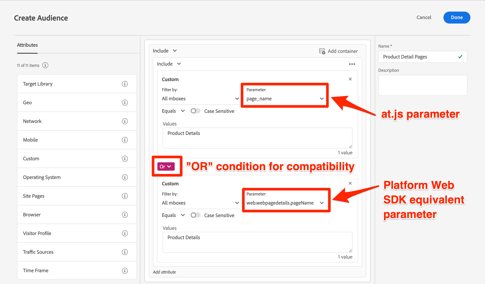

# Aggiornamento dei tipi di pubblico e degli script di profilo di Target per la compatibilità con Platform Web SDK

Dopo aver completato gli aggiornamenti tecnici per la migrazione di Target a Platform Web SDK, potrebbe essere necessario aggiornare alcuni tipi di pubblico, script di profilo e attività per garantire una transizione senza problemi.

Tutti i parametri mbox di Target devono essere trasmessi in formato XDM con un’implementazione Platform Web SDK. Prima di pubblicare le modifiche nell’ambiente di produzione, è necessario:

* Aggiornare i tipi di pubblico che utilizzano i parametri mbox
* Aggiornare gli script di profilo che utilizzano i parametri mbox
* Aggiorna offerte e attività che utilizzano la sostituzione del token di parametro mbox (ad esempio, `${mbox.parameter_name}`)

## Regolare i tipi di pubblico

Tutti i tipi di pubblico che utilizzano parametri mbox personalizzati devono essere aggiornati per l’utilizzo dei nuovi nomi di parametri XDM. Ad esempio, è probabile che un parametro personalizzato per `page_name` venga mappato a `web.webpagedetails.pageName`.

Un approccio per garantire la compatibilità sia con at.js che con Platform Web SDK consiste nell’aggiornare tutti i tipi di pubblico rilevanti in modo che vengano utilizzate `OR` condizioni, come illustrato di seguito:

{zoomable="yes"}

## Modificare gli script di profilo

Gli script di profilo devono essere aggiornati per fare riferimento ai nuovi nomi dei parametri XDM, in modo simile ai tipi di pubblico. A parte la modifica dei nomi dei parametri mbox, non vi è alcuna differenza nel modo in cui gli script di profilo funzionano tra un’implementazione at.js e un’implementazione Platform Web SDK.

Un approccio per garantire la compatibilità consiste nell&#39;utilizzare le condizioni `OR` nel codice dello script di profilo.

Esempio di script di profilo:

```Javascript
if(mbox.param('pageName') == 'Product Details'){
  return true
}
```

È stato aggiornato lo script di profilo per compatibilità con Platform Web SDK:

```Javascript
if((mbox.param('pageName') == 'Product Details') || (mbox.param('web.webPageDetails.pageName') =='Product Details')){
  return true
}
```

Per ulteriori informazioni e best practice, consulta la documentazione dedicata su [script di profilo](https://experienceleague.adobe.com/docs/target/using/audiences/visitor-profiles/profile-parameters.html).

## Aggiornare i token dei parametri per il contenuto dinamico

Se hai offerte, progetti di consigli o attività che utilizzano [la sostituzione dinamica dei contenuti](https://experienceleague.adobe.com/docs/target/using/experiences/offers/passing-profile-attributes-to-the-html-offer.html), potrebbe essere necessario aggiornarle di conseguenza per tenere conto dei nuovi nomi dei parametri XDM.

A seconda di come utilizzi la sostituzione del token per i parametri mbox, potresti essere in grado di migliorare la configurazione esistente per tenere conto dei nomi dei parametri vecchi e nuovi. Tuttavia, in situazioni in cui il codice JavaScript personalizzato non è possibile, ad esempio nelle offerte JSON, devi creare copie e apportare aggiornamenti dopo che la migrazione è stata completata e pubblicata sul sito di produzione.

Esempio di offerta JSON:

```JSON
{
  "pageName" : "${mbox.page_name}",
  "layoutVariation" : "grid"
}
```

Esempio di offerta JSON con i nomi dei parametri dell’SDK web di Platform:

```JSON
{
  "pageName" : "${mbox.web.webPagedDetails.pageName}",
  "layoutVariation" : "grid"
}
```

Se scegli di apportare modifiche dopo la migrazione per tenere conto dei nuovi nomi dei parametri mbox XDM, assicurati di mettere in pausa le attività interessate durante l’evento di migrazione per evitare errori di visualizzazione delle attività per i visitatori.

Quindi, scopri come [convalidare l&#39;implementazione di Target](validate.md).

>[!NOTE]
>
>Ci impegniamo ad aiutarti con la migrazione di Target da at.js a Web SDK. Se incontri ostacoli con la migrazione o pensi che in questa guida manchino informazioni critiche, inviaci [questa discussione della community](https://experienceleaguecommunities.adobe.com/t5/adobe-experience-platform-data/tutorial-discussion-migrate-target-from-at-js-to-web-sdk/m-p/575587#M463).
