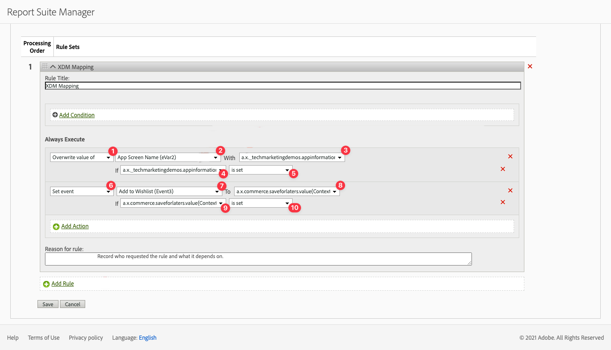

# Raccogliere e mappare dati di Analytics

Scopri come mappare i dati mobili su Adobe Analytics.

Il [evento](events.md) i dati raccolti e inviati a Platform Edge Network nelle lezioni precedenti vengono inoltrati ai servizi configurati nel flusso di dati, incluso Adobe Analytics. Mappa i dati alle variabili corrette nella suite di rapporti.


## Prerequisiti

* Informazioni sul tracciamento ExperienceEvent.
* Invio dei dati XDM nell&#39;app di esempio completato.
* Stream di dati configurato per Adobe Analytics

## Finalità di apprendimento

In questa lezione verranno fornite le seguenti informazioni:

* Configura lo stream di dati con il servizio Adobe Analytics.
* Comprendere la mappatura automatica delle variabili di Analytics.
* Imposta le regole di elaborazione per mappare i dati XDM sulle variabili di Analytics.

## Aggiungere il servizio dello stream di dati di Adobe Analytics

Per inviare i dati XDM da Edge Network ad Adobe Analytics, configura il servizio Adobe Analytics allo stream di dati configurato come parte di [Creare un flusso di dati](create-datastream.md).

1. Nell’interfaccia utente di Data Collection, seleziona **[!UICONTROL Flussi di dati]** e lo stream di dati.

1. Quindi seleziona  **[!UICONTROL Aggiungi servizio]**.

1. Aggiungi **[!UICONTROL Adobe Analytics]** dal [!UICONTROL Servizio] elenco,

1. Immetti il nome della suite di rapporti di Adobe Analytics che desideri utilizzare in **[!UICONTROL ID suite di rapporti]**.

1. Attiva il servizio cambiando **[!UICONTROL Abilitato]** su.

1. Seleziona **[!UICONTROL Salva]**.

   


## Mappatura automatica

Molti dei campi XDM standard sono mappati automaticamente alle variabili di Analytics. Vedi l’elenco completo [qui](https://experienceleague.adobe.com/docs/experience-platform/edge/data-collection/adobe-analytics/automatically-mapped-vars.html?lang=en).

### Esempio #1 - s.products

Un buon esempio è il [variabile dei prodotti](https://experienceleague.adobe.com/docs/analytics/implementation/vars/page-vars/products.html?lang=en) che non può essere compilato utilizzando le regole di elaborazione. Con un’implementazione XDM, trasmetti tutti i dati necessari in `productListItems` e `s.products` vengono compilati automaticamente tramite la mappatura di Analytics.

Questo oggetto:

```swift
"productListItems": [
    [
      "name":  "Yoga Mat",
      "SKU": "5829",
      "priceTotal": "49.99",
      "quantity": 1
    ],
    [
      "name":  "Water Bottle",
      "SKU": "9841",
      "priceTotal": "30.00",
      "quantity": 3
    ]
]
```

risultati in:

```
s.products = ";Yoga Mat;1;49.99,;Water Bottle,3,30.00"
```

>[!NOTE]
>
>Attualmente `productListItems[N].SKU` viene ignorato dalla mappatura automatica.


### Esempio #2 - scAdd

Se osservi attentamente, tutti gli eventi hanno due campi `value` (obbligatorio) e `id` (facoltativo). Il `value` per incrementare il conteggio degli eventi. Il `id` viene utilizzato per la serializzazione.

Questo oggetto:

```swift
"commerce" : {
  "productListAdds" : {
    "value" : 1
  }
}
```

risultati in:

```
s.events = "scAdd"
```

Questo oggetto:

```swift
"commerce" : {
  "productListAdds" : {
    "value" : 1,
    "id": "321435"
  }
}
```

risultati in:

```
s.events = "scAdd:321435"
```

## Convalida con garanzia

Utilizzo di [Assurance](assurance.md) puoi confermare che stai inviando un evento esperienza, che i dati XDM sono corretti e che la mappatura di Analytics sta avvenendo come previsto. Ad esempio:

1. Invia un evento productListAdds.

1. Visualizza l’hit ExperienceEvent.

   

1. Esamina la porzione XDM del JSON.

   ```json
   "xdm" : {
     "productListItems" : [ {
       "SKU" : "LLWS05.1-XS",
       "name" : "Desiree Fitness Tee",
       "priceTotal" : 24
     } ],
   "timestamp" : "2023-08-04T12:53:37.662Z",
   "eventType" : "commerce.productListAdds",
   "commerce" : {
     "productListAdds" : {
       "id" : "LLWS05.1-XS",
       "value" : 1
     }
   }
   // ...
   ```

1. Rivedi **[!UICONTROL analytics.mapping]** evento.

   

Osserva quanto segue nella mappatura di Analytics:

* **[!UICONTROL Eventi]** sono compilati con `scAdd` in base a `commerce.productListAdds`.
* **[!UICONTROL pl]** (variabile dei prodotti) sono compilati con un valore concatenato basato su `productListItems`.
* In questo evento sono disponibili altre informazioni interessanti, inclusi tutti i dati contestuali.


## Mappatura con dati contestuali

I dati XDM inoltrati ad Analytics vengono convertiti in [dati contestuali](https://experienceleague.adobe.com/docs/mobile-services/ios/getting-started-ios/proc-rules.html?lang=en) inclusi i campi standard e personalizzati.

La chiave dei dati contestuali è costruita seguendo questa sintassi:

```
a.x.[xdm path]
```

Ad esempio:

```
// Standard Field
a.x.commerce.saveforlaters.value

// Custom Field
a.x._techmarketingdemos.appinformation.appstatedetails.screenname
```

>[!NOTE]
>
>I campi personalizzati si trovano sotto l’identificatore dell’organizzazione di Experience Cloud.
>
>`_techmarketingdemos` viene sostituito con il valore univoco della tua organizzazione.

Per mappare questi dati contestuali XDM sui dati di Analytics nella suite di rapporti, puoi:

* Aggiungi il **[!UICONTROL Estensione completa Adobe Analytics ExperienceEvent]** gruppo di campi allo schema.

  
* Crea regole nella proprietà Tags per mappare i dati contestuali ai campi nel gruppo di campi Estensione completa Adobe Analytics ExperienceEvent. Ad esempio, mappa `_techmarketingdemo.appinformation.appstatedetails.screenname` a `_experience.analytics.customDimensions.eVars.eVar2`.

<!-- Old processing rules section
Here is what a processing rule using this data might look like:

* You **[!UICONTROL Overwrite value of]** (1) **[!UICONTROL App Screen Name (eVar2)]** (2) with the value of **[!UICONTROL a.x._techmarketingdemo.appinformation.appstatedetails.screenname]** (3) if **[!UICONTROL a.x._techmarketingdemo.appinformation.appstatedetails.screenname]** (4) **[!UICONTROL is set]** (5).

* You **[!UICONTROL Set event]** (6) **[!UICONTROL Add to Wishlist (Event 3)]** (7) to **[!UICONTROL a.x.commerce.saveForLaters.value(Context)]** (8) if **[!UICONTROL a.x.commerce.saveForLaters.value(Context)]** (9) **[!UICONTROL is set]** (10).



>[!IMPORTANT]
>
>
>Some of the automatically mapped variables may not be available for use in processing rules.
>
>
>The first time you map to a processing rule, the interface does not show you the context data variables from the XDM object. To fix that select any value, Save, and come back to edit. All XDM variables should now appear.


Additional information about processing rules and context data can be found [here](https://experienceleague.adobe.com/docs/analytics-learn/tutorials/implementation/implementation-basics/map-contextdata-variables-into-props-and-evars-with-processing-rules.html?lang=en).

>[!TIP]
>
>Unlike previous mobile app implementations, there is no distinction between a page / screen views and other events. Instead you can increment the **[!UICONTROL Page View]** metric by setting the **[!UICONTROL Page Name]** dimension in a processing rule. Since you are collecting the custom `screenName` field in the tutorial, it is highly recommended to map screen name to **[!UICONTROL Page Name]** in a processing rule.

-->

>[!SUCCESS]
>
>Hai configurato l’app per mappare gli oggetti XDM di Experience Edge alle variabili di Adobe Analytics abilitando il servizio Adobe Analytics nello stream di dati e utilizzando le regole di elaborazione, se applicabili.<br/> Grazie per aver dedicato il tuo tempo all’apprendimento dell’SDK di Adobe Experience Platform Mobile. Se hai domande, vuoi condividere feedback generali o suggerimenti su contenuti futuri, condividili su questo [Experience League post di discussione community](https://experienceleaguecommunities.adobe.com/t5/adobe-experience-platform-launch/tutorial-discussion-implement-adobe-experience-cloud-in-mobile/td-p/443796).

Successivo: **[Invia dati all’Experience Platform](platform.md)**
