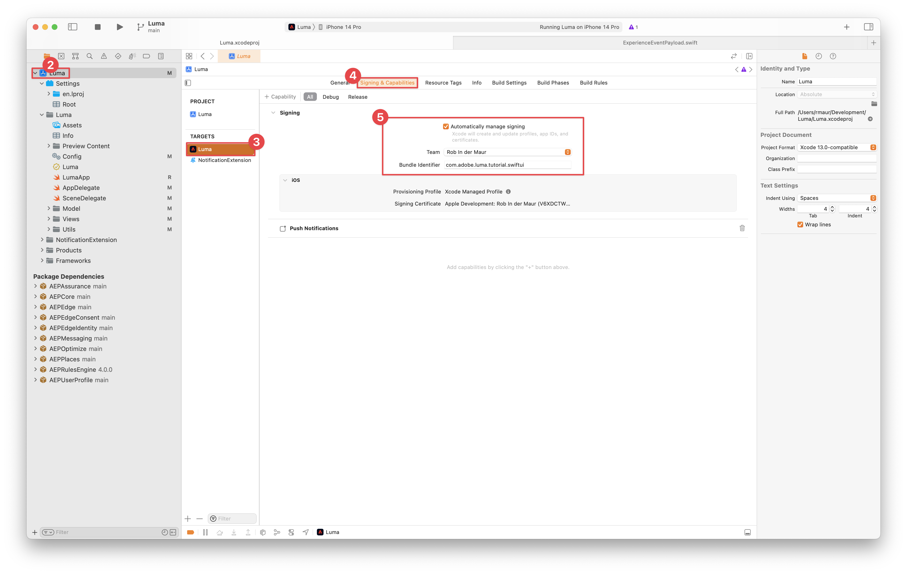
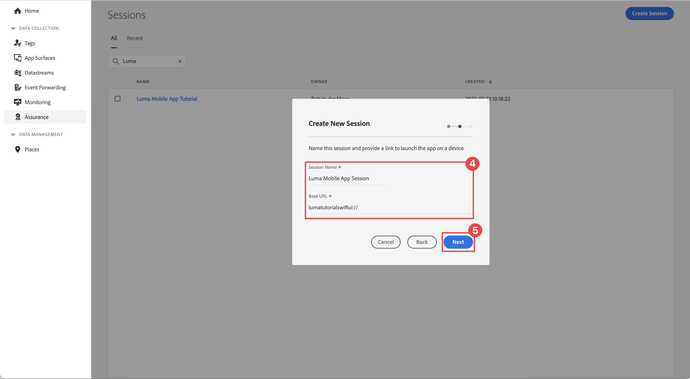

# Assurance

Scopri come configurare Adobe Experience Platform Assurance in un’app mobile.

Assurance, formalmente noto come Project Griffon, è progettato per aiutarti a ispezionare, verificare, simulare e convalidare come raccolgi dati o distribuisci esperienze nella tua app mobile.

Assurance consente di controllare gli eventi SDK non elaborati generati da Adobe Experience Platform Mobile SDK. Tutti gli eventi raccolti dall’SDK sono disponibili per il controllo. Gli eventi SDK vengono caricati in una vista a elenco, ordinati in ordine cronologico. Ogni evento dispone di una vista dettagliata che fornisce ulteriori dettagli. Sono inoltre disponibili viste aggiuntive per sfogliare la configurazione dell’SDK, gli elementi dati, gli stati condivisi e le versioni delle estensioni SDK. Ulteriori informazioni su [Assurance](https://experienceleague.adobe.com/docs/experience-platform/assurance/home.html) nella documentazione del prodotto.


## Prerequisiti

* L&#39;app con gli SDK installati e configurati è stata configurata.

## Finalità di apprendimento

In questa lezione verranno fornite le seguenti informazioni:

* Conferma che la tua organizzazione disponga dell’accesso (e richiedilo in caso contrario).
* Configurare l&#39;URL di base.
* Aggiungi il codice iOS specifico richiesto.
* Connettersi a una sessione.

## Conferma accesso

Conferma che la tua organizzazione abbia accesso a Assurance completando i seguenti passaggi:

1. Visita [https://experience.adobe.com/assurance](https://experience.adobe.com/it/assurance{target="_blank"}).
1. Accedi con le credenziali Adobe ID per l’Experience Cloud.
1. Se vedi il **[!UICONTROL Sessioni]** , quindi puoi accedere a. Se viene visualizzata la pagina di accesso (beta), seleziona **[!UICONTROL Registrati]** per registrarsi.

## Implementazione

Oltre al generale [Installazione SDK](install-sdks.md), hai completato la lezione precedente, iOS richiede anche la seguente aggiunta per avviare la sessione Assurance per la tua app. Aggiungi il seguente codice a **[!UICONTROL SceneDelegate]**:

```swift {highlight="5"}
func scene(_ scene: UIScene, openURLContexts URLContexts: Set<UIOpenURLContext>) {
        // Called when the app in background is opened with a deep link.
        if let deepLinkURL = URLContexts.first?.url {
            // Start the Assurance session
            Assurance.startSession(url: deepLinkURL)
        }
    }
```

Ulteriori informazioni sono disponibili [qui](https://developer.adobe.com/client-sdks/documentation/platform-assurance-sdk/api-reference/{target="_blank"}).

## Firma

Prima di eseguire l’applicazione per la prima volta in Xcode, assicurati di aggiornare la firma.

1. Apri il progetto in Xcode.
1. Seleziona **[!UICONTROL Luma]** nel Navigator.
1. Seleziona la **[!UICONTROL Luma]** target.
1. Seleziona la **Firma e funzionalità** scheda.
1. Configura **[!UICONTROL Gestisci firma automatica]**, **[!UICONTROL Team]**, e **[!UICONTROL Identificatore bundle]**.

   

## Configurare un URL di base

1. Vai al progetto in Xcode.
1. Seleziona **[!UICONTROL Luma]** nel Navigator.
1. Seleziona la **[!UICONTROL Luma]** target.
1. Seleziona la **Info** scheda.
1. Per aggiungere un URL di base, scorri verso il basso fino a **Tipi di URL** e seleziona la **+** pulsante.
1. Imposta **Identificatore** all&#39;identificatore del bundle configurato in [Firma](#signing) (ad esempio `com.adobe.luma.tutorial.swiftui`) e **Schemi URL** a `lumatutorialswiftui`.

   

Per ulteriori informazioni sugli schemi URL in iOS, consulta [Documentazione di Apple](https://developer.apple.com/documentation/xcode/defining-a-custom-url-scheme-for-your-app{target="_blank"}).

Assurance funziona aprendo un URL, tramite il browser o il codice QR. Tale URL inizia con l’URL di base che apre l’app e contiene parametri aggiuntivi. Questi parametri univoci vengono utilizzati per connettere la sessione.


## Connessione a una sessione

1. Eseguire l&#39;applicazione nel simulatore o su un dispositivo fisico collegato.
1. Seleziona **[!UICONTROL Assurance]** dalla barra a sinistra nell’interfaccia utente di Data Collection.
1. Seleziona **[!UICONTROL Crea sessione]**.
1. Seleziona **[!UICONTROL Inizio]**.
1. Fornisci un **[!UICONTROL Nome sessione]** come `Luma Mobile App Session` e **[!UICONTROL URL di base]**, che è lo schema URL immesso in Xcode, seguito da `://`. Ad esempio: `lumatutorialswiftui://`.
1. Seleziona **[!UICONTROL Avanti]**.
   
1. Nella finestra di dialogo Crea nuova sessione:

   Se si utilizza un dispositivo fisico:

   * Seleziona **[!UICONTROL Scansiona codice QR]**. Usa la fotocamera sul dispositivo fisico per scansionare il codice QR e tocca il collegamento per aprire l’app.

     

   Se utilizzi un simulatore:

   1. Seleziona **[!UICONTROL Copia collegamento]**.
   1. Copiare il collegamento profondo utilizzando la copia  e utilizza il collegamento profondo per aprire l’app con Safari nel simulatore.
      

1. Al caricamento dell’app, viene visualizzata una finestra di dialogo modale in cui viene richiesto di immettere il PIN illustrato al punto 7.

   

   Inserisci il PIN e seleziona **[!UICONTROL Connetti]**.


1. Se la connessione ha avuto esito positivo, vengono visualizzati i seguenti elementi:
   * Un’icona Assurance mobile sopra l’app.

   

   * Experienci Cloud di aggiornamenti disponibili nell’interfaccia utente basata su Web Assurance, che mostrano:

      1. Eventi esperienza provenienti dall’app.
      1. Dettagli di un evento selezionato.
      1. Il dispositivo e la timeline.

     

In caso di problemi, consulta [tecnico](https://developer.adobe.com/client-sdks/documentation/platform-assurance-sdk/{target="_blank"}) e [documentazione generale](https://experienceleague.adobe.com/docs/experience-platform/assurance/home.html{target="_blank"}).

>[!SUCCESS]
>
>Ora hai configurato l’app per utilizzare Assurance per il resto dell’esercitazione.<br/>Grazie per aver dedicato il tuo tempo all’apprendimento dell’SDK di Adobe Experience Platform Mobile. Se hai domande, vuoi condividere commenti generali o suggerimenti su contenuti futuri, condividili su questo [Experience League post di discussione community](https://experienceleaguecommunities.adobe.com/t5/adobe-experience-platform-launch/tutorial-discussion-implement-adobe-experience-cloud-in-mobile/td-p/443796)


Successivo: **[Consenso](consent.md)**
