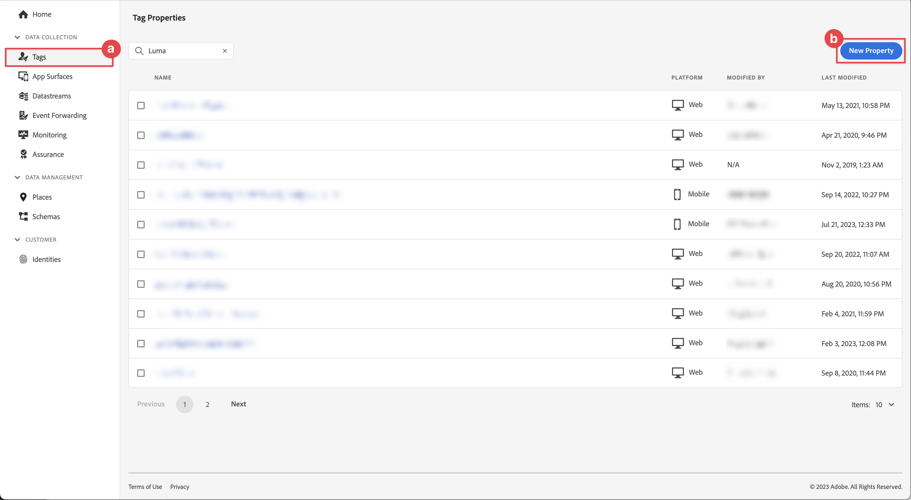
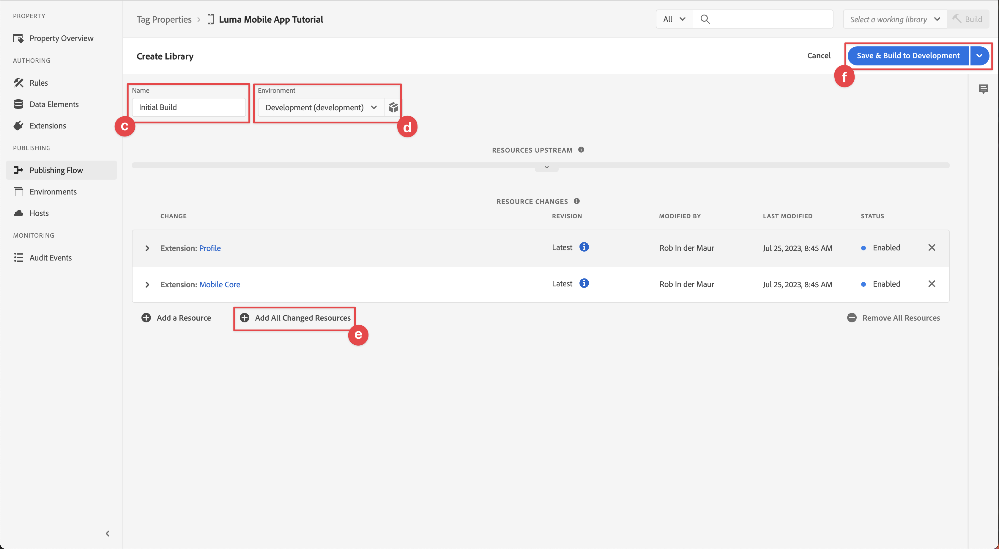

# Configurare una proprietà tag

Scopri come configurare una proprietà tag in [!UICONTROL Raccolta dati] di rete.

I tag in Adobe Experience Platform costituiscono la soluzione Adobe di nuova generazione per la gestione dei tag. I tag offrono ai clienti un modo semplice di implementare e gestire i tag di analisi, marketing e annunci pubblicitari necessari per fornire ai clienti esperienze personalizzate. Ulteriori informazioni su [Tag](https://experienceleague.adobe.com/docs/experience-platform/tags/home.html?lang=it) nella documentazione del prodotto.

## Prerequisiti

Per completare la lezione, devi disporre dell’autorizzazione per creare una proprietà tag. È inoltre utile avere una conoscenza di base dei tag.

>[!NOTE]
>
> Il platform launch (lato client) è ora [Tag](https://experienceleague.adobe.com/docs/experience-platform/tags/home.html?lang=it)

## Finalità di apprendimento

In questa lezione verranno fornite le seguenti informazioni:

* Installa e configura le estensioni di tag per dispositivi mobili.
* Genera le istruzioni di installazione dell’SDK.

## Configurazione iniziale

1. Crea una nuova proprietà di tag mobile nell’interfaccia di raccolta dati:
   1. Seleziona **[!UICONTROL Tag]** nel menu di navigazione a sinistra.
   1. Seleziona **[!UICONTROL Nuova proprietà]**
      .
   1. Per **[!UICONTROL Nome]**, immetti `Luma Mobile App Tutorial`.
   1. Per **[!UICONTROL Piattaforma]**, seleziona **[!UICONTROL Dispositivi mobili]**.
   1. Seleziona **[!UICONTROL Salva]**.

      

      >[!NOTE]
      >
      > Le impostazioni di consenso predefinite per le implementazioni di Mobile Sdk basate su Edge, come quella che esegui in questa esercitazione, provengono da [!UICONTROL Estensione del consenso] e non il [!UICONTROL Privacy] nella configurazione della proprietà tag. Puoi aggiungere e configurare l’estensione Consent più avanti in questa lezione. Per ulteriori informazioni, consulta [la documentazione](https://developer.adobe.com/client-sdks/documentation/privacy-and-gdpr/).

1. Apri la nuova proprietà.
1. Creare una libreria:

   1. Vai a **[!UICONTROL Flusso di pubblicazione]** nel menu di navigazione a sinistra.
   1. Seleziona **[!UICONTROL Aggiungi libreria]**.

      

   1. Per **[!UICONTROL Nome]**, immetti `Initial Build`.
   1. Per **[!UICONTROL Ambiente]**, seleziona **[!UICONTROL Sviluppo (sviluppo)]**.
   1. Seleziona   **[!UICONTROL Aggiungi tutte le risorse modificate]**.
   1. Seleziona **[!UICONTROL Salva e genera in sviluppo]**.

      

   1. Infine, seleziona **[!UICONTROL Build iniziale]** come libreria di lavoro dal **[!UICONTROL Seleziona una libreria di lavoro]** menu.
      
1. Verifica estensioni:

   1. Assicurati che **[!UICONTROL Build iniziale]** è selezionato come libreria predefinita.

   1. Seleziona **[!UICONTROL Estensioni]** nella barra a sinistra.

   1. Seleziona la **[!UICONTROL Installato]** scheda.

      Il [!UICONTROL Core mobile] e [!UICONTROL Profilo] le estensioni devono essere preinstallate.

      

## Configurazione dell&#39;estensione

1. Verifica di essere in **[!UICONTROL Estensioni]** all’interno della proprietà dell’app mobile.

1. Seleziona **[!UICONTROL Catalogo]**.

   

1. Utilizza il  **[!UICONTROL Ricerca]** inserire il campo trova **Identità** estensione.

   1. Cerca `Identity`.

   2. Seleziona la **[!UICONTROL Identità]** estensione.

   3. Seleziona **[!UICONTROL Installa]**.

      

   Questa estensione non richiede alcuna ulteriore configurazione.

1. Utilizza il  **[!UICONTROL Ricerca]** per trovare e installare **AEP Assurance** estensione.

   Questa estensione non richiede alcuna ulteriore configurazione.

1. Utilizza il  **[!UICONTROL Ricerca]** per trovare e installare **Consenso** estensione. Nella schermata di configurazione:

   1. Seleziona **[!UICONTROL In sospeso]**. In questa esercitazione, gestisci ulteriormente il consenso nell’applicazione. Ulteriori informazioni sull’estensione Consent in [la documentazione](https://developer.adobe.com/client-sdks/documentation/consent-for-edge-network/).
   1. Seleziona **[!UICONTROL Salva nella libreria]**.

      

1. Utilizza il  **[!UICONTROL Ricerca]** per trovare e installare **Adobe Experience Platform Edge Network** estensione.

   1. In entrata **[!UICONTROL Flussi di dati]** seleziona la **[!UICONTROL Datastream]** che hai creato in [passaggio precedente](create-datastream.md) per ciascuno degli ambienti, ad esempio **[!UICONTROL App mobile Luma]**.

   1. Specifica la **[!UICONTROL Dominio rete Edge]** entro **[!UICONTROL Configurazione del dominio]**. Il dominio della rete Edge è il nome della sandbox, seguito da `data.adobedc.net`, ad esempio `techmarketingdemos.data.adobedc.net`.

   1. Dalla sezione **[!UICONTROL Salva nella libreria]** menu, seleziona **[!UICONTROL Salva nella libreria e genera]**.

      

La libreria viene creata per le nuove estensioni e configurazioni. Una build corretta è indicata da un ● nel **[!UICONTROL Build iniziale]** pulsante.

## Generare istruzioni di installazione SDK

1. Seleziona **[!UICONTROL Ambienti]** dalla barra a sinistra.

1. Seleziona la **[!UICONTROL Sviluppo]** icona di installazione  .

   

1. In [!UICONTROL Istruzioni di installazione per dispositivi mobili] , seleziona la **[!UICONTROL iOS]** scheda.

1. Puoi copiare  le istruzioni per configurare il progetto con CocoaPods. I CocoaPod vengono utilizzati per gestire le versioni e i download dell’SDK. Per ulteriori informazioni, consulta [documentazione](https://cocoapods.org/).

   Le istruzioni di installazione forniscono un buon punto di partenza per l’implementazione. Puoi trovare ulteriori informazioni [qui](https://developer.adobe.com/client-sdks/documentation/getting-started/get-the-sdk/).

   >[!INFO]
   >
   >Per il resto di questo tutorial, potrai **non** utilizza le istruzioni CocoaPods, ma utilizza una configurazione nativa basata su Swift Package Manager (SPM).
   >

1. Seleziona la **[!UICONTROL Swift]** scheda sotto **[!UICONTROL Aggiungi codice di inizializzazione]**. Questo blocco di codice mostra come importare gli SDK richiesti e registrare le estensioni all’avvio. Questo argomento verrà trattato più dettagliatamente in [Installare gli SDK](install-sdks.md).

1. Copia  il **[!UICONTROL ID file ambiente]** e conservarlo in un luogo in cui se ne ha bisogno in un secondo momento. Questo ID univoco punta all’ambiente di sviluppo. Ogni ambiente (Produzione, Staging, Sviluppo) ha un proprio valore ID univoco.

   

>[!NOTE]
>
>Le istruzioni di installazione devono essere considerate un punto di partenza e non una documentazione definitiva. Le versioni più recenti dell’SDK e gli esempi di codice sono disponibili nella [documentazione](https://developer.adobe.com/client-sdks/documentation/).

## Architettura dei tag per dispositivi mobili

Se conosci la versione web di Tag, precedentemente Launch, è importante comprendere le differenze su dispositivi mobili.

* Sul web, viene eseguito il rendering di una proprietà tag in JavaScript che è poi (in genere) ospitato nel cloud. Viene fatto riferimento direttamente a tale file JavaScript nel sito web.

* In una proprietà di tag mobile, le regole e le configurazioni vengono sottoposte a rendering in file JSON ospitati nel cloud. I file JSON vengono scaricati e letti dall’estensione core per dispositivi mobili nell’app mobile. Le estensioni sono SDK separati che funzionano insieme. Se aggiungi un’estensione alla proprietà tag, devi aggiornare anche l’app. Se modifichi l’impostazione di un’estensione o crei una regola, tali modifiche vengono applicate nell’app dopo che la libreria di tag aggiornata è stata pubblicata.

>[!SUCCESS]
>
>Nel resto dell&#39;esercitazione è disponibile una proprietà di tag per dispositivi mobili. Grazie per aver dedicato il tuo tempo all’apprendimento dell’SDK di Adobe Experience Platform Mobile. Se hai domande, vuoi condividere feedback generali o suggerimenti su contenuti futuri, condividili su questo [Experience League post di discussione community](https://experienceleaguecommunities.adobe.com/t5/adobe-experience-platform-launch/tutorial-discussion-implement-adobe-experience-cloud-in-mobile/td-p/443796)

Successivo: **[Installare gli SDK](install-sdks.md)**
