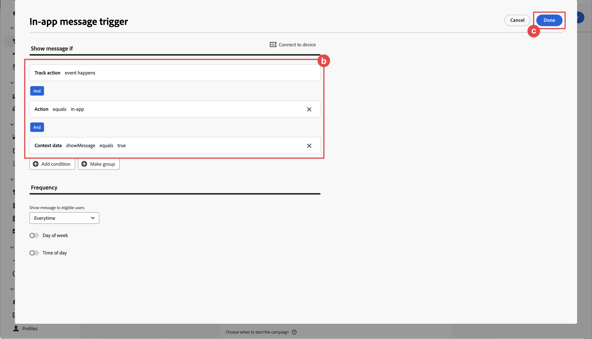

# Messaggistica in-app Adobe Journey Optimizer

Scopri come creare messaggi in-app per le app mobili con Platform Mobile SDK e Adobe Journey Optimizer.

Con Journey Optimizer puoi creare i tuoi percorsi e inviare messaggi in-app a tipi di pubblico mirati. Prima di inviare messaggi in-app con Journey Optimizer, è necessario assicurarsi che siano presenti le configurazioni e le integrazioni corrette. Per informazioni sul flusso di dati dei messaggi in-app in Adobe Journey Optimizer, consulta [la documentazione](https://experienceleague.adobe.com/docs/journey-optimizer/using/in-app/inapp-configuration.html?lang=en).

>[!NOTE]
>
>Questa lezione è facoltativa e si applica solo agli utenti di Adobe Journey Optimizer che desiderano inviare messaggi in-app.


## Prerequisiti

* L&#39;app con gli SDK installati e configurati è stata creata ed eseguita correttamente.
* Accesso a Adobe Journey Optimizer e autorizzazioni sufficienti come descritto [qui](https://experienceleague.adobe.com/docs/journey-optimizer/using/configuration/configuration-message/push-config/push-configuration.html?lang=en). Inoltre, è necessario disporre di autorizzazioni sufficienti per le seguenti funzionalità di Adobe Journey Optimizer.
   * Creare una campagna.
* Account sviluppatore Apple a pagamento con accesso sufficiente per creare certificati, identificatori e chiavi.
* Dispositivo fisico iOS o simulatore per test.
* [ID app registrato con APN](journey-optimizer-push.md#register-app-id-with-apn)
* [Sono state aggiunte le credenziali app push in Raccolta dati](journey-optimizer-push.md#add-your-app-push-credentials-in-data-collection)
* [Estensione tag Adobe Journey Optimizer installata](journey-optimizer-push.md#install-adobe-journey-optimizer-tags-extension)
* [Implementato Adobe Journey Optimizer nell’app](journey-optimizer-push.md#implement-adobe-journey-optimizer-in-the-app)


## Convalida con garanzia

1. Rivedi [istruzioni di configurazione](assurance.md) sezione.
1. Installa l’app sul dispositivo fisico o sul simulatore.
1. Avvia l’app utilizzando l’URL generato da Assurance.
1. Nell’interfaccia utente Assurance, seleziona **[!UICONTROL Configura]**.
   
1. Seleziona la  pulsante accanto a **[!UICONTROL Messaggistica in-app]**.
1. Seleziona **[!UICONTROL Salva]**.
   
1. Seleziona **[!UICONTROL Messaggistica in-app]** dal menu di navigazione a sinistra.
1. Seleziona la **[!UICONTROL Convalida]** scheda.
1. Verifica che non siano presenti errori.
   


## Creare un messaggio in-app personalizzato

Per creare un messaggio in-app personalizzato, devi definire una campagna in Journey Optimizer che attivi un messaggio in-app in base agli eventi che si verificano. Questi eventi possono essere:

* dati inviati a Adobe Experience Platform,
* eventi di tracciamento di base, come azioni, oppure stato o raccolta di dati PII, tramite le API generiche core mobile,
* eventi del ciclo di vita dell&#39;applicazione, ad esempio avvio, installazione, aggiornamento, chiusura o arresto anomalo,
* eventi di geolocalizzazione, come l’ingresso o l’uscita da un punto di interesse.

In questo tutorial, utilizzerai le API generiche core per dispositivi mobili e indipendenti dalle estensioni per facilitare il tracciamento degli eventi relativi a schermate utente, azioni e dati PII. Gli eventi generati da queste API vengono pubblicati nell’hub eventi SDK e sono disponibili per l’utilizzo da parte delle estensioni. Ad esempio, quando è installata l’estensione Analytics, tutti i dati relativi agli eventi delle azioni utente e delle schermate dell’app vengono inviati agli endpoint di reporting di Analytics appropriati.

1. Nell’interfaccia utente di Journey Optimizer, seleziona **[!UICONTROL Campagne]** dalla barra a sinistra.
1. Seleziona **[!UICONTROL Crea campagna]**.
1. In **[!UICONTROL Crea campagna]** schermata:
   1. Seleziona **[!UICONTROL Messaggio in-app]** e seleziona **[!UICONTROL App mobile Luma]** dal **[!UICONTROL Superficie app]** elenco.
   1. Seleziona **[!UICONTROL Crea]**
      
1. Nella schermata di definizione di Campaign, in **[!UICONTROL Proprietà]**, immetti un **[!UICONTROL Nome]** per la campagna, ad esempio `Luma - In-App Messaging Campaign`, e un **[!UICONTROL Descrizione]**, ad esempio `In-app messaging campaign for Luma app`.
   
1. Scorri verso il basso fino a **[!UICONTROL Azione]**, e seleziona **[!UICONTROL Modifica contenuto]**.
1. In **[!UICONTROL Messaggio in-app]** schermata:
   1. Seleziona **[!UICONTROL Modale]** come **[!UICONTROL Layout messaggio]**.
   2. Invio `https://luma.enablementadobe.com/content/dam/luma/en/logos/Luma_Logo.png` per **[!UICONTROL URL contenuto multimediale]**.
   3. Immetti un **[!UICONTROL Intestazione]**, ad esempio `Welcome to this Luma In-App Message` e inserisci un **[!UICONTROL Corpo]**, ad esempio `Triggered by pushing that button in the app...`.
   4. Invio **[!UICONTROL Ignora]** come **[!UICONTROL Testo #1 pulsante (primario)]**.
   5. Nota come viene aggiornata l’anteprima.
   6. Seleziona **[!UICONTROL Controlla per attivare]**.
      
1. In **[!UICONTROL Revisione per l’attivazione (Luma - Campagna di messaggistica in-app)]** schermata, seleziona  nel **[!UICONTROL Pianificazione]** affiancare.
   
1. Torna in **[!UICONTROL Luma - Campagna di messaggistica in-app]** schermata, seleziona  **[!UICONTROL Modifica trigger]**.
1. In **[!UICONTROL Attivatore messaggio in-app]** nella finestra di dialogo, configura i dettagli dell’azione di tracciamento che attiva il messaggio in-app:
   1. Da rimuovere **[!UICONTROL Evento di avvio dell’applicazione]**, seleziona  .
   1. Utilizzare  **[!UICONTROL Aggiungi condizione]** ripetutamente per generare la logica seguente per **[!UICONTROL Mostra messaggio se]**.
   1. Fai clic su **[!UICONTROL Fine]**.
      

   È stata definita un&#39;azione di tracciamento, in cui **[!UICONTROL Azione]** è uguale a `in-app` e **[!UICONTROL Dati contestuali]** con l&#39;azione è una coppia chiave-valore di `"showMessage" : "true"`.

1. Torna in **[!UICONTROL Luma - Campagna di messaggistica in-app]** schermata, seleziona **[!UICONTROL Controlla per attivare]**.
1. In **[!UICONTROL Revisione per l’attivazione (Luma - Campagna di messaggistica in-app)]** schermata, seleziona **[!UICONTROL Attiva]**.
1. Vedi il tuo **[!UICONTROL Luma - Campagna di messaggistica in-app]** con stato **[!UICONTROL Live]** nel **[!UICONTROL Campagne]** elenco.
   


## Attivazione del messaggio in-app

Disponi di tutti gli ingredienti necessari per inviare un messaggio in-app. Ciò che rimane è come attivare questo messaggio in-app nel codice.

1. Vai a Luma > Luma > Utilità > MobileSDK nel Navigatore progetti Xcode, trova il `func sendTrackAction(action: String, data: [String: Any]?)` e aggiungi il seguente codice, che chiama il `MobileCore.track` funzione, in base ai parametri `action` e `data`.


   ```swift
   // send trackAction event
   MobileCore.track(action: action, data: data)
   ```

1. Vai a **[!UICONTROL Luma]** > **[!UICONTROL Luma]** > **[!UICONTROL Visualizzazioni]** > **[!UICONTROL Generale]** > **[!UICONTROL ConfigView]** in Xcode Project Navigator. Trova il codice per il pulsante Messaggio in-app e aggiungi il seguente codice:

   ```swift
   Task {
       AEPService.shared.sendTrackAction(action: "in-app", data: ["showMessage": "true"])
   }
   ```

## Convalida tramite l’app

1. Apri l’app su un dispositivo o nel simulatore.

1. Vai a **[!UICONTROL Impostazioni]** scheda.

1. Tocca **[!UICONTROL Messaggio in-app]**. Il messaggio in-app viene visualizzato nell’app.
   


## Convalida in Assurance

Puoi convalidare i messaggi in-app nell’interfaccia utente Assurance.

1. Seleziona **[!UICONTROL Messaggistica in-app]**.
1. Seleziona **[!UICONTROL Elenco eventi]**.
1. Seleziona un **[!UICONTROL Visualizza messaggio]** voce.
1. Inspect l’evento non elaborato, in particolare `html`, che contiene il layout completo e il contenuto del messaggio in-app.
   


## Implementare nell’app

Ora dovresti disporre di tutti gli strumenti necessari per iniziare ad aggiungere notifiche push, laddove pertinente e applicabile, all’app Luma. Ad esempio, dare il benvenuto all’utente quando effettua l’accesso all’app o quando si avvicina una geolocalizzazione specifica.

>[!SUCCESS]
>
>Ora hai abilitato l’app per la messaggistica in-app e aggiunto una campagna di messaggistica in-app tramite Adobe Journey Optimizer e l’estensione Adobe Journey Optimizer per l’SDK di Adobe Experience Platform Mobile.<br/>Grazie per aver dedicato il tuo tempo all’apprendimento dell’SDK di Adobe Experience Platform Mobile. Se hai domande, vuoi condividere feedback generali o suggerimenti su contenuti futuri, condividili su questo [Experience League post di discussione community](https://experienceleaguecommunities.adobe.com/t5/adobe-experience-platform-launch/tutorial-discussion-implement-adobe-experience-cloud-in-mobile/td-p/443796).

Successivo: **[Conclusione e prossime tappe](conclusion.md)**
