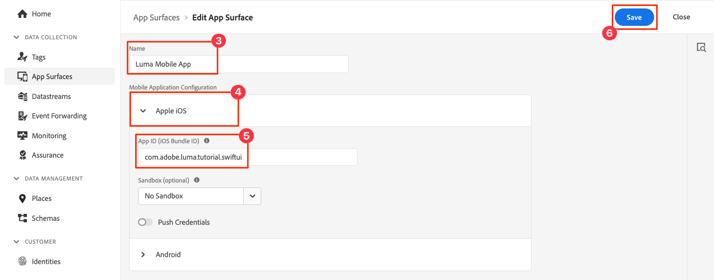

# Creare e inviare messaggi in-app

Scopri come creare messaggi in-app per le app mobili con Experienci Platform Mobile SDK e Journey Optimizer.

Journey Optimizer consente di creare campagne per inviare messaggi in-app a tipi di pubblico mirati. Le campagne in Journey Optimizer vengono utilizzate per fornire contenuti una tantum a un pubblico specifico utilizzando vari canali. Con le campagne, le azioni vengono eseguite simultaneamente, immediatamente o in base a una pianificazione specifica. Quando si utilizzano i percorsi (vedere [Notifiche push Journey Optimizer](journey-optimizer-push.md) lezione), le azioni vengono eseguite in sequenza.


Prima di inviare messaggi in-app con Journey Optimizer, è necessario assicurarsi che siano presenti le configurazioni e le integrazioni corrette. Per informazioni sul flusso di dati dei messaggi in-app in Journey Optimizer, consulta [la documentazione](https://experienceleague.adobe.com/docs/journey-optimizer/using/in-app/inapp-configuration.html?lang=en).

>[!NOTE]
>
>Questa lezione è facoltativa e si applica solo agli utenti di Journey Optimizer che desiderano inviare messaggi in-app.


## Prerequisiti

* L&#39;app con gli SDK installati e configurati è stata creata ed eseguita correttamente.
* Configura l’app per Adobe Experience Platform.
* Accesso a Journey Optimizer e autorizzazioni sufficienti come descritto [qui](https://experienceleague.adobe.com/docs/journey-optimizer/using/push/push-config/push-configuration.html). È inoltre necessaria un&#39;autorizzazione sufficiente per le seguenti funzioni di Journey Optimizer.
   * Gestire le campagne.
* Dispositivo fisico iOS o simulatore per test.


## Finalità di apprendimento

In questa lezione, potrai

* Crea una superficie app in AJO.
* Installa e configura l’estensione tag Journey Optimizer.
* Aggiorna l’app per registrare l’estensione tag Journey Optimizer.
* Convalidare l&#39;impostazione in Assurance.
* Definisci la tua esperienza di campagna e messaggio in-app in Journey Optimizer.
* Invia il tuo messaggio in-app dall’app.

## Configurazione

>[!TIP]
>
>Se hai già configurato l’ambiente come parte del [Messaggi push di Journey Optimizer](journey-optimizer-push.md) In questa lezione è possibile che siano già stati eseguiti alcuni dei passaggi descritti in questa sezione di configurazione.


### Aggiungere una superficie app in Raccolta dati

1. Dalla sezione [Interfaccia di Data Collection](https://experience.adobe.com/data-collection/), seleziona **[!UICONTROL Superfici app]** nel pannello a sinistra.
1. Per creare una configurazione, seleziona **[!UICONTROL Crea superficie app]**.
   
1. Immetti un **[!UICONTROL Nome]** per la configurazione, ad esempio `Luma App Tutorial`  .
1. Da **[!UICONTROL Configurazione applicazione mobile]**, seleziona **[!UICONTROL Apple iOS]**.
1. Immetti l’ID del bundle dell’app mobile in **[!UICONTROL ID app (ID bundle iOS)]** campo. Ad esempio,  `com.adobe.luma.tutorial.swiftui`.
1. Seleziona **[!UICONTROL Salva]**.

   

### Aggiorna configurazione dello stream di dati

Per fare in modo che i dati inviati dalla tua app mobile a Edge Network vengano inoltrati a Journey Optimizer, aggiorna la configurazione di Experience Edge.


1. Nell’interfaccia utente di Data Collection, seleziona **[!UICONTROL Flussi di dati]** e seleziona il flusso di dati, ad esempio **[!DNL Luma Mobile App]**.
1. Seleziona  per **[!UICONTROL Experience Platform]** e seleziona  **[!UICONTROL Modifica]** dal menu di scelta rapida.
1. In **[!UICONTROL Flussi di dati]** >  >  **[!UICONTROL Adobe Experience Platform]** schermata, assicurati **[!UICONTROL Adobe Journey Optimizer]** è selezionato. Consulta [Impostazioni Adobe Experience Platform](https://experienceleague.adobe.com/docs/experience-platform/datastreams/configure.html?lang=en#aep) per ulteriori informazioni.
1. Per salvare la configurazione dello stream di dati, seleziona **[!UICONTROL Salva]**.


   


### Installare l’estensione dei tag di Journey Optimizer

Affinché l&#39;app funzioni con Journey Optimizer, devi aggiornare la proprietà del tag.

1. Accedi a **[!UICONTROL Tag]** > **[!UICONTROL Estensioni]** > **[!UICONTROL Catalogo]**.
1. Apri la proprietà, ad esempio **[!DNL Luma Mobile App Tutorial]**.
1. Seleziona **[!UICONTROL Catalogo]**.
1. Cerca **[!UICONTROL Adobe Journey Optimizer]** estensione.
1. Installa l’estensione.
1. In **[!UICONTROL Installa estensione]** finestra di dialogo
   1. Seleziona un ambiente, ad esempio **[!UICONTROL Sviluppo]**.
   1. Seleziona la **[!UICONTROL Set di dati evento di tracciamento push AJO]** set di dati da **[!UICONTROL Set di dati evento]** elenco.
   1. Seleziona **[!UICONTROL Salva nella libreria e genera]**.
      

>[!NOTE]
>
>Se non vedi `AJO Push Tracking Experience Event Dataset` contatta l’assistenza clienti come opzione.
>

### Implementare Journey Optimizer nell’app

Come descritto nelle lezioni precedenti, l’installazione di un’estensione tag per dispositivi mobili fornisce solo la configurazione. Ora devi installare e registrare l’SDK di messaggistica. Se questi passaggi non sono chiari, rivedi [Installare gli SDK](install-sdks.md) sezione.

>[!NOTE]
>
>Se hai completato il [Installare gli SDK](install-sdks.md) , l&#39;SDK è già installato e puoi saltare questo passaggio.
>

1. In Xcode, assicurati che [Messaggistica AEP](https://github.com/adobe/aepsdk-messaging-ios) viene aggiunto all’elenco dei pacchetti in Dipendenze dai pacchetti. Consulta [Gestione pacchetti Swift](install-sdks.md#swift-package-manager).
1. Accedi a **[!DNL Luma]** > **[!DNL Luma]** > **[!UICONTROL AppDelegate]** nel Navigatore progetti Xcode.
1. Assicurare `AEPMessaging` fa parte dell’elenco delle importazioni.

   `import AEPMessaging`

1. Assicurare `Messaging.self` fa parte dell’array di estensioni che si stanno registrando.

   ```swift
   let extensions = [
       AEPIdentity.Identity.self,
       Lifecycle.self,
       Signal.self,
       Edge.self,
       AEPEdgeIdentity.Identity.self,
       Consent.self,
       UserProfile.self,
       Places.self,
       Messaging.self,
       Optimize.self,
       Assurance.self
   ]
   ```


## Convalida impostazione con Assurance

1. Rivedi [istruzioni di configurazione](assurance.md#connecting-to-a-session) per collegare il simulatore o il dispositivo ad Assurance.
1. Nell’interfaccia utente Assurance, seleziona **[!UICONTROL Configura]**.
   
1. Seleziona la  pulsante accanto a **[!UICONTROL Messaggistica in-app]**.
1. Seleziona **[!UICONTROL Salva]**.
   
1. Seleziona **[!UICONTROL Messaggistica in-app]** dal menu di navigazione a sinistra.
1. Seleziona la **[!UICONTROL Convalida]** scheda. Verifica che non siano presenti errori.

   


## Creare un messaggio in-app personalizzato

Per creare un messaggio in-app personalizzato, devi definire una campagna in Journey Optimizer che attivi un messaggio in-app in base agli eventi che si verificano. Questi eventi possono essere:

* dati inviati a Adobe Experience Platform,
* eventi di tracciamento di base, come azioni, oppure stato o raccolta di dati PII, tramite le API generiche core mobile,
* eventi del ciclo di vita dell&#39;applicazione, ad esempio avvio, installazione, aggiornamento, chiusura o arresto anomalo,
* eventi di geolocalizzazione, come l’ingresso o l’uscita da un punto di interesse.

In questo tutorial, utilizzerai le API Mobile Core generiche e indipendenti dalle estensioni (consulta [API generiche core per dispositivi mobili](https://developer.adobe.com/client-sdks/documentation/mobile-core/#mobile-core-generic-apis)) per facilitare il tracciamento degli eventi di schermate utente, azioni e dati PII. Gli eventi generati da queste API vengono pubblicati nell’hub eventi SDK e sono disponibili per l’utilizzo da parte delle estensioni. L’hub eventi SDK fornisce la struttura dati di base associata a tutte le estensioni SDK di Mobile Platform, mantenendo un elenco di estensioni registrate e moduli interni, un elenco di listener di eventi registrati e un database dello stato condiviso.

L’hub eventi SDK pubblica e riceve i dati dell’evento da estensioni registrate per semplificare le integrazioni con soluzioni Adobe e di terze parti. Ad esempio, quando è installata l’estensione Optimize, tutte le richieste e le interazioni con il motore di offerta Journey Optimizer - Decision Management vengono gestite dall’hub eventi.

1. Nell’interfaccia utente di Journey Optimizer, seleziona **[!UICONTROL Campagne]** dalla barra a sinistra.
1. Seleziona **[!UICONTROL Crea campagna]**.
1. In **[!UICONTROL Crea campagna]** schermata:
   1. Seleziona **[!UICONTROL Messaggio in-app]** e seleziona una superficie di app dalla sezione **[!UICONTROL Superficie app]** elenco, ad esempio **[!DNL Luma Mobile App]**.
   1. Seleziona **[!UICONTROL Crea]**
      
1. Nella schermata di definizione di Campaign, in **[!UICONTROL Proprietà]**, immetti un **[!UICONTROL Nome]** per la campagna, ad esempio `Luma - In-App Messaging Campaign`, e un **[!UICONTROL Descrizione]**, ad esempio `In-app messaging campaign for Luma app`.
   
1. Scorri verso il basso fino a **[!UICONTROL Azione]**, e seleziona **[!UICONTROL Modifica contenuto]**.
1. In **[!UICONTROL Messaggio in-app]** schermata:
   1. Seleziona **[!UICONTROL Modale]** come **[!UICONTROL Layout messaggio]**.
   2. Invio `https://luma.enablementadobe.com/content/dam/luma/en/logos/Luma_Logo.png` per **[!UICONTROL URL contenuto multimediale]**.
   3. Immetti un **[!UICONTROL Intestazione]**, ad esempio `Welcome to this Luma In-App Message` e inserisci un **[!UICONTROL Corpo]**, ad esempio `Triggered by pushing that button in the app...`.
   4. Invio **[!UICONTROL Ignora]** come **[!UICONTROL Testo #1 pulsante (primario)]**.
   5. Nota come viene aggiornata l’anteprima.
   6. Seleziona **[!UICONTROL Controlla per attivare]**.
      
1. In **[!UICONTROL Revisione per l’attivazione (Luma - Campagna di messaggistica in-app)]** schermata, seleziona  nel **[!UICONTROL Pianificazione]** affiancare.
   
1. Torna in **[!DNL Luma - In-App Messaging Campaign]** schermata, seleziona  **[!UICONTROL Modifica trigger]**.
1. In **[!UICONTROL Attivatore messaggio in-app]** nella finestra di dialogo, configura i dettagli dell’azione di tracciamento che attiva il messaggio in-app:
   1. Da rimuovere **[!UICONTROL Evento di avvio dell’applicazione]**, seleziona  .
   1. Utilizzare  **[!UICONTROL Aggiungi condizione]** ripetutamente per generare la logica seguente per **[!UICONTROL Mostra messaggio se]**.
   1. Fai clic su **[!UICONTROL Fine]**.
      

   È stata definita un&#39;azione di tracciamento, in cui **[!UICONTROL Azione]** è uguale a `in-app` e **[!UICONTROL Dati contestuali]** con l&#39;azione è una coppia chiave-valore di `"showMessage" : "true"`.

1. Torna in **[!DNL Luma - In-App Messaging Campaign]** schermata, seleziona **[!UICONTROL Controlla per attivare]**.
1. In **[!UICONTROL Revisione per l’attivazione (Luma - Campagna di messaggistica in-app)]** schermata, seleziona **[!UICONTROL Attiva]**.
1. Vedi il tuo **[!DNL Luma - In-App Messaging Campaign]** con stato **[!UICONTROL Live]** nel **[!UICONTROL Campagne]** elenco.
   


## Attivare il messaggio in-app

Disponi di tutti gli ingredienti necessari per inviare un messaggio in-app. Ciò che rimane è come attivare questo messaggio in-app nella tua app.

1. Vai a **[!DNL Luma]** > **[!DNL Luma]** > **[!DNL Utils]** > **[!UICONTROL MobileSDK]** nel Navigatore progetti Xcode. Trova il `func sendTrackAction(action: String, data: [String: Any]?)` e aggiungi il seguente codice, che chiama il [`MobileCore.track`](https://developer.adobe.com/client-sdks/documentation/mobile-core/api-reference/#trackaction) funzione, in base ai parametri `action` e `data`.


   ```swift
   // Send trackAction event
   MobileCore.track(action: action, data: data)
   ```

1. Vai a **[!DNL Luma]** > **[!DNL Luma]** > **[!DNL Views]** > **[!DNL General]** > **[!UICONTROL ConfigView]** nel Navigatore progetti Xcode. Trova il codice per il pulsante Messaggio in-app e aggiungi il seguente codice:

   ```swift
   // Setting parameters and calling function to send in-app message
   Task {
       MobileSDK.shared.sendTrackAction(action: "in-app", data: ["showMessage": "true"])
   }
   ```

## Convalida tramite l’app

1. Rigenera ed esegui l’app nel simulatore o su un dispositivo fisico da Xcode, utilizzando .

1. Vai a **[!UICONTROL Impostazioni]** scheda.

1. Tocca **[!UICONTROL Messaggio in-app]**. Il messaggio in-app viene visualizzato nell’app.

   


## Convalida implementazione in Assurance

Puoi convalidare i messaggi in-app nell’interfaccia utente Assurance.

1. Rivedi [istruzioni di configurazione](assurance.md#connecting-to-a-session) per collegare il simulatore o il dispositivo ad Assurance.
1. Seleziona **[!UICONTROL Messaggistica in-app]**.
1. Seleziona **[!UICONTROL Elenco eventi]**.
1. Seleziona un **[!UICONTROL Visualizza messaggio]** voce.
1. Inspect l’evento non elaborato, in particolare `html`, che contiene il layout completo e il contenuto del messaggio in-app.
   


## Passaggi successivi

Ora dovresti disporre di tutti gli strumenti necessari per iniziare ad aggiungere messaggi in-app, laddove opportuno e applicabile. Ad esempio, la promozione di prodotti in base a interazioni specifiche che tieni traccia nell’app.

>[!SUCCESS]
>
>Hai abilitato l’app per la messaggistica in-app e aggiunto una campagna di messaggistica in-app tramite Journey Optimizer e l’estensione Journey Optimizer per l’SDK di Mobile di Experience Platform.
>
>Grazie per aver dedicato il tuo tempo all’apprendimento dell’SDK di Adobe Experience Platform Mobile. Se hai domande, vuoi condividere feedback generali o suggerimenti su contenuti futuri, condividili su questo [Experience League post di discussione community](https://experienceleaguecommunities.adobe.com/t5/adobe-experience-platform-data/tutorial-discussion-implement-adobe-experience-cloud-in-mobile/td-p/443796).

Successivo: **[Creare e visualizzare le offerte](journey-optimizer-offers.md)**
