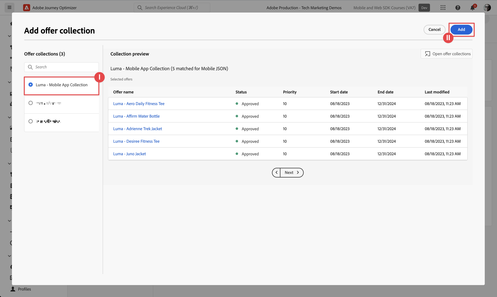

# Offerte Journey Optimizer

Scopri come mostrare le offerte da Journey Optimizer Decision Management nelle app mobili con l’SDK di Experienci Platform Mobile.

Journey Optimizer Decision Management consente di offrire ai clienti l’offerta e l’esperienza migliore al momento giusto, in tutti i punti di contatto. Una volta progettate, puoi indirizzarle al tuo pubblico con offerte personalizzate.

La gestione delle decisioni semplifica la personalizzazione con una libreria centrale di offerte di marketing e un motore decisionale che applica regole e vincoli ai profili avanzati e in tempo reale creati da Adobe Experience Platform. Di conseguenza, ti consente di inviare ai clienti l’offerta giusta al momento giusto. Consulta [Informazioni sulla gestione delle decisioni](https://experienceleague.adobe.com/docs/journey-optimizer/using/offer-decisioning/get-started-decision/starting-offer-decisioning.html?lang=en) per ulteriori informazioni.


>[!NOTE]
>
>Questa lezione è facoltativa e si applica solo agli utenti di Journey Optimizer che desiderano utilizzare la funzionalità di gestione delle decisioni per visualizzare le offerte in un’app mobile.


## Prerequisiti

* L&#39;app con gli SDK installati e configurati è stata creata ed eseguita correttamente.
* Accesso a Journey Optimizer - Gestione delle decisioni con le autorizzazioni appropriate per gestire offerte e decisioni come descritto [qui](https://experienceleague.adobe.com/docs/journey-optimizer/using/access-control/privacy/high-low-permissions.html?lang=en#decisions-permissions).


## Finalità di apprendimento

In questa lezione, potrai

* Aggiorna la configurazione Edge per la gestione delle decisioni.
* Aggiorna la proprietà tag con l’estensione Journey Optimizer - Decisioning.
* Aggiorna lo schema per acquisire gli eventi della proposta.
* Convalidare l&#39;impostazione in Assurance.
* Creare una decisione di offerta, basata sulle offerte disponibili in Journey Optimizer - Gestione delle decisioni.
* Aggiorna l&#39;app per includere l&#39;estensione Optimizer.
* Implementa nell’app le offerte di Gestione delle decisioni.


## Configurazione

>[!TIP]
>
>Se hai già configurato l’ambiente come parte del [Configurare test A/B con Target](target.md) esercitazione, puoi saltare [Installare Adobe Journey Optimizer - Estensione tag Decisioning](#install-adobe-journey-optimizer---decisioning-tags-extension) e [Aggiornare lo schema](#update-your-schema).

### Aggiorna configurazione Edge

Per fare in modo che i dati inviati dalla tua app mobile alla rete Edge vengano inoltrati a Journey Optimizer - Gestione delle decisioni, aggiorna la configurazione di Experience Edge.

1. Nell’interfaccia utente di Data Collection, seleziona **[!UICONTROL Flussi di dati]** e seleziona il flusso di dati, ad esempio **[!UICONTROL App mobile Luma]**.
1. Seleziona  per **[!UICONTROL Experience Platform]** e seleziona  **[!UICONTROL Modifica]** dal menu di scelta rapida.
1. In **[!UICONTROL Flussi di dati]** >  >  **[!UICONTROL Adobe Experience Platform]** schermata, assicurati **[!UICONTROL Offer decisioning]**, **[!UICONTROL Segmentazione Edge]**, **[!UICONTROL Destinazioni di personalizzazione]**, e **[!UICONTROL Adobe Journey Optimizer]** sono selezionati. Consulta [Impostazioni Adobe Experience Platform](https://experienceleague.adobe.com/docs/experience-platform/datastreams/configure.html?lang=en#aep) per ulteriori informazioni.
1. Per salvare la configurazione dello stream di dati, seleziona **[!UICONTROL Salva]** .

   


### Installare Journey Optimizer - Estensione tag Decisioning

1. Accedi a **[!UICONTROL Tag]** e trova la tua proprietà tag mobile e apri la proprietà.
1. Seleziona **[!UICONTROL Estensioni]**.
1. Seleziona **[!UICONTROL Catalogo]**.
1. Cerca **[!UICONTROL Adobe Journey Optimizer - Decisioning]** estensione.
1. Installa l’estensione. L&#39;estensione non richiede una configurazione aggiuntiva.

   


### Aggiornare lo schema

1. Passa all’interfaccia utente di Data Collection e seleziona **[!UICONTROL Schemi]** dalla barra a sinistra.
1. Seleziona **[!UICONTROL Sfoglia]** dalla barra superiore.
1. Seleziona lo schema per aprirlo.
1. Nell’editor schema, seleziona  **[!UICONTROL Aggiungi]** accanto a Gruppi di campi.
1. In **[!UICONTROL Aggiungi gruppi di campi]** finestra di dialogo,  cerca `proposition`, seleziona **[!UICONTROL Evento esperienza - Interazioni proposte]** e seleziona **[!UICONTROL Aggiungi gruppi di campi]**.
   
1. Seleziona **[!UICONTROL Salva]** per salvare le modifiche apportate allo schema.


## Convalida impostazione in Assurance

Per convalidare la configurazione in Assurance:

1. Passa all’interfaccia utente Assurance.
1. Seleziona **[!UICONTROL Configura]** nella barra a sinistra e seleziona  accanto a **[!UICONTROL Convalida configurazione]** sotto **[!UICONTROL ADOBE JOURNEY OPTIMIZER DECISIONING]**.
1. Seleziona **[!UICONTROL Salva]**.
1. Seleziona **[!UICONTROL Convalida configurazione]** nella barra a sinistra. Vengono convalidate sia la configurazione dello stream di dati che la configurazione dell’SDK nell’applicazione.
   


## Creare le offerte

1. Nell’interfaccia utente di Journey Optimizer, seleziona   **[!UICONTROL Offerte]** da **[!UICONTROL GESTIONE DELLE DECISIONI]** nella barra a sinistra.
1. In **[!UICONTROL Offerte]** schermata, seleziona **[!UICONTROL Sfoglia]** per visualizzare l’elenco delle offerte.
1. Seleziona **[!UICONTROL Crea offerta]**.
1. In **[!UICONTROL Nuova offerta]** finestra di dialogo, seleziona **[!UICONTROL Offerta personalizzata]** e fai clic su **[!UICONTROL Successivo]**.
1. In **[!UICONTROL Dettagli]** passaggio di **[!UICONTROL Creare una nuova offerta personalizzata]**:
   1. Immetti un **[!UICONTROL Nome]** per l’offerta, ad esempio `Luma - Juno Jacket`, e immettere un **[!UICONTROL Data e ora di inizio]** e un **[!UICONTROL Data e ora di fine]**. Al di fuori di queste date, l’offerta non verrà selezionata dal motore delle decisioni.
   1. Seleziona **[!UICONTROL Avanti]**.
      

1. In **[!UICONTROL Aggiungere rappresentazioni]** passaggio di **[!UICONTROL Creare una nuova offerta personalizzata]**:
   1. Seleziona  **[!UICONTROL Dispositivi mobili]** da **[!UICONTROL Canale]** e seleziona **[!UICONTROL JSON mobile]** dal **[!UICONTROL Posizione]** elenco.
   1. Seleziona **[!UICONTROL Personalizzato]** per **[!UICONTROL Contenuto]**.
   1. Seleziona **[!UICONTROL Aggiungi contenuto]**. In **[!UICONTROL Aggiungi personalizzazione]** finestra di dialogo:
      1. Immetti il seguente JSON:

         ```json
         { 
             "title": "Juno Jacket",
             "text": "On colder-than-comfortable mornings, you'll love warming up in the Juno All-Ways Performanc Jacket, designed to compete with wind and chill. Built-in Cocona&trade; technology aids evaporation, while a special zip placket and stand-up collar keep your neck protected.", 
             "image": "https://luma.enablementadobe.com/content/dam/luma/en/products/women/tops/jackets/wj06-purple_main.jpg" 
         }  
         ```

      1. Seleziona **[!UICONTROL Salva]**.
         
   1. Seleziona **[!UICONTROL Avanti]**.
      

1. In **[!UICONTROL Aggiungi vincoli]** passaggio del **[!UICONTROL Creare una nuova offerta personalizzata]**:
   1. Imposta **[!UICONTROL Priorità]** a `10`.
   1. Attiva/Disattiva **[!UICONTROL Includi limite]** disattivato.
   1. Seleziona **[!UICONTROL Avanti]**.
      

1. In **[!UICONTROL Revisione]** passaggio di **[!UICONTROL Creare un nuovo]** offerta:
   1. Rivedi l’offerta, quindi seleziona **[!UICONTROL Fine]**.
   1. In **[!UICONTROL Salva offerta]** finestra di dialogo, seleziona **[!UICONTROL Salva e approva]**.

1. Ripeti i passaggi da 3 a 8 per creare altre quattro offerte con nomi e contenuti diversi. Tutti gli altri valori di configurazione, ad esempio Data e ora di inizio o Priorità, sono simili alla prima offerta creata. Puoi creare rapidamente offerte duplicate e modificarle.

   1. Nell’interfaccia utente di Journey Optimizer, seleziona  **[!UICONTROL Offerte]** dalla barra a sinistra, quindi seleziona Offerte dalla barra superiore.
   1. Seleziona la riga dell’offerta creata.
   1. Nel riquadro di destra, seleziona  **[!UICONTROL Altre azioni]** e dal menu di scelta rapida selezionare  **[!UICONTROL Duplica]**.

      Utilizza la tabella seguente per definire le altre quattro offerte.

      | Offer name (Nome offerta) | Contenuto dell’offerta in JSON |
      |---|---|
      | Luma - Afferma bottiglia d’acqua | `{ "title": "Affirm Water Bottle", "text": "You'll stay hydrated with ease with the Affirm Water Bottle by your side or in hand. Measurements on the outside help you keep track of how much you're drinking, while the screw-top lid prevents spills. A metal carabiner clip allows you to attach it to the outside of a backpack or bag for easy access.", "image": "https://luma.enablementadobe.com/content/dam/luma/en/products/gear/fitness-equipment/ug06-lb-0.jpg" }` |
      | Luma - Desiree Fitness Tee | `{ "title": "Desiree Fitness Tee", "text": "When you're too far to turn back, thank yourself for choosing the Desiree Fitness Tee. Its ultra-lightweight, ultra-breathable fabric wicks sweat away from your body and helps keeps you cool for the distance.", "image": "https://luma.enablementadobe.com/content/dam/luma/en/products/women/tops/tees/ws05-yellow_main.jpg" }` |
      | Luma - Giubbotto Adrienne Trek | `{ "title": "Adrienne Trek Jacket", "text": "You're ready for a cross-country jog or a coffee on the patio in the Adrienne Trek Jacket. Its style is unique with stand collar and drawstrings, and it fits like a jacket should.", "image": "https://luma.enablementadobe.com/content/dam/luma/en/products/women/tops/jackets/wj08-gray_main.jpg" }` |
      | Luma - Aero Daily Fitness Tee | `{ "title": "Adrienne Trek Jacket", "text": "You're ready for a cross-country jog or a coffee on the patio in the Adrienne Trek Jacket. Its style is unique with stand collar and drawstrings, and it fits like a jacket should.", "image": "https://luma.enablementadobe.com/content/dam/luma/en/products/women/tops/jackets/wj08-gray_main.jpg" }` |

      {style="table-layout:fixed"}

1. Come passaggio finale, devi creare un’offerta di fallback, ovvero un’offerta inviata ai clienti che non sono idonei per altre offerte.
   1. Seleziona **[!UICONTROL Crea offerta]**.
   1. In **[!UICONTROL Dettagli]** passaggio di **[!UICONTROL Creare una nuova offerta personalizzata]**:
   1. Immetti un **[!UICONTROL Nome]** per l’offerta, ad esempio `Luma - Fallback Offer`, e immettere un **[!UICONTROL Data e ora di inizio]** e un **[!UICONTROL Data e ora di fine]**.
   1. Seleziona **[!UICONTROL Avanti]**.

1. In **[!UICONTROL Aggiungere rappresentazioni]** passaggio del **[!UICONTROL Creare una nuova offerta personalizzata]** schermata:
   1. Seleziona  **[!UICONTROL Dispositivi mobili]** da **[!UICONTROL Canale]** e seleziona **[!UICONTROL JSON mobile]** da **[!UICONTROL Posizione]** elenco.
   1. Seleziona **[!UICONTROL Personalizzato]** per **[!UICONTROL Contenuto]**.
   1. Seleziona **[!UICONTROL Aggiungi contenuto]**. In **[!UICONTROL Aggiungi personalizzazione]** finestra di dialogo:
      1. Immetti il seguente JSON:

         ```json
         {  
             "title": "Luma",
             "text": "Your store for sports wear and equipment.", 
             "image": "https://luma.enablementadobe.com/content/dam/luma/en/logos/Luma_Logo.png" 
         }  
         ```

      1. Seleziona **[!UICONTROL Salva]**.
   1. Seleziona **[!UICONTROL Avanti]**.


1. In **[!UICONTROL Revisione]** passaggio di **[!UICONTROL Creare un nuovo]** offerta:
   1. Rivedi l’offerta, quindi seleziona **[!UICONTROL Fine]**.
   1. In **[!UICONTROL Salva offerta]** finestra di dialogo, seleziona **[!UICONTROL Salva e approva]**.

Ora dovresti disporre del seguente elenco di offerte.


## Creare una raccolta

Per presentare un’offerta all’utente dell’app mobile, devi definire una raccolta di offerte, composta da una o più offerte create.

1. Nell’interfaccia utente di Journey Optimizer, seleziona **[!UICONTROL Offerte]** dalla barra a sinistra.
1. Seleziona **[!UICONTROL Raccolte]** dalla barra superiore.
1. Seleziona  **[!UICONTROL Crea raccolta]**.
1. In **[!UICONTROL Nuova raccolta]** , immetti un **[!UICONTROL Nome]** per la tua raccolta, ad esempio `Luma - Mobile App Collection`, seleziona **[!UICONTROL Creare una raccolta statica]** e fai clic su **[!UICONTROL Successivo]**.
1. In entrata **[!UICONTROL Luma - Raccolta di app mobili]**, seleziona le offerte che desideri includere nella raccolta. Per questa esercitazione, scegli le cinque offerte create. Puoi filtrare facilmente l’elenco utilizzando il campo di ricerca, ad esempio digitando **[!UICONTROL Luma]**.
1. Seleziona **[!UICONTROL Salva]**.

   


## Creare una decisione

Il passaggio finale consiste nel definire una decisione, ovvero la combinazione di uno o più ambiti decisionali e dell’offerta di fallback.

Un ambito decisionale è una combinazione di un posizionamento specifico (ad esempio HTML in un’e-mail o JSON in un’app mobile) e uno o più criteri di valutazione.

Un criterio di valutazione è la combinazione di

* una raccolta di offerte,
* regole di idoneità: ad esempio, l’offerta è disponibile solo per un pubblico specifico,
* un metodo di classificazione: quando sono disponibili più offerte tra cui scegliere, quale metodo utilizzare per classificarle (ad esempio in base alla priorità dell’offerta, utilizzando una formula o un modello di IA).

Consulta [Passaggi chiave per creare e gestire le offerte](https://experienceleague.adobe.com/docs/journey-optimizer/using/offer-decisioning/get-started-decision/key-steps.html?lang=en) se desideri comprendere meglio in che modo posizionamenti, regole, classificazioni, offerte, rappresentazioni, raccolte, decisioni e così via, interagiscono e si relazionano tra loro. Questa esercitazione si concentra esclusivamente sull’utilizzo dell’output di una decisione anziché sulla flessibilità nella definizione delle decisioni all’interno di Journey Optimizer - Gestione delle decisioni.

1. Nell’interfaccia utente di Journey Optimizer, seleziona **[!UICONTROL Offerte]** dalla barra a sinistra.
1. Seleziona **[!UICONTROL Decisioni]** dalla barra superiore.
1. Seleziona  **[!UICONTROL Crea decisione]**.
1. In **[!UICONTROL Dettagli]** passaggio di **[!UICONTROL Creare una nuova decisione di offerta]**:
   1. Immetti un **[!UICONTROL Nome]** per la decisione, ad esempio `Luma - Mobile App Decision`, immetti **[!UICONTROL Data e ora di inizio]** e **[!UICONTROL Data e ora di fine]**.
   1. Seleziona **[!UICONTROL Avanti]**.

1. In **[!UICONTROL Aggiungere ambiti decisionali]** passaggio di **[!UICONTROL Creare una nuova decisione di offerta]**:
   1. Seleziona **[!UICONTROL JSON mobile]** da **[!UICONTROL Posizione]** elenco.
   1. In **[!UICONTROL Criteri di valutazione]** affiancare, selezionare  **[!UICONTROL Aggiungi]**.
      1. In **[!UICONTROL Aggiungi raccolta di offerte]** , seleziona la raccolta di offerte. Ad esempio: **[!UICONTROL Luma - Raccolta di app mobili]**.
      1. Seleziona **[!UICONTROL Aggiungi]**.
         
   1. Assicurati che **[!UICONTROL Nessuno]** è selezionato per **[!UICONTROL Idoneità]**, e **[!UICONTROL Priorità offerta]** è selezionato come **[!UICONTROL Metodo di classificazione]**.
   1. Seleziona **[!UICONTROL Avanti]**.
      .
1. In **[!UICONTROL Aggiungi offerta di fallback]** passaggio di **[!UICONTROL Creare una nuova decisione di offerta]**:
   1. Seleziona l’offerta di fallback, ad esempio **[!UICONTROL Luma - Offerta di fallback]**.
   1. Seleziona **[!UICONTROL Avanti]**.
1. In **[!UICONTROL Riepilogo]** passaggio di **[!UICONTROL Creare una nuova decisione di offerta]**:
   1. Seleziona **[!UICONTROL Fine]**.
   1. In **[!UICONTROL Salva decisione di offerta]** finestra di dialogo, seleziona **[!UICONTROL Salva e attiva]**.
   1. In **[!UICONTROL Decisioni]** , viene visualizzata la decisione con lo stato **[!UICONTROL Live]**.

La decisione sull’offerta, composta da una serie di offerte, è ora pronta per l’uso. Per utilizzare la decisione nell&#39;app, nel codice devi fare riferimento all&#39;ambito della decisione.

1. Nell’interfaccia utente di Journey Optimizer, seleziona **[!UICONTROL Offerte]**.
1. Seleziona **[!UICONTROL Decisioni]** dalla barra superiore.
1. Seleziona la tua decisione, ad esempio **[!UICONTROL Luma - Decisione sull’app mobile]**.
1. In **[!UICONTROL Ambiti decisionali]** affiancare, selezionare  **[!UICONTROL Copia]**.
1. Dal menu contestuale, seleziona **[!UICONTROL Ambito della decisione]**.
   
1. Utilizza un qualsiasi editor di testo per incollare l’ambito decisionale per un utilizzo successivo. L’ambito della decisione ha il seguente formato JSON.

   ```json
   {
       "xdm:activityId":"xcore:offer-activity:xxxxxxxxxxxxxxx",
       "xdm:placementId":"xcore:offer-placement:xxxxxxxxxxxxxxx"
   }
   ```

## Implementare le offerte nell’app

Come descritto nelle lezioni precedenti, l’installazione di un’estensione tag per dispositivi mobili fornisce solo la configurazione. Ora devi installare e registrare l’SDK di ottimizzazione. Se questi passaggi non sono chiari, rivedi [Installare gli SDK](install-sdks.md) sezione.

>[!NOTE]
>
>Se hai completato il [Installare gli SDK](install-sdks.md) , l&#39;SDK è già installato e puoi saltare questo passaggio.
>

1. In Xcode, assicurati che [Ottimizzazione AEP](https://github.com/adobe/aepsdk-messaging-ios.git) viene aggiunto all’elenco dei pacchetti in Dipendenze dai pacchetti. Consulta [Gestione pacchetti Swift](install-sdks.md#swift-package-manager).
1. Accedi a **[!UICONTROL Luma]** > **[!UICONTROL Luma]** > **[!UICONTROL AppDelegate]** nel Navigatore progetti Xcode.
1. Assicurare `AEPOptimize` fa parte dell’elenco delle importazioni.

   `import AEPOptimize`

1. Assicurare `Optimize.self` fa parte dell’array di estensioni che si stanno registrando.

   ```swift
   let extensions = [
       AEPIdentity.Identity.self,
       Lifecycle.self,
       Signal.self,
       Edge.self,
       AEPEdgeIdentity.Identity.self,
       Consent.self,
       UserProfile.self,
       Places.self,
       Messaging.self,
       Optimize.self,
       Assurance.self
   ]
   ```

1. Accedi a **[!UICONTROL Luma]** > **[!UICONTROL Luma]** > **[!UICONTROL Utilità]** > **[!UICONTROL MobileSDK]** nel Navigatore progetti Xcode. Trova il `func updatePropositionOD(ecid: String, activityId: String, placementId: String, itemCount: Int) async` funzione. Aggiungi il seguente codice:

   ```swift
   // set up the XDM dictionary, define decision scope and call update proposition API
   Task {  
      let ecid = ["ECID" : ["id" : ecid, "primary" : true] as [String : Any]]
      let identityMap = ["identityMap" : ecid]
      let xdmData = ["xdm" : identityMap]
      let decisionScope = DecisionScope(activityId: activityId, placementId: placementId, itemCount: UInt(itemCount))
      Optimize.clearCachedPropositions()
      Optimize.updatePropositions(for: [decisionScope], withXdm: xdmData)
   }
   ```

   Questa funzione:

   * configura un dizionario XDM `xdmData`, contenente l’ECID per identificare il profilo per il quale devi presentare le offerte.
   * definisce `decisionScope`, un oggetto basato sulla decisione definita nell’interfaccia utente di Journey Optimizer - Gestione delle decisioni e definita utilizzando l’ambito di decisione copiato da [Creare una decisione](#create-a-decision).  L’app Luma utilizza un file di configurazione (`decisions.json`) che recupera i parametri di ambito, in base al seguente formato JSON:

     ```swift
     "scopes": [
         {
             "name": "name of the scope",
             "activityId": "xcore:offer-activity:xxxxxxxxxxxxxxx",
             "placementId": "xcore:offer-placement:xxxxxxxxxxxxxxx",
             "itemCount": 2
         }
     ]
     ```

     Tuttavia, puoi utilizzare qualsiasi tipo di implementazione per assicurarti che le API di ottimizzazione ricevano i parametri corretti (`activityId`, `placementId` e `itemCount`), per creare un [`DecisionScope`](https://developer.adobe.com/client-sdks/documentation/adobe-journey-optimizer-decisioning/api-reference/#decisionscope) oggetto per l’implementazione.
   * chiama due API: [`Optimize.clearCachePropositions`](https://support.apple.com/en-ie/guide/mac-help/mchlp1015/mac)  e [`Optimize.updatePropositions`](https://developer.adobe.com/client-sdks/documentation/adobe-journey-optimizer-decisioning/api-reference/#updatepropositions).  Queste funzioni cancellano tutte le proposte memorizzate nella cache e aggiornano le proposte per questo profilo.

1. Accedi a **[!UICONTROL Luma]** > **[!UICONTROL Luma]** > **[!UICONTROL Visualizzazioni]** > **[!UICONTROL Personalizzazione]** > **[!UICONTROL EdgeOffersView]** nel Navigatore progetti Xcode. Trova il `func onPropositionsUpdateOD(activityId: String, placementId: String, itemCount: Int) async` e controllare il codice di questa funzione. La parte più importante di questa funzione è la [`Optimize.onPropositionsUpdate`](https://developer.adobe.com/client-sdks/documentation/adobe-journey-optimizer-decisioning/api-reference/#onpropositionsupdate) Chiamata API, che

   * recupera le proposte per il profilo corrente in base all’ambito della decisione (definito in Journey Optimizer - Gestione delle decisioni),
   * recupera l’offerta dalla proposta,
   * decomprime il contenuto dell’offerta in modo che possa essere visualizzato correttamente nell’app; e
   * attiva il `displayed()` azione sull’offerta che invierà un evento alla rete Edge informando che l’offerta è visualizzata.


## Convalida tramite l’app

1. Apri l’app su un dispositivo o nel simulatore.

1. Vai a **[!UICONTROL Personalizzazione]** scheda.

1. Seleziona **[!UICONTROL Personalizzazione Edge]**.

1. Scorri verso l’alto per visualizzare due offerte casuali dalla raccolta definita in **[!UICONTROL DECISIONE LUMA - DECISIONE SULL’APP MOBILE]** affiancare.

   

   Le offerte sono casuali, in quanto hai assegnato a tutte la stessa priorità e la classificazione per la decisione si basa sulla priorità.


## Convalida implementazione in Assurance

Per convalidare l’implementazione delle offerte in Assurance:

1. Passa all’interfaccia utente Assurance.
1. Seleziona **[!UICONTROL Configura]** nella barra a sinistra e seleziona  accanto a **[!UICONTROL Revisione e simulazione]** sotto **[!UICONTROL ADOBE JOURNEY OPTIMIZER DECISIONING]**.
1. Seleziona **[!UICONTROL Salva]**.
1. Seleziona **[!UICONTROL Revisione e simulazione]** nella barra a sinistra. La configurazione di entrambi gli stream di dati viene convalidata e la configurazione dell’SDK nell’applicazione.
1. Seleziona **[!UICONTROL Richieste]** nella barra superiore. Vedi il tuo **[!UICONTROL Offerte]** richieste.
   

1. Puoi esplorare **[!UICONTROL Simula]** e **[!UICONTROL Elenco eventi]** per ulteriori funzionalità, verificando la configurazione di Journey Optimizer Decision Management.

## Passaggi successivi

Ora dovresti disporre di tutti gli strumenti necessari per iniziare ad aggiungere ulteriori funzionalità all’implementazione di Journey Optimizer - Gestione delle decisioni. Ad esempio:

* applica parametri diversi alle offerte (ad esempio, priorità, limite).
* raccogliere gli attributi del profilo nell’app (consulta [Profilo](profile.md)) e utilizza questi attributi di profilo per creare tipi di pubblico. Quindi utilizza questi tipi di pubblico come parte delle regole di idoneità nella tua decisione.
* combinare più ambiti decisionali.

>[!SUCCESS]
>
>Hai abilitato l’app per la visualizzazione delle offerte tramite l’estensione Journey Optimizer - Decisioning per l’SDK di Experienci Platform Mobile.<br/>Grazie per aver dedicato il tuo tempo all’apprendimento dell’SDK di Adobe Experience Platform Mobile. Se hai domande, vuoi condividere feedback generali o suggerimenti su contenuti futuri, condividili su questo [Experience League post di discussione community](https://experienceleaguecommunities.adobe.com/t5/adobe-experience-platform-launch/tutorial-discussion-implement-adobe-experience-cloud-in-mobile/td-p/443796).

Successivo: **[Eseguire test A/B con Target](target.md)**
