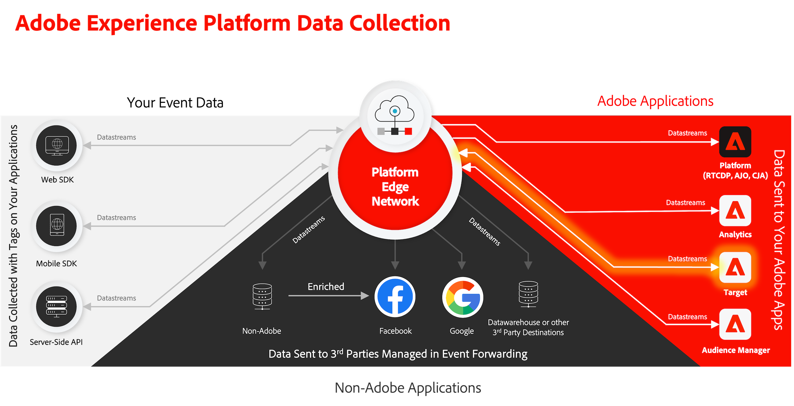

# Ottimizzare e personalizzare con Adobe Target

Scopri come ottimizzare e personalizzare le esperienze nelle app mobili con Platform Mobile SDK e Adobe Target.

Target offre tutto ciò che è necessario adattare e personalizzare le esperienze dei clienti. Target consente di massimizzare i ricavi sui siti web e mobili, applicazioni, social media e altri canali digitali. Target può eseguire test A/B, test multivariati, consigliare prodotti e contenuti, eseguire il targeting del contenuto, personalizzare automaticamente i contenuti con AI e molto altro. Questa lezione si concentra sulla funzionalità di test A/B di Target.  Consulta la [Panoramica sui test A/B](https://experienceleague.adobe.com/docs/target/using/activities/abtest/test-ab.html?lang=en) per ulteriori informazioni.



Prima di poter eseguire test A/B con Target, è necessario assicurarsi che siano presenti le configurazioni e le integrazioni corrette.

>[!NOTE]
>
>Questa lezione è facoltativa e si applica solo agli utenti di Adobe Target che desiderano eseguire test A/B.


## Prerequisiti

* L&#39;app con gli SDK installati e configurati è stata creata ed eseguita correttamente.
* Accedi ad Adobe Target con le autorizzazioni, i ruoli configurati correttamente, le aree di lavoro e le proprietà come descritto [qui](https://experienceleague.adobe.com/docs/target/using/administer/manage-users/enterprise/property-channel.html?lang=it).


## Finalità di apprendimento

In questa lezione verranno fornite le seguenti informazioni:

* Aggiorna lo stream di dati per l’integrazione di Target.
* Aggiorna la proprietà tag con l’estensione Journey Optimizer - Decisioning.
* Aggiorna lo schema per acquisire gli eventi della proposta.
* Convalidare l&#39;impostazione in Assurance.
* Crea un semplice test A/B in Target.
* Aggiorna l&#39;app per registrare l&#39;estensione Optimizer.
* Implementa il test A/B nell’app.
* Convalidare l’implementazione in Assurance.


## Configurazione

>[!TIP]
>
>Se hai già configurato l&#39;app come parte di [Offerte Journey Optimizer](journey-optimizer-offers.md) In questa lezione è possibile che siano già stati eseguiti alcuni dei passaggi descritti in questa sezione di configurazione.

### Aggiorna configurazione dello stream di dati

#### Adobe Target

Per fare in modo che i dati inviati dalla tua app mobile ad Experienci Platform Edge Network vengano inoltrati ad Adobe Target, devi aggiornare la configurazione dello stream di dati.

1. Nell’interfaccia utente di Data Collection, seleziona **[!UICONTROL Flussi di dati]** e seleziona il flusso di dati, ad esempio **[!DNL Luma Mobile App]**.
1. Seleziona **[!UICONTROL Aggiungi servizio]** e seleziona **[!UICONTROL Adobe Target]** dal **[!UICONTROL Servizio]** elenco.
1. Se sei un cliente Target Premium e desideri utilizzare i token di proprietà, immetti Target **[!UICONTROL Token proprietà]** valore che desideri utilizzare per questa integrazione. Gli utenti di Target Standard possono saltare questo passaggio.

   Puoi trovare le tue proprietà nell’interfaccia utente di Target, in **[!UICONTROL Amministrazione]** > **[!UICONTROL Proprietà]**. Seleziona  per visualizzare il token di proprietà per la proprietà che desideri utilizzare. Il token di proprietà ha un formato simile a `"at_property": "xxxxxxxx-xxxx-xxxxx-xxxx-xxxxxxxxxxxx"`; è necessario immettere solo il valore `xxxxxxxx-xxxx-xxxxx-xxxx-xxxxxxxxxxxx`.

   Facoltativamente, puoi specificare un ID ambiente di destinazione. Target utilizza gli ambienti per organizzare i siti e gli ambienti di pre-produzione in modo da semplificarne la gestione e la generazione di rapporti separati. Gli ambienti preimpostati includono Produzione, Staging e Sviluppo. Consulta [Ambienti](https://experienceleague.adobe.com/docs/target/using/administer/environments.html?lang=en) e [ID ambiente di destinazione](https://experienceleague.adobe.com/docs/platform-learn/implement-web-sdk/applications-setup/setup-target.html?lang=en#target-environment-id) per ulteriori informazioni.

   Facoltativamente, puoi specificare uno spazio dei nomi di terze parti per l’ID di Target per supportare la sincronizzazione dei profili su uno spazio dei nomi di identità (ad esempio, ID CRM). Consulta [Spazio dei nomi ID di terze parti di Target](https://experienceleague.adobe.com/docs/platform-learn/implement-web-sdk/applications-setup/setup-target.html?lang=en#target-third-party-id-namespace) per ulteriori informazioni.

1. Seleziona **[!UICONTROL Salva]**.

   


#### Adobe Journey Optimizer

Per garantire che i dati inviati dall’app mobile alla rete Edge vengano inoltrati a Journey Optimizer - Gestione delle decisioni, aggiorna la configurazione dello stream di dati.

1. Nell’interfaccia utente di Data Collection, seleziona **[!UICONTROL Flussi di dati]** e seleziona il flusso di dati, ad esempio **[!DNL Luma Mobile App]**.
1. Seleziona  per **[!UICONTROL Experience Platform]** e seleziona  **[!UICONTROL Modifica]** dal menu di scelta rapida.
1. In **[!UICONTROL Flussi di dati]** >  >  **[!UICONTROL Adobe Experience Platform]** schermata, assicurati **[!UICONTROL Offer decisioning]**, **[!UICONTROL Segmentazione Edge]**, e **[!UICONTROL Destinazioni di personalizzazione]** sono selezionati. Se segui anche le lezioni di Journey Optimizer, seleziona **[!UICONTROL Adobe Journey Optimizer]** anche. Consulta [Impostazioni Adobe Experience Platform](https://experienceleague.adobe.com/docs/experience-platform/datastreams/configure.html?lang=en#aep) per ulteriori informazioni.
1. Per salvare la configurazione dello stream di dati, seleziona **[!UICONTROL Salva]** .

   


### Installare Adobe Journey Optimizer - Estensione tag Decisioning

1. Accedi a **[!UICONTROL Tag]**, individua la proprietà del tag mobile e apri la proprietà.
1. Seleziona **[!UICONTROL Estensioni]**.
1. Seleziona **[!UICONTROL Catalogo]**.
1. Cerca **[!UICONTROL Adobe Journey Optimizer - Decisioning]** estensione.
1. Installa l’estensione. L&#39;estensione non richiede una configurazione aggiuntiva.

   


### Aggiornare lo schema

1. Passa all’interfaccia di Data Collection e seleziona **[!UICONTROL Schemi]** dalla barra a sinistra.
1. Seleziona **[!UICONTROL Sfoglia]** dalla barra superiore.
1. Seleziona lo schema per aprirlo.
1. Nell’editor schema, seleziona  **[!UICONTROL Aggiungi]** accanto a **[!UICONTROL Gruppi di campi]**.
1. Nella finestra di dialogo Aggiungi gruppi di campi, cerca `proposition`, seleziona **[!UICONTROL Evento esperienza - Interazioni proposte]** e seleziona **[!UICONTROL Aggiungi gruppi di campi]**.
   
1. Per salvare le modifiche apportate allo schema, seleziona **[!UICONTROL Salva]**.


### Convalida impostazione in Assurance

Per convalidare la configurazione in Assurance:

1. Passa all’interfaccia utente Assurance.
1. Seleziona **[!UICONTROL Configura]** nella barra a sinistra e seleziona  accanto a **[!UICONTROL Convalida configurazione]** sotto **[!UICONTROL ADOBE JOURNEY OPTIMIZER DECISIONING]**.
1. Seleziona **[!UICONTROL Salva]**.
1. Seleziona **[!UICONTROL Convalida configurazione]** nella barra a sinistra. La configurazione di entrambi gli stream di dati viene convalidata e la configurazione dell’SDK nell’applicazione.
   

## Creare un test A/B

Esistono molti tipi di attività che è possibile creare in Adobe Target e implementare in un’app mobile, come indicato nell’introduzione. Per questa lezione, ti concentrerai sulla creazione e l’implementazione di un test A/B.

1. Nell’interfaccia utente di Target, seleziona **[!UICONTROL Attività]** dalla barra superiore.
1. Seleziona **[!UICONTROL Crea attività]** e **[!UICONTROL Test A/B]** dal menu di scelta rapida.
1. In **[!UICONTROL Crea attività test A/B]** finestra di dialogo, seleziona **[!UICONTROL Dispositivi mobili]** come **[!UICONTROL Tipo]**, seleziona un’area di lavoro dalla sezione **[!UICONTROL Scegli area di lavoro]** e seleziona la tua proprietà dalla sezione **[!UICONTROL Scegli proprietà]** Se sei un cliente Target Premium e hai specificato un token di proprietà nello stream di dati, invia una Email all&#39;indirizzo
1. Seleziona **[!UICONTROL Crea]**.
   

1. In **[!UICONTROL Attività senza titolo]** schermata, alla **[!UICONTROL Esperienze]** passaggio:

   1. Invio `luma-mobileapp-abtest` in **[!UICONTROL Seleziona posizione]** sotto **[!UICONTROL POSIZIONE 1]**. Questo nome di posizione (spesso denominato mbox) viene utilizzato successivamente nell’implementazione dell’app.
   1. Seleziona  accanto a **[!UICONTROL Contenuto predefinito]** e seleziona **[!UICONTROL Crea offerta JSON]** dal menu di scelta rapida.
   1. Copia il seguente JSON in **[!UICONTROL Immetti un oggetto JSON valido]**.

      ```json
      { 
          "title": "Luma Anaolog Watch",
          "text": "Designed to stand up to your active lifestyle, this women's Luma Analog Watch features a tasteful brushed chrome finish and a stainless steel, water-resistant construction for lasting durability.", 
          "image": "https://luma.enablementadobe.com/content/dam/luma/en/products/gear/watches/Luma_Analog_Watch.jpg" 
      }
      ```

   1. Seleziona **[!UICONTROL + Aggiungi esperienza]**.

      

   1. Ripeti i passaggi b e c per l’esperienza B, ma utilizza il seguente JSON:

      ```json
      { 
          "title": "Aim Analog Watch",
          "text": "The flexible, rubberized strap is contoured to conform to the shape of your wrist for a comfortable all-day fit. The face features three illuminated hands, a digital read-out of the current time, and stopwatch functions.", 
          "image": "https://luma.enablementadobe.com/content/dam/luma/en/products/gear/watches/Aim_Watch.jpg" 
      }
      ```

   1. Seleziona **[!UICONTROL Avanti]**.

      

1. In **[!DNL Targeting]** fase, controlla la configurazione del test A/B. Per impostazione predefinita, entrambe le offerte vengono allocate in modo uniforme a tutti i visitatori. Seleziona **[!UICONTROL Avanti]** per continuare.

   

1. In **[!UICONTROL Obiettivi e impostazioni]** passaggio:

   1. Rinomina l’attività senza titolo, ad esempio in `Luma Mobile SDK Tutorial - A/B Test Example`.
   1. Immetti un **[!UICONTROL Obiettivo]** per il test A/B, ad esempio `A/B Test for Luma mobile app tutorial`.
   1. Seleziona **[!UICONTROL Conversione]**, **[!UICONTROL Visualizzazione di una mbox]** nel **[!UICONTROL Metrica per obiettivo]** > **[!UICONTROL IL MIO OBIETTIVO PRINCIPALE]** affiancare e immettere il nome della posizione (mbox), ad esempio `luma-mobileapp-abtest`.
   1. Seleziona **[!UICONTROL Salva e chiudi]**.

      

1. Torna in **[!UICONTROL Tutte le attività]** schermata:

   1. Seleziona  all’attività.
   1. Seleziona  **[!UICONTROL Attiva]** per attivare il test A/B.

   


## Implementare Target nell’app

Come descritto nelle lezioni precedenti, l’installazione di un’estensione tag per dispositivi mobili fornisce solo la configurazione. Ora devi installare e registrare l’SDK di ottimizzazione. Se questi passaggi non sono chiari, rivedi [Installare gli SDK](install-sdks.md) sezione.

>[!NOTE]
>
>Se hai completato il [Installare gli SDK](install-sdks.md) , l&#39;SDK è già installato e puoi saltare questo passaggio.
>

1. In Xcode, assicurati che [Ottimizzazione AEP](https://github.com/adobe/aepsdk-messaging-ios.git) viene aggiunto all’elenco dei pacchetti in Dipendenze dai pacchetti. Consulta [Gestione pacchetti Swift](install-sdks.md#swift-package-manager).
1. Accedi a **[!DNL Luma]** > **[!DNL Luma]** > **[!DNL AppDelegate]** nel Navigatore progetti Xcode.
1. Assicurare `AEPOptimize` fa parte dell’elenco delle importazioni.

   `import AEPOptimize`

1. Assicurare `Optimize.self` fa parte dell’array di estensioni che si stanno registrando.

   ```swift
   let extensions = [
       AEPIdentity.Identity.self,
       Lifecycle.self,
       Signal.self,
       Edge.self,
       AEPEdgeIdentity.Identity.self,
       Consent.self,
       UserProfile.self,
       Places.self,
       Messaging.self,
       Optimize.self,
       Assurance.self
   ]
   ```

1. Accedi a **[!DNL Luma]** > **[!DNL Luma]** > **[!DNL Utils]** > **[!DNL MobileSDK]** nel Navigatore progetti Xcode. Trova il ` func updatePropositionAT(ecid: String, location: String) async` funzione. Aggiungi il seguente codice:

   ```swift
   // set up the XDM dictionary, define decision scope and call update proposition API
   Task {
       let ecid = ["ECID" : ["id" : ecid, "primary" : true] as [String : Any]]
       let identityMap = ["identityMap" : ecid]
       let xdmData = ["xdm" : identityMap]
       let decisionScope = DecisionScope(name: location)
       Optimize.clearCachedPropositions()
       Optimize.updatePropositions(for: [decisionScope], withXdm: xdmData)
   }
   ```

   Questa funzione:

   * configura un dizionario XDM `xdmData`, contenente l’ECID per identificare il profilo per il quale si deve presentare il test A/B, e
   * definisce un `decisionScope`, un array di posizioni in cui presentare il test A/B.

   Quindi la funzione chiama due API: [`Optimize.clearCachedPropositions`](https://developer.adobe.com/client-sdks/documentation/adobe-journey-optimizer-decisioning/api-reference/#clearpropositions) e [`Optimize.updatePropositions`](https://developer.adobe.com/client-sdks/documentation/adobe-journey-optimizer-decisioning/api-reference/#updatepropositions). Queste funzioni cancellano tutte le proposte memorizzate nella cache e aggiornano le proposte per questo profilo. In questo contesto, una proposta è l’esperienza (offerta) selezionata dall’attività Target (test A/B) e definita in [Creare un test A/B](#create-an-ab-test).

1. Accedi a **[!DNL Luma]** > **[!DNL Luma]** > **[!DNL Views]** > **[!DNL Personalization]** > **[!DNL TargetOffersView]** nel Navigatore progetti Xcode. Trova il `func onPropositionsUpdateAT(location: String) async {` e controllare il codice di questa funzione. La parte più importante di questa funzione è la  [`Optimize.onPropositionsUpdate`](https://developer.adobe.com/client-sdks/documentation/adobe-journey-optimizer-decisioning/api-reference/#onpropositionsupdate) Chiamata API, che:
   * recupera le proposte per il profilo corrente in base all’ambito della decisione (che è la posizione definita nel test A/B),
   * recupera l’offerta dalla proposta,
   * decomprime il contenuto dell’offerta in modo che possa essere visualizzato correttamente nell’app; e
   * attiva il `displayed()` azione sull’offerta che invierà un evento alla rete Edge informando che l’offerta è visualizzata.

1. Ancora in **[!DNL TargetOffersView]**, aggiungi il seguente codice al `.onFirstAppear` modificatore. Questo codice assicurerà che il callback per l’aggiornamento delle offerte sia registrato una sola volta.

   ```swift
   // Invoke callback for offer updates
   Task {
       await self.onPropositionsUpdateAT(location: location)
   }
   ```

1. Ancora in **[!DNL TargetOffersView]**, aggiungi il seguente codice al `.task` modificatore. Questo codice aggiorna le offerte quando la vista viene aggiornata.

   ```swift
   // Clear and update offers
   await self.updatePropositionsAT(ecid: currentEcid, location: location)
   ```

Puoi inviare parametri Target aggiuntivi (come mbox, profilo, prodotto o parametri di ordine) in una richiesta di query di personalizzazione alla rete Experience Edge, aggiungendoli in un dizionario dati quando chiami il [`Optimize.updatePropositions`](https://developer.adobe.com/client-sdks/documentation/adobe-journey-optimizer-decisioning/api-reference/#updatepropositions) API. Per ulteriori informazioni, consulta [Parametri di Target](https://developer.adobe.com/client-sdks/documentation/adobe-journey-optimizer-decisioning/#target-parameters).


## Convalida tramite l’app

1. Rigenera ed esegui l’app nel simulatore o su un dispositivo fisico da Xcode, utilizzando .

1. Vai a **[!UICONTROL Personalizzazione]** scheda.

1. Scorri verso il basso e visualizzi una delle due offerte definite nel test A/B visualizzato in **[!UICONTROL TARGET]** affiancare.

   


## Convalida implementazione in Assurance

Per convalidare il test A/B in Assurance:

1. Rivedi [istruzioni di configurazione](assurance.md#connecting-to-a-session) per collegare il simulatore o il dispositivo ad Assurance.
1. Seleziona **[!UICONTROL Configura]** nella barra a sinistra e seleziona  accanto a **[!UICONTROL Revisione e simulazione]** sotto **[!UICONTROL ADOBE JOURNEY OPTIMIZER DECISIONING]**.
1. Seleziona **[!UICONTROL Salva]**.
1. Seleziona **[!UICONTROL Revisione e simulazione]** nella barra a sinistra. La configurazione di entrambi gli stream di dati viene convalidata e la configurazione dell’SDK nell’applicazione.
1. Seleziona **[!UICONTROL Richieste]** nella barra superiore. Vedi il tuo **[!DNL Target]** richieste.
   

1. Puoi esplorare **[!UICONTROL Simula]** e **[!UICONTROL Elenco eventi]** schede per ulteriori funzionalità, verificando la configurazione delle offerte Target.

## Passaggi successivi

Ora dovresti disporre di tutti gli strumenti per iniziare ad aggiungere all’app più test A/B o altre attività di Target (come Targeting esperienza, Test multivariato), laddove pertinente e applicabile. Ulteriori informazioni sono disponibili nella sezione [Archivio Github per l’estensione Optimize](https://github.com/adobe/aepsdk-optimize-ios) dove puoi anche trovare un collegamento a un [esercitazione](https://opensource.adobe.com/aepsdk-optimize-ios/#/tutorials/README) su come tenere traccia delle offerte di Adobe Target.

>[!SUCCESS]
>
>Hai attivato l’app per i test A/B e visualizzato i risultati di un test A/B tramite Adobe Target e l’estensione Adobe Journey Optimizer - Decisioning per l’SDK di Adobe Experience Platform Mobile.<br/>Grazie per aver dedicato il tuo tempo all’apprendimento dell’SDK di Adobe Experience Platform Mobile. Se hai domande, vuoi condividere feedback generali o suggerimenti su contenuti futuri, condividili su questo [Experience League post di discussione community](https://experienceleaguecommunities.adobe.com/t5/adobe-experience-platform-launch/tutorial-discussion-implement-adobe-experience-cloud-in-mobile/td-p/443796).

Successivo: **[Conclusione e prossime tappe](conclusion.md)**
