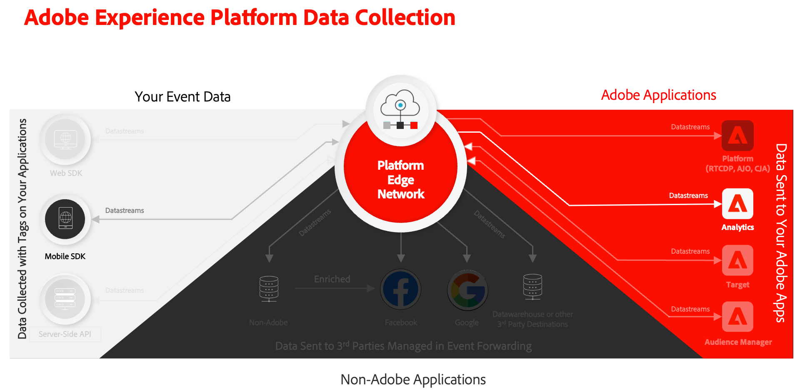

# Raccogliere e mappare dati di Analytics

Scopri come mappare i dati mobili su Adobe Analytics.

Il [evento](events.md) i dati raccolti e inviati a Platform Edge Network nelle lezioni precedenti vengono inoltrati ai servizi configurati nel flusso di dati, incluso Adobe Analytics. Mappa i dati alle variabili corrette nella suite di rapporti.



## Prerequisiti

* Informazioni sul tracciamento ExperienceEvent.
* Invio dei dati XDM nell&#39;app di esempio completato.
* Una suite di rapporti di Adobe Analytics che puoi utilizzare per questa lezione.

## Obiettivi di apprendimento

In questa lezione verranno fornite le seguenti informazioni:

* Configura lo stream di dati con il servizio Adobe Analytics.
* Comprendere la mappatura automatica delle variabili di Analytics.
* Imposta le regole di elaborazione per mappare i dati XDM sulle variabili di Analytics.

## Aggiungere il servizio dello stream di dati di Adobe Analytics

Per inviare i dati XDM da Edge Network ad Adobe Analytics, configura il servizio Adobe Analytics allo stream di dati configurato come parte di [Creare un flusso di dati](create-datastream.md).

1. Nell’interfaccia utente di Data Collection, seleziona **[!UICONTROL Flussi di dati]** e lo stream di dati.

1. Quindi seleziona  **[!UICONTROL Aggiungi servizio]**.

1. Aggiungi **[!UICONTROL Adobe Analytics]** dal [!UICONTROL Servizio] elenco,

1. Immetti il nome della suite di rapporti di Adobe Analytics che desideri utilizzare in **[!UICONTROL ID suite di rapporti]**.

1. Attiva il servizio cambiando **[!UICONTROL Abilitato]** su.

1. Seleziona **[!UICONTROL Salva]**.

   


## Mappatura automatica

Molti dei campi XDM standard sono mappati automaticamente alle variabili di Analytics. Vedi l’elenco completo [qui](https://experienceleague.adobe.com/docs/analytics/implementation/aep-edge/variable-mapping.html?lang=en).

### Esempio #1 - s.products

Un buon esempio è il [variabile dei prodotti](https://experienceleague.adobe.com/docs/analytics/implementation/vars/page-vars/products.html?lang=en) che non può essere compilato utilizzando le regole di elaborazione. Con un’implementazione XDM, trasmetti tutti i dati necessari in `productListItems` e `s.products` vengono compilati automaticamente tramite la mappatura di Analytics.

Questo oggetto:

```swift
"productListItems": [
    [
      "name":  "Yoga Mat",
      "SKU": "5829",
      "priceTotal": "49.99",
      "quantity": 1
    ],
    [
      "name":  "Water Bottle",
      "SKU": "9841",
      "priceTotal": "30.00",
      "quantity": 3
    ]
]
```

risultati in:

```
s.products = ";5829;1;49.99,9841;3;30.00"
```

>[!NOTE]
>
>Se `productListItems[].SKU` e `productListItems[].name` entrambi contengono dati, il valore in `productListItems[].SKU` viene utilizzato. Consulta [Mappatura delle variabili di Analytics in Adobe Experience Edge](https://experienceleague.adobe.com/docs/analytics/implementation/aep-edge/variable-mapping.html?lang=en) per ulteriori informazioni.


### Esempio #2 - scAdd

Se osservi attentamente, tutti gli eventi hanno due campi `value` (obbligatorio) e `id` (facoltativo). Il `value` per incrementare il conteggio degli eventi. Il `id` viene utilizzato per la serializzazione.

Questo oggetto:

```swift
"commerce" : {
  "productListAdds" : {
    "value" : 1
  }
}
```

risultati in:

```
s.events = "scAdd"
```

Questo oggetto:

```swift
"commerce" : {
  "productListAdds" : {
    "value" : 1,
    "id": "321435"
  }
}
```

risultati in:

```
s.events = "scAdd:321435"
```

## Convalida con garanzia

Utilizzo di [Assurance](assurance.md) puoi confermare che stai inviando un evento esperienza, che i dati XDM sono corretti e che la mappatura di Analytics sta avvenendo come previsto.

1. Rivedi [istruzioni di configurazione](assurance.md#connecting-to-a-session) per collegare il simulatore o il dispositivo ad Assurance.

1. Invia un **[!UICONTROL productListAdds]** evento (aggiungi un prodotto al carrello).

1. Visualizza l’hit ExperienceEvent.

   

1. Esamina la porzione XDM del JSON.

   ```json
   "xdm" : {
     "productListItems" : [ {
       "SKU" : "LLWS05.1-XS",
       "name" : "Desiree Fitness Tee",
       "priceTotal" : 24
     } ],
   "timestamp" : "2023-08-04T12:53:37.662Z",
   "eventType" : "commerce.productListAdds",
   "commerce" : {
     "productListAdds" : {
       "value" : 1
     }
   }
   // ...
   ```

1. Rivedi **[!UICONTROL analytics.mapping]** evento.

   

Osserva quanto segue nella mappatura di Analytics:

* **[!UICONTROL Eventi]** sono compilati con `scAdd` in base a `commerce.productListAdds`.
* **[!UICONTROL pl]** (variabile dei prodotti) sono compilati con un valore concatenato basato su `productListItems`.
* In questo evento sono disponibili altre informazioni interessanti, inclusi tutti i dati contestuali.


## Mappatura con dati contestuali

I dati XDM inoltrati ad Analytics vengono convertiti in [dati contestuali](https://experienceleague.adobe.com/docs/mobile-services/ios/getting-started-ios/proc-rules.html?lang=en) inclusi i campi standard e personalizzati.

La chiave dei dati contestuali è costruita seguendo questa sintassi:

```
a.x.[xdm path]
```

Ad esempio:

```
// Standard Field
a.x.commerce.saveforlaters.value

// Custom Field
a.x._techmarketingdemos.appinformation.appstatedetails.screenname
```

>[!NOTE]
>
>I campi personalizzati si trovano sotto l’identificatore dell’organizzazione di Experience Cloud.
>
>`_techmarketingdemos` viene sostituito con il valore univoco della tua organizzazione.


Per mappare questi dati contestuali XDM sui dati di Analytics nella suite di rapporti, puoi:

### Utilizza un gruppo di campi

* Aggiungi il **[!UICONTROL Estensione completa Adobe Analytics ExperienceEvent]** gruppo di campi allo schema.

  

* Crea payload XDM nell’app, in conformità al gruppo di campi Estensione completa Adobe Analytics ExperienceEvent, in modo simile a quanto eseguito nel [Tracciamento dati evento](events.md) lezione, oppure
* Crea regole nella proprietà Tags che utilizzano azioni regola per allegare o modificare dati al gruppo di campi Estensione completa Adobe Analytics ExperienceEvent. Vedi per ulteriori dettagli [Allegare dati agli eventi SDK](https://developer.adobe.com/client-sdks/documentation/user-guides/attach-data/) o [Modificare i dati negli eventi SDK](https://developer.adobe.com/client-sdks/documentation/user-guides/attach-data/).


### eVar di merchandising

Se sta usando [eVar di merchandising](https://experienceleague.adobe.com/docs/analytics/admin/admin-tools/manage-report-suites/edit-report-suite/conversion-variables/merchandising-evars.html?lang=en) nella configurazione di Analytics, ad esempio per acquisire il colore dei prodotti, come `&&products = ...;evar1=red;event10=50,...;evar1=blue;event10=60`, devi estendere il payload XDM definito in [Tracciare i dati dell’evento](events.md) per acquisire tali informazioni di merchandising.

* In JSON:

  ```json
  {
    "productListItems": [
        {
            "SKU": "LLWS05.1-XS",
            "name": "Desiree Fitness Tee",
            "priceTotal": 24,
            "_experience": {
                "analytics": {
                    "events1to100": {
                        "event10": {
                            "value": 50
                        }
                    },
                    "customDimensions": {
                        "eVars": {
                            "eVar1": "red",
                        }
                    }
                }
            }
        }
    ],
    "eventType": "commerce.productListAdds",
    "commerce": {
        "productListAdds": {
            "value": 1
        }
    }
  }
  ```

* Nel codice:

  ```swift
  var xdmData: [String: Any] = [
    "productListItems": [
      [
        "name":  productName,
        "SKU": sku,
        "priceTotal": priceString,
        "_experience" : [
          "analytics": [
            "events1to100": [
              "event10": [
                "value:": value
              ]
            ],
            "customDimensions": [
              "eVars": [
                "eVar1": color
              ]
            ]
          ]
        ]
      ]
    ],
    "eventType": "commerce.productViews",
    "commerce": [
      "productViews": [
        "value": 1
      ]
    ]
  ]
  ```


### Utilizzare le regole di elaborazione

Di seguito è riportato un esempio di regola di elaborazione che utilizza questi dati:

* Tu **[!UICONTROL Sovrascrivi valore di]** 1) **[!UICONTROL Nome schermo app (eVar2)]** (2) con il valore di **[!UICONTROL a.x._techmarketingdemo.appinformation.appstatedetails.screenname]** (3) se **[!UICONTROL a.x._techmarketingdemo.appinformation.appstatedetails.screenname]** 4) **[!UICONTROL è impostato]** (5).

* Tu **[!UICONTROL Imposta evento]** 6) **[!UICONTROL Aggiungi alla lista dei desideri (evento 3)]** da (7) a **[!UICONTROL a.x.commerce.saveForLaters.value(Context)]** (8) se **[!UICONTROL a.x.commerce.saveForLaters.value(Context)]** 9) **[!UICONTROL è impostato]** (10)


>[!IMPORTANT]
>
>
>Alcune delle variabili mappate automaticamente potrebbero non essere disponibili per l’utilizzo nelle regole di elaborazione.
>
>
>La prima volta che esegui il mapping a una regola di elaborazione, l’interfaccia non mostra le variabili di dati di contesto dall’oggetto XDM. Per risolvere il problema, seleziona un valore qualsiasi, Salva e torna per modificarlo. Verranno visualizzate tutte le variabili XDM.


Ulteriori informazioni sulle regole di elaborazione e i dati contestuali sono disponibili [qui](https://experienceleague.adobe.com/docs/analytics-learn/tutorials/implementation/implementation-basics/map-contextdata-variables-into-props-and-evars-with-processing-rules.html?lang=en).

>[!TIP]
>
>A differenza delle precedenti implementazioni di app mobili, non esiste alcuna distinzione tra visualizzazioni di pagina/schermo e altri eventi. È invece possibile incrementare **[!UICONTROL Visualizzazione pagina]** metrica impostando la **[!UICONTROL Nome pagina]** dimensione in una regola di elaborazione. Poiché stai raccogliendo il `screenName` nell’esercitazione, si consiglia vivamente di mappare il nome della schermata su **[!UICONTROL Nome pagina]** in una regola di elaborazione.


>[!SUCCESS]
>
>Hai configurato l’app per mappare gli oggetti XDM di Experience Edge alle variabili di Adobe Analytics abilitando il servizio Adobe Analytics nello stream di dati e utilizzando le regole di elaborazione, se applicabili.<br/> Grazie per aver dedicato il tuo tempo all’apprendimento dell’SDK di Adobe Experience Platform Mobile. Se hai domande, vuoi condividere feedback generali o suggerimenti su contenuti futuri, condividili su questo [Experience League post di discussione community](https://experienceleaguecommunities.adobe.com:443/t5/adobe-experience-platform-data/tutorial-discussion-implement-adobe-experience-cloud-in-mobile/td-p/443796).

Successivo: **[Invia dati all’Experience Platform](platform.md)**
