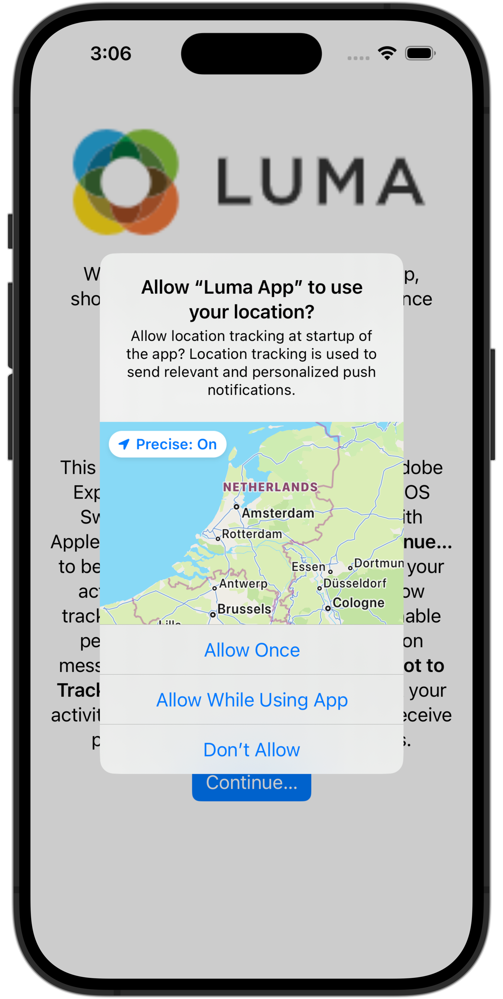

# Configurare Assurance

Scopri come configurare Adobe Experience Platform Assurance in un’app mobile.

Assurance, formalmente noto come Project Griffon, è progettato per aiutarti a ispezionare, verificare, simulare e convalidare le modalità di raccolta dei dati o di gestione delle esperienze nella tua app mobile.

Assurance consente di controllare gli eventi SDK non elaborati generati da Adobe Experience Platform Mobile SDK. Tutti gli eventi raccolti dall’SDK sono disponibili per il controllo. Gli eventi SDK vengono caricati in una vista a elenco, ordinati in ordine cronologico. Ogni evento dispone di una vista dettagliata che fornisce ulteriori dettagli. Sono inoltre disponibili viste aggiuntive per sfogliare la configurazione di SDK, gli elementi dati, gli stati condivisi e le versioni delle estensioni di SDK. Ulteriori informazioni su [Assurance](https://experienceleague.adobe.com/it/docs/experience-platform/assurance/home) nella documentazione del prodotto.


## Prerequisiti

* L&#39;app con gli SDK installati e configurati è stata configurata.

## Obiettivi di apprendimento

In questa lezione verranno fornite le seguenti informazioni:

* Conferma che la tua organizzazione disponga dell’accesso (e richiedilo in caso contrario).
* Imposta l’URL di base.
* Aggiungi il codice iOS specifico richiesto.
* Connettersi a una sessione.

## Conferma accesso

Conferma che la tua organizzazione abbia accesso ad Assurance. Come utente, devi essere aggiunto al profilo per Adobe Experience Platform. Per ulteriori informazioni, consulta [Accesso utente](https://experienceleague.adobe.com/it/docs/experience-platform/assurance/user-access) nella guida di Assurance.

## Implementazione

Per implementare Assurance nella tua app:

>[!BEGINTABS]

>[!TAB iOS]

Oltre all&#39;[installazione generale di SDK](install-sdks.md), iOS richiede anche il seguente codice aggiuntivo per avviare la sessione di Assurance per l&#39;app.

1. Passa a **[!DNL Luma]** > **[!DNL Luma]** > **[!UICONTROL SceneDelegate]** nel Navigatore progetti Xcode.

1. Aggiungi il codice seguente a `func scene(_ scene: UIScene, openURLContexts URLContexts: Set<UIOpenURLContext>`:

   ```swift
   // Called when the app in background is opened with a deep link.
   if let deepLinkURL = URLContexts.first?.url {
       // Start the Assurance session
       Assurance.startSession(url: deepLinkURL)
   }
   ```

   Questo codice avvia una sessione di garanzia quando l’app è in background e viene aperta utilizzando un collegamento profondo.

>[!TAB Android]

Oltre all&#39;[installazione generale di SDK](install-sdks.md), Android richiede anche il seguente codice aggiuntivo per avviare la sessione di Assurance per l&#39;app.

1. In Android Studio, nella visualizzazione **[!UICONTROL Android]**, passa a **[!UICONTROL app]** > **[!UICONTROL kotlin+java]** > **[!UICONTROL com.adobe.luma.tutorial.android]** > **[!UICONTROL LumaApplication]**.

1. Aggiungi il codice seguente a `fun handleDeeplink(deeplink: String?)`:

   ```kotlin
   // Called when the app in background is opened with a deep link.
   if (deeplink.isNullOrEmpty()) {
      Log.w("Luma", "Deeplink is null or empty")
      return
   }
   
   Log.i("Luma", "Handling deeplink: $deeplink")
   Assurance.startSession(deeplink)
   ```

   Questo codice avvia una sessione di garanzia quando l’app è in background e viene aperta utilizzando un collegamento profondo.

>[!ENDTABS]


Per ulteriori informazioni, consulta [Riferimento API di Assurance](https://developer.adobe.com/client-sdks/documentation/platform-assurance-sdk/api-reference/){target="_blank"}.


## Definire un identificatore bundle

Devi fornire un identificatore univoco del bundle per l’app.

>[!BEGINTABS]

>[!TAB iOS]

1. Apri il progetto in Xcode.
1. Selezionare **[!DNL Luma]** nel Navigatore progetti.
1. Selezionare la destinazione **[!DNL Luma]**.
1. Selezionare la scheda **Firma e funzionalità**.
1. Definisci un **[!UICONTROL identificatore bundle]**.

Assicurati di utilizzare un identificatore bundle _univoco_ e sostituisci l&#39;identificatore bundle `com.adobe.luma.tutorial.swiftui`, in quanto ogni identificatore bundle deve essere univoco. In genere si utilizza un formato DNS inverso per le stringhe ID bundle, come `com.organization.brand.uniqueidentifier`. La versione finale di questa esercitazione, ad esempio, utilizza `com.adobe.luma.tutorial.swiftui`.

{zoomable="yes"}

>[!TAB Android]

1. Apri il progetto in Android Studio.
1. Selezionare **[!UICONTROL build.gradle.kts (Modulo :app)]** nel Navigator.
1. Assicurati di utilizzare un identificatore bundle _univoco_ e di sostituire il valore `com.adobe.luma.tutorial.android` per `namespace` in `android`
1. Assicurati di utilizzare lo stesso identificatore del bundle _unique_ e di sostituire `com.adobe.luma.tutorial.android` per `applicationId` in `defaultConfig` in `android`

In genere si utilizza un formato DNS inverso per le stringhe ID bundle, come `com.organization.brand.uniqueidentifier`. La versione finale di questa esercitazione, ad esempio, utilizza `com.adobe.luma.tutorial.android`.

{zoomable="yes"}{zoomable="yes"}

>[!ENDTABS]


## Configurare un URL di base

Devi impostare un URL di base per garantire il funzionamento dei collegamenti profondi.

>[!BEGINTABS]

>[!TAB iOS]

1. Vai al progetto in Xcode.
1. Selezionare **[!DNL Luma]** nel Navigatore progetti.
1. Selezionare la destinazione **[!DNL Luma]**.
1. Selezionare la scheda **Informazioni**.
1. Per aggiungere un URL di base, scorri verso il basso fino a **Tipi di URL** e seleziona il pulsante **+**.
1. Imposta **Identificatore** per l&#39;identificatore del bundle desiderato e **Schemi URL** a tua scelta.

   {zoomable="yes"}

Assicurati di utilizzare un identificatore bundle _univoco_ e sostituisci l&#39;identificatore bundle `com.adobe.luma.tutorial.swiftui`, in quanto ogni identificatore bundle deve essere univoco. In genere si utilizza un formato DNS inverso per le stringhe ID bundle, come `com.organization.brand.uniqueidentifier`. È possibile utilizzare lo stesso identificatore del bundle utilizzato in [Definisci identificatore del bundle](#define-bundle-identifier).<br/>Analogamente, utilizzare uno schema URL univoco e sostituire `lumatutorialswiftui` già fornito con lo schema URL univoco.

Per ulteriori informazioni sugli schemi URL in iOS, consulta la [documentazione di Apple](https://developer.apple.com/documentation/xcode/defining-a-custom-url-scheme-for-your-app){target="_blank"}.

Assurance funziona aprendo un URL tramite un browser o un codice QR. Tale URL inizia con l’URL di base che apre l’app e contiene parametri aggiuntivi. Questi parametri univoci vengono utilizzati per connettere la sessione. Nell&#39;app di esempio, il collegamento profondo è `lumatutorialswiftui://`.

>[!TAB Android]

1. Vai alla visualizzazione **[!UICONTROL Android]** del progetto in Android Studio.
1. Seleziona **[!UICONTROL app]** > **[!UICONTROL manifesti]** > **[!UICONTROL AndroidManifest.xml]** nel navigatore.
1. Assicurati che l&#39;elemento XML **[!UICONTROL manifest]** > **[!UICONTROL application]** > **[!UICONTROL activity]** sia simile al seguente:

   ```xml
   <activity
      android:name=".MainActivity"
      android:exported="true"
      android:theme="@style/Theme.LumaAndroid">
      <intent-filter>
            <action android:name="android.intent.action.MAIN" />
            <category android:name="android.intent.category.LAUNCHER" />
      </intent-filter>
      <intent-filter
            android:label="@string/app_name">
            <action android:name="android.intent.action.VIEW" />
            <category android:name="android.intent.category.DEFAULT" />
            <category android:name="android.intent.category.BROWSABLE" />
            <data android:scheme="lumatutorialandroid"
               android:host="default" />
      </intent-filter>
   </activity>
   ```

Assicurati di specificare un `android:scheme` (ad esempio. `lumatutorialandroid`) e `android:host` (ad esempio `default`) per definire l&#39;URL di base.

Per ulteriori informazioni sui collegamenti profondi in Android, consulta [Creare collegamenti profondi](https://developer.android.com/training/app-links/create-deeplinks){target="_blank"} nella documentazione di Android.

Assurance funziona aprendo un URL tramite un browser o un codice QR. Tale URL inizia con l’URL di base, che apre l’app e contiene parametri aggiuntivi. Questi parametri univoci vengono utilizzati per connettere la sessione.  Nell&#39;app di esempio, il collegamento profondo è `lumatutorialandroid://default`.

>[!ENDTABS]


## Connessione a una sessione

Ora puoi utilizzare Assurance per connettersi a una sessione.

>[!BEGINTABS]

>[!TAB iOS]

In Xcode:

1. Genera o ricompila ed esegui l&#39;app nel simulatore o su un dispositivo fisico da Xcode, utilizzando .

   Facoltativamente, potrebbe essere utile *pulire* la build, soprattutto quando vengono visualizzati risultati imprevisti. Seleziona **[!UICONTROL Pulisci cartella build...]** dal menu Xcode **[!UICONTROL Product]**.


1. Nella finestra di dialogo **[!UICONTROL Consenti all&#39;app Luma di utilizzare la tua posizione]**, seleziona **[!UICONTROL Consenti durante l&#39;utilizzo dell&#39;app]**.

   

1. Nella finestra di dialogo **[!UICONTROL &quot;App Luma&quot; desidera inviarti notifiche]**, seleziona **[!UICONTROL Consenti]**.

   

1. Seleziona **[!UICONTROL Continua...]** per consentire all&#39;app di tenere traccia dell&#39;attività.

   

1. Nella finestra di dialogo **[!UICONTROL Consenti a &quot;App Luma&quot; di tenere traccia dell&#39;attività tra app e siti Web di altre aziende]**, seleziona **[!UICONTROL Consenti]**.

   

1. Seleziona **[!UICONTROL Continua]**.


Nel browser:

1. Passa all’interfaccia utente di Data Collection.
1. Seleziona **[!UICONTROL Assurance]** dalla barra a sinistra.
1. Seleziona **[!UICONTROL Crea nuova sessione]** e l&#39;opzione **[!UICONTROL Connessione collegamento profondo]**.
1. Seleziona **[!UICONTROL Inizio]**.
1. Fornisci un **[!UICONTROL Nome sessione]** come `Luma Mobile App Session` e l&#39;**[!UICONTROL URL di base]**, ovvero gli schemi URL immessi in Xcode, seguiti da `://` Ad esempio: `lumatutorialswiftui://`
1. Seleziona **[!UICONTROL Avanti]**.
   {zoomable="yes"}
1. Nella finestra di dialogo modale **[!UICONTROL Crea nuova sessione]**:

   Se si utilizza un dispositivo fisico:

   * Selezionare **[!UICONTROL Scansiona codice QR]**. Per aprire l&#39;app, usa la fotocamera sul tuo dispositivo fisico per scansionare il codice QR e toccare il collegamento.

     {zoomable="yes"}

   Se utilizzi un simulatore:

   1. Seleziona **[!UICONTROL Copia collegamento]**.
   1. Copia il collegamento profondo utilizzando  e utilizza il collegamento profondo per aprire l&#39;app con Safari nel simulatore.
      {zoomable="yes"}

1. Al caricamento dell’app, viene visualizzata una finestra di dialogo modale in cui viene richiesto di immettere il PIN illustrato al punto 7.

   

   Immettere il PIN e selezionare **[!UICONTROL Connetti]**.


1. Se la connessione ha avuto esito positivo, vengono visualizzati i seguenti elementi:
   * Un’icona Assurance che galleggia sulla tua app.

     

   * Gli aggiornamenti di Experience Cloud vengono inclusi nell’interfaccia utente di Assurance e mostrano:

      1. Eventi esperienza provenienti dall’app.
      1. Dettagli di un evento selezionato.
      1. Il dispositivo e la timeline.

         {zoomable="yes"}

1. Seleziona **[!UICONTROL Continua]** per passare alla schermata iniziale.

>[!TAB Android]

In Android Studio:

1. Genera o ricompila ed esegui l&#39;app nel simulatore o su un dispositivo fisico da Android Studio, utilizzando .

   Facoltativamente, potrebbe essere utile *pulire* la build, soprattutto quando vengono visualizzati risultati imprevisti. Selezionare **[!UICONTROL Pulisci progetto]** dal menu **[!UICONTROL Genera]** di Android Studio.


1. Nella finestra di dialogo **[!UICONTROL Consenti a Luma Android di inviarti notifiche]**, seleziona **[!UICONTROL Consenti]**.

   

1. Seleziona **[!UICONTROL Mostra finestra di dialogo autorizzazioni]**.

   

1. In **[!UICONTROL Consentire a Luma Android di accedere alla posizione di questo dispositivo?]**...

   

   * Seleziona **[!UICONTROL Preciso]**.
   * Seleziona **[!UICONTROL Durante l&#39;utilizzo dell&#39;app]**.

1. Nella schermata introduttiva dell&#39;app, seleziona **[!UICONTROL Apri impostazioni dispositivo]**.

1. Nella schermata **[!UICONTROL Autorizzazione posizione]**, seleziona **[!UICONTROL Consenti in qualsiasi momento]**. Quindi seleziona **[!UICONTROL ←]** per tornare alla schermata dell&#39;app introduttiva.

   

1. Seleziona **[!UICONTROL Continua]** per passare alla schermata iniziale.


Nel browser:

1. Passa all’interfaccia utente di Data Collection.
1. Seleziona **[!UICONTROL Assurance]** dalla barra a sinistra.
1. Seleziona **[!UICONTROL Crea nuova sessione]** e l&#39;opzione **[!UICONTROL Connessione collegamento profondo]**.
1. Seleziona **[!UICONTROL Inizio]**.
1. Fornisci un **[!UICONTROL Nome sessione]** come `Luma Mobile App Session` e l&#39;**[!UICONTROL URL di base]**, ovvero `android:scheme` e `android:host` definiti in **[!UICONTROL AndroidManifest.xml]** in Android Studio, separati da `://`. Esempio: `lumatutorialandroid://default`
1. Seleziona **[!UICONTROL Avanti]**.
   {zoomable="yes"}

1. Nella finestra di dialogo modale **[!UICONTROL Crea nuova sessione]**:

   Se si utilizza un dispositivo fisico:

   * Selezionare **[!UICONTROL Scansiona codice QR]**. Per aprire l&#39;app, usa la fotocamera sul tuo dispositivo fisico per scansionare il codice QR e toccare il collegamento.

     {zoomable="yes"}

   Se utilizzi un simulatore:

   1. Seleziona **[!UICONTROL Copia collegamento]**.
   1. Copia il collegamento profondo utilizzando  e utilizza il collegamento profondo per aprire l&#39;app con Chrome nel simulatore.

   {zoomable="yes"}

   Quando in Chrome viene richiesto di **Passare a Luma Android**, selezionare **Continua**.

1. Al caricamento dell’app, viene visualizzata una finestra di dialogo modale in cui viene richiesto di immettere il PIN illustrato al punto 7.

   

   Immettere il PIN e selezionare **[!UICONTROL Connetti]**.


1. Se la connessione ha avuto esito positivo, vengono visualizzati i seguenti elementi:
   * Un’icona Assurance che galleggia sulla tua app.

     

   * Gli aggiornamenti di Experience Cloud vengono inclusi nell’interfaccia utente di Assurance e mostrano:

      1. Eventi esperienza provenienti dall’app.
      1. Dettagli di un evento selezionato.
      1. Il dispositivo e la timeline.

         {zoomable="yes"}

>[!ENDTABS]

In caso di problemi, consulta la [documentazione tecnica](https://developer.adobe.com/client-sdks/documentation/platform-assurance-sdk/){target="_blank"} e la [documentazione generale](https://experienceleague.adobe.com/it/docs/experience-platform/assurance/home){target="_blank"}.


## Verificare le estensioni

Per verificare se l’app utilizza le estensioni più aggiornate:

1. Seleziona **[!UICONTROL Configura]**.

1. Seleziona  per  **[!UICONTROL Versioni estensione]**.

1. Seleziona **[!UICONTROL Salva]**.

   {zoomable="yes"}

1. Seleziona  **[!UICONTROL Versioni estensione]** per visualizzare una panoramica delle ultime estensioni disponibili e delle estensioni utilizzate nella tua versione dell&#39;app.

>[!BEGINTABS]

>[!TAB iOS]

{zoomable="yes"}

Per aggiornare le versioni dell&#39;estensione (ad esempio, **[!UICONTROL Messaggistica]** e **[!UICONTROL Ottimizza]**), selezionare il pacchetto (estensione) da **[!UICONTROL Dipendenze pacchetto]** (ad esempio, **[!UICONTROL AEPMessaging]**) e dal menu di scelta rapida selezionare **[!UICONTROL Aggiorna pacchetto]**. Xcode aggiorna le dipendenze del pacchetto.

>[!TAB Android]

{zoomable="yes"}

Se sono presenti estensioni obsolete, consulta la [documentazione di Android Studio](https://developer.android.com/build/agp-upgrade-assistant) su come aggiornare i moduli di dipendenza per il progetto.


>[!ENDTABS]

>[!NOTE]
>
>Dopo aver aggiornato le estensioni (pacchetti) nell&#39;ambiente di sviluppo, chiudi ed elimina la sessione corrente e ripeti tutti i passaggi da [Connessione a una sessione](#connecting-to-a-session) e [Verifica le estensioni](#verify-extensions) per assicurarti che Assurance segnali correttamente le estensioni corrette in una nuova sessione di Assurance.
>


>[!SUCCESS]
>
>Ora hai configurato l’app per l’utilizzo di Assurance per il resto dell’esercitazione.
>
>Grazie per aver dedicato tempo all&#39;apprendimento di Adobe Experience Platform Mobile SDK. Se hai domande, vuoi condividere commenti generali o suggerimenti su contenuti futuri, condividili in questo [post di discussione della community Experience League](https://experienceleaguecommunities.adobe.com/t5/adobe-experience-platform-data/tutorial-discussion-implement-adobe-experience-cloud-in-mobile/td-p/443796?profile.language=it)


Successivo: **[Implementare il consenso](consent.md)**
