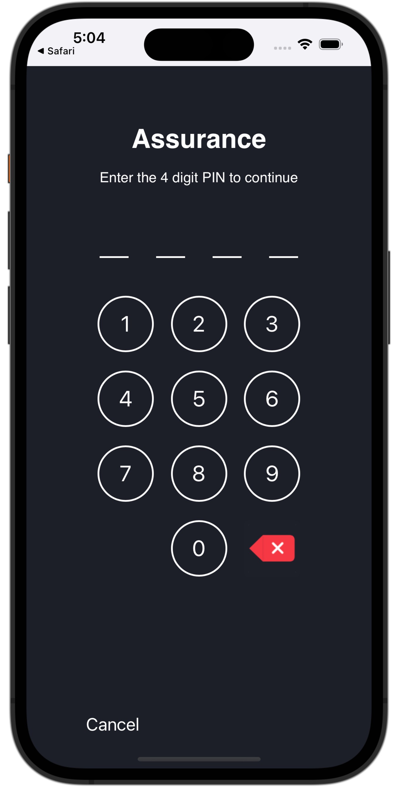

# Configura Assurance

Scopri come configurare Adobe Experience Platform Assurance in un’app mobile.

Assurance, formalmente noto come Project Griffon, è progettato per aiutarti a ispezionare, verificare, simulare e convalidare come raccolgi dati o distribuisci esperienze nella tua app mobile.

Assurance consente di controllare gli eventi SDK non elaborati generati da Adobe Experience Platform Mobile SDK. Tutti gli eventi raccolti dall’SDK sono disponibili per il controllo. Gli eventi SDK vengono caricati in una vista a elenco, ordinati in ordine cronologico. Ogni evento dispone di una vista dettagliata che fornisce ulteriori dettagli. Sono inoltre disponibili viste aggiuntive per sfogliare la configurazione dell’SDK, gli elementi dati, gli stati condivisi e le versioni delle estensioni SDK. Ulteriori informazioni su [Assurance](https://experienceleague.adobe.com/docs/experience-platform/assurance/home.html?lang=it) nella documentazione del prodotto.


## Prerequisiti

* L&#39;app con gli SDK installati e configurati è stata configurata.

## Obiettivi di apprendimento

In questa lezione verranno fornite le seguenti informazioni:

* Conferma che la tua organizzazione disponga dell’accesso (e richiedilo in caso contrario).
* Imposta l’URL di base.
* Aggiungi il codice iOS specifico richiesto.
* Connettersi a una sessione.

## Conferma accesso

Assicurati che la tua organizzazione abbia accesso a Assurance. Come utente, devi essere aggiunto al profilo per Adobe Experience Platform. Per ulteriori informazioni, consulta [Accesso utente](https://experienceleague.adobe.com/docs/experience-platform/assurance/user-access.html?lang=it) nella guida Assurance.

## Implementazione

Oltre all&#39;installazione generale di [SDK](install-sdks.md), completata nella lezione precedente, iOS richiede anche la seguente aggiunta per avviare la sessione Assurance per la tua app.

1. Passa a **[!DNL Luma]** > **[!DNL Luma]** > **[!UICONTROL SceneDelegate]** nel Navigatore progetti Xcode.

1. Aggiungi il codice seguente a `func scene(_ scene: UIScene, openURLContexts URLContexts: Set<UIOpenURLContext>`:

   ```swift
   // Called when the app in background is opened with a deep link.
   if let deepLinkURL = URLContexts.first?.url {
       // Start the Assurance session
       Assurance.startSession(url: deepLinkURL)
   }
   ```

   Questo codice avvia una sessione di garanzia quando l’app è in background e viene aperta utilizzando un collegamento profondo.

Ulteriori informazioni sono disponibili [qui](https://developer.adobe.com/client-sdks/documentation/platform-assurance-sdk/api-reference/){target="_blank"}.


## Definisci identificatore bundle

Devi fornire un identificatore univoco del bundle per l’app.

1. Apri il progetto in Xcode.
1. Selezionare **[!DNL Luma]** nel Navigatore progetti.
1. Selezionare la destinazione **[!DNL Luma]**.
1. Selezionare la scheda **Firma e funzionalità**.
1. Definisci un **[!UICONTROL identificatore bundle]**.

   >[!IMPORTANT]
   >
   >Assicurati di utilizzare un identificatore bundle _univoco_ e sostituisci l&#39;identificatore bundle `com.adobe.luma.tutorial.swiftui`, in quanto ogni identificatore bundle deve essere univoco. In genere si utilizza un formato DNS inverso per le stringhe ID bundle, come `com.organization.brand.uniqueidentifier`. La versione finale di questa esercitazione, ad esempio, utilizza `com.adobe.luma.tutorial.swiftui`.


   {zoomable="yes"}


## Configurare un URL di base

1. Vai al progetto in Xcode.
1. Selezionare **[!DNL Luma]** nel Navigatore progetti.
1. Selezionare la destinazione **[!DNL Luma]**.
1. Selezionare la scheda **Informazioni**.
1. Per aggiungere un URL di base, scorri verso il basso fino a **Tipi di URL** e seleziona il pulsante **+**.
1. Imposta **Identificatore** per l&#39;identificatore del bundle desiderato e **Schemi URL** a tua scelta.

   

   >[!IMPORTANT]
   >
   >Assicurati di utilizzare un identificatore bundle _univoco_ e sostituisci l&#39;identificatore bundle `com.adobe.luma.tutorial.swiftui`, in quanto ogni identificatore bundle deve essere univoco. In genere si utilizza un formato DNS inverso per le stringhe ID bundle, come `com.organization.brand.uniqueidentifier`. È possibile utilizzare lo stesso identificatore del bundle utilizzato in [Definisci identificatore del bundle](#define-bundle-identifier).<br/>Analogamente, utilizzare uno schema URL univoco e sostituire `lumatutorialswiftui` già fornito con lo schema URL univoco.

Per ulteriori informazioni sugli schemi URL in iOS, consulta la [documentazione di Apple](https://developer.apple.com/documentation/xcode/defining-a-custom-url-scheme-for-your-app){target="_blank"}.

Assurance funziona aprendo un URL, tramite il browser o il codice QR. Tale URL inizia con l’URL di base che apre l’app e contiene parametri aggiuntivi. Questi parametri univoci vengono utilizzati per connettere la sessione.


## Connessione a una sessione

In Xcode:

1. Genera o ricompila ed esegui l&#39;app nel simulatore o su un dispositivo fisico da Xcode, utilizzando .

   >[!TIP]
   >
   >Facoltativamente, potresti voler &quot;ripulire&quot; la build, soprattutto quando vengono visualizzati risultati imprevisti. A tale scopo, selezionare **[!UICONTROL Pulisci cartella di compilazione...]** dal menu Xcode **[!UICONTROL Product]**.


1. Nella finestra di dialogo **[!UICONTROL Consenti all&#39;app Luma di utilizzare la tua posizione]**, seleziona **[!UICONTROL Consenti durante l&#39;utilizzo dell&#39;app]**.

   

1. Nella finestra di dialogo **[!UICONTROL &quot;App Luma&quot; desidera inviarti notifiche]**, seleziona **[!UICONTROL Consenti]**.

   

1. Seleziona **[!UICONTROL Continua...]** per consentire all&#39;app di tenere traccia dell&#39;attività.

   

1. Nella finestra di dialogo **[!UICONTROL Consenti a &quot;App Luma&quot; di tenere traccia dell&#39;attività tra app e siti Web di altre aziende]**, seleziona **[!UICONTROL Consenti]**.

   


Nel browser:

1. Passa all’interfaccia utente di Data Collection.
1. Seleziona **[!UICONTROL Assurance]** dalla barra a sinistra.
1. Seleziona **[!UICONTROL Crea sessione]**.
1. Seleziona **[!UICONTROL Inizio]**.
1. Fornisci un **[!UICONTROL Nome sessione]** come `Luma Mobile App Session` e l&#39;**[!UICONTROL URL di base]**, ovvero gli schemi URL immessi in Xcode, seguiti da `://` Ad esempio: `lumatutorialswiftui://`
1. Seleziona **[!UICONTROL Avanti]**.
   
1. Nella finestra di dialogo modale **[!UICONTROL Crea nuova sessione]**:

   Se si utilizza un dispositivo fisico:

   * Selezionare **[!UICONTROL Scansiona codice QR]**. Per aprire l&#39;app, usa la fotocamera sul tuo dispositivo fisico per scansionare il codice QR e toccare il collegamento.

     

   Se utilizzi un simulatore:

   1. Seleziona **[!UICONTROL Copia collegamento]**.
   1. Copia il collegamento profondo utilizzando  e utilizza il collegamento profondo per aprire l&#39;app con Safari nel simulatore.

      

1. Al caricamento dell’app, viene visualizzata una finestra di dialogo modale in cui viene richiesto di immettere il PIN illustrato al punto 7.

   

   Immettere il PIN e selezionare **[!UICONTROL Connetti]**.


1. Se la connessione ha avuto esito positivo, vengono visualizzati i seguenti elementi:
   * Un’icona Assurance mobile sopra l’app.

     

   * Experienci Cloud di aggiornamenti disponibili nell’interfaccia utente Assurance, che mostrano:

      1. Eventi esperienza provenienti dall’app.
      1. Dettagli di un evento selezionato.
      1. Il dispositivo e la timeline.

         

In caso di problemi, consulta la [documentazione tecnica](https://developer.adobe.com/client-sdks/documentation/platform-assurance-sdk/){target="_blank"} e la [documentazione generale](https://experienceleague.adobe.com/docs/experience-platform/assurance/home.html?lang=it){target="_blank"}.


## Verificare le estensioni

Per verificare se l’app utilizza le estensioni più aggiornate:

1. Seleziona **[!UICONTROL Configura]**.

1. Seleziona  per  **[!UICONTROL Versioni estensione]**.

1. Seleziona **[!UICONTROL Salva]**.

   

1. Seleziona  **[!UICONTROL Versioni estensione]** per visualizzare una panoramica delle ultime estensioni disponibili e delle estensioni utilizzate nella tua versione dell&#39;app.

   

1. Per aggiornare le versioni dell&#39;estensione (ad esempio, **[!UICONTROL Messaggistica]** e **[!UICONTROL Ottimizza]**), selezionare il pacchetto (estensione) da **[!UICONTROL Dipendenze pacchetto]** (ad esempio, **[!UICONTROL AEPMessaging]**) e dal menu di scelta rapida selezionare **[!UICONTROL Aggiorna pacchetto]**. Xcode aggiornerà le dipendenze del pacchetto.


>[!NOTE]
>
>Dopo aver aggiornato le estensioni (pacchetti) in Xcode, chiudi ed elimina la sessione corrente e ripeti tutti i passaggi da [Connessione a una sessione](#connecting-to-a-session) e [Verifica le estensioni](#verify-extensions) per garantire che Assurance segnali correttamente le estensioni corrette in una nuova sessione Assurance.


>[!SUCCESS]
>
>Ora hai configurato l’app per utilizzare Assurance per il resto dell’esercitazione.
>
>Grazie per aver dedicato il tuo tempo all’apprendimento dell’SDK di Adobe Experience Platform Mobile. Se hai domande, vuoi condividere commenti generali o suggerimenti su contenuti futuri, condividili in questo [Experience League post di discussione della community](https://experienceleaguecommunities.adobe.com/t5/adobe-experience-platform-data/tutorial-discussion-implement-adobe-experience-cloud-in-mobile/td-p/443796)


Successivo: **[Implementare il consenso](consent.md)**
