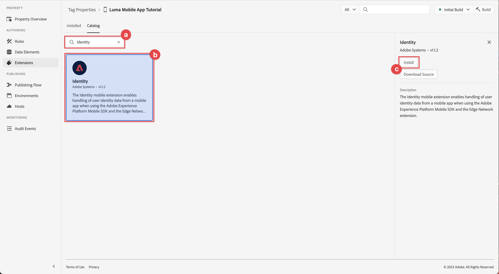

# Configurare una proprietà tag

Scopri come configurare una proprietà tag nell’interfaccia [!UICONTROL Raccolta dati].

I tag in Adobe Experience Platform costituiscono la soluzione Adobe di nuova generazione per la gestione dei tag. I tag offrono ai clienti un modo semplice di implementare e gestire i tag di analisi, marketing e annunci pubblicitari necessari per fornire ai clienti esperienze personalizzate. Ulteriori informazioni su [Tag](https://experienceleague.adobe.com/it/docs/experience-platform/tags/home) sono disponibili nella documentazione del prodotto.

## Prerequisiti

Per completare la lezione, devi disporre dell’autorizzazione per creare una proprietà tag. È inoltre utile avere una conoscenza di base dei tag.

>[!NOTE]
>
> Platform Launch (lato client) è ora [Tag](https://experienceleague.adobe.com/it/docs/experience-platform/tags/home)

## Obiettivi di apprendimento

In questa lezione verranno fornite le seguenti informazioni:

* Installa e configura le estensioni di tag per dispositivi mobili.
* Generare le istruzioni di installazione di SDK.

## Configurazione iniziale

1. Crea una nuova proprietà di tag mobile nell’interfaccia di raccolta dati:
   1. Seleziona **[!UICONTROL Tag]** nel menu di navigazione a sinistra.
   1. Seleziona **[!UICONTROL Nuova proprietà]**
      {zoomable="yes"}.
   1. Per **[!UICONTROL Name]**, immetti `Luma Mobile App Tutorial`.
   1. Per **[!UICONTROL Platform]**, seleziona **[!UICONTROL Mobile]**.
   1. Seleziona **[!UICONTROL Salva]**.

      {zoomable="yes"}

      >[!NOTE]
      >
      > Le impostazioni di consenso predefinite per le implementazioni di Mobile SDK basate su Edge, come quella che si sta effettuando in questa lezione, provengono dall&#39;estensione [!UICONTROL Consent] e non dall&#39;impostazione [!UICONTROL Privacy] nella configurazione della proprietà tag. Puoi aggiungere e configurare l’estensione Consent più avanti in questa lezione. Per ulteriori informazioni, consulta [la documentazione](https://developer.adobe.com/client-sdks/edge/consent-for-edge-network/).

1. Apri la nuova proprietà.
1. Creare una libreria:

   1. Vai a **[!UICONTROL Flusso di pubblicazione]** nella navigazione a sinistra.
   1. Seleziona **[!UICONTROL Aggiungi libreria]**.

      {zoomable="yes"}

   1. Per **[!UICONTROL Name]**, immetti `Initial Build`.
   1. Per **[!UICONTROL Ambiente]**, selezionare **[!UICONTROL Sviluppo (sviluppo)]**.
   1. Seleziona  **[!UICONTROL Aggiungi tutte le risorse modificate]**.
   1. Seleziona **[!UICONTROL Salva e genera in sviluppo]**.

      {zoomable="yes"}

   1. Selezionare **[!UICONTROL Build iniziale]** come libreria di lavoro dal menu **[!UICONTROL Seleziona una libreria di lavoro]**.
      {zoomable="yes"}
1. Verifica estensioni:

   1. Verificare che **[!UICONTROL Build iniziale]** sia selezionata come libreria predefinita.

   1. Seleziona **[!UICONTROL Estensioni]** nella barra a sinistra.

   1. Selezionare la scheda **[!UICONTROL Installato]**.

      Le estensioni [!UICONTROL Mobile Core] e [!UICONTROL Profile] devono essere preinstallate.

      {zoomable="yes"}

## Configurazione dell&#39;estensione

1. Assicurati di trovarti in **[!UICONTROL Estensioni]** all&#39;interno della proprietà della tua app mobile.

1. Seleziona **[!UICONTROL Catalogo]**.

   {zoomable="yes"}

1. Utilizza il campo  **[!UICONTROL Ricerca]** per trovare l&#39;estensione **Identità**.

   1. Cerca `Identity`.

   2. Seleziona l&#39;estensione **[!UICONTROL Identity]**.

   3. Selezionare **[!UICONTROL Installa]**.

      {zoomable="yes"}

   Questa estensione non richiede alcuna ulteriore configurazione.

1. Utilizza il campo  **[!UICONTROL Cerca]** per trovare e installare l&#39;estensione **AEP Assurance**.

   Questa estensione non richiede alcuna ulteriore configurazione.

1. Utilizza il campo  **[!UICONTROL Ricerca]** per trovare e installare l&#39;estensione **Consenso**. Nella schermata di configurazione:

   1. Seleziona **[!UICONTROL In sospeso]**. In questa esercitazione, gestisci ulteriormente il consenso nell’applicazione. Ulteriori informazioni sull&#39;estensione Consent sono disponibili nella [documentazione](https://developer.adobe.com/client-sdks/documentation/consent-for-edge-network/).
   1. Seleziona **[!UICONTROL Salva nella libreria]**.

      {zoomable="yes"}

1. Utilizza il campo  **[!UICONTROL Cerca]** per trovare e installare l&#39;estensione **Adobe Experience Platform Edge Network**.

   1. In **[!UICONTROL Datastream]** seleziona lo **[!UICONTROL Datastream]** creato nel [passaggio precedente](create-datastream.md) per ciascuno degli ambienti, ad esempio **[!DNL Luma Mobile App]**.

   1. Se non è già stato popolato, specificare il **[!UICONTROL dominio Edge Network]** all&#39;interno di **[!UICONTROL Configurazione dominio]**. Il dominio Edge Network è il nome dell&#39;organizzazione, seguito da `data.adobedc.net`, ad esempio `techmarketingdemos.data.adobedc.net`.

   1. Dal menu **[!UICONTROL Salva nella libreria]**, selezionare **[!UICONTROL Salva nella libreria e genera]**.

      {zoomable="yes"}

La libreria viene creata per le nuove estensioni e configurazioni. Una ● nel pulsante **[!UICONTROL Initial Build]** indica una compilazione completata.

## Genera istruzioni di installazione SDK

I tag ti forniscono istruzioni e snippet di codice per installare Adobe Experience Platform Mobile SDK nell’app.

>[!BEGINTABS]

>[!TAB iOS]

1. Seleziona **[!UICONTROL Ambienti]** dalla barra a sinistra.

1. Selezionare l&#39;icona di installazione **[!UICONTROL Sviluppo]** .

   {zoomable="yes"}

1. Nella finestra di dialogo **[!UICONTROL Istruzioni di installazione mobile]**, seleziona la scheda **[!UICONTROL iOS]**.

1. È possibile copiare  le istruzioni per configurare il progetto utilizzando CocoaPods. I CocoaPod vengono utilizzati per gestire le versioni e i download di SDK. Per ulteriori informazioni, consulta la [documentazione di CocoaPods](https://cocoapods.org/).

   Le [istruzioni di installazione](https://developer.adobe.com/client-sdks/documentation/getting-started/get-the-sdk/) forniscono un buon punto di partenza per l&#39;implementazione.

   Per il resto di questa esercitazione, stai **non** utilizzando le istruzioni CocoaPods. Viene invece utilizzata l&#39;impostazione nativa basata su SPM (Swift Package Manager).

1. Selezionare la scheda **[!UICONTROL Swift]** sotto **[!UICONTROL Aggiungi codice di inizializzazione]**. Questo blocco di codice mostra come importare gli SDK richiesti e registrare le estensioni all’avvio. Questa importazione e registrazione sono descritte più dettagliatamente in [Installare gli SDK](install-sdks.md).

1. Copiare  l&#39;ID **[!UICONTROL File di ambiente]** e archiviarlo in un luogo che sarà necessario in un secondo momento. Questo ID univoco punta all’ambiente di sviluppo. Ogni ambiente (Produzione, Staging, Sviluppo) ha un proprio valore ID univoco.

   {zoomable="yes"}

>[!TAB Android]

1. Seleziona **[!UICONTROL Ambienti]** dalla barra a sinistra.
1. Selezionare l&#39;icona di installazione **[!UICONTROL Sviluppo]** .

   {zoomable="yes"}

1. Nella finestra di dialogo **[!UICONTROL Istruzioni di installazione mobile]**, seleziona la scheda **[!UICONTROL Android]**.
1. Puoi copiare  le istruzioni per configurare il progetto utilizzando Gradle. Gradle viene utilizzato per gestire versioni e download di SDK. Per ulteriori informazioni, consulta la [documentazione Gradle](https://gradle.org/)

   Le [istruzioni di installazione](https://developer.adobe.com/client-sdks/documentation/getting-started/get-the-sdk/) forniscono un buon punto di partenza per l&#39;implementazione.

1. Questo blocco di codice mostra come importare gli SDK richiesti e registrare le estensioni all’avvio. Questa importazione e registrazione sono descritte più dettagliatamente in [Installare gli SDK](install-sdks.md).

1. Copiare  l&#39;ID **[!UICONTROL File di ambiente]** e archiviarlo in un luogo che sarà necessario in un secondo momento. Questo ID univoco punta all’ambiente di sviluppo. Ogni ambiente (Produzione, Staging, Sviluppo) ha un proprio valore ID univoco.

   {zoomable="yes"}

>[!ENDTABS]

>[!NOTE]
>
>Le istruzioni di installazione devono essere considerate un punto di partenza e non una documentazione definitiva. Le versioni più recenti di SDK ed esempi di codice sono disponibili nella [documentazione ufficiale](https://developer.adobe.com/client-sdks/home/).

## Architettura dei tag per dispositivi mobili

Se conosci la versione web di Tag, precedentemente Launch, è importante comprendere le differenze su dispositivi mobili.

* Sul web, viene eseguito il rendering di una proprietà tag in JavaScript che è poi (in genere) ospitato nel cloud. Viene fatto riferimento al file JavaScript direttamente nel sito Web.

* In una proprietà di tag mobile, le regole e le configurazioni vengono sottoposte a rendering in file JSON ospitati nel cloud. I file JSON vengono scaricati e letti dall’estensione core per dispositivi mobili nell’app mobile. Le estensioni sono SDK separati che funzionano insieme. Se aggiungi un’estensione alla proprietà tag, devi aggiornare anche l’app. Se modifichi l’impostazione di un’estensione o crei una regola, tali modifiche vengono applicate nell’app dopo che la libreria di tag aggiornata è stata pubblicata. Questa flessibilità ti consente di modificare le impostazioni (come l’ID suite di rapporti di Adobe Analytics). Oppure puoi anche modificare il comportamento dell’app (utilizzando elementi dati e regole, come vedi nelle lezioni successive) senza dover modificare il codice nell’app e inviare di nuovo l’app all’app store.

>[!SUCCESS]
>
>Nel resto dell&#39;esercitazione è disponibile una proprietà di tag per dispositivi mobili.
>
>Grazie per aver dedicato tempo all&#39;apprendimento di Adobe Experience Platform Mobile SDK. Se hai domande, vuoi condividere commenti generali o suggerimenti su contenuti futuri, condividili in questo [post di discussione della community Experience League](https://experienceleaguecommunities.adobe.com/t5/adobe-experience-platform-data/tutorial-discussion-implement-adobe-experience-cloud-in-mobile/td-p/443796?profile.language=it)

Successivo: **[Installare gli SDK](install-sdks.md)**
