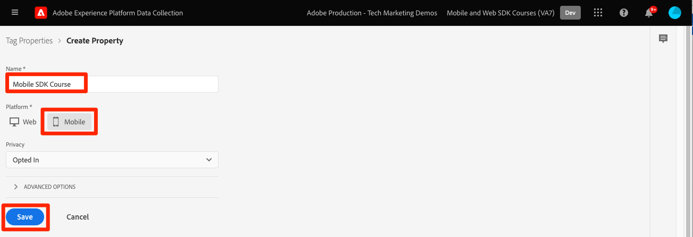
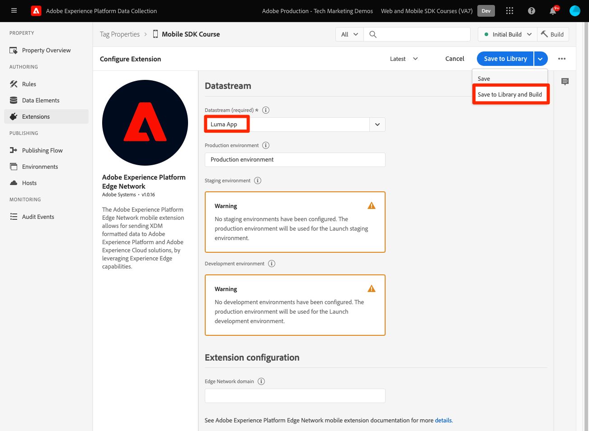

# Configurare una proprietà tag

Scopri come configurare una proprietà tag in [!UICONTROL Raccolta dati] interfaccia.

I tag in Adobe Experience Platform costituiscono la soluzione Adobe di nuova generazione per la gestione dei tag. I tag offrono ai clienti un modo semplice di implementare e gestire tutti i tag di analisi, marketing e annunci pubblicitari necessari per fornire ai clienti esperienze personalizzate significative. Ulteriori informazioni [tag](https://experienceleague.adobe.com/docs/experience-platform/tags/home.html?lang=it) nella documentazione del prodotto.

## Prerequisiti

Per completare la lezione, è necessario disporre dell’autorizzazione per creare una proprietà tag. È inoltre utile avere una comprensione di base dei tag.

>[!NOTE]
>
> Il platform launch (lato client) è ora [tag](https://experienceleague.adobe.com/docs/experience-platform/tags/home.html?lang=it)

## Finalità di apprendimento

In questa lezione:

* Installa e configura le estensioni dei tag per dispositivi mobili.
* Genera le istruzioni di installazione SDK.

## Configurazione iniziale

1. Crea una nuova proprietà tag mobile:
   1. In [Interfaccia di raccolta dati](https://experience.adobe.com/data-collection/){target=&quot;_blank&quot;}, seleziona **[!UICONTROL Tag]** nella navigazione a sinistra
   1. Seleziona **[!UICONTROL Nuova proprietà]**

      .
   1. Per **[!UICONTROL Nome]**, inserisci `Mobile SDK Course`.
   1. Per **[!UICONTROL Piattaforma]**, seleziona **[!UICONTROL Mobile]**.
   1. Seleziona **[!UICONTROL Salva]**.

      

      >[!NOTE]
      >
      > Le impostazioni di consenso predefinite per le implementazioni sdk per dispositivi mobili basate su edge, come quella che stai facendo in questa esercitazione, provengono dal [!UICONTROL Estensione del consenso] e non il [!UICONTROL Privacy] nella configurazione della proprietà tag. In seguito, aggiungerai e configurerai l’estensione Consent in questa lezione. Per ulteriori informazioni, consulta [la documentazione](https://aep-sdks.gitbook.io/docs/resources/privacy-and-gdpr).

1. Apri la nuova proprietà
1. Creare una libreria:

   1. Vai a **[!UICONTROL Flusso di pubblicazione]** nella navigazione a sinistra.
   1. Seleziona **[!UICONTROL Aggiungi libreria]**.

      

   1. Per **[!UICONTROL Nome]**, inserisci `Initial Build`.
   1. Per **[!UICONTROL Ambiente]**, seleziona **[!UICONTROL Sviluppo]**.
   1. Seleziona  **[!UICONTROL Aggiungi tutte le risorse modificate]**.
   1. Seleziona **[!UICONTROL Salva e genera in sviluppo]**.

      

   1. Infine, impostalo come **[!UICONTROL Libreria di lavoro]**.
      
1. Seleziona **[!UICONTROL Estensioni]**.

   È necessario preinstallare le estensioni Core e Profilo mobile.

1. Seleziona **[!UICONTROL Catalogo]**.

   

1. Utilizza la [!UICONTROL Ricerca] per trovare e installare le seguenti estensioni. Nessuna di queste estensioni richiede alcuna configurazione:
   * Identità
   * Garanzia AEP

## Configurazione dell&#39;estensione

1. Installa il **Consenso** estensione.

   Ai fini di questa esercitazione, seleziona **[!UICONTROL In sospeso]**. Ulteriori informazioni sull’estensione Consent in [la documentazione](https://aep-sdks.gitbook.io/docs/foundation-extensions/consent-for-edge-network).

   

1. Installa il **Adobe Experience Platform Edge Network** estensione.

   In **[!UICONTROL Configurazione Edge]** , seleziona il datastream creato nel menu a discesa [passaggio precedente](create-datastream.md).

1. Seleziona **[!UICONTROL Salva nella libreria e genera]**.

   

## Generare istruzioni di installazione SDK

1. Seleziona **[!UICONTROL Ambienti]**.

1. Seleziona la **[!UICONTROL Sviluppo]** icona di installazione.

   

1. Seleziona **[!UICONTROL iOS]**.

1. Seleziona **[!UICONTROL Swift]**.

   

1. Le istruzioni di installazione forniscono un buon punto di partenza per l’implementazione.

   Ulteriori informazioni [qui](https://aep-sdks.gitbook.io/docs/getting-started/get-the-sdk).

   * **[!UICONTROL ID file di ambiente]**: Questo ID univoco punta al tuo ambiente di sviluppo, prendi nota di questo valore. Production/Staging/Development avrà tutti valori ID diversi.
   * **[!UICONTROL Podfile]**: CocoaPods viene utilizzato per gestire le versioni e i download dell’SDK. Per ulteriori informazioni, consulta la sezione [documentazione](https://cocoapods.org/).
   * **[!UICONTROL Codice di inizializzazione]**: Questo blocco di codice mostra come importare gli SDK richiesti e registrare le estensioni all&#39;avvio.

>[!NOTE]
>Le istruzioni di installazione devono essere considerate un punto di partenza e non una documentazione definitiva. Le versioni SDK più recenti e gli esempi di codice sono disponibili nel [documentazione](https://aep-sdks.gitbook.io/docs/).

## Architettura dei tag mobili

Se conosci la versione web dei tag, precedentemente Launch, è importante comprendere le differenze sui dispositivi mobili.

Sul web, viene eseguito il rendering di una proprietà tag in JavaScript che viene poi (di solito) ospitato nel cloud. Al file JS viene fatto riferimento direttamente nel sito web.

In una proprietà tag mobile, le regole e le configurazioni vengono sottoposte a rendering in file JSON ospitati nel cloud. I file JSON vengono scaricati e letti dall’estensione Mobile Core nell’app mobile. Le estensioni sono SDK separati che funzionano insieme. Se aggiungi un&#39;estensione alla proprietà tag, devi anche aggiornare l&#39;app. Se modifichi un’impostazione di estensione o crei una regola, queste modifiche si rifletteranno nell’app una volta pubblicata la libreria di tag aggiornata.

Avanti: **[Installare gli SDK](install-sdks.md)**

>[!NOTE]
>
>Grazie per aver investito il tuo tempo nell&#39;apprendimento dell&#39;SDK di Adobe Experience Platform Mobile. In caso di domande, se desideri condividere feedback generali o se hai suggerimenti su contenuti futuri, condividi questi su questo [Experience League Articolo di discussione della Comunità](https://experienceleaguecommunities.adobe.com/t5/adobe-experience-platform-launch/tutorial-discussion-implement-adobe-experience-cloud-in-mobile/td-p/443796)