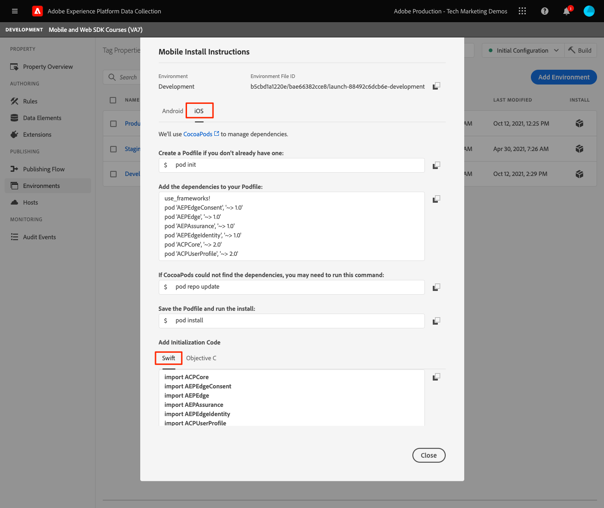

# Configurare una proprietà tag

Scopri come configurare una proprietà tag in [!UICONTROL Raccolta dati] di rete.

I tag in Adobe Experience Platform costituiscono la soluzione Adobe di nuova generazione per la gestione dei tag. I tag offrono ai clienti un modo semplice di implementare e gestire tutti i tag di analisi, marketing e annunci pubblicitari necessari per fornire ai clienti esperienze personalizzate significative. Ulteriori informazioni su [tag](https://experienceleague.adobe.com/docs/experience-platform/tags/home.html?lang=it) nella documentazione del prodotto.

## Prerequisiti

Per completare la lezione, è necessario disporre dell’autorizzazione per creare una proprietà tag. È inoltre utile avere una conoscenza di base dei tag.

>[!NOTE]
>
> Il platform launch (lato client) è ora [tag](https://experienceleague.adobe.com/docs/experience-platform/tags/home.html?lang=it)

## Finalità di apprendimento

In questa lezione verranno fornite le seguenti informazioni:

* Installa e configura le estensioni di tag per dispositivi mobili.
* Genera le istruzioni di installazione dell’SDK.

## Configurazione iniziale

1. Crea una nuova proprietà tag mobile:
   1. In [Interfaccia di Data Collection](https://experience.adobe.com/data-collection/){target="_blank"}, seleziona **[!UICONTROL Tag]** nel menu di navigazione a sinistra
   1. Seleziona **[!UICONTROL Nuova proprietà]**
      .
   1. Per **[!UICONTROL Nome]**, immetti `Mobile SDK Course`.
   1. Per **[!UICONTROL Piattaforma]**, seleziona **[!UICONTROL Dispositivi mobili]**.
   1. Seleziona **[!UICONTROL Salva]**.

      

      >[!NOTE]
      >
      > Le impostazioni di consenso predefinite per le implementazioni di Mobile Sdk basate su Edge, come quella che esegui in questa esercitazione, provengono da [!UICONTROL Estensione del consenso] e non il [!UICONTROL Privacy] nella configurazione della proprietà tag. Puoi aggiungere e configurare l’estensione di consenso più avanti in questa lezione. Per ulteriori informazioni, consulta [la documentazione](https://developer.adobe.com/client-sdks/documentation/privacy-and-gdpr/).

1. Apri la nuova proprietà
1. Creare una libreria:

   1. Vai a **[!UICONTROL Flusso di pubblicazione]** nel menu di navigazione a sinistra.
   1. Seleziona **[!UICONTROL Aggiungi libreria]**.

      

   1. Per **[!UICONTROL Nome]**, immetti `Initial Build`.
   1. Per **[!UICONTROL Ambiente]**, seleziona **[!UICONTROL Sviluppo]**.
   1. Seleziona  **[!UICONTROL Aggiungi tutte le risorse modificate]**.
   1. Seleziona **[!UICONTROL Salva e genera in sviluppo]**.

      

   1. Infine, impostalo come **[!UICONTROL Working Library]**.
      
1. Seleziona **[!UICONTROL Estensioni]**.

   Le estensioni Mobile Core e Profile devono essere preinstallate.

1. Seleziona **[!UICONTROL Catalogo]**.

   

1. Utilizza il [!UICONTROL Ricerca] per trovare e installare le seguenti estensioni. Nessuna di queste estensioni richiede alcuna configurazione:
   * Identità
   * AEP Assurance

## Configurazione dell&#39;estensione

1. Installare **Consenso** estensione.

   Ai fini del presente tutorial, seleziona **[!UICONTROL In sospeso]**. Ulteriori informazioni sull’estensione Consent in [la documentazione](https://developer.adobe.com/client-sdks/documentation/consent-for-edge-network/).

   

1. Installare **Adobe Experience Platform Edge Network** estensione.

   In **[!UICONTROL Configurazione Edge]** a discesa, seleziona lo stream di dati creato in [passaggio precedente](create-datastream.md).

1. Seleziona **[!UICONTROL Salva nella libreria e genera]**.

   

## Generare istruzioni di installazione SDK

1. Seleziona **[!UICONTROL Ambienti]**.

1. Seleziona la **[!UICONTROL Sviluppo]** icona di installazione.

   

1. Seleziona **[!UICONTROL iOS]**.

1. Seleziona **[!UICONTROL Swift]**.

   

1. Le istruzioni di installazione forniscono un buon punto di partenza per l’implementazione.

   Puoi trovare ulteriori informazioni [qui](https://developer.adobe.com/client-sdks/documentation/getting-started/get-the-sdk/).

   * **[!UICONTROL ID file ambiente]**: questo ID univoco punta all’ambiente di sviluppo, annota questo valore. Produzione/Staging/Sviluppo avranno tutti valori ID diversi.
   * **[!UICONTROL Podfile]**: i CocoaPod vengono utilizzati per gestire le versioni e i download dell’SDK. Per ulteriori informazioni, consulta [documentazione](https://cocoapods.org/).
   * **[!UICONTROL Codice di inizializzazione]**: questo blocco di codice mostra come importare gli SDK richiesti e registrare le estensioni all’avvio.

>[!NOTE]
>Le istruzioni di installazione devono essere considerate un punto di partenza e non una documentazione definitiva. Le versioni più recenti dell’SDK e gli esempi di codice sono disponibili nella [documentazione](https://developer.adobe.com/client-sdks/documentation/).

## Architettura dei tag per dispositivi mobili

Se conosci la versione web dei tag, precedentemente Launch, è importante comprendere le differenze su dispositivi mobili.

Sul web, viene eseguito il rendering di una proprietà tag in JavaScript che è poi (in genere) ospitato nel cloud. Viene fatto riferimento direttamente a tale file JS nel sito web.

In una proprietà di tag mobile, le regole e le configurazioni vengono sottoposte a rendering in file JSON ospitati nel cloud. I file JSON vengono scaricati e letti dall’estensione core per dispositivi mobili nell’app mobile. Le estensioni sono SDK separati che funzionano insieme. Se aggiungi un’estensione alla proprietà tag, devi aggiornare anche l’app. Se modifichi l’impostazione di un’estensione o crei una regola, tali modifiche vengono applicate nell’app dopo che la libreria di tag aggiornata è stata pubblicata.

Successivo: **[Installare gli SDK](install-sdks.md)**

>[!NOTE]
>
>Grazie per aver dedicato il tuo tempo all’apprendimento dell’SDK di Adobe Experience Platform Mobile. Se hai domande, vuoi condividere commenti generali o suggerimenti su contenuti futuri, condividili su questo [Experience League post di discussione community](https://experienceleaguecommunities.adobe.com/t5/adobe-experience-platform-launch/tutorial-discussion-implement-adobe-experience-cloud-in-mobile/td-p/443796)