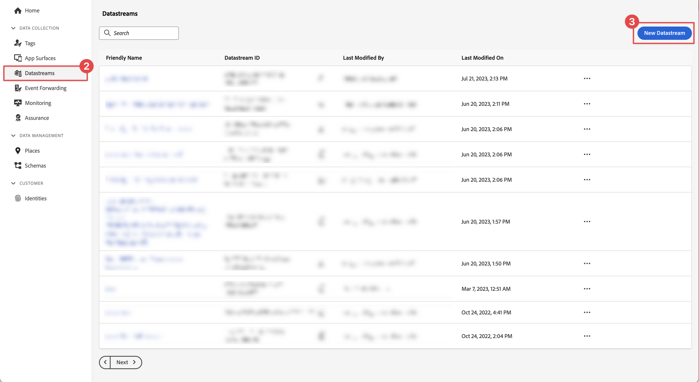

# Creare un flusso di dati

Scopri come creare uno stream di dati in Experience Platform.

Un flusso di dati è una configurazione lato server in Platform Edge Network. Lo stream di dati assicura che i dati in arrivo in Platform Edge Network vengano instradati in modo appropriato alle applicazioni e ai servizi Adobe Experience Cloud. Per ulteriori informazioni, consulta la [documentazione](https://experienceleague.adobe.com/en/docs/experience-platform/datastreams/overview) o questo [video](https://experienceleague.adobe.com/en/docs/platform-learn/data-collection/edge-network/configure-datastreams).

{zoomable="yes"}

## Prerequisiti

Per creare uno stream di dati, è necessario eseguire il provisioning della tua organizzazione per questa funzionalità nell&#39;interfaccia di raccolta dati (precedentemente [!UICONTROL Launch]) e disporre delle autorizzazioni utente per gestire e visualizzare gli stream di dati.

## Obiettivi di apprendimento

In questa lezione verranno fornite le seguenti informazioni:

* Sapere quando utilizzare un flusso di dati.
* Creare un flusso di dati.
* Configurare un flusso di dati.

## Creare un flusso di dati

È possibile creare gli stream di dati nell&#39;interfaccia [!UICONTROL Data Collection] utilizzando lo strumento di configurazione [!UICONTROL Datastream]. Per creare uno stream di dati:

1. Assicurati di trovarti nella sandbox di Experience Platform corretta, in quanto gli stream di dati sono definiti a livello di sandbox.
1. Seleziona **[!UICONTROL Datastreams]** nella barra a sinistra.
1. Seleziona **[!UICONTROL Nuovo flusso di dati]**.

   {zoomable="yes"}

1. Fornisci un **[!UICONTROL Nome]**, ad esempio `Luma Mobile App` e una **[!UICONTROL Descrizione]**, ad esempio `Datastream for Luma Mobile App`.

   >[!NOTE]
   >
   >Promemoria finale: se segui questa esercitazione con più persone su una singola sandbox o se utilizzi un account condiviso, puoi aggiungere o anteporre un’identificazione come parte delle convenzioni di denominazione. Ad esempio, anziché `Luma Mobile App Event Dataset`, utilizza `Luma Mobile App Event Dataset - Joe Smith`. Vedi anche la nota in [Panoramica](overview.md).

1. Selezionare lo schema creato nella lezione precedente dall&#39;elenco **Schema evento**.
1. Seleziona **[!UICONTROL Salva]**.

   {zoomable="yes"}

## Aggiungi servizi

Quando segui le lezioni (facoltative) [Analytics](analytics.md) e [Experience Platform](platform.md) in questa esercitazione, aggiungi servizi allo stream di dati in modo che i dati inviati a Platform Edge Network vengano inoltrati a queste applicazioni.

<!--

### Adobe Analytics

1. Select **[!UICONTROL Add Service]**.

1. Add **[!UICONTROL Adobe Analytics]** from the [!UICONTROL Service] list, 

1. Enter the name of the report site that you want to use in **[!UICONTROL Report Suite ID]**.

1. Enable the service by switching **[!UICONTROL Enabled]** on.

1. Select **[!UICONTROL Save]**.

   {zoomable="yes"}

### Adobe Experience Platform

You might also want to enable the Adobe Experience Platform service. 

>[!IMPORTANT]
>
>You can only enable the Adobe Experience Platform service when having created an event dataset. If you don't already have an event dataset created, follow the instructions [here](platform.md).

1. Click  **[!UICONTROL Add Service]** to add another service.

1. Select **[!UICONTROL Adobe Experience Platform]** from the [!UICONTROL Service] list.

1. Enable the service by switching **[!UICONTROL Enabled]** on.

1. Select the **[!UICONTROL Event Dataset]** that you created as part of the [Create a dataset](platform.md#create-a-dataset) instructions, for example **Luma Mobile App Event Dataset**

1. Select **[!UICONTROL Save]**.

   {zoomable="yes"}
1. The final configuration should look something like this.
   
   {zoomable="yes"}

-->

>[!NOTE]
>
>L’abilitazione di ciascuno dei servizi utilizzati dalla tua organizzazione garantisce che i dati raccolti nell’app mobile possano essere utilizzati ovunque. Per ulteriori informazioni, vedere [impostazioni dello stream di dati](https://experienceleague.adobe.com/en/docs/experience-platform/datastreams/overview).

Quando implementi Platform Mobile SDK nella tua app, devi creare tre flussi di dati da mappare ai tre ambienti di tag (sviluppo, stage e produzione). Se utilizzi Platform Mobile SDK con applicazioni basate su Platform, ad esempio Adobe Real-Time Customer Data Platform o Adobe Journey Optimizer, assicurati di creare tali flussi di dati nelle sandbox appropriate.

>[!SUCCESS]
>
>Ora disponi di un flusso di dati da utilizzare per il resto dell’esercitazione.
>
>Grazie per aver dedicato tempo all&#39;apprendimento di Adobe Experience Platform Mobile SDK. Se hai domande, vuoi condividere commenti generali o suggerimenti su contenuti futuri, condividili in questo [post di discussione della community Experience League](https://experienceleaguecommunities.adobe.com/t5/adobe-experience-platform-data/tutorial-discussion-implement-adobe-experience-cloud-in-mobile/td-p/443796)

Successivo: **[Configurare una proprietà tag](configure-tags.md)**
