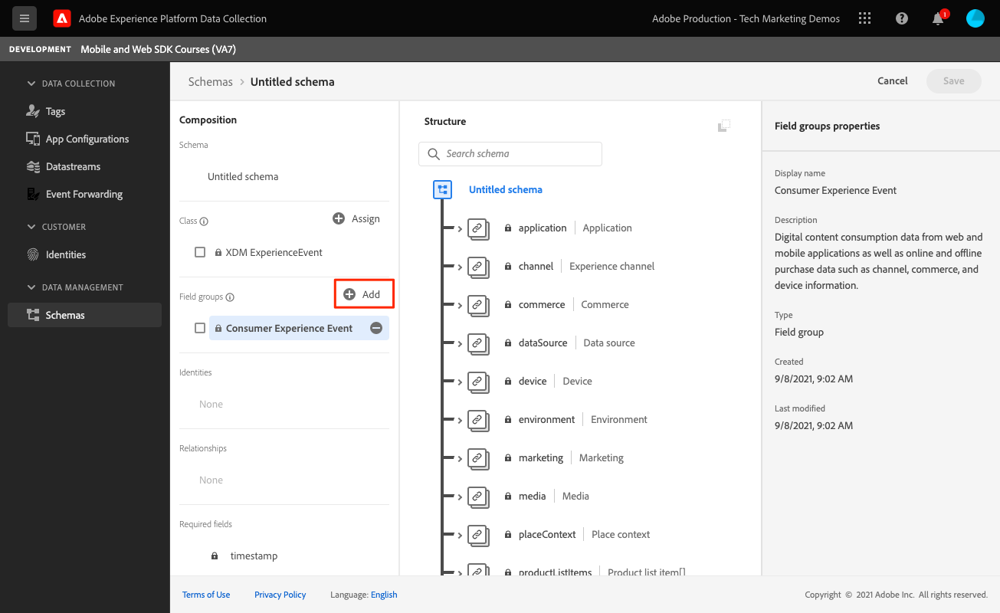

# Creare uno schema XDM

Scopri come creare uno schema XDM per gli eventi delle app mobili.

La standardizzazione e l&#39;interoperabilità sono concetti chiave alla base di Adobe Experience Platform. Experience Data Model (XDM), basato su un Adobe, è uno sforzo per standardizzare i dati sulla customer experience e definire schemi per la gestione della customer experience.

## Cosa sono gli schemi XDM?

XDM è una specifica documentata pubblicamente progettata per migliorare il potere delle esperienze digitali. Fornisce strutture e definizioni comuni che consentono a qualsiasi applicazione di comunicare con i servizi di Platform. Aderendo agli standard XDM, tutti i dati sulla customer experience possono essere incorporati in una rappresentazione comune che può fornire informazioni in modo più rapido e integrato. Puoi ottenere informazioni utili dalle azioni dei clienti, definire il pubblico dei clienti attraverso i segmenti ed esprimere gli attributi dei clienti a scopo di personalizzazione.

Experience Platform utilizza gli schemi per descrivere la struttura dei dati in modo coerente e riutilizzabile. Definendo i dati in modo coerente tra i diversi sistemi, diventa più facile mantenere il significato e quindi ottenere valore dai dati.

Prima di poter acquisire i dati in Platform, è necessario comporre uno schema per descrivere la struttura dei dati e fornire vincoli al tipo di dati che possono essere contenuti all’interno di ciascun campo. Gli schemi sono costituiti da una classe base e da zero o più gruppi di campi dello schema.

Per ulteriori informazioni sul modello di composizione dello schema, inclusi i principi di progettazione e le best practice, consulta la sezione [nozioni di base sulla composizione dello schema](https://experienceleague.adobe.com/docs/experience-platform/xdm/schema/composition.html?lang=it) o il corso [Modellare i dati sulla customer experience con XDM](https://experienceleague.adobe.com/?recommended=ExperiencePlatform-D-1-2021.1.xdm).

>[!TIP]
>
>Se conosci i requisiti di riferimento per la progettazione delle soluzioni (SDR, Solution Design Reference) di Analytics, puoi considerare uno schema come un DSP più affidabile.

## Prerequisiti

Per completare la lezione, è necessario disporre dell’autorizzazione per creare uno schema di Experience Platform.

## Finalità di apprendimento

In questa lezione:

* Creare uno schema nell’interfaccia Raccolta dati
* Aggiungi un gruppo di campi standard allo schema
* Creare e aggiungere un gruppo di campi personalizzato allo schema

## Passa agli schemi

1. Accedi ad Adobe Experience Cloud.

1. Apri il commutatore dell’app, quindi seleziona **[!UICONTROL Raccolta dati]**

   

1. Assicurati di essere nella sandbox di Experience Platform che stai utilizzando per questa esercitazione.

   >[!NOTE]
   >
   > Per questa esercitazione, i clienti di applicazioni basate su piattaforma come Real-time CDP devono utilizzare una sandbox di sviluppo. Altri clienti utilizzeranno la sandbox di produzione predefinita.

1. Seleziona **[!UICONTROL Schemi]** sotto **[!UICONTROL Gestione dati]**.

   

Ora ti trovi nella pagina principale degli schemi e ti viene presentato un elenco degli schemi esistenti. Puoi anche visualizzare le schede corrispondenti ai blocchi di base di uno schema:

* **Gruppi di campi** sono componenti riutilizzabili che definiscono uno o più campi per acquisire dati specifici, ad esempio dati personali, preferenze alberghiere o indirizzi.
* **Classi** definire gli aspetti comportamentali dei dati contenuti nello schema. Ad esempio: `XDM ExperienceEvent` acquisisce serie temporali, dati evento e `XDM Individual Profile` acquisisce i dati degli attributi relativi a una persona.
* **Tipi di dati** sono utilizzati come tipi di campi di riferimento in classi o gruppi di campi nello stesso modo dei campi letterali di base.

Le descrizioni di cui sopra sono una panoramica di alto livello. Per ulteriori dettagli, consulta la sezione [Blocchi di creazione dello schema](https://experienceleague.adobe.com/docs/platform-learn/tutorials/schemas/schema-building-blocks.html?lang=it) video o lettura [Nozioni di base sulla composizione dello schema](https://experienceleague.adobe.com/docs/experience-platform/xdm/schema/composition.html?lang=en) nella documentazione del prodotto.

In questa esercitazione, utilizzi il gruppo di campi Evento esperienza consumatore e creane uno personalizzato per illustrare il processo.

>[!NOTE]
>
>Adobe continua ad aggiungere gruppi di campi più standard e dovrebbero essere utilizzati ogni volta che possibile, in quanto questi campi sono implicitamente compresi dai servizi Experience Platform e forniscono una maggiore coerenza quando utilizzati tra i componenti di Platform. L’utilizzo di gruppi di campi standard offre vantaggi tangibili, come la mappatura automatica nelle funzioni di Analytics e AI in Platform.

## Architettura dello schema dell’app Luma

In uno scenario reale, il processo di progettazione dello schema potrebbe essere simile al seguente:

* Raccogli i requisiti aziendali.
* Trova gruppi di campi predefiniti per soddisfare il maggior numero possibile di requisiti.
* Crea gruppi di campi personalizzati per eventuali spazi vuoti.

A scopo di apprendimento, utilizzerai gruppi di campi predefiniti e personalizzati.

* **Evento esperienza consumatore**: Gruppo di campi predefinito con molti campi comuni.
* **Informazioni app**: Gruppo di campi personalizzato progettato per simulare i concetti di TrackState/TrackAction Analytics.

<!--Later in the tutorial, you can [update the schema](lifecycle-data.md) to include the **[!UICONTROL AEP Mobile Lifecycle Details]** field group.-->

## Creare uno schema

1. Seleziona **[!UICONTROL Crea schema]** per visualizzare il menu a discesa delle opzioni, seleziona **[!UICONTROL ExperienceEvent XDM]**.

   

1. Cerca `Consumer Experience Event`.

1. È possibile visualizzare in anteprima i campi e/o leggere la descrizione per ulteriori dettagli prima di selezionare.

1. Seleziona la casella di controllo e quindi **[!UICONTROL Aggiungi gruppi di campi]**.

   

   Viene visualizzata nuovamente la schermata di composizione dello schema principale, in cui sono presenti tutti i campi disponibili.

1. Assegna un nome allo schema selezionando **[!UICONTROL Schema senza titolo]** dall&#39;alto a sinistra e quindi fornire un **[!UICONTROL Nome visualizzato]** &amp; **[!UICONTROL Descrizione]**, ad esempio `Luma Tutorial Mobile` e `"Luma App" schema for Adobe Tutorial`

1. Seleziona **[!UICONTROL Salva]**.

   

>[!NOTE]
>
>Non è necessario utilizzare tutti i campi di un gruppo. Se utile, puoi considerare uno schema come un livello di dati vuoto. Nell’app, compila i valori rilevanti al momento opportuno.
>
>La `Consumer Experience Event` ha un tipo di dati denominato `Web information`, che descrive eventi quali la visualizzazione della pagina e i clic sui collegamenti. Al momento della scrittura, non esiste una parità tra app mobili per questa funzione, quindi creerai una tua.

## Creare un tipo di dati personalizzato

Per iniziare, crea un tipo di dati personalizzato che descrive i due eventi:

* Vista a schermo
* Interazione app

1. Seleziona la **[!UICONTROL Tipi di dati]** , quindi seleziona **[!UICONTROL Crea tipo di dati]**.

   

1. Dagli un **[!UICONTROL Nome visualizzato]** e **[!UICONTROL Descrizione]**, ad esempio `App Information` e `Custom data type describing "Screen Views" & "App Actions"`

   

   >[!TIP]
   >
   > Usa sempre descrittivo e leggibile [!UICONTROL nomi visualizzati] per i campi personalizzati, in quanto questa pratica li rende più accessibili agli addetti al marketing quando i campi si trovano in servizi a valle, come il generatore di segmenti.

1. Per aggiungere un campo, seleziona il pulsante (+) .

   Questo campo è un oggetto contenitore per l’interazione con l’app. Dagli una cassa di cammello **[!UICONTROL Nome campo]** `appInteraction`, **[!UICONTROL nome visualizzato]** `App Interaction`e **[!UICONTROL type]** `Object`.

1. Seleziona **[!UICONTROL Applica]**.

   

1. Per misurare la frequenza con cui si è verificata un’azione, aggiungi un campo selezionando il pulsante (+) accanto al `appInteraction` oggetto creato.

1. Dagli una cassa di cammello **[!UICONTROL Nome campo]** `appAction`, **[!UICONTROL nome visualizzato]** di `App Action` e **[!UICONTROL type]** `Measure`.

   Questo passaggio è l’equivalente di un evento di successo in Adobe Analytics.

1. Seleziona **[!UICONTROL Applica]**.

   

1. Aggiungi un campo che descrive il tipo di interazione selezionando il pulsante (+) accanto al `appInteraction` oggetto.

1. Dagli un **[!UICONTROL Nome campo]** `name`, **[!UICONTROL nome visualizzato]** di `Name` e **[!UICONTROL type]** `String`.

   Questo passaggio è l’equivalente di una dimensione in Adobe Analytics.

   

1. Scorri fino alla parte inferiore della barra a destra e seleziona **[!UICONTROL Applica]**.

1. Seguire lo stesso pattern per creare un `appStateDetails` oggetto contenente un campo di misura denominato `screenView` e due stringhe denominate `screenName` e `screenType`.

1. Seleziona **[!UICONTROL Salva]**.

   

## Aggiungi un gruppo di campi personalizzato

Aggiungi ora un gruppo di campi personalizzato utilizzando il tipo di dati personalizzato:

1. Apri lo schema creato in precedenza in questa lezione.

1. Seleziona **[!UICONTROL Aggiungi]** accanto a **[!UICONTROL Gruppi di campi]**.

   

1. Questa volta è possibile creare un gruppo di campi personalizzato selezionando **[!UICONTROL Crea nuovo gruppo di campi]** pulsante di scelta accanto alla parte superiore, quindi fornisci un nome e una descrizione, ad esempio, `App Interactions` e `Fields for app interactions`.

   

1. Dalla schermata di composizione principale, aggiungi un campo alla directory principale dello schema.

1. Seleziona il (+) accanto al nome dello schema.

1. Nella barra a destra, fornisci un **[!UICONTROL Nome campo]** di `appInformation`, un nome visualizzato di `App Information`.

1. Seleziona `App Information` dal **[!UICONTROL Tipo]** a discesa, il tipo di dati creato nell&#39;esercizio precedente.

1. Seleziona **[!UICONTROL Applica]**.

   

>[!NOTE]
>
>I gruppi di campi personalizzati vengono sempre inseriti sotto l&#39;identificatore dell&#39;organizzazione Experience Cloud.
>
>`_techmarketingdemos` viene sostituito con il valore univoco dell&#39;organizzazione.

Ora disponi di uno schema da utilizzare per il resto dell’esercitazione.

Avanti: **[Crea un [!UICONTROL datastream]](create-datastream.md)**

>[!NOTE]
>
>Grazie per aver investito il tuo tempo nell&#39;apprendimento dell&#39;SDK di Adobe Experience Platform Mobile. In caso di domande, se desideri condividere feedback generali o se hai suggerimenti su contenuti futuri, condividi questi su questo [Experience League Articolo di discussione della Comunità](https://experienceleaguecommunities.adobe.com/t5/adobe-experience-platform-launch/tutorial-discussion-implement-adobe-experience-cloud-in-mobile/td-p/443796)