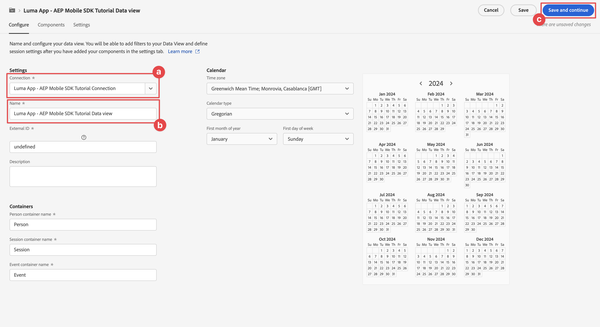
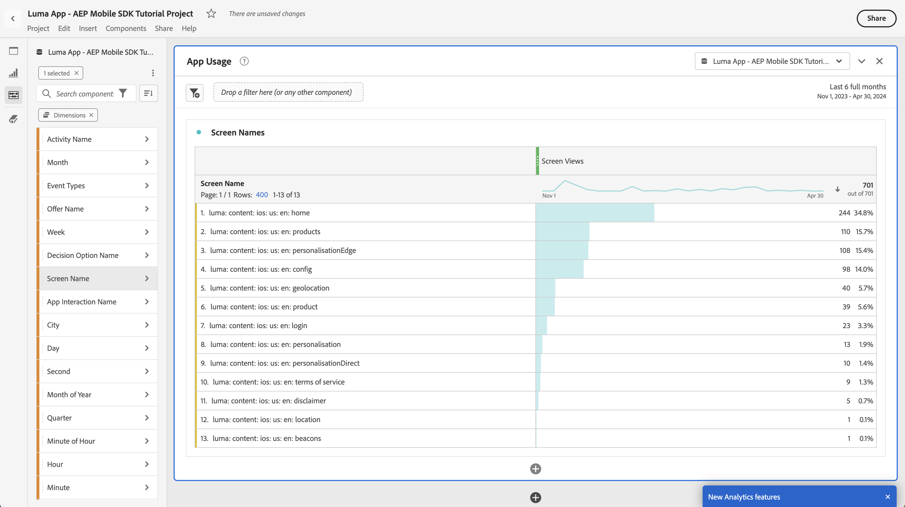

# Generare rapporti e analizzare con Customer Journey Analytics

Scopri come segnalare e analizzare le interazioni dell’app mobile con Customer Journey Analytics.

I dati degli eventi delle app mobili, che hai raccolto e inviato a Platform Edge Network nelle lezioni precedenti, vengono inoltrati ai servizi configurati nello stream di dati. Se hai seguito la lezione [Invia dati ad Experience Platform](platform.md), questi dati vengono ora memorizzati in un set di dati di Experience Platform e sono disponibili per Customer Journey Analytics per l&#39;utilizzo a scopo di reporting e analisi.

A differenza di Adobe Analytics, Customer Journey Analytics *utilizza* dati dei set di dati creati in Experience Platform. I dati non vengono inviati direttamente a Customer Journey Analytics utilizzando Adobe Experience Platform Mobile SDK, ma vengono inviati a set di dati. Le connessioni vengono quindi configurate in Customer Journey Analytics per selezionare i set di dati da utilizzare nei progetti di reporting e analisi.

Questa lezione nell’esercitazione si concentra sul reporting e l’analisi dei dati acquisiti dall’app di esercitazione Luma. Una delle funzionalità esclusive di Customer Journey Analytics è la combinazione di dati provenienti da più origini (CRM, punto vendita, applicazione fedeltà, call center) e canali (web, mobile, offline) per ottenere informazioni approfondite sui percorsi dei clienti. Questa capacità va oltre lo scopo di questa lezione. Per ulteriori informazioni, vedere [Panoramica di Customer Journey Analytics](https://experienceleague.adobe.com/it/docs/analytics-platform/using/cja-overview/cja-overview).

## Prerequisiti

È necessario eseguire il provisioning della tua organizzazione e concedere l’autorizzazione per Customer Journey Analytics. È necessario disporre dell&#39;accesso amministratore a Customer Journey Analytics.

## Obiettivi di apprendimento

In questa lezione verranno fornite le seguenti informazioni:

- Crea una connessione per definire i set di dati da Experience Platform che desideri utilizzare in Customer Journey Analytics.
- Creare una visualizzazione dati per preparare i dati dai set di dati per le attività di reporting e analisi
- Crea un progetto per creare rapporti e visualizzazioni in modo da poter analizzare i dati dalla tua app mobile.

La sequenza è intenzionale. Le connessioni utilizzano i set di dati, mentre le visualizzazioni dati utilizzano le connessioni.

## Creare una connessione

Una connessione in Customer Journey Analytics definisce i set di dati (e i dati all’interno di tali set) di Experience Platform che desideri utilizzare per il reporting e l’analisi.

1. Passa all&#39;interfaccia di Customer Journey Analytics utilizzando il menu App  in alto a destra.

1. Seleziona **[!UICONTROL Connessioni]** dalla barra dei menu superiore.

1. Assicurarsi di selezionare la scheda **[!UICONTROL Elenco]** nell&#39;interfaccia Connessioni. Viene visualizzato un elenco delle connessioni esistenti.

1. Selezionare **[!UICONTROL Crea nuova connessione]**.

1. Nella schermata **[!UICONTROL Connessioni]** > **[!UICONTROL Connessione senza titolo]**, in **[!UICONTROL Impostazioni connessione]**

   1. Immettere un **[!UICONTROL nome connessione]**, ad esempio `Luma App - AEP Mobile SDK Tutorial Connection`.
   2. Immettere una **[!UICONTROL descrizione connessione]**, ad esempio `Connection for the Luma app used in the AEP Mobile SDK tutorial`.

      In **[!UICONTROL Impostazioni dati]**:

   3. Seleziona la sandbox utilizzata per raccogliere i dati dell&#39;app mobile, ad esempio **[!UICONTROL Corsi per dispositivi mobili e SDK Web]**.
   4. Seleziona **[!UICONTROL meno di 1 milione]** dal **[!UICONTROL numero medio di eventi giornalieri]**.

   5. Seleziona **[!UICONTROL Aggiungi set di dati]** per selezionare i set di dati da Experience Platform che desideri utilizzare in Customer Journey Analytics.

      {zoomable="yes"}

   6. Nella procedura guidata **[!UICONTROL Aggiungi set di dati]**, **[!UICONTROL Seleziona set di dati]** passaggio,

      1. Seleziona i seguenti set di dati:

         - **[!UICONTROL Set di dati evento app mobile Luma]**, il set di dati creato come parte della sezione [Creare un set di dati](platform.md#create-a-dataset) nella lezione di Experience Platform.
         - **[!UICONTROL ODE DecisionEvents - *nome sandbox*] decisioning**
         - **[!UICONTROL Set di dati evento di tracciamento push AJO]**

      1. Seleziona **[!UICONTROL Avanti]**.

         {zoomable="yes"}

   7. Nel passaggio **[!UICONTROL Aggiungi set di dati]**, **[!UICONTROL Impostazioni set di dati]**, è necessario definire i dettagli per ciascuno dei set di dati evento.
      1. Per una configurazione corretta, consultare le tabelle seguenti:

         | Set di dati | ID persona ① | Timestamp ② | ③ del tipo di origine dati | Importa tutti i nuovi ④ dati | Recupera tutti i dati esistenti ⑤ |
         |---|---|---|---|---|---|
         | Set di dati evento app mobile Luma | identityMap | timestamp | Dati app mobili | abilita | abilita |
         | ODE DecisionEvents - *nome sandbox* decisioning | identityMap | timestamp | Dati app mobili | abilita | abilita |
         | Set di dati evento di tracciamento push di AJO | identityMap | timestamp | Dati app mobili | abilita | abilita |

      1. Seleziona **[!UICONTROL Aggiungi set di dati]**.

         {zoomable="yes"}

1. Tornando alle **[!UICONTROL Connessioni]** > **[!UICONTROL App Luma - Connessione esercitazione AEP Mobile SDK]**, seleziona **[!UICONTROL Salva]** per salvare la connessione.

   {zoomable="yes"}

Ora hai definito la connessione e Customer Journey Analytics aggiunge i dati dei set di dati al proprio database interno. Questa raccolta di dati può richiedere un po’ di tempo, a seconda della quantità di dati. Per l’app di esercitazione, attendi un paio d’ore prima che i dati vengano visualizzati in Customer Journey Analytics.

Per visualizzare lo stato della connessione:

1. Seleziona **[!UICONTROL Connessioni]** nell&#39;interfaccia principale di Customer Journey Analytics.
1. Seleziona il nome della connessione, ad esempio **[!UICONTROL App Luma - Connessione esercitazione SDK mobile AEP]**.

In **[!UICONTROL Connessioni]** > **[!UICONTROL App Luma - Connessione esercitazione SDK mobile AEP]**, vedi:

1. Informazioni sui record totali aggiunti, sui record ignorati e sui record eliminati. Accertati di selezionare **[!UICONTROL Tutti i set di dati]** e di selezionare un periodo di tempo appropriato per visualizzare i dettagli della connessione. È possibile utilizzare  per aprire una finestra di dialogo e selezionare il periodo di tempo.
1. Informazioni per singoli set di dati su record aggiunti, record saltati, record eliminati e altro ancora.

   {zoomable="yes"}

## Creare una visualizzazione dati

Dopo aver aggiunto i record dai set di dati a Customer Journey Analytics, puoi creare una visualizzazione dati per definire i componenti dei dati sui quali desideri creare un rapporto.

Una visualizzazione dati è un contenitore specifico di Customer Journey Analytics che consente di determinare come interpretare i dati di una connessione. Puoi configurare campi standard e di schema da qualsiasi set di dati definito nella Connessione come componenti (dimensioni, metriche) in Analysis Workspace.

Una visualizzazione dati in Customer Journey Analytics offre un’enorme flessibilità per configurare e definire correttamente i dati dalla connessione. In questo tutorial utilizzi solo la funzionalità necessaria per le attività di reporting e analisi. Per ulteriori informazioni, vedi [Visualizzazioni dati](https://experienceleague.adobe.com/it/docs/analytics-platform/using/cja-dataviews/data-views).

Per creare la visualizzazione dati:

1. Passa all&#39;interfaccia di Customer Journey Analytics utilizzando il menu App  in alto a destra.

1. Seleziona **[!UICONTROL Visualizzazioni dati]** dalla barra dei menu superiore.
1. Selezionare **[!UICONTROL Crea nuova visualizzazione dati]**.
1. In **[!UICONTROL Visualizzazioni dati >]**, verificare che la scheda **[!UICONTROL Configura]** sia selezionata.

   1. Seleziona la tua connessione dall&#39;elenco a discesa Connessione impostazioni, ad esempio **[!UICONTROL App Luma - Connessione esercitazione AEP Mobile SDK]**.
   1. Immettere un nome per la visualizzazione dati, ad esempio: `Luma App - AEP Mobile SDK Tutorial Data view`.
   1. Seleziona **[!UICONTROL Salva e continua]**.

      {zoomable="yes"}

1. Nella scheda **[!UICONTROL Components]** della **[!UICONTROL app Luma - visualizzazione dati dell&#39;esercitazione di AEP Mobile SDK]**, puoi definire le metriche e la dimensione da utilizzare per la generazione di rapporti nell&#39;app mobile. Per impostazione predefinita, per la visualizzazione dati sono già configurate diverse metriche e dimensioni standard (con riferimento congiunto a un componente). Tuttavia, la visualizzazione dati richiede più componenti.  Per aggiungere un campo schema dallo schema definito in precedenza o da schemi predefiniti (vedere [Creare uno schema](create-schema.md) lezione), come componente (dimensione o metrica):

   1. Trova il campo schema:

      - cercare il componente utilizzando il campo di ricerca  ***[!UICONTROL Cerca campi schema]***. Ad esempio, `productListAdd` oppure

        {zoomable="yes"}

      - Scorri verso il basso fino al campo dello schema all&#39;interno di  **[!UICONTROL Set di dati evento]** .  Ad esempio,  **[!UICONTROL Set di dati evento]**   **[!UICONTROL commerce]**   **[!UICONTROL productListAdds]** 

        {zoomable="yes"}

   1. Trascina il campo dello schema specifico dal riquadro Campi schema e rilascialo nell&#39;elenco **[!UICONTROL METRICHE]** o **[!UICONTROL DIMENSIONI]** nel riquadro [!UICONTROL Componenti inclusi].

      {zoomable="yes"}

   1. È possibile configurare le impostazioni di un componente. Seleziona il componente e configura le impostazioni nel riquadro a destra.  Ad esempio, è possibile rinominare **[!UICONTROL commerce.productListAdds]** in `Product Add To Lists` utilizzando il campo **[!UICONTROL IMPOSTAZIONI COMPONENTE]** > **[!UICONTROL Nome componente]** nel riquadro di destra.

      {zoomable="yes"}

      Oppure configura **[!UICONTROL INCLUDE EXCLUDE VALUES]**.

      {zoomable="yes"}

   1. Dopo aver compreso come aggiungere campi alla visualizzazione dati e configurare il componente risultante, utilizza le tabelle seguenti per un elenco di campi schema da aggiungere come metriche o dimensioni. Utilizza il valore della colonna **Percorso schema** dalla tabella seguente per cercare o scorrere fino al campo dello schema specifico. Una volta aggiunte le metriche e le dimensioni, controlla nella tabella il valore della colonna **Impostazioni componente** per verificare se sono necessarie impostazioni specifiche per un componente, come il suo **[!UICONTROL Nome componente]** o la definizione di **[!UICONTROL INCLUDI VALORI ESCLUSI]**.

      **METRICHE**

      | Nome componente | Set di dati | Tipo di dati dello schema | Percorso schema | Impostazioni dei componenti |
      |---|---|---|---|---|
      | Ignora | Set di dati evento esperienza tracciamento push AJO, set di dati evento app mobile Luma | Intero | _experience.decisioning. propositionEventType.dismiss | Nome componente: `Dismiss` |
      | Annulla iscrizione | Set di dati evento esperienza tracciamento push AJO, set di dati evento app mobile Luma | Intero | _experience.decisioning. propositionEventType.unsubscribe | Nome componente: `Unsubscribe` |
      | Trigger | Set di dati evento esperienza tracciamento push AJO, set di dati evento app mobile Luma | Intero | _experience.decisioning. propositionEventType.trigger | Nome componente: `Trigger` |
      | Visualizzazione | Set di dati evento esperienza tracciamento push AJO, set di dati evento app mobile Luma | Intero | _experience.decisioning. propositionEventType.display | Nome componente: `Display` |
      | Invia | Set di dati evento esperienza tracciamento push AJO, set di dati evento app mobile Luma | Intero | _experience.decisioning. propositionEventType.send | Nome componente: `Send` |
      | Interagisci | Set di dati evento esperienza tracciamento push AJO, set di dati evento app mobile Luma | Intero | _experience.decisioning. propositionEventType.interact | Nome componente: `Interact` |
      | Eventi di posizione | Set di dati evento esperienza tracciamento push di AJO, set di dati evento app mobile Luma, eventi decisionali ODE - decisioning per dispositivi mobili e web-sdk-corsi | Stringa | Tipo evento | Nome componente: `Location Events`  {zoomable="yes"} |
      | Visualizzazioni prodotto | Set di dati evento app mobile Luma | Doppio | commerce.productViews.value | Nome componente: `Product Views` |
      | Aggiunta di prodotti agli elenchi | Set di dati evento app mobile Luma | Doppio | commerce.productListAdds.value | Nome componente: `Product Add To Lists` |
      | Acquisti | Set di dati evento app mobile Luma | Doppio | commerce.purchases.value | Nome componente: `Purchases` |
      | Salva per dopo | Set di dati evento app mobile Luma | Doppio | commerce.saveForLaters.value | Nome componente: `Save For Laters` |
      | Interazioni app | Set di dati evento app mobile Luma | Doppio | _techmarketingdemos.appInformation. appInteraction.appAction.value | Nome componente: `App Interactions` |
      | Visualizzazioni schermo | Set di dati evento app mobile Luma | Doppio | _techmarketingdemos.appInformation. appStateDetails.screenView.value | Nome componente: `Screen Views` |

      {style="table-layout:auto"}

      >[!NOTE]
      >
      >Nota come il campo schema per la metrica Eventi posizione utilizza **[!UICONTROL INCLUDE EXCLUDE VALUES]** per contare i tipi di evento che contengono `location`.

      La configurazione della visualizzazione dati per **[!UICONTROL METRICS]** deve corrispondere di seguito dopo aver aggiunto tutti i campi schema della tabella precedente come componente metrica:

      {zoomable="yes"}

      **DIMENSIONI**

      | Nome componente | Set di dati | Tipo di dati dello schema | Percorso schema | Impostazioni dei componenti |
      |---|---|---|---|---|
      | Città | Set di dati evento esperienza tracciamento push AJO, set di dati evento app mobile Luma | Stringa | placeContext.geo.city | Nome componente: `City` |
      | Tipi di evento | Set di dati evento esperienza tracciamento push di AJO, set di dati evento app mobile Luma, eventi decisionali ODE - decisioning per dispositivi mobili e web-sdk-corsi | Stringa | eventType | Nome componente: `Event Types` |
      | Nome opzione di decisione | Set di dati evento esperienza tracciamento push di AJO, set di dati evento app mobile Luma, eventi decisionali ODE - decisioning per dispositivi mobili e web-sdk-corsi | Stringa | _experience.decisioning. propositions.items.name | Nome componente: `Decision Option Name` |
      | Nome interazione app | Set di dati evento app mobile Luma | Stringa | _techmarketingdemos.appInformation. appInteraction.name | Nome componente: `App Interaction Name` |
      | Nome visualizzato | Set di dati evento app mobile Luma | Stringa | _techmarketingdemos.appInformation. appStateDetails.screenName | Nome componente: `Screen Name` |
      | Nome attività | ODE DecisionEvents - mobile-and-web-sdk-courses decisioning | Stringa | _experience.decisioning. propositionDetails.activity.name | Nome componente: `Activity Name` |
      | Nome offerta | ODE DecisionEvents - mobile-and-web-sdk-courses decisioning | Stringa | _experience.decisioning. propositionDetails.selections.name | Nome componente: `Offer Name` |

      {style="table-layout:auto"}

      La configurazione della visualizzazione dati per **[!UICONTROL DIMENSIONI]** deve corrispondere di seguito dopo aver aggiunto tutti i campi dello schema della tabella precedente come componente dimensione:

      {zoomable="yes"}

   1. Seleziona **[!UICONTROL Salva e continua]**.

1. La scheda **[!UICONTROL Impostazioni]** della **[!UICONTROL App Luma - AEP Mobile SDK Tutorial Data view]** consente di configurare filtri e impostazioni di sessione. Per questa esercitazione, non è richiesta alcuna configurazione aggiuntiva.

   - Seleziona **[!UICONTROL Salva e termina]**.

Hai definito la tua visualizzazione dati e tutto è pronto per iniziare a creare rapporti e visualizzazioni.

## Creare un progetto

I progetti Workspace vengono utilizzati in Customer Journey Analytics per creare rapporti e visualizzazioni. Ci sono molte possibilità per creare rapporti completi e visualizzazioni coinvolgenti, ma questo esula dall&#39;ambito di questa esercitazione. Per ulteriori informazioni, vedere [Panoramica di Workspace](https://experienceleague.adobe.com/it/docs/customer-journey-analytics-learn/tutorials/analysis-workspace/workspace-projects/analysis-workspace-overview) e [Creare un nuovo progetto](https://experienceleague.adobe.com/it/docs/customer-journey-analytics-learn/tutorials/analysis-workspace/workspace-projects/build-a-new-project).

In questa sezione della lezione, crei un progetto che mostra rapporti e visualizzazioni su:

- Utilizzo app: utilizzo delle informazioni visualizzate sullo schermo e delle interazioni app.
- Commerce: utilizzando gli eventi di e-commerce, come la visualizzazione prodotto, aggiungi al carrello e acquista.
- Offerte: utilizzando le offerte visualizzate nell’app.
- Visite allo store: utilizzando gli eventi di recinto geografico (simulati) dell’app.

Per creare il progetto:

1. Passa all&#39;interfaccia di Customer Journey Analytics utilizzando il menu App  in alto a destra.

1. Seleziona **[!UICONTROL Workspace]** dalla barra dei menu superiore.

1. Seleziona **[!UICONTROL Crea progetto]**.

   1. Seleziona **[!UICONTROL Progetto Workspace vuoto]** dalla finestra di dialogo a comparsa.

   1. Seleziona **[!UICONTROL Crea]**.

      {zoomable="yes"}

1. Ti viene presentata l&#39;interfaccia **[!UICONTROL Nuovo progetto]**. In questa interfaccia puoi creare rapporti e visualizzazioni.

1. Selezionare il nome del progetto (**[!UICONTROL Nuovo progetto]**) e specificare il proprio nome per il progetto. Ad esempio, `Luma App - AEP Mobile SDK Tutorial Project`.
   {zoomable="yes"}

1. Per salvare il progetto, selezionare **[!UICONTROL Progetto]** > **[!UICONTROL Salva]**.
   {zoomable="yes"}

1. Nella finestra di dialogo **[!UICONTROL Salva]**, ignora tutti gli altri campi e seleziona **[!UICONTROL Salva]**.
   {zoomable="yes"}

>[!IMPORTANT]
>
>   Ricorda di salvare il progetto regolarmente, altrimenti le modifiche andranno perse. Puoi salvare rapidamente il progetto utilizzando **[!UICONTROL ctrl + s]** (Windows) o **[!UICONTROL ⌘(cmd) + s]** (macOS).

Ora hai configurato il progetto. Per impostazione predefinita, viene fornita una tabella a forma libera. Prima di aggiungere i componenti, assicurati che il pannello a forma libera utilizzi la visualizzazione dati e il periodo di tempo corretti.

1. Seleziona la visualizzazione dati dall’elenco a discesa. Ad esempio, **[!UICONTROL App Luma - AEP Mobile SDK Tutorial Data view]**. Se la visualizzazione dati non è visibile nell&#39;elenco, selezionare **[!UICONTROL Mostra tutto]** nella parte inferiore dell&#39;elenco a discesa.
   {zoomable="yes"}

1. Per definire il periodo di tempo appropriato per il pannello, seleziona il predefinito predefinito predefinito **[!UICONTROL Questo mese]** immetti una data di inizio e una data di fine personalizzate oppure utilizza un **[!UICONTROL predefinito]** (come **[!UICONTROL Ultimi 6 mesi interi]**) e seleziona **[!UICONTROL Applica]**.
   {zoomable="yes"}

### Utilizzo app

Ora puoi creare un rapporto sull’utilizzo dell’app. Hai aggiunto il codice necessario nell&#39;app per registrare le interazioni dell&#39;app e quali schermate vengono utilizzate nell&#39;app (consulta la lezione [Traccia eventi](events.md)) e ora desideri creare un rapporto su questi dati.

#### Nomi schermo

Per creare rapporti sugli schermi visualizzati nell’app:

1. Rinomina il pannello **[!UICONTROL Freeform]** in `App Usage`.

1. Rinomina la **[!UICONTROL tabella a forma libera]** in `Screen Names`.

1. Seleziona **[!UICONTROL Mostra tutti]** sotto l&#39;elenco **[!UICONTROL METRICHE]**.

1. Trascina e rilascia il componente **[!UICONTROL Visualizzazioni schermo]** in [!UICONTROL _Rilascia qui (o in qualsiasi altro componente **)**&#x200B;una_ metrica].
   {zoomable="yes"}
La tabella a forma libera ora mostra le visualizzazioni dello schermo per ogni giorno per il periodo di tempo selezionato. Tuttavia, vuoi mostrare il numero di visualizzazioni dello schermo per ciascuna delle diverse schermate utilizzate nell’app.

1. Per visualizzare l&#39;elenco di componenti **[!UICONTROL DIMENSIONS]**, seleziona  per rimuovere il filtro  **[!UICONTROL Metrics]** dalla barra dei componenti.
   {zoomable="yes"}

1. Seleziona **[!UICONTROL Mostra tutti]** sotto l&#39;elenco **[!UICONTROL DIMENSIONI]**.

1. Trascina e rilascia il componente **[!UICONTROL Nome schermo]** nell&#39;intestazione **[!UICONTROL Giorno]**. L&#39;operazione mostra  **[!UICONTROL Replace]** per indicare la sostituzione della dimensione.
   {zoomable="yes"}

La prima tabella a forma libera nel report è stata completata.

{zoomable="yes"}

>[!NOTE]
>
>Salva il progetto prima di procedere.

#### Interazioni app

Successivamente, creerai una tabella a forma libera per segnalare il modo in cui gli utenti hanno interagito con l’app.

1. Seleziona  e dalla finestra a comparsa  per aggiungere una nuova tabella a forma libera.
   {zoomable="yes"}

1. Rinomina **[!UICONTROL Tabella a forma libera (2)]** in `App Interactions`.

1. Trascina e rilascia la metrica **[!UICONTROL Interazioni app]** su [!UICONTROL _Rilascia una **metrica**&#x200B;qui (o qualsiasi altro componente_)].

1. Trascina e rilascia la dimensione **[!UICONTROL Nome interazione app]** nell&#39;intestazione **[!UICONTROL Day]** per sostituire questa dimensione.

Il secondo rapporto è ora pronto e mostra le interazioni dell’app.
{zoomable="yes"}

Le informazioni sono limitate principalmente perché hai implementato `MobileSDK.shared.sendAppInteractionEvent(actionName: "<actionName>")` chiamate API solo nella schermata di accesso. Se aggiungi questa chiamata API a più schermate dell’app, il rapporto diventa più informativo.

>[!NOTE]
>
>Salva il progetto prima di procedere.

### Commerce

Ora vuoi segnalare, in un pannello separato, gli eventi di e-commerce che si verificano nell’app.

#### Eventi Commerce

1. Per creare un nuovo pannello, seleziona  all&#39;esterno del pannello [!UICONTROL Utilizzo app] corrente.
   {zoomable="yes"}

1. Assicurati di selezionare il periodo di tempo appropriato.

1. Seleziona  **[!UICONTROL Tabella a forma libera]** per creare una nuova tabella a forma libera.
   {zoomable="yes"}

1. Rinomina **[!UICONTROL Pannello]** in `Commerce`.

1. Rinomina **[!UICONTROL Tabella a forma libera]** in `Commerce Events`.

1. Trascina e rilascia la metrica **[!UICONTROL Visualizzazioni prodotto]** su [!UICONTROL _Rilascia una **metrica**&#x200B;qui (o qualsiasi altro componente_)].

1. Trascina e rilascia la metrica **[!UICONTROL Product Add To Lists]** a destra della colonna **[!UICONTROL Product Views]** per inserire questa colonna nella tabella a forma libera. Accertati che **[!UICONTROL + Add]** (in blu) sia visualizzato durante l&#39;inserimento della colonna.
   {zoomable="yes"}

1. Ripeti il passaggio precedente per aggiungere la metrica **[!UICONTROL Salva per dopo]** e la metrica **[!UICONTROL Acquisti]** alla tabella a forma libera.

1. Trascina e rilascia la dimensione **[!UICONTROL Mese]** sopra la dimensione **[!UICONTROL Giorno]** per cambiare il reporting da giornaliero a mensile.

Il rapporto Eventi Commerce è stato completato.

{zoomable="yes"}

>[!NOTE]
>
>Salva il progetto prima di procedere.

#### Fallout

Ora creerai una visualizzazione dell’abbandono per il funnel commerce che mostra quanti utenti che hanno visualizzato i prodotti hanno aggiunto questi prodotti al carrello e, da lì, quanti utenti hanno salvato questi prodotti per dopo.

1. Seleziona  nel pannello **[!UICONTROL Commerce]** e dal popup seleziona  (che rappresenta la visualizzazione Abbandono).

1. Seleziona **[!UICONTROL Visualizzazioni prodotto]** dall&#39;elenco a discesa [!UICONTROL *Aggiungi punto di contatto*].
   {zoomable="yes"}
In alternativa, puoi trascinare la dimensione **[!UICONTROL Visualizzazione prodotti]** sotto la dimensione **[!UICONTROL Tutte le persone]** nella visualizzazione **[!UICONTROL Abbandono]**.

1. Ripeti il passaggio precedente per le dimensioni **[!UICONTROL Product Add To Lists]** e **[!UICONTROL Purchases]**.

Il rapporto di visualizzazione Abbandono è stato completato.
{zoomable="yes"}

>[!NOTE]
>
>Salva il progetto prima di procedere.

### Offerte

Desideri generare rapporti sul numero di offerte e sulle offerte visualizzate agli utenti dell’app.

#### Panoramica mensile

1. Per creare un nuovo pannello, seleziona  all&#39;esterno del pannello Commerce corrente.

1. Rinomina il **[!UICONTROL pannello]** in `Offers`.

1. Accertati di selezionare il periodo appropriato.

1. Seleziona  per creare una nuova tabella a forma libera.

1. Rinomina la **[!UICONTROL tabella a forma libera]** in `Monthly Overview`.

1. Trascina e rilascia la metrica **[!UICONTROL Visualizzazione]** su [!UICONTROL _Rilascia una **metrica**&#x200B;qui (o qualsiasi altro componente_)].

1. Trascina e rilascia la dimensione **[!UICONTROL Mese]** nella colonna **[!UICONTROL Giorno]** per sostituire la dimensione.

La panoramica mensile delle offerte è completa.

{zoomable="yes"}

>[!NOTE]
>
>Salva il progetto prima di procedere.

#### Offerte agli utenti

Desideri inoltre disporre di un rapporto che mostri quali offerte sono state mostrate agli utenti dell’app, in base a quali numeri.

1. Seleziona  nel pannello **[!UICONTROL Offerte]** e  dal popup per aggiungere una nuova tabella a forma libera.

1. Rinomina **[!UICONTROL Tabella a forma libera (2)]** in `People`.

1. Trascina e rilascia la metrica **[!UICONTROL Persone]** su [!UICONTROL _Rilascia una **metrica**&#x200B;qui (o qualsiasi altro componente_)].

1. Trascina e rilascia **[!UICONTROL Nome attività]** nella colonna **[!UICONTROL Giorno]** per sostituire la dimensione.

1. Fare clic con il pulsante destro del mouse sulla riga, identificando una o più decisioni sulle offerte definite nella lezione [Creare e visualizzare le offerte con Gestione delle decisioni](journey-optimizer-offers.md). Ad esempio, **[!UICONTROL Luma - Decisione app mobile]**.

1. Dal menu di scelta rapida, seleziona **[!UICONTROL Raggruppamento]** > **[!UICONTROL Dimensioni]** > **[!UICONTROL Nome offerta]**. Questa selezione suddividerà la dimensione Nome attività in Nomi offerta.
   {zoomable="yes"}

Il report Offerte a persone è stato completato.

{zoomable="yes"}

>[!NOTE]
>
>Salva il progetto prima di procedere.

### Visite al negozio

Infine, vuoi generare rapporti sulle visite ai negozi.

1. Per creare un nuovo pannello, seleziona  all&#39;esterno del pannello Offerte corrente.

1. Rinomina il **[!UICONTROL pannello]** in `Store Visits`.

1. Accertati di selezionare il periodo appropriato.

1. Seleziona  per creare una nuova tabella a forma libera.

1. Rinomina **[!UICONTROL Tabella a forma libera]** in `Store Entries / Exits Across Cities`.

1. Trascina e rilascia la metrica **[!UICONTROL Eventi posizione]** su [!UICONTROL _Rilascia una **metrica**&#x200B;qui (o qualsiasi altro componente_)]. Il rapporto ora mostra una panoramica giornaliera di tutti gli eventi di posizione che si sono verificati nell’app. Ricorda come hai configurato in modo specifico questa dimensione come parte della [visualizzazione dati](#create-a-data-view).

1. Trascina e rilascia la dimensione **[!UICONTROL Città]** nell&#39;intestazione di colonna **[!UICONTROL Giorno]** per sostituire la dimensione. Il rapporto ora mostra le città per gli eventi di posizione.

1. Per rimuovere gli eventi di geolocalizzazione a cui non è associata alcuna città, selezionare  e dal popup **[!UICONTROL Ricerca]**, disattivare **[!UICONTROL Includi &quot;Nessun valore&quot;]**, quindi selezionare **[!UICONTROL Applica]**.

   {zoomable="yes"}

   Questa azione rimuove la riga **[!UICONTROL Nessun valore]** dal report.

1. Seleziona tutte le righe della tabella, fai clic con il pulsante destro del mouse e, dal menu di scelta rapida, seleziona Raggruppamento > Dimension > Tipi di evento.

Il rapporto Visite al Negozio è stato completato. È ora disponibile un report che mostra gli utenti che si trovano dentro e fuori dalle vicinanze delle posizioni dei punti vendita (come definito nella lezione [Luoghi](places.md)).

{zoomable="yes"}

Tieni presente che se desideri creare rapporti sulle persone che visitano fisicamente il tuo negozio, puoi utilizzare i beacon. Ma si spera che abbiate acquisito il concetto di reporting sui dati di geolocalizzazione.

## Passaggi successivi

Ora dovresti avere una conoscenza di base di come creare rapporti e visualizzare informazioni sull’utilizzo dell’app mobile, sulle interazioni e altro ancora utilizzando Customer Journey Analytics.

>[!SUCCESS]
>
>
>Grazie per aver dedicato tempo all&#39;apprendimento di Adobe Experience Platform Mobile SDK. Se hai domande, vuoi condividere commenti generali o suggerimenti su contenuti futuri, condividili in questo [post di discussione della community Experience League](https://experienceleaguecommunities.adobe.com/t5/adobe-experience-platform-data/tutorial-discussion-implement-adobe-experience-cloud-in-mobile/td-p/443796?profile.language=it).

Successivo: **[Conclusione e passaggi successivi](conclusion.md)**
