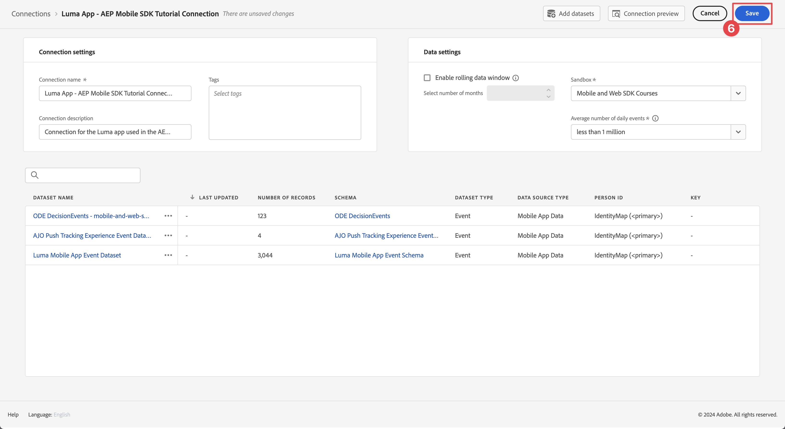
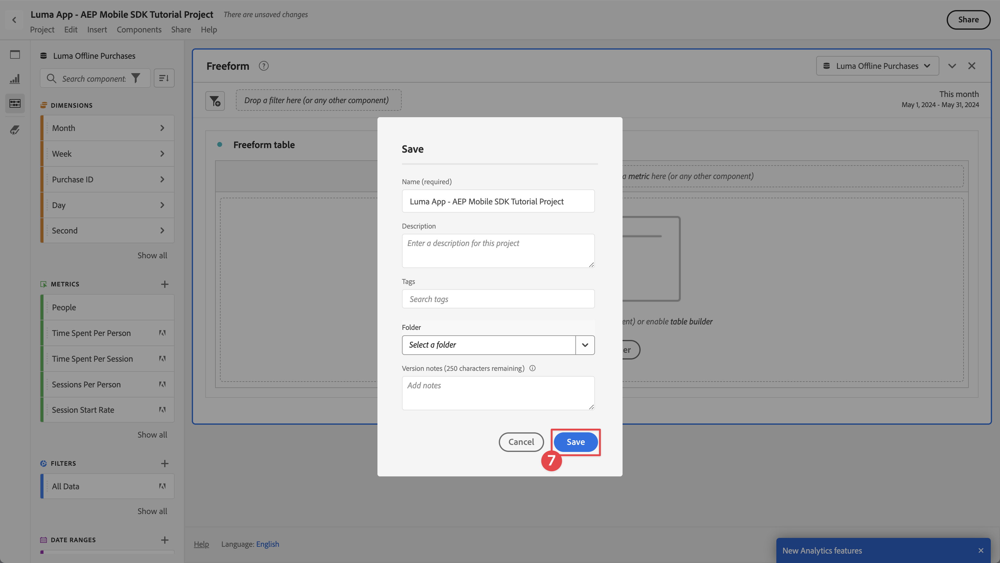
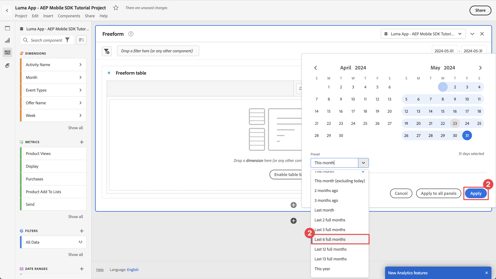

# Report e analisi tramite Customer Journey Analytics

Scopri come segnalare e analizzare le interazioni dell’app mobile con il Customer Journey Analytics.

I dati dell’evento dell’app mobile, che hai raccolto e inviato all’Edge Network di Platform nelle lezioni precedenti, vengono inoltrati ai servizi configurati nello stream di dati. Se hai seguito il [Invia dati all’Experience Platform](platform.md) lezione, tali dati vengono ora memorizzati nel data lake di Experienci Platform come set di dati. E quei dati sono poi disponibili per essere usati dal Customer Journey Analytics per reportistica e analisi.

A differenza di Adobe Analytics, il Customer Journey Analytics è un’applicazione che *utilizza* dati dei set di dati creati in Experienci Platform e ai quali l’app invia i dati. Utilizzando l’SDK di Adobe Experience Platform Mobile, non invii dati direttamente al Customer Journey Analytics. Al contrario, Customer Journey Analytics utilizza i dati dei set di dati in Experienci Platform.

Questa lezione nell’esercitazione si concentra sul reporting e l’analisi dei dati acquisiti dall’app di esercitazione Luma. Una delle funzionalità uniche di Customer Journey Analytics è quella di combinare dati provenienti da più origini (CRM, punti vendita, applicazioni fedeltà, call center) e canali (web, mobile, offline) per fornire informazioni approfondite sui percorsi dei clienti. Questa capacità va oltre lo scopo di questa lezione. Consulta [Panoramica del Customer Journey Analytics](https://experienceleague.adobe.com/en/docs/analytics-platform/using/cja-overview/cja-overview) per ulteriori informazioni.

## Prerequisiti

È necessario eseguire il provisioning della tua organizzazione e concedere l’autorizzazione per il Customer Journey Analytics. È necessario disporre dell&#39;accesso di amministrazione al Customer Journey Analytics.

## Obiettivi di apprendimento

In questa lezione verranno fornite le seguenti informazioni:

- Crea una connessione per definire i set di dati da Experienci Platform che desideri utilizzare nel Customer Journey Analytics.
- Creare una visualizzazione dati per preparare i dati dai set di dati per le attività di reporting e analisi
- Crea un progetto per creare rapporti e visualizzazioni in modo da poter analizzare i dati dalla tua app mobile.

Questo ordine è di proposito. In Customer Journey Analytics, un rapporto in Analysis Workspace dipende da una visualizzazione dati. Una visualizzazione dati dipende da una connessione.

## Creare una connessione

Una connessione in Customer Journey Analytics definisce i set di dati (e i dati all’interno di tali set di dati) di Experienci Platform che desideri utilizzare per il reporting e l’analisi.

1. Passare all&#39;interfaccia di Customer Journey Analytics utilizzando le app  in alto a destra.

1. Seleziona **[!UICONTROL Connessioni]** dalla barra dei menu superiore.

1. Assicurati di selezionare **[!UICONTROL Elenco]** nell&#39;interfaccia Connessioni. Viene visualizzato un elenco delle connessioni esistenti.

1. Seleziona **[!UICONTROL Crea nuova connessione]**.

1. In **[!UICONTROL Connessioni]** > **[!UICONTROL Connessione senza titolo]** schermo, in **[!UICONTROL Impostazioni di connessione]**

   1. Immetti un **[!UICONTROL Nome connessione]**, ad esempio `Luma App - AEP Mobile SDK Tutorial Connection`.
   2. Immetti un **[!UICONTROL Descrizione della connessione]**, ad esempio `Connection for the Luma app used in the AEP Mobile SDK tutorial`.

      In entrata **[!UICONTROL Impostazioni dati]**:

   3. Seleziona la sandbox utilizzata per raccogliere i dati dell’app mobile, ad esempio **[!UICONTROL Corsi Mobile e Web SDK]**.
   4. Seleziona **[!UICONTROL meno di 1 milione]** dal **[!UICONTROL Numero medio di eventi giornalieri]**.

   5. Seleziona **[!UICONTROL Aggiungere set di dati]** per selezionare i set di dati dall’Experience Platform da utilizzare nel Customer Journey Analytics.

      

   6. In **[!UICONTROL Aggiungere set di dati]** procedura guidata, **[!UICONTROL Seleziona set di dati]** passaggio,

      1. seleziona i seguenti set di dati:

         - **[!UICONTROL Set di dati evento app mobile Luma]**, il set di dati creato come parte del [Creare un set di dati](platform.md#create-a-dataset) nella lezione di Experience Platform.
         - **[!UICONTROL ODE DecisionEvents - *nome sandbox*] decisioning**
         - **[!UICONTROL Set di dati evento di tracciamento push AJO]**

      1. Seleziona **[!UICONTROL Successivo]**.

         

   7. In **[!UICONTROL Aggiungere set di dati]** procedura guidata, **[!UICONTROL Impostazioni dei set di dati]** passaggio, è necessario definire i dettagli per ciascuno dei set di dati dell’evento.
      1. Per una configurazione corretta, consultare le tabelle seguenti:

         | Set di dati | ID persona ① | Timestamp ② | ③ del tipo di origine dati | Importa tutti i nuovi ④ dati | Recupera tutti i dati esistenti ⑤ |
         |---|---|---|---|---|---|
         | Set di dati evento app mobile Luma | identityMap | timestamp | Dati app mobili | abilita | abilita |
         | ODE DecisionEvents - *nome sandbox* decisioning | identityMap | timestamp | Dati app mobili | abilita | abilita |
         | Set di dati evento di tracciamento push AJO | identityMap | timestamp | Dati app mobili | abilita | abilita |

         

      1. Seleziona **[!UICONTROL Aggiungere set di dati]**.

1. Torna in **[!UICONTROL Connessioni]** > **[!UICONTROL App Luma - Connessione tutorial SDK per dispositivi mobili AEP]**, seleziona **[!UICONTROL Salva]** per salvare la connessione.

   

Ora hai definito la connessione e il Customer Journey Analytics aggiunge i dati dei set di dati al proprio database interno. Questa raccolta di dati può richiedere un po’ di tempo, a seconda della quantità di dati. Per l’app di esercitazione, attendi un paio d’ore prima che i dati vengano visualizzati nel Customer Journey Analytics.

Per visualizzare lo stato della connessione:

1. Seleziona **[!UICONTROL Connessioni]** nell&#39;interfaccia principale del Customer Journey Analytics.
1. Seleziona il nome della connessione, ad esempio **[!UICONTROL App Luma - Connessione tutorial SDK per dispositivi mobili AEP]**.

In **[!UICONTROL Connessioni]** > **[!UICONTROL App Luma - Connessione tutorial SDK per dispositivi mobili AEP]**, puoi vedere:

1. Informazioni sui record totali aggiunti, sui record ignorati e sui record eliminati. Assicurati di selezionare **[!UICONTROL Tutti i set di dati]** e seleziona un periodo di tempo appropriato per visualizzare i dettagli della connessione. È possibile utilizzare  per aprire una finestra di dialogo e selezionare il periodo di tempo.
1. Informazioni per singoli set di dati su record aggiunti, record saltati, record eliminati e altro ancora.

   

## Creare una visualizzazione dati

Dopo aver aggiunto i record dai set di dati al Customer Journey Analytics, puoi creare una visualizzazione dati per definire i componenti dei dati sui quali desideri creare un rapporto.

Una visualizzazione dati è un contenitore specifico del Customer Journey Analytics che consente di determinare come interpretare i dati di una connessione. Puoi configurare i campi standard e di schema da qualsiasi set di dati definito nella connessione come componenti (dimensioni, metriche) in Analysis Workspace.

Una visualizzazione dati nel Customer Journey Analytics offre un’enorme flessibilità per configurare e definire correttamente i dati dalla connessione. In questo tutorial utilizzi solo la funzionalità necessaria per le attività di reporting e analisi. Consulta [Visualizzazioni dati](https://experienceleague.adobe.com/en/docs/analytics-platform/using/cja-dataviews/data-views) per ulteriori informazioni.

Per creare la visualizzazione dati:

1. Passare all&#39;interfaccia di Customer Journey Analytics utilizzando le app  in alto a destra.

1. Seleziona **[!UICONTROL Visualizzazioni dati]** dalla barra dei menu superiore.
1. Seleziona **[!UICONTROL Creare una nuova visualizzazione dati]**.
1. In entrata **[!UICONTROL Visualizzazioni dati >]**, assicurano che **[!UICONTROL Configura]** è selezionata.

   1. Seleziona la connessione dall’elenco a discesa Connessione impostazioni, ad esempio **[!UICONTROL App Luma - Connessione tutorial SDK per dispositivi mobili AEP]**.
   1. Immetti un Nome per la visualizzazione dati, ad esempio: `Luma App - AEP Mobile SDK Tutorial Data view`.
   1. Seleziona **[!UICONTROL Salva e continua]**.

      

1. In **[!UICONTROL Componenti]** scheda di **[!UICONTROL App Luma: visualizzazione dati dell’esercitazione dell’SDK di AEP Mobile]**, puoi definire le metriche e la dimensione da utilizzare per i rapporti sull’app mobile. Per impostazione predefinita, per la visualizzazione dati sono già configurate diverse metriche e dimensioni standard (con riferimento congiunto a un componente). Tuttavia, la visualizzazione dati richiede più componenti.  Per aggiungere un campo schema, dallo schema definito in precedenza o da schemi predefiniti (consulta [Creare uno schema](create-schema.md) lezione), come componente (dimensione o metrica):

   1. Trova il campo schema:

      - cercare il componente utilizzando  ***[!UICONTROL Cerca campi schema]*** campo di ricerca. Ad esempio: `productListAdd`, o

        

      - scorri verso il basso fino al campo schema in  **[!UICONTROL Set di dati evento]** .  Ad esempio:  **[!UICONTROL Set di dati evento]**   **[!UICONTROL commerce]**   **[!UICONTROL productListAdds]** 

        

   1. Trascina il campo schema specifico dal riquadro Campi schema e rilascialo sulla **[!UICONTROL METRICHE]** o **[!UICONTROL DIMENSION]** elenco in [!UICONTROL Componenti inclusi] riquadro.

      

   1. È possibile configurare le impostazioni di un componente. Seleziona il componente e configura le impostazioni nel riquadro a destra.  Ad esempio, puoi rinominare **[!UICONTROL commerce.productListAdds]** a `Product Add To Lists` utilizzando **[!UICONTROL IMPOSTAZIONI DEI COMPONENTI]** > **[!UICONTROL Nome componente]** nel riquadro di destra.

      

      Oppure configura **[!UICONTROL INCLUDI VALORI DI ESCLUSIONE]**.

      

   1. Dopo aver compreso come aggiungere campi alla visualizzazione dati e configurare il componente risultante, utilizza le tabelle seguenti per un elenco di campi schema da aggiungere come metrica o dimensione. Utilizza il **Percorso schema** valore della colonna dalla tabella seguente per cercare o scorrere fino al campo dello schema specifico. Una volta trascinati, controlla **Impostazioni dei componenti** nella tabella se sono necessarie impostazioni specifiche per un componente, come la modifica del relativo **[!UICONTROL Nome componente]** o definizione **[!UICONTROL INCLUDI VALORI DI ESCLUSIONE]**.

      

      **METRICHE**

      | Nome componente | Set di dati | Tipo di dati dello schema | Percorso schema | Impostazioni dei componenti |
      |---|---|---|---|---|
      | Ignora | Set di dati evento di tracciamento push AJO, set di dati evento app mobile Luma | Intero | _experience.decisioning. propositionEventType.dismiss | Nome componente: `Dismiss` |
      | Annulla iscrizione | Set di dati evento di tracciamento push AJO, set di dati evento app mobile Luma | Intero | _experience.decisioning. propositionEventType.unsubscribe | Nome componente: `Unsubscribe` |
      | Trigger | Set di dati evento di tracciamento push AJO, set di dati evento app mobile Luma | Intero | _experience.decisioning. propositionEventType.trigger | Nome componente: `Trigger` |
      | Visualizzazione | Set di dati evento di tracciamento push AJO, set di dati evento app mobile Luma | Intero | _experience.decisioning. propositionEventType.display | Nome componente: `Display` |
      | Invia | Set di dati evento di tracciamento push AJO, set di dati evento app mobile Luma | Intero | _experience.decisioning. propositionEventType.send | Nome componente: `Send` |
      | Interagisci | Set di dati evento di tracciamento push AJO, set di dati evento app mobile Luma | Intero | _experience.decisioning. propositionEventType.interact | Nome componente: `Interact` |
      | Eventi di posizione | Set di dati evento di tracciamento push AJO, set di dati evento app mobile Luma, eventi decisionali ODE - decisioning di corsi sdk per dispositivi mobili e web | Stringa | Tipo evento | Nome componente: `Location Events`   |
      | Visualizzazioni prodotto | Set di dati evento app mobile Luma | Doppio | commerce.productViews.value | Nome componente: `Product Views` |
      | Aggiunta di prodotti agli elenchi | Set di dati evento app mobile Luma | Doppio | commerce.productListAdds.value | Nome componente: `Product Add To Lists` |
      | Acquisti | Set di dati evento app mobile Luma | Doppio | commerce.purchases.value | Nome componente: `Purchases` |
      | Salva per dopo | Set di dati evento app mobile Luma | Doppio | commerce.saveForLaters.value | Nome componente: `Save For Laters` |
      | Interazioni app | Set di dati evento app mobile Luma | Doppio | _techmarketingdemos.appInformation. appInteraction.appAction.value | Nome componente: `App Interactions` |
      | Visualizzazioni schermo | Set di dati evento app mobile Luma | Doppio | _techmarketingdemos.appInformation. appStateDetails.screenView.value | Nome componente: `Screen Views` |

      {style="table-layout:auto"}

      Nota come il campo schema per la metrica Eventi posizione utilizza **[!UICONTROL INCLUDI VALORI DI ESCLUSIONE]** per contare i tipi di evento che contengono `location`.

      Dopo aver aggiunto tutti i campi schema della tabella precedente come componente metrico, la configurazione della visualizzazione dati per **[!UICONTROL METRICHE]** dovrebbe essere simile a:

      

      **DIMENSION**

      | Nome componente | Set di dati | Tipo di dati dello schema | Percorso schema | Impostazioni dei componenti |
      |---|---|---|---|---|
      | Città | Set di dati evento di tracciamento push AJO, set di dati evento app mobile Luma | Stringa | placeContext.geo.city | Nome componente: `City` |
      | Tipi di evento | Set di dati evento di tracciamento push AJO, set di dati evento app mobile Luma, eventi decisionali ODE - decisioning di corsi sdk per dispositivi mobili e web | Stringa | eventType | Nome componente: `Event Types` |
      | Nome opzione di decisione | Set di dati evento di tracciamento push AJO, set di dati evento app mobile Luma, eventi decisionali ODE - decisioning di corsi sdk per dispositivi mobili e web | Stringa | _experience.decisioning. propositions.items.name | Nome componente: `Decision Option Name` |
      | Nome interazione app | Set di dati evento app mobile Luma | Stringa | _techmarketingdemos.appInformation. appInteraction.name | Nome componente: `App Interaction Name` |
      | Nome visualizzato | Set di dati evento app mobile Luma | Stringa | _techmarketingdemos.appInformation. appStateDetails.screenName | Nome componente: `Screen Name` |
      | Nome attività | ODE DecisionEvents - mobile-and-web-sdk-courses decisioning | Stringa | _experience.decisioning. propositionDetails.activity.name | Nome componente: `Activity Name` |
      | Nome offerta | ODE DecisionEvents - mobile-and-web-sdk-courses decisioning | Stringa | _experience.decisioning. propositionDetails.selections.name | Nome componente: `Offer Name` |

      {style="table-layout:auto"}

      Dopo aver aggiunto tutti i campi schema della tabella precedente come componente dimensione, la configurazione della visualizzazione dati per **[!UICONTROL DIMENSION]** dovrebbe essere simile a:

      

   1. Seleziona **[!UICONTROL Salva e continua]**.

1. Il **[!UICONTROL Impostazioni]** scheda di **[!UICONTROL App Luma: visualizzazione dati dell’esercitazione dell’SDK di AEP Mobile]** consente di configurare filtri e impostazioni di sessione. Per questa esercitazione, non è richiesta alcuna configurazione aggiuntiva.

   - Seleziona **[!UICONTROL Salva e termina]**.

Hai definito la tua visualizzazione dati e tutto è pronto per iniziare a creare rapporti e visualizzazioni.

## Creare un progetto

Puoi utilizzare i progetti Workspace in Customer Journey Analytics per creare rapporti e visualizzazioni. Ci sono molte possibilità per creare rapporti completi e visualizzazioni coinvolgenti, ma tutte queste possibilità sono al di fuori dell&#39;ambito di questa esercitazione. Consulta [Panoramica di Workspace](https://experienceleague.adobe.com/en/docs/customer-journey-analytics-learn/tutorials/analysis-workspace/workspace-projects/analysis-workspace-overview) e [Crea un nuovo progetto](https://experienceleague.adobe.com/en/docs/customer-journey-analytics-learn/tutorials/analysis-workspace/workspace-projects/build-a-new-project) per ulteriori informazioni.

In questa sezione della lezione, crei un progetto che mostra rapporti e visualizzazioni su:

- Utilizzo app: utilizzo delle informazioni visualizzate sullo schermo e delle interazioni app.
- Commerce: utilizzando gli eventi di e-commerce, come la visualizzazione prodotto, aggiungi al carrello e acquista.
- Offerte: utilizzando le offerte visualizzate nell’app.
- Visite allo store: utilizzando gli eventi di recinto geografico (simulati) dell’app.

Per creare il progetto:

1. Passare all&#39;interfaccia di Customer Journey Analytics utilizzando le app  in alto a destra.

1. Seleziona **[!UICONTROL Workspace]** dalla barra dei menu superiore.

1. Seleziona **[!UICONTROL Crea progetto]**.

   1. Seleziona **[!UICONTROL Progetto Workspace vuoto]** dalla finestra di dialogo a comparsa.

      

   1. Seleziona **[!UICONTROL Crea]**.

1. Ti viene presentato il **[!UICONTROL Nuovo progetto]** di rete. In questa interfaccia puoi creare rapporti e visualizzazioni.

1. Seleziona il nome del progetto (**[!UICONTROL Nuovo progetto]**) e specifica il nome del progetto. Ad esempio, `Luma App - AEP Mobile SDK Tutorial Project`.
   

1. Per salvare il progetto, seleziona **[!UICONTROL Progetto]** > **[!UICONTROL Salva]**.
   

1. In **[!UICONTROL Salva]** , ignora tutti gli altri campi e seleziona **[!UICONTROL Salva]**.
   

>[!IMPORTANT]
>
>   Ricorda di salvare il progetto regolarmente, altrimenti le modifiche andranno perse. Puoi salvare rapidamente il progetto utilizzando **[!UICONTROL Ctrl+S]** (Windows) o **[!UICONTROL ⌘ (cmd) + s]** (macOS)

Ora hai configurato il progetto. Nell’area di lavoro principale è già presente un pannello a forma libera contenente una tabella a forma libera. A breve aggiungerai componenti a questa tabella, ma devi prima verificare che il pannello a forma libera utilizzi la visualizzazione dati corretta e il periodo di tempo corretto.

1. Seleziona la visualizzazione dati dall’elenco a discesa. Ad esempio: **[!UICONTROL App Luma: visualizzazione dati dell’esercitazione dell’SDK di AEP Mobile]**. Se non riesci a visualizzare la visualizzazione dati nell’elenco, seleziona **[!UICONTROL Mostra tutto]** nella parte inferiore dell’elenco a discesa.
   

1. Per definire il periodo di tempo appropriato per il pannello, selezionate il valore predefinito **[!UICONTROL Questo mese]** e nel pannello a comparsa definiscono la data di inizio e di fine. Oppure utilizza un **[!UICONTROL Predefinito]**, come **[!UICONTROL Ultimi 6 mesi interi]** e seleziona **[!UICONTROL Applica]**.
   

### Utilizzo app

Desideri generare rapporti sull’utilizzo dell’app. Hai aggiunto il codice necessario nell’app per registrare le interazioni dell’app e quali schermate vengono utilizzate nell’app (consulta la sezione [Tracciare gli eventi](events.md) lezione) e ora desideri creare un rapporto su questi dati.

#### Nomi schermo

Vuoi innanzitutto creare un rapporto sugli schermi visualizzati nell’app.

1. Rinomina il **[!UICONTROL Figura a mano libera]** pannello a `App Usage`.

1. Rinomina il **[!UICONTROL Tabella a forma libera]** a `Screen Names`.

1. Seleziona **[!UICONTROL Mostra tutto]** sotto **[!UICONTROL METRICHE]** elenco.

1. Trascina la **[!UICONTROL Visualizzazioni schermo]** componente attivato [!UICONTROL _Rilascia un **metrica**qui (o qualsiasi altro componente)_)].
   
La tabella a forma libera ora mostra le visualizzazioni a schermo per i giorni per il periodo di tempo selezionato. Tuttavia, desideri mostrare le visualizzazioni dello schermo per le diverse schermate utilizzate nell’app.

1. Per visualizzare **[!UICONTROL DIMENSION]** elenco dei componenti, seleziona  per rimuovere  **[!UICONTROL Metriche]** filtrare dalla barra dei componenti.
   

1. Seleziona **[!UICONTROL Mostra tutto]** sotto **[!UICONTROL DIMENSION]** elenco.

1. Trascina la **[!UICONTROL Nome visualizzato]** componente sul **[!UICONTROL Giorno]** intestazione. L’operazione mostra  **[!UICONTROL Sostituisci]** per indicare la sostituzione della quota.
   

Il primo rapporto è pronto; mostra le visualizzazioni delle schermate per i vari nomi definiti nell’app.

Non dimenticare di salvare il progetto.

#### Interazioni app

Desideri inoltre generare rapporti su come gli utenti hanno interagito con l’app.

1. Seleziona  e dal popup  per aggiungere una nuova tabella a forma libera.
   

1. Rinomina **[!UICONTROL Tabella a forma libera (2)]** a `App Interactions`.

1. Trascina la **[!UICONTROL Interazioni app]** metrica su [!UICONTROL _Rilascia un **metrica**qui (o qualsiasi altro componente)_)].

1. Trascina la **[!UICONTROL Nome interazione app]** dimensione sul **[!UICONTROL Giorno]** per sostituire questa dimensione.

Il secondo rapporto è ora pronto e mostra le interazioni dell’app.

Le informazioni sono limitate principalmente perché hai implementato `MobileSDK.shared.sendAppInteractionEvent(actionName: "<actionName>")` Le chiamate API vengono effettuate solo nella schermata di accesso. Se aggiungi questa chiamata API a più schermate dell’app, il rapporto diventa più informativo.

Non dimenticare di salvare il progetto.

### Commerce

Ora vuoi segnalare, in un pannello separato, gli eventi di e-commerce che si verificano nell’app.

#### Eventi Commerce

1. Seleziona  al di fuori della corrente [!UICONTROL Utilizzo app] per creare un nuovo pannello.
   

1. Assicurati di selezionare il periodo di tempo appropriato.

1. Seleziona  **[!UICONTROL Tabella a forma libera]** per creare una nuova tabella a forma libera.
   

1. Rinomina **[!UICONTROL Pannello]** a `Commerce`.

1. Rinomina **[!UICONTROL Tabella a forma libera]** a `Commerce Events`.

1. Trascina **[!UICONTROL Visualizzazioni prodotto]** metrica su a [!UICONTROL _Rilascia un **metrica**qui (o qualsiasi altro componente)_)].

1. Trascina la **[!UICONTROL Aggiunta di prodotti agli elenchi]** metrica a destra della **[!UICONTROL Visualizzazioni prodotto]** per inserire questa colonna nella tabella a forma libera. Assicurare **[!UICONTROL + Aggiungi]** (in blu) quando si inserisce la colonna.
   

1. Ripeti il passaggio precedente per aggiungere **[!UICONTROL Salva per dopo]** e la **[!UICONTROL Acquisti]** nella tabella a forma libera.

1. Trascina la **[!UICONTROL Mese]** dimensione sopra il **[!UICONTROL Giorno]** per cambiare il reporting da giornaliero a mensile.

Il tuo **[!UICONTROL Eventi Commerce]** il rapporto è ora pronto e mostra come gli utenti hanno visualizzato i prodotti, aggiunto i prodotti alla propria lista dei desideri, salvato i prodotti per un momento successivo o acquistato i prodotti.

Non dimenticare di salvare il progetto.

#### Abbandono

In base al rapporto precedente, desideri visualizzare l’abbandono nel funnel di e-commerce: quanti utenti che hanno visualizzato i prodotti hanno aggiunto anche prodotti ai carrelli. E quanti utenti che hanno aggiunto prodotti ai loro carrelli hanno salvato anche questi prodotti per dopo. E così via.

1. Seleziona  all&#39;interno del **[!UICONTROL Commerce]** e dal menu a comparsa seleziona  (che rappresenta la visualizzazione Abbandono).

1. Seleziona **[!UICONTROL Visualizzazioni prodotto]** dal [!UICONTROL *Aggiungi punto di contatto*] elenco a discesa.
   
In alternativa, puoi trascinare e rilasciare la **[!UICONTROL Visualizzazione prodotti]** dimensione sotto il **[!UICONTROL Tutte le persone]** dimensione in **[!UICONTROL Abbandono]** visualizzazione.

1. Ripeti il passaggio precedente per **[!UICONTROL Aggiunta di prodotti agli elenchi]** e **[!UICONTROL Acquisti]** dimensioni. Il tuo **[!UICONTROL Abbandono]** la visualizzazione mostra ora una rappresentazione visiva del funnel di conversione per i prodotti.
   

Non dimenticare di salvare il progetto.

### Offerte

Desideri generare rapporti sul numero di offerte e sulle offerte visualizzate agli utenti dell’app.

#### Panoramica mensile

1. Seleziona  al di fuori del pannello Commerce corrente, per creare un nuovo pannello.

1. Rinomina il **[!UICONTROL Pannello]** a `Offers`.

1. Accertati di selezionare il periodo appropriato.

1. Seleziona  Tabella a forma libera per creare una nuova tabella a forma libera.

1. Rinomina il **[!UICONTROL Tabella a forma libera]** a `Monthly Overview`.

1. Trascina la **[!UICONTROL Visualizzazione]** metrica su a [!UICONTROL _Rilascia un **metrica**qui (o qualsiasi altro componente)_)].

1. Trascina la **[!UICONTROL Mese]** dimensione sul **[!UICONTROL Giorno]** per sostituire la dimensione.

Ora disponi di un rapporto che mostra le offerte mensili mostrate agli utenti nell’app.

Non dimenticare di salvare il progetto.

#### Offerte agli utenti

Desideri inoltre disporre di un rapporto che mostri quali offerte sono state mostrate agli utenti dell’app, in base a quali numeri.

1. Seleziona  all&#39;interno del **[!UICONTROL Offerte]** pannello e dalla finestra a comparsa per aggiungere una nuova tabella a forma libera.

1. Rinomina **[!UICONTROL Tabella a forma libera (2)]** a `People`.

1. Trascina la **[!UICONTROL Persone]** metrica su a [!UICONTROL _Rilascia un **metrica**qui (o qualsiasi altro componente)_)].

1. Trascina la **[!UICONTROL Nome attività]** il **[!UICONTROL Giorno]** per sostituire la dimensione.

1. Fai clic con il pulsante destro del mouse sulla riga, identificando una o più decisioni di offerta definite nell’ [Creare e visualizzare le offerte con Gestione delle decisioni](journey-optimizer-offers.md) lezione. Ad esempio: **[!UICONTROL Luma - Decisione sull’app mobile]**.

1. Dal menu di scelta rapida, selezionare **[!UICONTROL Raggruppamento]** > **[!UICONTROL Dimension]** > **[!UICONTROL Nome offerta]**. Questa selezione suddividerà la dimensione Nome attività in Nomi offerta.
   

Ora disponi di un rapporto che mostra agli utenti dell’app le singole offerte visualizzate per questa decisione di offerta per il periodo selezionato.

Non dimenticare di salvare il progetto.

### Visite al negozio

Infine, vuoi generare rapporti sulle visite ai negozi.

1. Seleziona  al di fuori del pannello Offerte corrente, per creare un nuovo pannello.

1. Rinomina il **[!UICONTROL Pannello]** a `Store Visits`.

1. Accertati di selezionare il periodo appropriato.

1. Seleziona  Tabella a forma libera per creare una nuova tabella a forma libera.

1. Rinomina **[!UICONTROL Tabella a forma libera]** a `Store Entries / Exits Across Cities`.

1. Trascina la **[!UICONTROL Eventi di posizione]** metrica su a [!UICONTROL _Rilascia un **metrica**qui (o qualsiasi altro componente)_)]. Il rapporto ora mostra una panoramica giornaliera di tutti gli eventi di posizione che si sono verificati nell’app. Ricorda come hai configurato in modo specifico questa dimensione come parte della tua [visualizzazione dati](#create-a-data-view).

1. Trascina la **[!UICONTROL Città]** dimensione sul **[!UICONTROL Giorno]** per sostituire la dimensione. Il rapporto ora mostra le città per gli eventi di posizione.

1. Per rimuovere gli eventi di geolocalizzazione senza città associate, seleziona , e dal **[!UICONTROL Ricerca]** popup, disattiva **[!UICONTROL Includi &quot;Nessun valore&quot;]**, quindi seleziona **[!UICONTROL Applica]**.

   

   Questa azione rimuove **[!UICONTROL Nessun valore]** riga dal report.

1. Seleziona tutte le righe della tabella, fai clic con il pulsante destro del mouse e, dal menu di scelta rapida, seleziona Raggruppamento > Dimension > Tipi di evento.

Ora disponi di un rapporto che mostra gli utenti che si trovano dentro e fuori dalle vicinanze delle posizioni del negozio (come hai definito queste posizioni in [Places](places.md) lezione).

Tieni presente che se desideri creare rapporti sulle persone che visitano fisicamente il tuo negozio, puoi utilizzare i beacon. Ma si spera che abbiate acquisito il concetto di reporting sui dati di geolocalizzazione.

## Passaggi successivi

Ora dovresti avere una conoscenza di base di come creare rapporti e visualizzare informazioni sull’utilizzo dell’app mobile, sulle interazioni e altro ancora utilizzando il Customer Journey Analytics.

>[!SUCCESS]
>
>
>Grazie per aver dedicato il tuo tempo all’apprendimento dell’SDK di Adobe Experience Platform Mobile. Se hai domande, vuoi condividere feedback generali o suggerimenti su contenuti futuri, condividili su questo [Experience League post di discussione community](https://experienceleaguecommunities.adobe.com/t5/adobe-experience-platform-data/tutorial-discussion-implement-adobe-experience-cloud-in-mobile/td-p/443796).

Successivo: **[Conclusione e prossime tappe](conclusion.md)**
