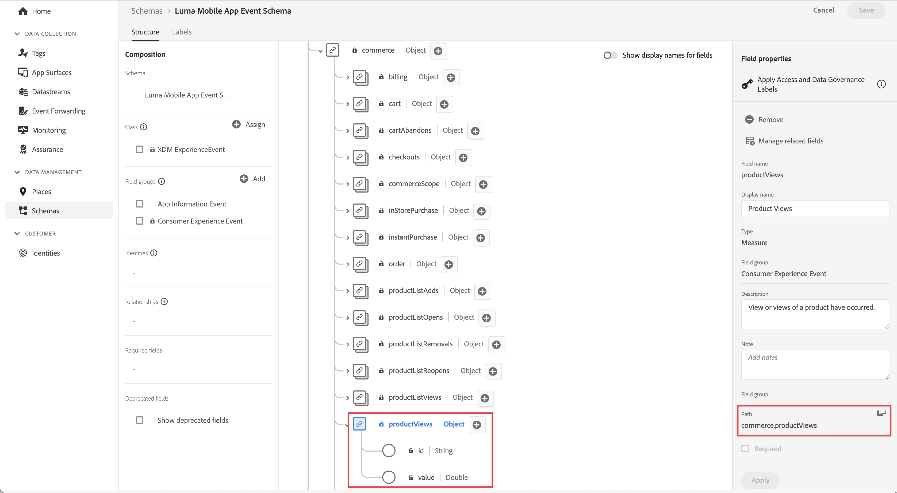

# Tracciare i dati dell’evento

Scopri come tracciare gli eventi in un’app mobile.

L’estensione Edge Network fornisce un’API per inviare eventi di esperienza a Platform Edge Network. Un evento esperienza è un oggetto che contiene dati conformi alla definizione dello schema XDM ExperienceEvent. Più semplicemente, questi eventi acquisiscono ciò che le persone fanno nella tua app mobile. Una volta che Platform Edge Network ha ricevuto i dati, questi possono essere inoltrati alle applicazioni e ai servizi configurati nel flusso di dati, come Adobe Analytics e Experience Platform. Ulteriori informazioni su [Eventi esperienza](https://developer.adobe.com/client-sdks/documentation/getting-started/track-events/) nella documentazione del prodotto.

## Prerequisiti

* Tutte le dipendenze del pacchetto sono configurate nel progetto Xcode.
* Estensioni registrate in **[!UICONTROL AppDelegate]**.
* Estensione MobileCore configurata per utilizzare il tuo sviluppo `appId`.
* SDK importati.
* L&#39;app è stata creata ed eseguita correttamente con le modifiche precedenti.

## Obiettivi di apprendimento

In questa lezione, potrai

* Scopri come strutturare i dati XDM in base a uno schema.
* Invia un evento XDM basato su un gruppo di campi standard.
* Invia un evento XDM basato su un gruppo di campi personalizzato.
* Invia un evento di acquisto XDM.
* Convalida con Assurance.

## Creazione di un evento esperienza

L’estensione Adobe Experience Platform Edge può inviare a Adobe Experience Platform Edge Network eventi che seguono uno schema XDM definito in precedenza.

Il processo è simile a questo...

1. Identifica l’interazione con l’app mobile che stai tentando di tracciare.

1. Esamina lo schema e identifica l’evento appropriato.

1. Esamina lo schema e identifica eventuali campi aggiuntivi da utilizzare per descrivere l’evento.

1. Costruisci e popola l’oggetto dati.

1. Crea e invia evento.

1. Convalida.


### Gruppi di campi standard

Per i gruppi di campi standard, il processo è simile al seguente:

* Nello schema, identifica gli eventi che stai tentando di raccogliere. In questo esempio stai tenendo traccia degli eventi di esperienza di e-commerce, ad esempio un evento di visualizzazione prodotto (**[!UICONTROL productViews]**).

  {zoomable="yes"}

* Per creare un oggetto contenente i dati dell’evento esperienza nell’app, puoi utilizzare un codice simile al seguente:

>[!BEGINTABS]

>[!TAB iOS]

```swift
var xdmData: [String: Any] = [
    "eventType": "commerce.productViews",
    "commerce": [
        "productViews": [
        "value": 1
        ]
    ]
]
```

In questo codice:

* `eventType`: descrive l&#39;evento che si è verificato. Utilizzare un [valore noto](https://github.com/adobe/xdm/blob/master/docs/reference/classes/experienceevent.schema.md#xdmeventtype-known-values) quando possibile.

* `commerce.productViews.value`: valore numerico o booleano dell&#39;evento. Se è un valore booleano (o &quot;Contatore&quot; in Adobe Analytics), il valore è sempre impostato su 1. Se è un evento numerico o di valuta, il valore può essere > 1.

>[!TAB Android]

```kotlin
val xdmData = mapOf(
    "eventType" to "commerce.productViews",
    "commerce" to mapOf(
        "productViews" to mapOf(
        "value": 1
        )
    )
)
```

In questo codice:

* `eventType`: descrive l&#39;evento che si è verificato. Utilizzare un [valore noto](https://github.com/adobe/xdm/blob/master/docs/reference/classes/experienceevent.schema.md#xdmeventtype-known-values) quando possibile.

* `commerce.productViews.value`: valore numerico o booleano dell&#39;evento. Se è un valore booleano (o &quot;Contatore&quot; in Adobe Analytics), il valore è sempre impostato su 1. Se è un evento numerico o di valuta, il valore può essere > 1.

>[!ENDTABS]


* Nello schema, identifica eventuali dati aggiuntivi associati all’evento di visualizzazione del prodotto Commerce. In questo esempio, includi **[!UICONTROL productListItems]** che è un set standard di campi utilizzati con qualsiasi evento relativo a e-commerce:

  {zoomable="yes"}
   * **[!UICONTROL productListItems]** è un array e pertanto è possibile specificare più prodotti.

* Per aggiungere questi dati, espandere l&#39;oggetto `xdmData` per includere dati supplementari:

>[!BEGINTABS]

>[!TAB iOS]

```swift
var xdmData: [String: Any] = [
    "eventType": "commerce.productViews",
    "commerce": [
        "productViews": [
            "value": 1
        ]
    ],
    "productListItems": [
        [
            "name":  productName,
            "SKU": sku,
            "priceTotal": priceString,
            "quantity": 1
        ]
    ]
]
```

>[!TAB Android]

```kotlin
val xdmData = mapOf(
    "eventType" to "commerce.productViews",
    "commerce" to mapOf(
        "productViews" to mapOf(
        "value": 1
        )
    ),
    "productListItems" to mapOf(
        "name": productName,
        "SKU": sku,
        "priceTotal", priceString,
        "quantity", 1
    )
)
```

>[!ENDTABS]

* È ora possibile utilizzare questa struttura dati per creare un `ExperienceEvent`:

>[!BEGINTABS]

>[!TAB iOS]

```swift
let productViewEvent = ExperienceEvent(xdm: xdmData)
```

>[!TAB Android]

```kotlin
val productViewEvent = ExperienceEvent.Builder().setXdmSchema(xdmData).build()
```

>[!ENDTABS]

* E invia l&#39;evento e i dati a Platform Edge Network utilizzando l&#39;API `sendEvent`:

>[!BEGINTABS]

>[!TAB iOS]

```swift
Edge.sendEvent(experienceEvent: productViewEvent)
```

>[!TAB Android]

```kotlin
Edge.sendEvent(productViewEvent, null)
```

>[!ENDTABS]


L&#39;API [`Edge.sendEvent`](https://developer.adobe.com/client-sdks/documentation/edge-network/api-reference/#sendevent) è l&#39;equivalente di AEP Mobile SDK alle chiamate API [`MobileCore.trackAction`](https://developer.adobe.com/client-sdks/documentation/mobile-core/api-reference/#trackaction) e [`MobileCore.trackState`](https://developer.adobe.com/client-sdks/documentation/mobile-core/api-reference/#trackstate). Per ulteriori informazioni, consulta [Migrare dall&#39;estensione per dispositivi mobili Analytics a Adobe Experience Platform Edge Network](https://developer.adobe.com/client-sdks/documentation/adobe-analytics/migrate-to-edge-network/).

Ora stai per implementare questo codice nel tuo progetto.
Nell’app sono presenti diverse azioni relative al prodotto commerce e desideri inviare eventi, in base alle azioni eseguite dall’utente:

* view: si verifica quando un utente visualizza un prodotto specifico,
* aggiungi al carrello: quando un utente tocca  in una schermata dei dettagli del prodotto,
* salva per dopo: quando un utente tocca  /  in una schermata dei dettagli del prodotto,
* acquisto: quando un utente tocca  in una schermata dei dettagli del prodotto.

Per implementare l’invio di eventi di esperienza relativi al commercio in modo riutilizzabile, utilizza una funzione dedicata:

>[!BEGINTABS]

>[!TAB iOS]

1. Passa a **[!DNL Luma]** > **[!DNL Luma]** > **[!DNL Utils]** > **[!UICONTROL MobileSDK]** nel navigatore progetti Xcode e aggiungi quanto segue alla funzione `func sendCommerceExperienceEvent(commerceEventType: String, product: Product)`.

   ```swift
   // Set up a data dictionary, create an experience event and send the event.
   let xdmData: [String: Any] = [
       "eventType": "commerce." + commerceEventType,
       "commerce": [
           commerceEventType: [
               "value": 1
           ]
       ],
       "productListItems": [
           [
               "name": product.name,
               "priceTotal": product.price,
               "SKU": product.sku
           ]
       ]
   ]
   
   let commerceExperienceEvent = ExperienceEvent(xdm: xdmData)
   Edge.sendEvent(experienceEvent: commerceExperienceEvent)
   ```

   Questa funzione considera il tipo di evento e il prodotto dell’esperienza di e-commerce come parametri e

   * imposta il payload XDM come dizionario, utilizzando i parametri della funzione,
   * configura un evento esperienza utilizzando il dizionario,
   * invia l&#39;evento esperienza utilizzando l&#39;API [`Edge.sendEvent`](https://developer.adobe.com/client-sdks/documentation/edge-network/api-reference/#sendevent).

1. Passa a **[!DNL Luma]** > **[!DNL Luma]** > **[!DNL Views]** > **[!DNL Products]** > **[!UICONTROL ProductView]** nel Navigator dei progetti Xcode e aggiungi varie chiamate alla funzione `sendCommerceExperienceEvent`:

   1. Nel modificatore `.task`, entro la chiusura di `ATTrackingManager.trackingAuthorizationStatus`. Questo modificatore `.task` viene chiamato quando la visualizzazione prodotto viene inizializzata e visualizzata, quindi si desidera inviare un evento di visualizzazione prodotto in quel momento specifico.

      ```swift
      // Send productViews commerce experience event
      MobileSDK.shared.sendCommerceExperienceEvent(commerceEventType: "productViews", product: product)
      ```

   1. Per ciascuno dei pulsanti (,  e ) nella barra degli strumenti, aggiungi la chiamata pertinente entro la chiusura di `ATTrackingManager.trackingAuthorizationStatus == .authorized`:

      1. Per :

         ```swift
         // Send saveForLater commerce experience event
         MobileSDK.shared.sendCommerceExperienceEvent(commerceEventType: "saveForLaters", product: product)
         ```

      1. Per :

         ```swift
         // Send productListAdds commerce experience event
         MobileSDK.shared.sendCommerceExperienceEvent(commerceEventType: "productListAdds", product: product)
         ```

      1. Per :

         ```swift
         // Send purchase commerce experience event
         MobileSDK.shared.sendCommerceExperienceEvent(commerceEventType: "purchases", product: product)
         ```

>[!TAB Android]

1. Passa a **[!UICONTROL Android]**  > **[!UICONTROL app]** > **[!UICONTROL kotlin+java]** > **[!UICONTROL com.adobe.luma.tutorial.android]** > **[!UICONTROL models]** > **[!UICONTROL MobileSDK]** nel navigatore di Android Studio e aggiungi quanto segue alla funzione `func sendCommerceExperienceEvent(commerceEventType: String, product: Product)`.

   ```kotlin
   // Set up a data map, create an experience event and send the event.
   val xdmData = mapOf(
       "eventType" to "commerce.$commerceEventType",
       "commerce" to mapOf(commerceEventType to mapOf("value" to 1)),
       "productListItems" to listOf(
           mapOf(
               "name" to product.name,
               "priceTotal" to product.price,
               "SKU" to product.sku
           )
       )
   )
   val commerceExperienceEvent = ExperienceEvent.Builder().setXdmSchema(xdmData).build()
   Edge.sendEvent(commerceExperienceEvent, null)
   ```

   Questa funzione considera il tipo di evento e il prodotto dell’esperienza di e-commerce come parametri e

   * imposta il payload XDM come mappa, utilizzando i parametri della funzione,
   * configura un evento esperienza utilizzando la mappa;
   * invia l&#39;evento esperienza utilizzando l&#39;API [`Edge.sendEvent`](https://developer.adobe.com/client-sdks/documentation/edge-network/api-reference/#sendevent).

1. Passa a **[!UICONTROL app]** > **[!UICONTROL kotlin+java]** > **[!UICONTROL com.adobe.luma.tutorial.android]** > **[!UICONTROL visualizzazioni]** > **[!UICONTROL ProductView.kt]** nel navigatore di Android Studio e aggiungi varie chiamate alla funzione `sendCommerceExperienceEvent`:

   1. Nella funzione componibile `LaunchedEffect(Unit)`, si desidera inviare un evento di visualizzazione prodotto nel momento specifico in cui viene visualizzato un prodotto.

      ```kotlin
      // Send productViews commerce experience event
      MobileSDK.shared.sendCommerceExperienceEvent("productViews", product)
      ```

   1. Per ciascuno dei pulsanti (,  e ) nella barra degli strumenti, aggiungere la chiamata pertinente all&#39;interno di `scope.launch` di `if (MobileSDK.shared.trackingEnabled == TrackingStatus.AUTHORIZED)  statement`:

      1. Per :

         ```kotlin
         // Send saveForLater commerce experience event
         MobileSDK.shared.sendCommerceExperienceEvent("saveForLaters", product)
         ```

      1. Per :

         ```kotlin
         // Send productListAdds commerce experience event
         MobileSDK.shared.sendCommerceExperienceEvent("productListAdds", product)
         ```

      1. Per :

         ```kotlin
         // Send purchase commerce experience event
         MobileSDK.shared.sendCommerceExperienceEvent("purchases", product)
         ```

>[!ENDTABS]

>[!TIP]
>
>Se stai sviluppando per Android™, utilizza Map (`java.util.Map`) come interfaccia fondamentale per creare il payload XDM.


### Gruppi di campi personalizzati

Immagina di voler tenere traccia delle visualizzazioni a schermo e delle interazioni nell’app stessa. Ricorda di aver definito un gruppo di campi personalizzato per questo tipo di eventi.

* Nello schema, identifica gli eventi che stai tentando di raccogliere.
  {zoomable="yes"}

* Inizia a costruire l&#39;oggetto.

  >[!NOTE]
  >
  >* I gruppi di campi standard iniziano sempre nella radice dell&#39;oggetto.
  >
  >* I gruppi di campi personalizzati iniziano sempre con un oggetto univoco per la tua organizzazione Experience Cloud, `_techmarketingdemos` in questo esempio.

* Per l’evento di interazione dell’app, puoi costruire un oggetto come:

>[!BEGINTABS]

>[!TAB iOS]

```swift
let xdmData: [String: Any] = [
    "eventType": "application.interaction",
    "_techmarketingdemos": [
    "appInformation": [
        "appInteraction": [
            "name": "login",
            "appAction": [
                "value": 1
                ]
            ]
        ]
    ]
]
```

>[!TAB Android]

```kotlin
val xdmData = mapOf(
    "eventType" to "application.interaction",
    "_techmarketingdemos" to mapOf(
        "appInformation" to mapOf(
            "appInteraction" to mapOf(
                "name" to "login",
                "appAction" to mapOf("value" to 1)
            )
        )
    )
)
```

>[!ENDTABS]

* Per l’evento di tracciamento dello schermo, puoi costruire un oggetto come:

>[!BEGINTABS]

>[!TAB iOS]

```swift
var xdmData: [String: Any] = [
    "eventType": "application.scene",
    "_techmarketingdemos": [
        "appInformation": [
            "appStateDetails": [
                "screenType": "App",
                "screenName": "luma: content: ios: us: en: login",
                "screenView": [
                    "value": 1
                ]
            ]
        ] 
    ]
]
```

>[!TAB Android]

```kotlin
val xdmData = mapOf(
    "eventType" to "application.scene",
    tenant.value to mapOf(
        "appInformation" to mapOf(
            "appStateDetails" to mapOf(
                "screenType" to "App",
                "screenName" to stateName,
                "screenView" to mapOf("value" to 1)
            )
        )
    )
)
```

>[!ENDTABS]


* È ora possibile utilizzare questa struttura dati per creare un `ExperienceEvent`.

>[!BEGINTABS]

>[!TAB iOS]

```swift
let event = ExperienceEvent(xdm: xdmData)
```

>[!TAB Android]

```kotlin
val event = ExperienceEvent(xdmData)
```

>[!ENDTABS]


* Invia l’evento e i dati a Platform Edge Network.

>[!BEGINTABS]

>[!TAB iOS]

```swift
Edge.sendEvent(experienceEvent: event)
```

>[!TAB Android]

```kotlin
Edge.sendEvent(event, null)
```

>[!ENDTABS]

Di nuovo, implementa questo codice nel progetto.

>[!BEGINTABS]

>[!TAB iOS]

1. Per comodità, puoi definire due funzioni in **[!UICONTROL MobileSDK]**. Passa a **[!DNL Luma]** > **[!DNL Luma]** > **[!DNL Utils]** > **[!UICONTROL MobileSDK]** nel navigatore dei progetti Xcode.

   * Uno per le interazioni tra app. Aggiungi questo codice alla funzione `func sendAppInteractionEvent(actionName: String)`:

     ```swift
     // Set up a data dictionary, create an experience event and send the event.
     let xdmData: [String: Any] = [
         "eventType": "application.interaction",
         tenant : [
             "appInformation": [
                 "appInteraction": [
                     "name": actionName,
                     "appAction": [
                         "value": 1
                     ]
                 ]
             ]
         ]
     ]
     let appInteractionEvent = ExperienceEvent(xdm: xdmData)
     Edge.sendEvent(experienceEvent: appInteractionEvent)
     ```

     Questa funzione utilizza il nome dell’azione come parametro e

      * imposta il payload XDM come dizionario, utilizzando il parametro della funzione,
      * configura un evento esperienza utilizzando il dizionario,
      * invia l&#39;evento esperienza utilizzando l&#39;API [`Edge.sendEvent`](https://developer.adobe.com/client-sdks/documentation/edge-network/api-reference/#sendevent).


   * E uno per il tracciamento dello schermo. Aggiungi questo codice alla funzione `func sendTrackScreenEvent(stateName: String) `:

     ```swift
     // Set up a data dictionary, create an experience event and send the event.
     let xdmData: [String: Any] = [
         "eventType": "application.scene",
         tenant : [
             "appInformation": [
                 "appStateDetails": [
                     "screenType": "App",
                     "screenName": stateName,
                     "screenView": [
                         "value": 1
                     ]
                 ]
             ]
         ]
     ]
     let trackScreenEvent = ExperienceEvent(xdm: xdmData)
     Edge.sendEvent(experienceEvent: trackScreenEvent)
     ```

     Questa funzione utilizza il nome dello stato come parametro e

      * imposta il payload XDM come dizionario, utilizzando il parametro della funzione,
      * configura un evento esperienza utilizzando il dizionario,
      * invia l&#39;evento esperienza utilizzando l&#39;API [`Edge.sendEvent`](https://developer.adobe.com/client-sdks/documentation/edge-network/api-reference/#sendevent).

1. Passa a **[!DNL Luma]** > **[!DNL Luma]** > **[!DNL Views]** > **[!DNL General]** > **[!UICONTROL Foglio di accesso]**.

   1. Aggiungi il seguente codice evidenziato alla chiusura del pulsante di accesso:

      ```swift
      // Send app interaction event
      MobileSDK.shared.sendAppInteractionEvent(actionName: "login")
      ```

   1. Aggiungi il seguente codice evidenziato al modificatore `onAppear`:

      ```swift
      // Send track screen event
      MobileSDK.shared.sendTrackScreenEvent(stateName: "luma: content: ios: us: en: login")
      ```

>[!TAB Android]

1. Per comodità, puoi definire due funzioni in **[!UICONTROL MobileSDK]**. Vai a **[!UICONTROL Android]**  **[!DNL app]** > **[!DNL kotlin+java]** > **[!DNL com.adobe.luma.tutorial.android]** > **[!UICONTROL models]** > **[!UICONTROL MobileSDK]** nel tuo navigatore Android Studio.

   * Uno per le interazioni tra app. Aggiungi questo codice alla funzione `fun sendAppInteractionEvent(actionName: String)`:

     ```kotlin
     // Set up a data map, create an experience event and send the event.
     val xdmData = mapOf(
         "eventType" to "application.interaction",
         tenant.value to mapOf(
             "appInformation" to mapOf(
                 "appInteraction" to mapOf(
                     "name" to actionName,
                     "appAction" to mapOf("value" to 1)
                 )
             )
         )
     )
     val appInteractionEvent = ExperienceEvent.Builder().setXdmSchema(xdmData).build()
     Edge.sendEvent(appInteractionEvent, null)
     ```

     Questa funzione utilizza il nome dell’azione come parametro e

      * imposta il payload XDM come mappa, utilizzando il parametro della funzione,
      * configura un evento esperienza utilizzando la mappa;
      * invia l&#39;evento esperienza utilizzando l&#39;API [`Edge.sendEvent`](https://developer.adobe.com/client-sdks/documentation/edge-network/api-reference/#sendevent).


   * E uno per il tracciamento dello schermo. Aggiungi questo codice alla funzione `fun sendTrackScreenEvent(stateName: String)`:

     ```kotlin
     // Set up a data map, create an experience event and send the event.
     val xdmData = mapOf(
         "eventType" to "application.scene",
         tenant.value to mapOf(
             "appInformation" to mapOf(
                 "appStateDetails" to mapOf(
                     "screenType" to "App",
                     "screenName" to stateName,
                     "screenView" to mapOf("value" to 1)
                 )
             )
         )
     )
     val trackScreenEvent = ExperienceEvent.Builder().setXdmSchema(xdmData).build()
     Edge.sendEvent(trackScreenEvent, null)
     ```

     Questa funzione utilizza il nome dello stato come parametro e

      * imposta il payload XDM come mappa, utilizzando il parametro della funzione,
      * configura un evento esperienza utilizzando la mappa;
      * invia l&#39;evento esperienza utilizzando l&#39;API [`Edge.sendEvent`](https://developer.adobe.com/client-sdks/documentation/edge-network/api-reference/#sendevent).

1. Passa a **[!UICONTROL Android]** **[!DNL app]**>**[!DNL kotlin+java]**>**[!DNL com.adobe.luma.tutorial.android]**>**[!UICONTROL  visualizzazioni ]**>**[!UICONTROL  LoginSheet.kt ]**

   1. Aggiungi il seguente codice evidenziato all&#39;evento **[!UICONTROL Button]** **[!UICONTROL onClick]**:

      ```kotlin
      // Send app interaction event
      MobileSDK.shared.sendAppInteractionEvent("login")
      ```

   1. Aggiungere il codice evidenziato seguente alla funzione componibile `LaunchedEffect(Unit)`:

      ```kotlin
      // Send track screen event
      MobileSDK.shared.sendTrackScreenEvent("luma: content: android: us: en: login")
      ```

>[!ENDTABS]


## Convalida

1. Consulta la sezione [istruzioni di installazione](assurance.md#connecting-to-a-session) per collegare il simulatore o il dispositivo con Assurance.

   1. Sposta l’icona Assurance a sinistra.
   1. Seleziona **[!UICONTROL Home]** nella barra delle schede e verifica di visualizzare un **[!UICONTROL ECID]**, **[!UICONTROL E-mail]** e un **[!UICONTROL ID CRM]** nella schermata iniziale.
   1. Selezionare **[!DNL Products]** nella barra delle schede.
   1. Seleziona un prodotto.
   1. Seleziona  (iOS) o  (Android).
   1. Seleziona .
   1. Seleziona .

>[!BEGINTABS]

>[!TAB iOS]


>[!TAB Android]


>[!ENDTABS]

1. Nell&#39;interfaccia utente di Assurance, cerca gli eventi **[!UICONTROL hitReceived]** del fornitore **[!UICONTROL com.adobe.edge.konductor]**.
1. Seleziona l&#39;evento e controlla i dati XDM nell&#39;oggetto **[!UICONTROL messages]**. In alternativa, puoi utilizzare  **[!UICONTROL Copia evento non elaborato]** e utilizzare un editor di testo o di codice di tua preferenza per incollare e ispezionare l&#39;evento.

   {zoomable="yes"}


## Passaggi successivi

Ora dovresti disporre di tutti gli strumenti necessari per iniziare ad aggiungere la raccolta dati all’app. Puoi aggiungere più informazioni sul modo in cui l’utente interagisce con i prodotti nell’app e più chiamate di interazione app e tracciamento dello schermo all’app:

* Implementa l’ordine, il pagamento, il carrello vuoto e altre funzionalità nell’app e aggiungi eventi di esperienza di e-commerce pertinenti a questa funzionalità.
* Ripetere la chiamata a `sendAppInteractionEvent` con il parametro appropriato per tenere traccia delle altre interazioni dell&#39;app da parte dell&#39;utente.
* Ripeti la chiamata a `sendTrackScreenEvent` con il parametro appropriato per tenere traccia delle schermate visualizzate dall&#39;utente nell&#39;app.

>[!TIP]
>
>Rivedi l&#39;[app completata](https://github.com/Adobe-Marketing-Cloud/Luma-iOS-Mobile-App) per altri esempi.


## Inviare eventi ad Analytics e Platform

Dopo aver raccolto gli eventi e averli inviati a Platform Edge Network, vengono inviati alle applicazioni e ai servizi configurati nel [flusso di dati](create-datastream.md). Nelle lezioni successive, mappi questi dati a [Adobe Analytics](analytics.md), [Adobe Experience Platform](platform.md) e altre soluzioni Adobe Experience Cloud (come [Adobe Target](target.md) e Adobe Journey Optimizer).

>[!SUCCESS]
>
>Ora hai configurato l’app per monitorare gli eventi di e-commerce, interazione tra app e tracciamento dello schermo nell’Edge Network di Adobe Experience Platform. E a tutti i servizi definiti nel flusso di dati.
>
>Grazie per aver dedicato tempo all&#39;apprendimento di Adobe Experience Platform Mobile SDK. Se hai domande, vuoi condividere commenti generali o suggerimenti su contenuti futuri, condividili in questo [post di discussione della community Experience League](https://experienceleaguecommunities.adobe.com/t5/adobe-experience-platform-data/tutorial-discussion-implement-adobe-experience-cloud-in-mobile/td-p/443796).

Successivo: **[Gestione visualizzazioni Web](web-views.md)**
