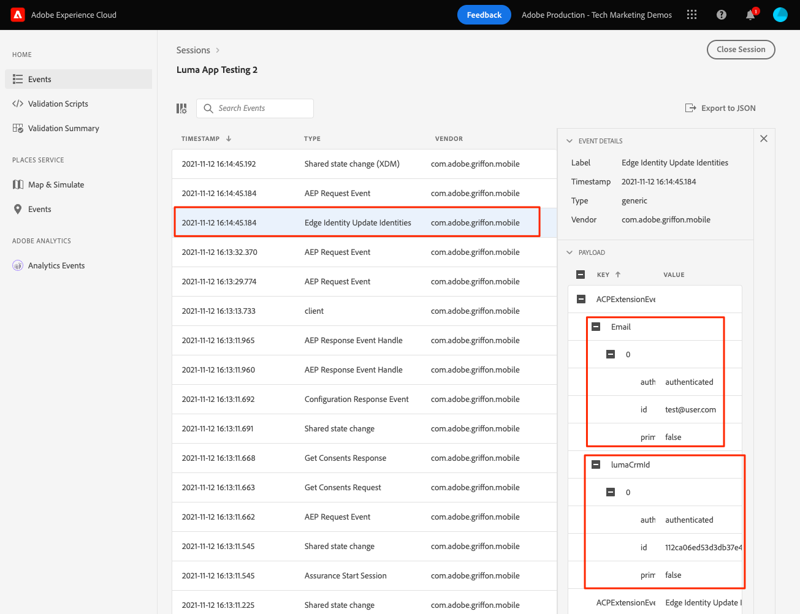

# Identità

Scopri come raccogliere i dati di identità in un’app mobile.

Il servizio Adobe Experience Platform Identity consente di acquisire una visione migliore dei clienti e dei loro comportamenti attraverso il collegamento di identità tra dispositivi e sistemi, consentendo di fornire in tempo reale esperienze digitali personali e di forte impatto. I campi e i namespace di identità sono la colla che unisce diverse origini dati per creare il profilo cliente in tempo reale a 360 gradi.

Ulteriori informazioni sulle [Estensione Identity](https://aep-sdks.gitbook.io/docs/foundation-extensions/identity-for-edge-network) e [servizio di identità](https://experienceleague.adobe.com/docs/experience-platform/identity/home.html?lang=it) nella documentazione.

## Prerequisiti

* L’app è stata generata ed eseguita correttamente con gli SDK installati e configurati.

## Finalità di apprendimento

In questa lezione:

* Aggiorna un&#39;identità standard.
* Imposta un&#39;identità personalizzata.
* Aggiorna un&#39;identità personalizzata.
* Convalida il grafico dell&#39;identità.
* Ottieni ECID e altre identità.

## Aggiornare un&#39;identità standard

Per prima cosa, aggiorna la mappa di identità dell’utente al momento dell’accesso.

1. Passa a `Login.swift` se l’app Luma e trovi la funzione denominata `loginButt`.

   Nell’app di esempio Luma, non è disponibile alcuna convalida di nome utente o password. È sufficiente toccare i pulsanti per accedere.

1. Crea il `IdentityMap` e `IdentityItem`.

   ```swift
   let identityMap: IdentityMap = IdentityMap()
   let emailIdentity = IdentityItem(id: emailAddress, authenticatedState: AuthenticatedState.authenticated)
   ```

1. Aggiungi il `IdentityItem` al `IdentityMap`

   ```swift
   identityMap.add(item:emailIdentity, withNamespace: "Email")
   ```

1. Chiamata `updateIdentities` per inviare i dati a Platform Edge Network.

   ```swift
   Identity.updateIdentities(with: identityMap)
   ```

>[!NOTE]
>
>Puoi inviare più identità in una singola chiamata updateIdentities . Puoi anche modificare le identità inviate in precedenza.


## Configurare uno spazio dei nomi di identità personalizzato

Gli spazi dei nomi di identità sono componenti di [Servizio identità](https://experienceleague.adobe.com/docs/experience-platform/identity/home.html?lang=en) che fungono da indicatori del contesto a cui si riferisce un&#39;identità. Ad esempio, distinguono un valore di &quot;name@email.com&quot; come indirizzo e-mail o &quot;443522&quot; come ID CRM numerico.

1. Nell’interfaccia Raccolta dati, seleziona **[!UICONTROL Identità]** dalla barra di navigazione a sinistra.
1. Seleziona **[!UICONTROL Creare uno spazio dei nomi di identità]**.
1. Fornisci un **[!UICONTROL Nome visualizzato]** di `Luma CRM ID` e **[!UICONTROL Simbolo di identità]** valore `lumaCrmId`.
1. Seleziona **[!UICONTROL ID multi-dispositivo]**.
1. Seleziona **[!UICONTROL Crea]**.


## Aggiornare un&#39;identità personalizzata

Dopo aver creato un’identità personalizzata, inizia a raccoglierla modificando il `updateIdentities` codice aggiunto nel passaggio precedente. È sufficiente creare un oggetto IdentityItem e aggiungerlo a IdentityMap. Ecco come dovrebbe essere il blocco di codice completo:

```swift
//Hardcoded identity values
let emailAddress = "testuser@gmail.com"
let crmId = "112ca06ed53d3db37e4cea49cc45b71e"

// Create identity map
let identityMap: IdentityMap = IdentityMap()
// Add email (standard)
let emailIdentity = IdentityItem(id: emailAddress, authenticatedState: AuthenticatedState.authenticated)
identityMap.add(item:emailIdentity, withNamespace: "Email")
// Add lumaCrmId (custom)
let crmIdentity = IdentityItem(id: crmId, authenticatedState: AuthenticatedState.authenticated)
identityMap.add(item: crmIdentity, withNamespace: "lumaCrmId")
// Update
Identity.updateIdentities(with: identityMap)
```

## Rimuovere un&#39;identità

È possibile utilizzare `removeIdentity` per rimuovere l&#39;identità dalla IdentityMap lato client memorizzata. L’estensione Identity interrompe l’invio dell’identificatore alla rete Edge. L’utilizzo di questa API non rimuove l’identificatore dal grafico dei profili utente o dal grafico delle identità lato server.

Aggiungi quanto segue `removeIdentity` codice al pulsante logout fai clic su in `Account.swift`.

```swift
// Logout
let logout = UIAlertAction(title: "Logout", style: .destructive, handler: { (action) -> Void in
    isLoggedIn = false;
    ////Hardcoded identity values
    let emailAddress = "testuser@gmail.com"
    let crmId = "112ca06ed53d3db37e4cea49cc45b71e"
    // Adobe Experience Platform - Remove Identity
    Identity.removeIdentity(item: IdentityItem(id: emailAddress), withNamespace: "Email")
    Identity.removeIdentity(item: IdentityItem(id: crmId), withNamespace: "lumaCrmId")
})
```

>[!NOTE]
>Negli esempi precedenti, `crmId` e `emailAddress` sono codificati ma in un’app reale i valori saranno dinamici.

## Convalida con affidabilità

1. Consulta la sezione [istruzioni di configurazione](assurance.md) e collegare il simulatore o il dispositivo a Assurance.
1. Nell’app, seleziona l’icona Account in basso a destra.

   
1. Seleziona la **Accesso** pulsante .
1. Ti viene offerta l&#39;opzione di inserire un nome utente e una password, entrambi opzionali e puoi semplicemente selezionare **Accesso**.

   
1. Cerca nell’interfaccia utente web di Assurance per `Edge Identity Update Identities` evento dal `com.adobe.griffon.mobile` fornitore.
1. Seleziona l’evento e rivedi i dati nel `ACPExtensionEventData` oggetto. Dovresti vedere le identità che hai aggiornato.
   

## Convalida con grafico dell’identità

Una volta completati i passaggi nel [Experience Platform](platform.md), puoi anche confermare l’acquisizione dell’identità nel visualizzatore grafico dell’identità delle piattaforme:


Avanti: **[Profilo](profile.md)**

>[!NOTE]
>
>Grazie per aver investito il tuo tempo nell&#39;apprendimento dell&#39;SDK di Adobe Experience Platform Mobile. In caso di domande, se desideri condividere feedback generali o se hai suggerimenti su contenuti futuri, condividi questi su questo [Experience League Articolo di discussione della Comunità](https://experienceleaguecommunities.adobe.com/t5/adobe-experience-platform-launch/tutorial-discussion-implement-adobe-experience-cloud-in-mobile/td-p/443796)