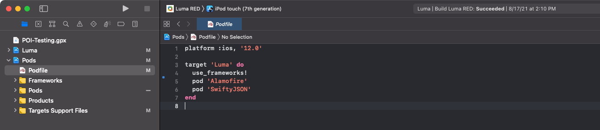

# Installare gli SDK di Adobe Experience Platform Mobile

Scopri come implementare l’SDK di Adobe Experience Platform Mobile in un’app mobile.

## Prerequisiti

* La libreria di tag è stata creata con le estensioni descritte in [lezione precedente](configure-tags.md).
* ID file dell’ambiente di sviluppo da [Istruzioni di installazione per dispositivi mobili](configure-tags.md#generate-sdk-install-instructions).
* Scaricato, vuoto [app di esempio](https://github.com/Adobe-Marketing-Cloud/Luma-iOS-Mobile-App){target="_blank"}.
* Esperienza con [Xcode](https://developer.apple.com/xcode/){target="_blank"}.
* Base [riga di comando](https://en.wikipedia.org/wiki/Command-line_interface){target="_blank"} conoscenza.

## Finalità di apprendimento

In questa lezione verranno fornite le seguenti informazioni:

* Aggiorna il file CocoaPod.
* Importa gli SDK richiesti.
* Registra le estensioni.

>[!NOTE]
>
>In un’implementazione per app mobile, i termini &quot;estensioni&quot; e &quot;SDK&quot; sono quasi intercambiabili.


## Aggiorna PodFile

>[!NOTE]
>
> Se non hai familiarità con CocoaPods, consulta la documentazione ufficiale [guida introduttiva](https://guides.cocoapods.org/using/getting-started.html).

L’installazione è in genere un semplice comando sudo:

```console
sudo gem install cocoapods
```

Una volta che hai installato CocoaPods, apri il Podfile.



Aggiorna il file per includere i seguenti pod:

```swift
pod 'AEPCore', '~> 3'
pod 'AEPEdge', '~> 1'
pod 'AEPUserProfile', '~> 3'
pod 'AEPAssurance', '~> 3'
pod 'AEPServices', '~> 3'
pod 'AEPEdgeConsent', '~> 1'
pod 'AEPLifecycle', '~>3'
pod 'AEPMessaging', '~>1'
pod 'AEPEdgeIdentity', '~>1'
pod 'AEPSignal', '~>3'
```

>[!NOTE]
>
> `AEPMessaging` è richiesto solo se intendi implementare i messaggi push utilizzando Adobe Journey Optimizer. Leggi l&#39;esercitazione su [implementazione dei messaggi push con Adobe Journey Optimizer](journey-optimizer-push.md) per ulteriori informazioni.

Dopo aver salvato le modifiche al Podfile, passa alla cartella con il progetto ed esegui il comando `pod install` per installare le modifiche.


>[!NOTE]
>
> Se ottieni il messaggio &quot;Nessun podfile trovato nella directory del progetto&quot;. errore, il terminale si trova nella cartella sbagliata. Passa alla cartella con il Podfile aggiornato e riprova.

Se desideri eseguire l’aggiornamento alla versione più recente, esegui `pod update` comando.

>[!INFO]
>
>Se non sei in grado di utilizzare i CocoaPods nelle tue app, puoi scoprire di più [implementazioni supportate](https://github.com/adobe/aepsdk-core-ios#binaries) nel progetto GitHub.

## CocoaPods di build

Per creare CocoaPods, apri `Luma.xcworkspace`, e seleziona **Prodotto**, seguito da **Pulisci cartella di compilazione**.

>[!NOTE]
>
> Potrebbe essere necessario impostare **Crea solo architettura attiva** a **No**. A questo scopo, seleziona il progetto Pod dal navigatore del progetto, quindi fai clic su **Impostazioni build**, e impostare **Creare un’architettura attiva** a **No**.

Ora puoi generare ed eseguire il progetto.


>[!NOTE]
>
>Il progetto Luma è stato creato con Xcode v12.5 su un chipset M1 e funziona sul simulatore iOS. Se utilizzi una configurazione diversa, potrebbe essere necessario modificare le impostazioni della build per riflettere l’architettura.
>
>Se la build non ha avuto successo, prova a ripristinare **Creare un’architettura attiva** > **Debug** ripristino di **Sì**.
>
>Durante la creazione di questa esercitazione è stata utilizzata la configurazione del simulatore &quot;iPod touch (7a generazione)&quot;.

## Importare estensioni

In ciascuno dei `.swift` , aggiungere le importazioni seguenti. Inizia aggiungendo a `AppDelegate.swift`.

```swift
import AEPUserProfile
import AEPAssurance
import AEPEdge
import AEPCore
import AEPEdgeIdentity
import AEPEdgeConsent
import AEPLifecycle
import AEPMessaging //Optional, used for AJO push messaging
import AEPSignal
import AEPServices
```

## Aggiorna AppDelegate

In `AppDelegate.swift` , aggiungi il seguente codice a `didFinishLaunchingWithOptions`. Sostituisci currentAppId con il valore ID file dell’ambiente di sviluppo recuperato dai tag in [lezione precedente](configure-tags.md).

```swift
let currentAppId = "b5cbd1a1220e/bae66382cce8/launch-88492c6dcb6e-development"

let extensions = [Edge.self, Assurance.self, Lifecycle.self, UserProfile.self, Consent.self, AEPEdgeIdentity.Identity.self, Messaging.self]

MobileCore.setLogLevel(.trace)

MobileCore.registerExtensions(extensions, {
    MobileCore.configureWith(appId: currentAppId)
})
```

`Messaging.self` è richiesto solo se intendi implementare i messaggi push tramite Adobe Journey Optimizer come descritto [qui](journey-optimizer-push.md).

Il codice di cui sopra esegue le seguenti operazioni:

* Registra le estensioni richieste.
* Configura MobileCore e altre estensioni per utilizzare la configurazione della proprietà tag.
* Abilita la registrazione di debug. Ulteriori dettagli e opzioni sono disponibili nella sezione [Documentazione di Mobile SDK](https://developer.adobe.com/client-sdks/documentation/getting-started/enable-debug-logging/).

>[!IMPORTANT]
>In un’app di produzione, devi cambiare AppId in base all’ambiente corrente (dev/stag/prod).

Successivo: **[Configura Assurance](assurance.md)**

>[!NOTE]
>
>Grazie per aver dedicato il tuo tempo all’apprendimento dell’SDK di Adobe Experience Platform Mobile. Se hai domande, vuoi condividere commenti generali o suggerimenti su contenuti futuri, condividili su questo [Experience League post di discussione community](https://experienceleaguecommunities.adobe.com/t5/adobe-experience-platform-launch/tutorial-discussion-implement-adobe-experience-cloud-in-mobile/td-p/443796)