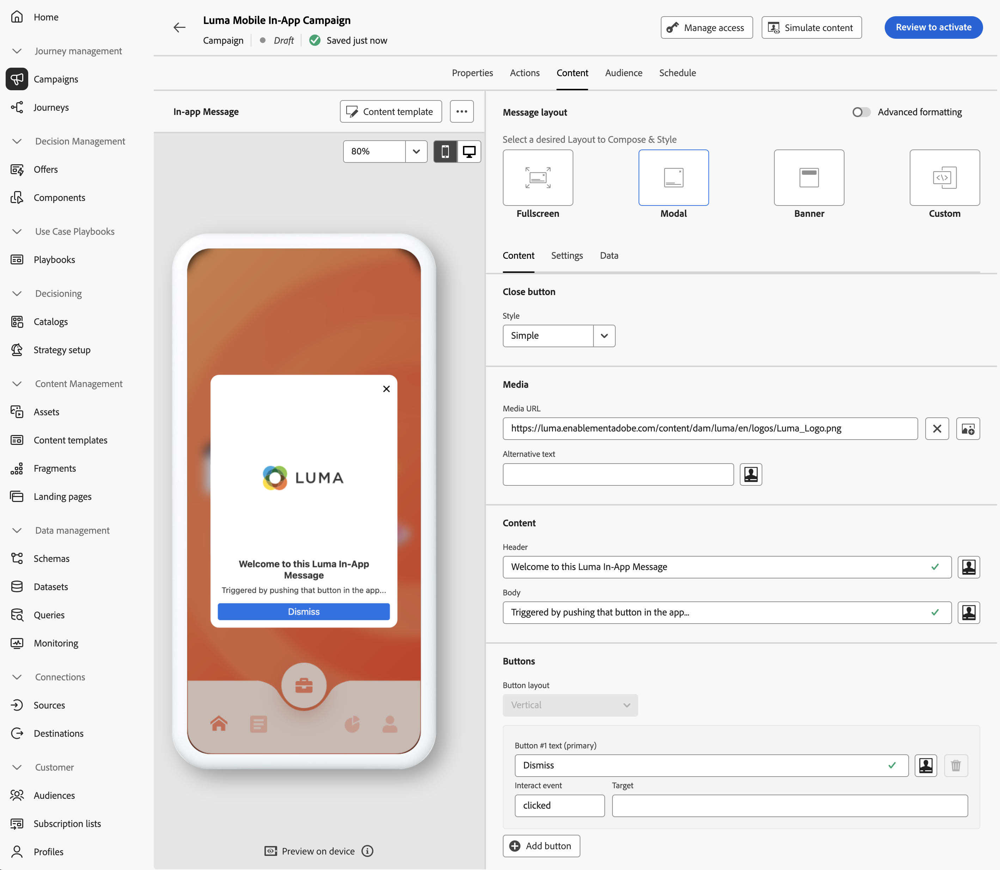

# Creare e inviare messaggi in-app

Scopri come creare messaggi in-app per le app mobili con Experience Platform Mobile SDK e Journey Optimizer.

Journey Optimizer consente di creare campagne per inviare messaggi in-app a tipi di pubblico mirati. Le campagne in Journey Optimizer vengono utilizzate per fornire contenuti una tantum a un pubblico specifico utilizzando vari canali. Con le campagne, le azioni vengono eseguite simultaneamente, immediatamente o in base a una pianificazione specifica. Quando si utilizzano i percorsi (consulta la lezione [Notifiche push di Journey Optimizer](journey-optimizer-push.md)), le azioni vengono eseguite in sequenza.

{zoomable="yes"}

Prima di inviare messaggi in-app con Journey Optimizer, è necessario assicurarsi che siano presenti le configurazioni e le integrazioni corrette. Per informazioni sul flusso di dati dei messaggi in-app in Journey Optimizer, consulta [la documentazione](https://experienceleague.adobe.com/it/docs/journey-optimizer/using/in-app/inapp-configuration).

>[!NOTE]
>
>Questa lezione è facoltativa e si applica solo agli utenti di Journey Optimizer che desiderano inviare messaggi in-app.


## Prerequisiti

* L&#39;app con gli SDK installati e configurati è stata creata ed eseguita correttamente.
* Configura l’app per Adobe Experience Platform.
* Accesso a Journey Optimizer e [autorizzazioni sufficienti per le notifiche push](https://experienceleague.adobe.com/it/docs/journey-optimizer/using/push/push-config/push-configuration). È inoltre necessaria un&#39;autorizzazione sufficiente per le seguenti funzioni di Journey Optimizer.
   * Gestire le campagne.
* Dispositivo fisico iOS o simulatore per test.


## Obiettivi di apprendimento

In questa lezione, potrai

* Crea una configurazione di canale in Journey Optimizer.
* Installa e configura l’estensione tag Journey Optimizer.
* Aggiorna l’app per registrare l’estensione tag Journey Optimizer.
* Convalida la configurazione in Assurance.
* Definisci la tua esperienza di campagna e messaggio in-app in Journey Optimizer.
* Invia il tuo messaggio in-app dall’app.

## Configurazione

>[!TIP]
>
>Se l&#39;ambiente è già stato configurato nell&#39;ambito della lezione [Messaggi push di Journey Optimizer](journey-optimizer-push.md), è possibile che siano già stati eseguiti alcuni dei passaggi descritti in questa sezione di installazione.


### Creare una configurazione dei canali

Per iniziare, devi creare una configurazione di canale per poter inviare notifiche di messaggi app da Journey Optimizer.

1. Nell&#39;interfaccia di Journey Optimizer aprire il menu **[!UICONTROL Canali]** > **[!UICONTROL Impostazioni generali]** > **[!UICONTROL Configurazioni canale]** e quindi selezionare **[!UICONTROL Crea configurazione canale]**.

1. Immetti un nome e una descrizione (facoltativa) per la configurazione. Ad esempio, `LumaInAppMessaging` e `Channel for in-app messaging`.

   >[!NOTE]
   >
   > I nomi devono iniziare con una lettera (A-Z). Può contenere solo caratteri alfanumerici. È inoltre possibile utilizzare i caratteri trattino basso `_`, punto `.` e trattino `-`.

1. Per assegnare etichette di utilizzo dei dati personalizzate o di base alla configurazione, è possibile selezionare **[!UICONTROL Gestisci accesso]**. [Ulteriori informazioni sul controllo degli accessi a livello di oggetto](https://experienceleague.adobe.com/it/docs/journey-optimizer/using/access-control/object-based-access).

1. Seleziona il canale **Messaggistica in-app**.

1. Seleziona **[!UICONTROL Azione di marketing]** per associare i criteri di consenso ai messaggi utilizzando questa configurazione. Tutti i criteri di consenso associati all’azione di marketing vengono utilizzati per rispettare le preferenze dei clienti. [Ulteriori informazioni sulle azioni di marketing](https://experienceleague.adobe.com/it/docs/journey-optimizer/using/privacy/consent/consent#surface-marketing-actions). Ad esempio: Push Targeting.

1. Seleziona la Piattaforma per la quale vuoi definire le impostazioni. Questa impostazione consente di specificare l’app di destinazione per ogni piattaforma e garantisce la distribuzione coerente dei contenuti su più piattaforme.

   >[!NOTE]
   >
   >Per le piattaforme iOS e Android, la consegna si basa esclusivamente sull’ID app. Se entrambe le app condividono lo stesso ID app, il contenuto viene distribuito a entrambi, indipendentemente dalla piattaforma selezionata nella **[!UICONTROL configurazione canale]**.

1. Immetti gli ID app per la piattaforma da supportare.

   {zoomable="yes"}

1. Seleziona **[!UICONTROL Invia]** per salvare le modifiche.

### Aggiorna configurazione dello stream di dati

Per fare in modo che i dati inviati dalla tua app mobile ad Edge Network vengano inoltrati a Journey Optimizer, aggiorna la configurazione di Experience Edge.


1. Nell&#39;interfaccia utente di Data Collection, seleziona **[!UICONTROL Datastreams]** e quindi il tuo datastream, ad esempio **[!DNL Luma Mobile App]**.
1. Seleziona  per **[!UICONTROL Experience Platform]** e seleziona  **[!UICONTROL Modifica]** dal menu di scelta rapida.
1. Nella schermata **[!UICONTROL Datastreams]** >  > **[!UICONTROL Adobe Experience Platform]**, assicurati che sia selezionato **[!UICONTROL Adobe Journey Optimizer]**. Per ulteriori informazioni, vedere [Impostazioni di Adobe Experience Platform](https://experienceleague.adobe.com/it/docs/experience-platform/datastreams/configure).
1. Per salvare la configurazione dello stream di dati, seleziona **[!UICONTROL Salva]**.


   {zoomable="yes"}


### Installare l’estensione dei tag di Journey Optimizer

Affinché l&#39;app funzioni con Journey Optimizer, devi aggiornare la proprietà del tag.

1. Passa a **[!UICONTROL Tag]** > **[!UICONTROL Estensioni]** > **[!UICONTROL Catalogo]**.
1. Apri la proprietà, ad esempio **[!DNL Luma Mobile App Tutorial]**.
1. Seleziona **[!UICONTROL Catalogo]**.
1. Cerca l&#39;estensione **[!UICONTROL Adobe Journey Optimizer]**.
1. Installa l’estensione.

Quando *solo* utilizza i messaggi in-app nell&#39;app, in **[!UICONTROL Installa estensione]** o **[!UICONTROL Configura estensione]**, non è necessario configurare nulla. Se hai già seguito la lezione [Notifiche push](journey-optimizer-push.md) nell&#39;esercitazione, noterai che per l&#39;ambiente **[!UICONTROL Sviluppo]**, il set di dati **[!UICONTROL AJO Push Tracking Experience Event]** è selezionato dall&#39;elenco **[!UICONTROL Set di dati evento]**.


### Implementare Journey Optimizer nell’app

Come descritto nelle lezioni precedenti, l’installazione di un’estensione tag per dispositivi mobili fornisce solo la configurazione. A questo punto è necessario installare e registrare il SDK di messaggistica. Se questi passaggi non sono chiari, controlla la sezione [Installare gli SDK](install-sdks.md).

>[!NOTE]
>
>Se hai completato la sezione [Installare gli SDK](install-sdks.md), SDK è già installato e puoi saltare questo passaggio.
>

>[!BEGINTABS]

>[!TAB iOS]

1. In Xcode, accertati che [Messaggistica AEP](https://github.com/adobe/aepsdk-messaging-ios) sia aggiunto all&#39;elenco dei pacchetti nelle dipendenze dei pacchetti. Consulta [Gestione pacchetti Swift](install-sdks.md#swift-package-manager).
1. Passa a **[!DNL Luma]** > **[!DNL Luma]** > **[!UICONTROL AppDelegate]** nel Navigatore progetti Xcode.
1. Assicurarsi che `AEPMessaging` faccia parte dell&#39;elenco delle importazioni.

   `import AEPMessaging`

1. Assicurarsi che `Messaging.self` faccia parte dell&#39;array di estensioni che si sta registrando.

   ```swift
   let extensions = [
       AEPIdentity.Identity.self,
       Lifecycle.self,
       Signal.self,
       Edge.self,
       AEPEdgeIdentity.Identity.self,
       Consent.self,
       UserProfile.self,
       Places.self,
       Messaging.self,
       Optimize.self,
       Assurance.self
   ]
   ```

>[!TAB Android]

1. In Android Studio, assicurati che [aepsdk-messaging-android](https://github.com/adobe/aepsdk-messaging-android) faccia parte delle dipendenze in **[!UICONTROL build.gradle.kts]** in **[!UICONTROL Android]**  > **[!UICONTROL Gradle Scripts]**. Vedi [Gradle](install-sdks.md#gradle).
1. Passa a **[!UICONTROL Android]**  **[!DNL app]** > **[!DNL kotlin+java]** > **[!UICONTROL com.adobe.luma.tutorial.android]** > **[!UICONTROL LumaApplication]** nel Navigatore progetti di Android Studio.
1. Assicurarsi che `com.adobe.marketing.mobile.Messaging` faccia parte dell&#39;elenco delle importazioni.

   `import import com.adobe.marketing.mobile.Messaging`

1. Assicurarsi che `Messaging.EXTENSION` faccia parte dell&#39;array di estensioni che si sta registrando.

   ```kotlin
   val extensions = listOf(
       Identity.EXTENSION,
       Lifecycle.EXTENSION,
       Signal.EXTENSION,
       Edge.EXTENSION,
       Consent.EXTENSION,
       UserProfile.EXTENSION,
       Places.EXTENSION,
       Messaging.EXTENSION,
       Optimize.EXTENSION,
       Assurance.EXTENSION
   )
   ```

>[!ENDTABS]

## Convalidare la configurazione con Assurance

1. Consulta la sezione [istruzioni di installazione](assurance.md#connecting-to-a-session) per collegare il simulatore o il dispositivo ad Assurance.
1. Nell&#39;interfaccia utente di Assurance, seleziona **[!UICONTROL Configura]**.
   {zoomable="yes"}
1. Seleziona il pulsante  accanto a **[!UICONTROL Messaggistica in-app]**.
1. Seleziona **[!UICONTROL Salva]**.
   {zoomable="yes"}
1. Seleziona **[!UICONTROL Messaggistica in-app]** dal menu di navigazione a sinistra.
1. Selezionare la scheda **[!UICONTROL Convalida]**. Verifica che non siano presenti errori.

   {zoomable="yes"}


## Creare un messaggio in-app personalizzato

Per creare un messaggio in-app personalizzato, devi definire una campagna in Journey Optimizer che attivi un messaggio in-app in base agli eventi che si verificano. Questi eventi possono essere:

* dati inviati a Adobe Experience Platform,
* eventi di tracciamento di base, come azioni, oppure stato o raccolta di dati PII, tramite le API generiche core mobile,
* eventi del ciclo di vita dell&#39;applicazione, ad esempio avvio, installazione, aggiornamento, chiusura o arresto anomalo,
* eventi di geolocalizzazione, come l’ingresso o l’uscita da un punto di interesse.

In questo tutorial, utilizzerai le API generiche core per dispositivi mobili e indipendenti dalle estensioni (consulta [API generiche core per dispositivi mobili](https://developer.adobe.com/client-sdks/documentation/mobile-core/#mobile-core-generic-apis)) per facilitare il tracciamento degli eventi di schermate utente, azioni e dati PII. Gli eventi generati da queste API vengono pubblicati nell’hub eventi di SDK e sono disponibili per l’utilizzo da parte delle estensioni. L’hub eventi SDK fornisce la struttura dati di base associata a tutte le estensioni SDK di Mobile Platform. L&#39;hub eventi gestisce un elenco di estensioni registrate e moduli interni, un elenco di listener di eventi registrati e un database dello stato condiviso.

L’hub eventi di SDK pubblica e riceve i dati dell’evento da estensioni registrate per semplificare le integrazioni con Adobe e soluzioni di terze parti. Ad esempio, quando è installata l’estensione Optimize, l’hub eventi gestisce tutte le richieste e le interazioni con il motore di offerta Journey Optimizer - Decision Management.

1. Nell&#39;interfaccia utente di Journey Optimizer, seleziona **[!UICONTROL Campagne]** dalla barra a sinistra.
1. Seleziona **[!UICONTROL Crea campagna]**.
1. Nella finestra di dialogo **[!UICONTROL Crea campagna]**, seleziona  **[!UICONTROL Pianificato - Marketing]** e seleziona **[!UICONTROL Conferma]**.
1. Nella schermata **[!UICONTROL Campagna - *AAAA-MM-GG HH:MM:SS UTC+XX:XX*]**:

   1. Nella scheda **[!UICONTROL Proprietà]**:

      1. Immettere un nome per la campagna, ad esempio `Luma Mobile In-App Campaign`.
      1. Se necessario, aggiungi una descrizione.


   1. Selezionare la scheda **[!UICONTROL Azione]**.

      1. Sotto **[!UICONTROL Mostra messaggio se]**, selezionare  **[!UICONTROL Aggiungi azione]**. Dal menu a discesa, selezionare **[!UICONTROL Messaggio in-app]**.
      1. Dal menu a discesa **[!UICONTROL Configurazione messaggio in-app]**, seleziona la configurazione. Ad esempio, **[!UICONTROL LumaInAppMessaging]**.
      1. Seleziona  **[!UICONTROL Modifica trigger]**.
      1. Nella finestra di dialogo **[!UICONTROL Attivatore messaggio in-app]**:

         1. Seleziona **[!UICONTROL Avvio applicazione]** e seleziona **[!UICONTROL Azione di tracciamento]** dal menu a discesa.
         1. Seleziona  **[!UICONTROL Aggiungi condizione]**.
         1. Seleziona **[!UICONTROL Azione]** e **[!UICONTROL è uguale a]** dai menu a discesa.
         1. Immettere `in-app`.
         1. Seleziona  **[!UICONTROL Aggiungi condizione]**.
         1. Seleziona **[!UICONTROL Dati contestuali]** dal menu a discesa e immetti `showMessage`.
         1. Seleziona **[!UICONTROL è uguale a]** dal menu a discesa e immetti `true`.

            {zoomable="yes"}
         1. Seleziona **[!UICONTROL Fine]**.

   1. Nella schermata principale di definizione della campagna, seleziona la scheda **[!UICONTROL Contenuto]**.

      1. Abilita **[!UICONTROL Formattazione avanzata]**.
      1. Seleziona **[!UICONTROL Modale]** come **[!UICONTROL Layout messaggi]**. Nella finestra di dialogo **[!UICONTROL Cambia layout]**, seleziona **[!UICONTROL Cambia layout]**.
      1. Nella scheda **[!UICONTROL Contenuto]**.
         1. Immetti `https://luma.enablementadobe.com/content/dam/luma/en/logos/Luma_Logo.png` per **[!UICONTROL URL file multimediale]**.
         1. Immetti un **[!UICONTROL Intestazione]**, ad esempio `Welcome to this Luma In-App Message`, e un **[!UICONTROL Corpo]**, ad esempio `Triggered by pushing that button in the app...`.

         {zoomable="yes"}

      1. Selezionare la scheda **[!UICONTROL Impostazioni]**.
         1. Seleziona **[!UICONTROL Personalizza dimensione]** in **[!UICONTROL Messaggio]**.
         1. Disabilita **[!UICONTROL Adatta al contenuto]**.
         1. Imposta **[!UICONTROL Altezza]** su **[!UICONTROL 75%]**.

         {zoomable="yes"}

1. Seleziona **[!UICONTROL Rivedi per attivare]**. Per modificare facoltativamente qualsiasi configurazione per **[!UICONTROL Contenuto]**, **[!UICONTROL Proprietà]**, **[!UICONTROL Azioni]** o altro, selezionare .
1. Nella schermata **[!UICONTROL Rivedi per attivare (*nome campagna*)]**, seleziona **[!UICONTROL Attiva]**.
1. Dopo un po&#39;, visualizzi il tuo **_nome campagna_** con stato **[!UICONTROL Live]** nell&#39;elenco **[!UICONTROL Campagne]**.
   {zoomable="yes"}


## Attivare il messaggio in-app

Disponi di tutti gli ingredienti necessari per inviare un messaggio in-app. Ciò che rimane è come attivare questo messaggio in-app nella tua app.

>[!BEGINTABS]

>[!TAB iOS]

1. Vai a **[!DNL Luma]** > **[!DNL Luma]** > **[!DNL Utils]** > **[!UICONTROL MobileSDK]** nel navigatore progetti Xcode. Trovare la funzione `func sendTrackAction(action: String, data: [String: Any]?)` e aggiungere il codice seguente, che chiama la funzione [`MobileCore.track`](https://developer.adobe.com/client-sdks/documentation/mobile-core/api-reference/#trackaction), in base ai parametri `action` e `data`.


   ```swift
   // Send trackAction event
   MobileCore.track(action: action, data: data)
   ```

1. Vai a **[!DNL Luma]** > **[!DNL Luma]** > **[!DNL Views]** > **[!DNL General]** > **[!UICONTROL ConfigView]** in Xcode Project Navigator. Trova il codice per il pulsante Messaggio in-app e aggiungi il seguente codice:

   ```swift
   // Setting parameters and calling function to send in-app message
   Task {
       MobileSDK.shared.sendTrackAction(action: "in-app", data: ["showMessage": "true"])
   }
   ```

>[!TAB Android]

1. Vai a **[!UICONTROL Android]**  > **[!DNL app]** > **[!DNL kotlin+java]** > **[!DNL com.adobe.luma.tutorial.android]** > **[!DNL models]** > **[!UICONTROL MobileSDK]** nel navigatore di Android Studio. Trovare la funzione `fun sendTrackAction(action: String, data: Map<String, String>?)` e aggiungere il codice seguente, che chiama la funzione [`MobileCore.track`](https://developer.adobe.com/client-sdks/documentation/mobile-core/api-reference/#trackaction), in base ai parametri `action` e `data`.


   ```kotlin
   // Send trackAction event
   MobileCore.track(action, data)
   ```

1. Vai a **[!UICONTROL Android]**  > **[!DNL app]** > **[!DNL kotlin+java]** > **[!DNL com.adobe.luma.tutorial.androi]** > **[!DNL views]** > **[!UICONTROL ConfigView.kt]** nel navigatore di Android Studio. Trovare il codice per il pulsante del gestore `onInAppMessageClick` e aggiungere il codice seguente:

   ```kotlin
   // Setting parameters and calling function to send in-app message
   MobileSDK.shared.sendTrackAction(
       "in-app",
       mapOf("showMessage" to "true")
   )
   ```

>[!ENDTABS]

## Convalida tramite l’app

Puoi convalidare i messaggi in-app direttamente dall’app.

>[!BEGINTABS]

>[!TAB iOS]

1. Rigenera ed esegui l&#39;app nel simulatore o su un dispositivo fisico da Xcode, utilizzando .

1. Passa alla scheda **[!UICONTROL Impostazioni]**.

1. Tocca **[!UICONTROL Messaggio In-App]**. Il messaggio in-app viene visualizzato nell’app.

   


>[!TAB Android]

1. Rigenera ed esegui l&#39;app nel simulatore o su un dispositivo fisico da Android Studio, utilizzando .

1. Passa alla scheda **[!UICONTROL Impostazioni]**.

1. Tocca **[!UICONTROL Messaggio In-App]**. Il messaggio in-app viene visualizzato nell’app.

   


>[!ENDTABS]


## Convalidare l’implementazione in Assurance

Puoi convalidare i messaggi in-app nell’interfaccia utente di Assurance.

1. Consulta la sezione [istruzioni di installazione](assurance.md#connecting-to-a-session) per collegare il simulatore o il dispositivo ad Assurance.
1. Selezionare **[!UICONTROL Messaggistica in-app]**.
1. Seleziona **[!UICONTROL Elenco eventi]**.
1. Selezionare una voce **[!UICONTROL Messaggio visualizzato]**.
1. Controllare l&#39;evento non elaborato, in particolare `html`, che contiene il layout completo e il contenuto del messaggio in-app.
   {zoomable="yes"}


## Passaggi successivi

Ora dovresti disporre di tutti gli strumenti necessari per iniziare ad aggiungere messaggi in-app, laddove opportuno e applicabile. Ad esempio, la promozione di prodotti in base a interazioni specifiche che tieni traccia nell’app.

>[!SUCCESS]
>
>Hai abilitato l’app per la messaggistica in-app e aggiunto una campagna di messaggistica in-app tramite Journey Optimizer e l’estensione Journey Optimizer per Experience Platform Mobile SDK.
>
>Grazie per aver dedicato tempo all&#39;apprendimento di Adobe Experience Platform Mobile SDK. Se hai domande, vuoi condividere commenti generali o suggerimenti su contenuti futuri, condividili in questo [post di discussione della community Experience League](https://experienceleaguecommunities.adobe.com/t5/adobe-experience-platform-data/tutorial-discussion-implement-adobe-experience-cloud-in-mobile/td-p/443796).

Successivo: **[Creare e visualizzare le offerte](journey-optimizer-offers.md)**
