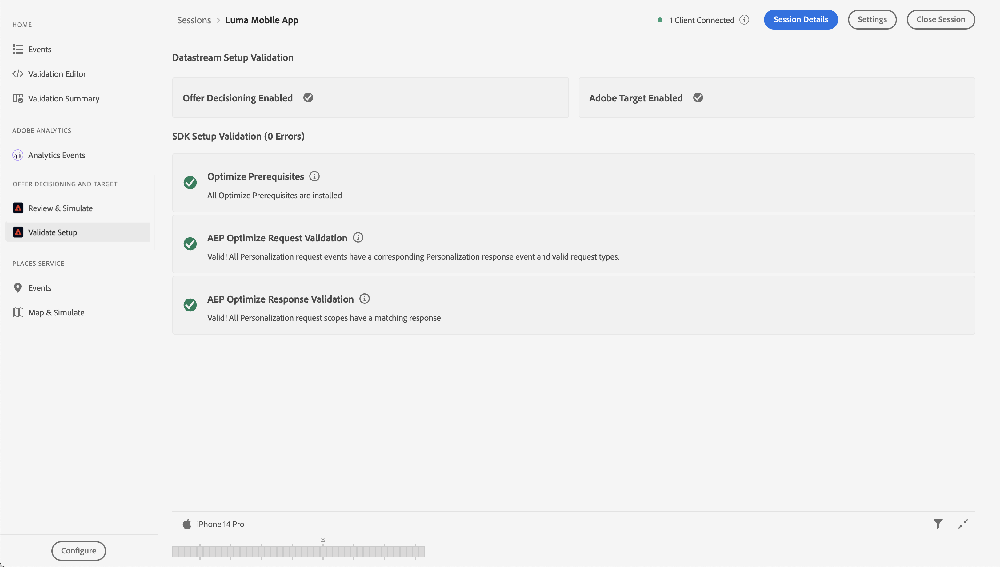

# Creare e visualizzare le offerte con Gestione delle decisioni

Scopri come mostrare le offerte da Journey Optimizer Decision Management nelle app mobili con Experience Platform Mobile SDK.

Journey Optimizer Decision Management consente di offrire ai clienti l’offerta e l’esperienza migliore al momento giusto, in tutti i punti di contatto. Una volta progettate, puoi indirizzarle al tuo pubblico con offerte personalizzate.


La gestione delle decisioni semplifica la personalizzazione con una libreria centrale di offerte di marketing e un motore decisionale che applica regole e vincoli ai profili avanzati e in tempo reale creati da Adobe Experience Platform. Di conseguenza, ti consente di inviare ai clienti l’offerta giusta al momento giusto. Per ulteriori informazioni, vedere [Informazioni sulla gestione delle decisioni](https://experienceleague.adobe.com/docs/journey-optimizer/using/offer-decisioning/get-started-decision/starting-offer-decisioning.html?lang=en).


>[!NOTE]
>
>Questa lezione è facoltativa e si applica solo agli utenti di Journey Optimizer che desiderano utilizzare la funzionalità di gestione delle decisioni per visualizzare le offerte in un’app mobile.


## Prerequisiti

* L&#39;app con gli SDK installati e configurati è stata creata ed eseguita correttamente.
* Configura l’app per Adobe Experience Platform.
* Accedi a Journey Optimizer - Gestione delle decisioni con le autorizzazioni appropriate per gestire offerte e decisioni come descritto [qui](https://experienceleague.adobe.com/docs/journey-optimizer/using/access-control/privacy/high-low-permissions.html?lang=en#decisions-permissions).


## Obiettivi di apprendimento

In questa lezione, potrai

* Aggiorna la configurazione di Edge per la gestione delle decisioni.
* Aggiorna la proprietà tag con l’estensione Offer Decisioning e Target.
* Aggiorna lo schema per acquisire gli eventi della proposta.
* Convalida la configurazione in Assurance.
* Creare una decisione di offerta, basata sulle offerte disponibili in Journey Optimizer - Gestione delle decisioni.
* Aggiorna l&#39;app per registrare l&#39;estensione Optimizer.
* Implementa nell’app le offerte di Gestione delle decisioni.


## Configurazione

>[!TIP]
>
>Se l&#39;ambiente è già stato configurato nell&#39;ambito della lezione [Configura test A/B con Target](target.md), è possibile che siano già stati eseguiti alcuni passaggi in questa sezione di configurazione.

### Aggiorna configurazione dello stream di dati

Per fare in modo che i dati inviati dalla tua app mobile a Platform Edge Network vengano inoltrati a Journey Optimizer - Gestione delle decisioni, aggiorna lo stream di dati.

1. Nell&#39;interfaccia utente di Data Collection, seleziona **[!UICONTROL Datastreams]** e quindi il tuo datastream, ad esempio **[!DNL Luma Mobile App]**.
1. Seleziona  per **[!UICONTROL Experience Platform]** e seleziona  **[!UICONTROL Modifica]** dal menu di scelta rapida.
1. Nella schermata **[!UICONTROL Datastreams]** >  > **[!UICONTROL Adobe Experience Platform]**, assicurati che siano selezionati **[!UICONTROL Offer Decisioning]**, **[!UICONTROL Edge Segmentation]** e **[!UICONTROL Adobe Journey Optimizer]**. Se vuoi seguire la lezione di Target, seleziona anche **[!UICONTROL Destinazioni Personalization]**. Per ulteriori informazioni, vedere [Impostazioni di Adobe Experience Platform](https://experienceleague.adobe.com/docs/experience-platform/datastreams/configure.html?lang=en#aep).
1. Per salvare la configurazione dello stream di dati, seleziona **[!UICONTROL Salva]**.

   


### Installare Journey Optimizer - Estensione tag Decisioning

1. Passa a **[!UICONTROL Tag]**, individua la proprietà del tag mobile e apri la proprietà.
1. Seleziona **[!UICONTROL Estensioni]**.
1. Seleziona **[!UICONTROL Catalogo]**.
1. Cerca l&#39;estensione **[!UICONTROL Offer Decisioning e Target]**.
1. Installa l’estensione. L&#39;estensione non richiede una configurazione aggiuntiva.

   


### Aggiornare lo schema

1. Passa all&#39;interfaccia di Data Collection e seleziona **[!UICONTROL Schemi]** dalla barra a sinistra.
1. Seleziona **[!UICONTROL Sfoglia]** dalla barra superiore.
1. Seleziona lo schema per aprirlo.
1. Nell&#39;editor schema, selezionare  **[!UICONTROL Aggiungi]** accanto a Gruppi di campi.
1. Nella finestra di dialogo **[!UICONTROL Aggiungi gruppi di campi]**,  cerca `proposition`, seleziona **[!UICONTROL Evento esperienza - Interazioni proposte]** e seleziona **[!UICONTROL Aggiungi gruppi di campi]**. Questo gruppo di campi raccoglie i dati dell’evento esperienza rilevanti per le offerte: quale offerta viene presentata, come parte di quale raccolta, decisione e altri parametri (vedi più avanti in questa lezione). Ma anche cosa sta succedendo con l&#39;offerta? È visualizzato, interagisce con, ignorato e così via?
   
1. Seleziona **[!UICONTROL Salva]** per salvare le modifiche apportate allo schema.


## Convalidare la configurazione in Assurance

Per convalidare la configurazione in Assurance:

1. Passa all’interfaccia utente di Assurance.
1. Seleziona **[!UICONTROL Configura]** nella barra a sinistra e seleziona  accanto a **[!UICONTROL Convalida installazione]** sotto **[!UICONTROL ADOBE JOURNEY OPTIMIZER DECISIONING]**.
1. Seleziona **[!UICONTROL Salva]**.
1. Seleziona **[!UICONTROL Convalida installazione]** nella barra a sinistra. Vengono convalidate sia la configurazione dello stream di dati che la configurazione di SDK nell’applicazione.
   


## Crea posizionamento

Prima di poter creare le offerte, è necessario definire come e dove posizionarle nell’app mobile. In Gestione delle decisioni, definisci i posizionamenti a questo scopo e definirai un posizionamento per il canale mobile che supporta un payload JSON:

1. Nell&#39;interfaccia utente di Journey Optimizer, seleziona  **[!UICONTROL Componenti]** da **[!UICONTROL GESTIONE DECISIONI]** nella barra a sinistra.

1. Seleziona **[!UICONTROL Posizionamenti]** dalla barra superiore.

1. Se non è presente alcun posizionamento con nome **[!UICONTROL JSON]** per dispositivi mobili **[!UICONTROL come]** Tipo di canale **[!UICONTROL e]** JSON **[!UICONTROL come]** Tipo di contenuto **[!UICONTROL , è necessario creare un posizionamento.]** In caso contrario, continuare a [Creare le offerte](#create-offers).

Per creare il posizionamento JSON per dispositivi mobili:

1. Seleziona  Crea posizionamento.

   1. nella sezione **[!UICONTROL Dettagli]**, immetti `Mobile JSON` come **[!UICONTROL Nome]**, seleziona **[!UICONTROL Mobile]** da **[!UICONTROL Tipo di canale]** e **[!UICONTROL JSON]** da **[!UICONTROL Tipo di contenuto]**.
   1. Seleziona **[!UICONTROL Salva]** per salvare il posizionamento.

   


## Crea offerte

1. Nell&#39;interfaccia utente di Journey Optimizer, seleziona  **[!UICONTROL Offerte]** da **[!UICONTROL GESTIONE DELLE DECISIONI]** nella barra a sinistra.
1. Nella schermata **[!UICONTROL Offerte]**, seleziona **[!UICONTROL Sfoglia]** per visualizzare l&#39;elenco delle offerte.
1. Seleziona **[!UICONTROL Crea offerta]**.
1. Nella finestra di dialogo **[!UICONTROL Nuova offerta]**, seleziona **[!UICONTROL Offerta personalizzata]** e fai clic su **[!UICONTROL Successiva]**.
1. Nel passaggio **[!UICONTROL Dettagli]** di **[!UICONTROL Crea una nuova offerta personalizzata]**:
   1. Immetti un **[!UICONTROL Nome]** per l&#39;offerta, ad esempio `Luma - Juno Jacket`, e una **[!UICONTROL Data e ora di inizio]** e una **[!UICONTROL Data e ora di fine]**. Al di fuori di questo intervallo di date, l’offerta non verrà selezionata dal motore della funzione Decisioni.
   1. Seleziona **[!UICONTROL Avanti]**.
      

1. Nel passaggio **[!UICONTROL Aggiungi rappresentazioni]** di **[!UICONTROL Crea una nuova offerta personalizzata]**:
   1. Seleziona  **[!UICONTROL Mobile]** dall&#39;elenco **[!UICONTROL Channel]** e seleziona **[!UICONTROL Mobile JSON]** dall&#39;elenco **[!UICONTROL Placement]**.
   1. Seleziona **[!UICONTROL Personalizzato]** per **[!UICONTROL Contenuto]**.
   1. Seleziona **[!UICONTROL Aggiungi contenuto]**. Nella finestra **[!UICONTROL Aggiungi personalizzazione]**:
      1. Se è disponibile un selettore [!UICONTROL Mode], assicurati che sia impostato su **[!UICONTROL JSON]**.
      1. Immetti il seguente JSON:

         ```json
         { 
             "title": "Juno Jacket",
             "text": "On colder-than-comfortable mornings, you'll love warming up in the Juno All-Ways Performance Jacket, designed to compete with wind and chill. Built-in Cocona&trade; technology aids evaporation, while a special zip placket and stand-up collar keep your neck protected.", 
             "image": "https://luma.enablementadobe.com/content/dam/luma/en/products/women/tops/jackets/wj06-purple_main.jpg" 
         }  
         ```

      1. Seleziona **[!UICONTROL Salva]**.
         
   1. Seleziona **[!UICONTROL Avanti]**.
      

1. Nel passaggio **[!UICONTROL Aggiungi vincoli]** di **[!UICONTROL Crea una nuova offerta personalizzata]**:
   1. Imposta **[!UICONTROL Priorità]** su `10`.
   1. Disattiva **[!UICONTROL Includi limite]**.
   1. Seleziona **[!UICONTROL Avanti]**.
      

1. Nel passaggio **[!UICONTROL Rivedi]** di **[!UICONTROL Crea nuova offerta personalizzata]**:
   1. Rivedi l&#39;offerta, quindi seleziona **[!UICONTROL Fine]**.
   1. Nella finestra di dialogo **[!UICONTROL Salva offerta]**, seleziona **[!UICONTROL Salva e approva]**.

1. Ripeti i passaggi da 3 a 8 per creare altre quattro offerte con nomi e contenuti diversi. Tutti gli altri valori di configurazione, ad esempio Data e ora di inizio o Priorità, sono simili alla prima offerta creata. Puoi creare rapidamente offerte duplicate e modificarle.

   1. Nell&#39;interfaccia utente di Journey Optimizer, seleziona  **[!UICONTROL Offerte]** dalla barra a sinistra, quindi seleziona Offerte dalla barra superiore.
   1. Seleziona la riga dell’offerta creata.
   1. Nel riquadro di destra, selezionare  **[!UICONTROL Altre azioni]** e dal menu di scelta rapida selezionare  **[!UICONTROL Duplica]**.

      Utilizza la tabella seguente per definire le altre quattro offerte.

      | Offer name (Nome offerta) | Contenuto dell’offerta in JSON |
      |---|---|
      | Luma - Afferma bottiglia d’acqua | `{ "title": "Affirm Water Bottle", "text": "You'll stay hydrated with ease with the Affirm Water Bottle by your side or in hand. Measurements on the outside help you keep track of how much you're drinking, while the screw-top lid prevents spills. A metal carabiner clip allows you to attach it to the outside of a backpack or bag for easy access.", "image": "https://luma.enablementadobe.com/content/dam/luma/en/products/gear/fitness-equipment/ug06-lb-0.jpg" }` |
      | Luma - Desiree Fitness Tee | `{ "title": "Desiree Fitness Tee", "text": "When you're too far to turn back, thank yourself for choosing the Desiree Fitness Tee. Its ultra-lightweight, ultra-breathable fabric wicks sweat away from your body and helps keeps you cool for the distance.", "image": "https://luma.enablementadobe.com/content/dam/luma/en/products/women/tops/tees/ws05-yellow_main.jpg" }` |
      | Luma - Giubbotto Adrienne Trek | `{ "title": "Adrienne Trek Jacket", "text": "You're ready for a cross-country jog or a coffee on the patio in the Adrienne Trek Jacket. Its style is unique with stand collar and drawstrings, and it fits like a jacket should.", "image": "https://luma.enablementadobe.com/content/dam/luma/en/products/women/tops/jackets/wj08-gray_main.jpg" }` |
      | Luma - Aero Daily Fitness Tee | `{ "title": "Aero Daily Fitness Tee", "text": "Need an everyday action tee that helps keep you dry? The Aero Daily Fitness Tee is made of 100% polyester wicking knit that funnels moisture away from your skin. Don't be fooled by its classic style; this tee hides premium performance technology beneath its unassuming look.", "image": "https://luma.enablementadobe.com/content/dam/luma/en/products/men/tops/tees/ms01-black_main.jpg" }` |

      {style="table-layout:fixed"}

1. Come passaggio finale, devi creare un’offerta di fallback, ovvero un’offerta inviata ai clienti che non sono idonei per altre offerte.
   1. Seleziona **[!UICONTROL Crea offerta]**.
   1. Nella finestra di dialogo **[!UICONTROL Nuova offerta]**, seleziona **[!UICONTROL Offerta personalizzata]** e **[!UICONTROL Successiva]**.
   1. Nel passaggio **[!UICONTROL Dettagli]** di **[!UICONTROL Crea nuova offerta di fallback]**, immetti un **[!UICONTROL Nome]** per l&#39;offerta, ad esempio `Luma - Fallback Offer`, e seleziona **[!UICONTROL Successivo]**.

   1. Nel passaggio **[!UICONTROL Aggiungi rappresentazioni]** di **[!UICONTROL Crea nuova offerta di fallback]**:
      1. Seleziona  **[!UICONTROL Mobile]** dall&#39;elenco **[!UICONTROL Channel]** e seleziona **[!UICONTROL Mobile JSON]** dall&#39;elenco **[!UICONTROL Placement]**.
      1. Seleziona **[!UICONTROL Personalizzato]** per **[!UICONTROL Contenuto]**.
      1. Seleziona **[!UICONTROL Aggiungi contenuto]**.
      1. Nella finestra di dialogo **[!UICONTROL Aggiungi personalizzazione]**, immetti il seguente JSON e seleziona **[!UICONTROL Salva]**:

         ```json
         {  
            "title": "Luma",
            "text": "Your store for sports wear and equipment.", 
            "image": "https://luma.enablementadobe.com/content/dam/luma/en/logos/Luma_Logo.png" 
         }  
         ```

      1. Seleziona **[!UICONTROL Avanti]**.


1. Nel passaggio **[!UICONTROL Rivedi]** di **[!UICONTROL Crea nuova offerta di fallback]**:
   1. Rivedi l&#39;offerta, quindi seleziona **[!UICONTROL Fine]**.
   1. Nella finestra di dialogo **[!UICONTROL Salva offerta]**, seleziona **[!UICONTROL Salva e approva]**.

Ora dovresti disporre del seguente elenco di offerte:


## Creare una raccolta

Per presentare un’offerta all’utente dell’app mobile, devi definire una raccolta di offerte, composta da una o più offerte create.

1. Nell&#39;interfaccia utente di Journey Optimizer, seleziona **[!UICONTROL Offerte]** dalla barra a sinistra.
1. Seleziona **[!UICONTROL Raccolte]** dalla barra superiore.
1. Selezionare  **[!UICONTROL Crea raccolta]**.
1. Nella finestra di dialogo **[!UICONTROL Nuova raccolta]**, immetti un **[!UICONTROL Nome]** per la raccolta, ad esempio `Luma - Mobile App Collection`, seleziona **[!UICONTROL Crea raccolta statica]** e fai clic su **[!UICONTROL Avanti]**.
1. In **[!DNL Luma - Mobile App Collection]**, selezionare le offerte da includere nella raccolta. Per questa esercitazione, scegli le cinque offerte create. È possibile filtrare facilmente l&#39;elenco utilizzando il campo di ricerca, ad esempio digitando **[!DNL Luma]**.
1. Seleziona **[!UICONTROL Salva]**.

   


## Creare una decisione

Il passaggio finale consiste nel definire una decisione, ovvero la combinazione di uno o più ambiti decisionali e dell’offerta di fallback.

Un ambito decisionale è una combinazione di un posizionamento specifico (ad esempio HTML in un messaggio e-mail o JSON in un’app mobile) e uno o più criteri di valutazione.

Un criterio di valutazione è la combinazione di

* una raccolta di offerte,
* regole di idoneità: ad esempio, l’offerta è disponibile solo per un pubblico specifico,
* un metodo di classificazione: quando sono disponibili più offerte tra cui scegliere, quale metodo utilizzare per classificarle (ad esempio in base alla priorità dell’offerta, utilizzando una formula o un modello di IA).

Consulta [Passaggi chiave per creare e gestire le offerte](https://experienceleague.adobe.com/docs/journey-optimizer/using/offer-decisioning/get-started-decision/key-steps.html?lang=en) per comprendere meglio come posizionamenti, regole, classificazioni, offerte, rappresentazioni, raccolte, decisioni e così via interagiscono e si relazionano tra loro. Questa lezione si concentra esclusivamente sull&#39;utilizzo dei risultati di una decisione piuttosto che sulla flessibilità nella definizione delle decisioni all&#39;interno di Journey Optimizer - Gestione delle decisioni.

1. Nell&#39;interfaccia utente di Journey Optimizer, seleziona **[!UICONTROL Offerte]** dalla barra a sinistra.
1. Seleziona **[!UICONTROL Decisioni]** dalla barra superiore.
1. Seleziona  **[!UICONTROL Crea decisione]**.
1. Nel passaggio **[!UICONTROL Dettagli]** di **[!UICONTROL Crea una nuova decisione di offerta]**:
   1. Immettere un **[!UICONTROL Nome]** per la decisione, ad esempio `Luma - Mobile App Decision`, immettere **[!UICONTROL Data e ora di inizio]** e **[!UICONTROL Data e ora di fine]**.
   1. Seleziona **[!UICONTROL Avanti]**.

1. Nel passaggio **[!UICONTROL Aggiungi ambiti decisionali]** di **[!UICONTROL Crea una nuova decisione di offerta]**:
   1. Seleziona **[!UICONTROL JSON mobile]** dall&#39;elenco **[!UICONTROL Posizionamento]**.
   1. Nel riquadro **[!UICONTROL Criteri di valutazione]**, selezionare  **[!UICONTROL Aggiungi]**.
      1. Nella finestra di dialogo **[!UICONTROL Aggiungi raccolta di offerte]**, seleziona la raccolta di offerte. Ad esempio, **[!DNL Luma - Mobile App Collection]**.
      1. Seleziona **[!UICONTROL Aggiungi]**.
         
   1. Assicurati che **[!UICONTROL None]** sia selezionato per **[!UICONTROL Eligibility]** e che **[!UICONTROL Offer priority]** sia selezionato come **[!UICONTROL metodo di classificazione]**.
   1. Seleziona **[!UICONTROL Avanti]**.
      .
1. Nel passaggio **[!UICONTROL Aggiungi offerta di fallback]** di **[!UICONTROL Crea una nuova decisione di offerta]**:
   1. Selezionare l&#39;offerta di fallback, ad esempio **[!DNL Luma - Fallback offer]**.
   1. Seleziona **[!UICONTROL Avanti]**.
1. Nel passaggio **[!UICONTROL Riepilogo]** di **[!UICONTROL Crea una nuova decisione di offerta]**:
   1. Seleziona **[!UICONTROL Fine]**.
   1. Nella finestra di dialogo **[!UICONTROL Salva decisione offerta]**, seleziona **[!UICONTROL Salva e attiva]**.
   1. Nella scheda **[!UICONTROL Decisioni]**, visualizzi la tua decisione con stato **[!UICONTROL Live]**.

La decisione sull’offerta, composta da una serie di offerte, è ora pronta per l’uso. Per utilizzare la decisione nell&#39;app, nel codice devi fare riferimento all&#39;ambito della decisione.

1. Nell&#39;interfaccia utente di Journey Optimizer, seleziona **[!UICONTROL Offerte]**.
1. Seleziona **[!UICONTROL Decisioni]** dalla barra superiore.
1. Selezionare la decisione, ad esempio **[!DNL Luma - Mobile App Decision]**.
1. Nel riquadro **[!UICONTROL Ambiti decisione]**, selezionare  **[!UICONTROL Copia]**.
1. Dal menu contestuale, selezionare **[!UICONTROL Ambito decisione]**.
   
1. Utilizza un qualsiasi editor di testo per incollare l’ambito decisionale per un utilizzo successivo. L’ambito della decisione ha il seguente formato JSON.

   ```json
   {
       "xdm:activityId":"xcore:offer-activity:xxxxxxxxxxxxxxx",
       "xdm:placementId":"xcore:offer-placement:xxxxxxxxxxxxxxx"
   }
   ```

## Implementare le offerte nell’app

Come descritto nelle lezioni precedenti, l’installazione di un’estensione tag per dispositivi mobili fornisce solo la configurazione. A questo punto è necessario installare e registrare Optimize SDK. Se questi passaggi non sono chiari, controlla la sezione [Installare gli SDK](install-sdks.md).

>[!NOTE]
>
>Se hai completato la sezione [Installare gli SDK](install-sdks.md), SDK è già installato e puoi saltare questo passaggio.
>

1. In Xcode, accertati che [AEP Optimize](https://github.com/adobe/aepsdk-messaging-ios) sia aggiunto all&#39;elenco dei pacchetti nelle dipendenze dei pacchetti. Consulta [Gestione pacchetti Swift](install-sdks.md#swift-package-manager).
1. Passa a **[!DNL Luma]** > **[!DNL Luma]** > **[!UICONTROL AppDelegate]** nel Navigatore progetti Xcode.
1. Assicurarsi che `AEPOptimize` faccia parte dell&#39;elenco delle importazioni.

   ```swift
   import AEPOptimize
   ```

1. Assicurarsi che `Optimize.self` faccia parte dell&#39;array di estensioni che si sta registrando.

   ```swift
   let extensions = [
       AEPIdentity.Identity.self,
       Lifecycle.self,
       Signal.self,
       Edge.self,
       AEPEdgeIdentity.Identity.self,
       Consent.self,
       UserProfile.self,
       Places.self,
       Messaging.self,
       Optimize.self,
       Assurance.self
   ]
   ```

1. Passa a **[!DNL Luma]** > **[!DNL Luma]** > **[!DNL Model]** > **[!DNL Data]** > **[!UICONTROL decisioni]** nel Navigator dei progetti Xcode. Aggiorna i valori `activityId` e `placementId` con i dettagli dell&#39;ambito di decisione copiati dall&#39;interfaccia di Journey Optimizer.

1. Passa a **[!DNL Luma]** > **[!DNL Luma]** > **[!DNL Utils]** > **[!UICONTROL MobileSDK]** nel Navigatore progetti Xcode. Trovare la funzione `func updatePropositionOD(ecid: String, activityId: String, placementId: String, itemCount: Int) async`. Aggiungi il seguente codice:

   ```swift
   // set up the XDM dictionary, define decision scope and call update proposition API
   Task {  
      let ecid = ["ECID" : ["id" : ecid, "primary" : true] as [String : Any]]
      let identityMap = ["identityMap" : ecid]
      let xdmData = ["xdm" : identityMap]
      let decisionScope = DecisionScope(activityId: activityId, placementId: placementId, itemCount: UInt(itemCount))
      Optimize.clearCachedPropositions()
      Optimize.updatePropositions(for: [decisionScope], withXdm: xdmData)
   }
   ```

   Questa funzione:

   * configura un dizionario XDM `xdmData` contenente l&#39;ECID per identificare il profilo per il quale si devono presentare le offerte.
   * definisce `decisionScope`, un oggetto basato sulla decisione definita nell&#39;interfaccia Journey Optimizer - Gestione decisioni e definito utilizzando l&#39;ambito di decisione copiato da [Crea una decisione](#create-a-decision).  L&#39;app Luma utilizza un file di configurazione (`decisions.json`) che recupera i parametri di ambito in base al seguente formato JSON:

     ```swift
     "scopes": [
         {
             "name": "name of the scope",
             "activityId": "xcore:offer-activity:xxxxxxxxxxxxxxx",
             "placementId": "xcore:offer-placement:xxxxxxxxxxxxxxx",
             "itemCount": 2
         }
     ]
     ```

     È tuttavia possibile utilizzare qualsiasi tipo di implementazione per assicurarsi che le API di ottimizzazione ottengano i parametri corretti (`activityId`, `placementId` e `itemCount`) per creare un oggetto [`DecisionScope`](https://developer.adobe.com/client-sdks/documentation/adobe-journey-optimizer-decisioning/api-reference/#decisionscope) valido per l&#39;implementazione. <br/>Per informazioni: gli altri valori chiave nel file `decisions.json` sono per uso futuro e non rilevanti e sono attualmente utilizzati in questa lezione e come parte dell&#39;esercitazione.

   * chiama due API: [`Optimize.clearCachePropositions`](https://support.apple.com/en-ie/guide/mac-help/mchlp1015/mac) e [`Optimize.updatePropositions`](https://developer.adobe.com/client-sdks/documentation/adobe-journey-optimizer-decisioning/api-reference/#updatepropositions).  Queste funzioni cancellano tutte le proposte memorizzate nella cache e aggiornano le proposte per questo profilo.

1. Passa a **[!DNL Luma]** > **[!DNL Luma]** > **[!DNL Views]** > **[!UICONTROL Personalization]** > **[!UICONTROL EdgeOffersView]** nel navigatore progetti Xcode. Trovare la funzione `func onPropositionsUpdateOD(activityId: String, placementId: String, itemCount: Int) async` ed esaminare il codice di questa funzione. La parte più importante di questa funzione è la chiamata API [`Optimize.onPropositionsUpdate`](https://developer.adobe.com/client-sdks/documentation/adobe-journey-optimizer-decisioning/api-reference/#onpropositionsupdate), che

   * recupera le proposte per il profilo corrente in base all’ambito della decisione (definito in Journey Optimizer - Gestione delle decisioni),
   * recupera l’offerta dalla proposta,
   * decomprime il contenuto dell’offerta in modo che possa essere visualizzato correttamente nell’app; e
   * attiva l&#39;azione `displayed()` sull&#39;offerta che invia nuovamente un evento ad Edge Network informando che l&#39;offerta è visualizzata.

1. Sempre in **[!DNL EdgeOffersView]**, aggiungi il seguente codice al modificatore `.onFirstAppear`. Questo codice assicura che il callback per l’aggiornamento delle offerte venga registrato una sola volta.

   ```swift
   // Invoke callback for offer updates
   Task {
       await self.onPropositionsUpdateOD(activityId: decision.activityId, placementId: decision.placementId, itemCount: decision.itemCount)
   }
   ```

1. Sempre in **[!UICONTROL EdgeOffersView]**, aggiungere il codice seguente al modificatore `.task`. Questo codice aggiorna le offerte quando la vista viene aggiornata.

   ```swift
   // Clear and update offers
   await self.updatePropositionsOD(ecid: currentEcid, activityId: decision.activityId, placementId: decision.placementId, itemCount: decision.itemCount)
   ```


## Convalida tramite l’app

1. Rigenera ed esegui l&#39;app nel simulatore o su un dispositivo fisico da Xcode, utilizzando .

1. Passa alla scheda **[!DNL Personalisation]**.

1. Seleziona **[!DNL Edge Personalisation]**.

1. Scorri verso l&#39;alto per visualizzare due offerte casuali dalla raccolta definita nella sezione **[!DNL DECISION LUMA - MOBILE APP DECISION]**.

   

   Le offerte sono casuali, in quanto hai assegnato a tutte la stessa priorità e la classificazione per la decisione si basa sulla priorità.


## Convalidare l’implementazione in Assurance

Per convalidare l’implementazione delle offerte in Assurance:

1. Consulta la sezione [istruzioni di installazione](assurance.md#connecting-to-a-session) per collegare il simulatore o il dispositivo ad Assurance.
1. Seleziona **[!UICONTROL Configura]** nella barra a sinistra e seleziona  accanto a **[!UICONTROL Rivedi e simula]** sotto **[!UICONTROL ADOBE JOURNEY OPTIMIZER DECISIONING]**.
1. Seleziona **[!UICONTROL Salva]**.
1. Seleziona **[!UICONTROL Rivedi e simula]** nella barra a sinistra. La configurazione dello stream di dati viene convalidata e la configurazione di SDK nell’applicazione.
1. Seleziona **[!UICONTROL Richieste]** nella barra superiore. Sono visualizzate le **[!UICONTROL Offerte]** richieste.
   

1. Puoi esplorare le schede **[!UICONTROL Simula]** e **[!UICONTROL Elenco eventi]** per ulteriori funzionalità, controllando la configurazione di Journey Optimizer Decision Management.

## Passaggi successivi

Ora dovresti disporre di tutti gli strumenti necessari per iniziare ad aggiungere ulteriori funzionalità all’implementazione di Journey Optimizer - Gestione delle decisioni. Ad esempio:

* applica parametri diversi alle offerte (ad esempio, priorità, limite).
* raccogli gli attributi del profilo nell&#39;app (vedi [Profilo](profile.md)) e utilizza questi attributi per creare tipi di pubblico. Quindi utilizza questi tipi di pubblico come parte delle regole di idoneità nella tua decisione.
* combinare più ambiti decisionali.

>[!SUCCESS]
>
>Hai abilitato l’app per la visualizzazione delle offerte tramite l’estensione Offer Decisioning e Target per Experience Platform Mobile SDK.
>
>Grazie per aver dedicato tempo all&#39;apprendimento di Adobe Experience Platform Mobile SDK. Se hai domande, vuoi condividere commenti generali o suggerimenti su contenuti futuri, condividili in questo [post di discussione della community Experience League](https://experienceleaguecommunities.adobe.com/t5/adobe-experience-platform-data/tutorial-discussion-implement-adobe-experience-cloud-in-mobile/td-p/443796).

Successivo: **[Eseguire test A/B](target.md)**
