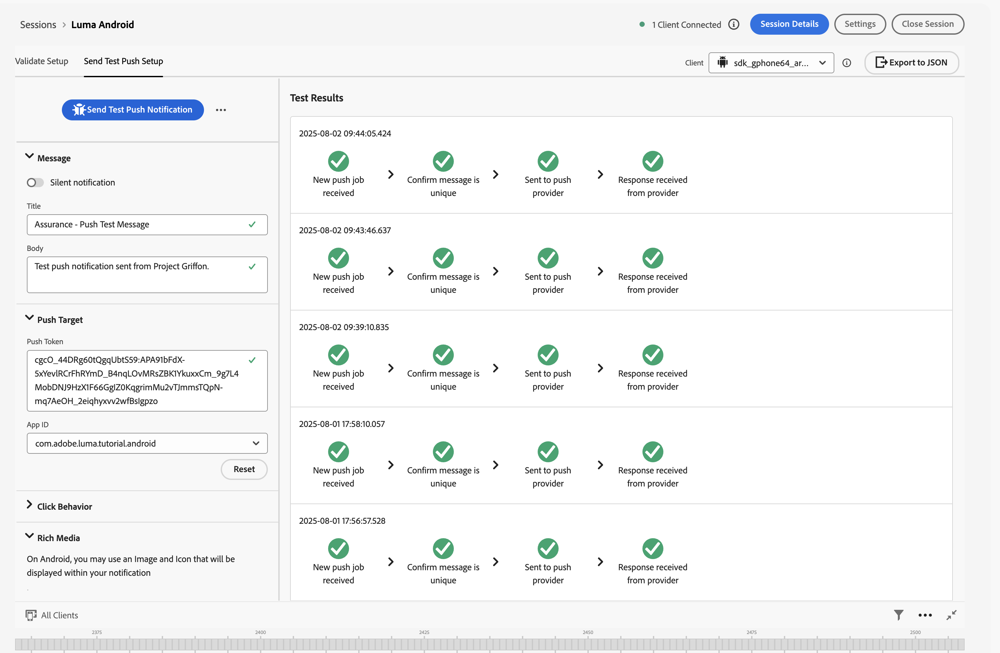

# Creare e inviare notifiche push

Scopri come creare notifiche push per le app mobili con Experience Platform Mobile SDK e Journey Optimizer.

Journey Optimizer consente di creare percorsi e inviare messaggi a tipi di pubblico mirati. Prima di inviare le notifiche push con Journey Optimizer, devi verificare che siano presenti le configurazioni e le integrazioni corrette. Per informazioni sul flusso di dati delle notifiche push in Journey Optimizer, consulta la [documentazione](https://experienceleague.adobe.com/en/docs/journey-optimizer/using/channels/push/push-config/push-gs).

{zoomable="yes"}

>[!NOTE]
>
>Questa lezione è facoltativa e si applica solo agli utenti di Journey Optimizer che desiderano inviare notifiche push.


## Prerequisiti

* L&#39;app con gli SDK installati e configurati è stata creata ed eseguita correttamente.
* Configura l’app per Adobe Experience Platform.
* Accesso a Journey Optimizer e [autorizzazioni sufficienti](https://experienceleague.adobe.com/en/docs/journey-optimizer/using/channels/push/push-config/push-configuration). È inoltre necessaria un&#39;autorizzazione sufficiente per le seguenti funzioni di Journey Optimizer.
   * Crea una credenziale push.
   * Crea una configurazione di canale push.
   * Creazione di un percorso.
   * Crea un messaggio.
   * Creare predefiniti per messaggi.
* Per iOS, un **account sviluppatore Apple a pagamento** con accesso sufficiente per creare certificati, identificatori e chiavi.
* Per Android, un account sviluppatore Google con accesso sufficiente per creare certificati e chiavi.
* Dispositivo o simulatore fisico iOS o Android da testare.

## Obiettivi di apprendimento

In questa lezione, potrai

* Registra l’ID app con il servizio di notifica push di Apple (APN).
* Crea una configurazione di canale in Journey Optimizer.
* Aggiorna lo schema per includere i campi di messaggistica push.
* Installa e configura l’estensione tag Journey Optimizer.
* Aggiorna l’app per registrare l’estensione tag Journey Optimizer.
* Convalida la configurazione in Assurance.
* Inviare un messaggio di prova da Assurance
* Definisci in Journey Optimizer l’evento, il percorso e l’esperienza della notifica push.
* Invia una notifica push personalizzata dall’app.


## Configurazione

>[!TIP]
>
>Se hai già configurato l&#39;ambiente come parte della lezione [Messaggistica in-app di Journey Optimizer](journey-optimizer-inapp.md), potresti aver già eseguito alcuni dei passaggi descritti in questa sezione di configurazione.

### Creare le credenziali push

Per le notifiche push, devi innanzitutto registrare l’app per le notifiche push.

>[!BEGINTABS]

>[!TAB iOS]

I passaggi seguenti non sono specifici per Adobe Experience Cloud e sono progettati per guidarti nella configurazione di APN.

1. Nel portale per sviluppatori Apple, passa a **[!UICONTROL Chiavi]**.
1. Per creare una chiave, selezionare **[!UICONTROL +]**.

   {zoomable="yes"}

1. Fornisci un **[!UICONTROL nome chiave]**.
1. Seleziona **[!UICONTROL Servizio di notifica push di Apple] (APNs)**, quindi seleziona **[!UICONTROL Configura]**.
   1. Nella schermata **[!UICONTROL Configura chiave]**, seleziona **[!UICONTROL Sandbox e produzione]** dal menu a discesa **[!UICONTROL Ambiente]**.
   1. Seleziona **[!UICONTROL Salva]**.
1. Seleziona **[!UICONTROL Continua]**.

   {zoomable="yes"}

1. Rivedi la configurazione e seleziona **[!UICONTROL Registra]**.
1. Scarica la chiave privata `.p8`. Viene utilizzato nell’esercizio successivo quando configuri le credenziali push di Journey Optimizer.
1. Prendere nota dell&#39;**[!UICONTROL ID chiave]**. Viene utilizzato nell’esercizio successivo quando configuri le credenziali push di Journey Optimizer.
1. Prendi nota dell&#39;**[!UICONTROL ID team]**. Viene utilizzato nell’esercizio successivo quando configuri le credenziali push di Journey Optimizer. L’ID del team si trova in alto a destra, accanto al nome di accesso.
   {zoomable="yes"}

Ulteriori informazioni sono disponibili [qui](https://help.apple.com/developer-account/#/devcdfbb56a3).

>[!TAB Android]

I passaggi seguenti non sono specifici per Adobe Experience Cloud e sono progettati per guidarti nella configurazione di Firebase.

1. Accedi alla console Firebase.
1. Selezionare **[!UICONTROL Crea un progetto Firebase]**.
   1. Immetti un **[!UICONTROL nome progetto]**.
   1. Seleziona **[!UICONTROL Continua]** in **[!UICONTROL Crea un progetto]** - **[!UICONTROL Iniziamo con un nome per il progetto]**. Ad esempio, `Luma Android App.`
   1. Disabilita **[!UICONTROL Gemini in Firebase]** e seleziona **[!UICONTROL Continua]** in **[!UICONTROL Crea un progetto]** - **[!UICONTROL Assistenza IA per il progetto Firebase]**.
   1. Disabilita **[!UICONTROL Google Analytics per questo progetto]** e seleziona **[!UICONTROL Continua]** in **[!UICONTROL Crea un progetto]** - **[!UICONTROL Google Analytics per il tuo progetto Firebase]**.
   1. Selezionare **[!UICONTROL Crea progetto]**.
   1. Quando il progetto è pronto, selezionare **[!UICONTROL Continua]**.

1. Nella console Firebase, accertati che il progetto sia selezionato in alto. Ad esempio, **[!UICONTROL App Android Luma]**.

   {zoomable="yes"}

1. Selezionare  > **[!UICONTROL Impostazioni progetto]**.

1. In **[!UICONTROL Impostazioni progetto]**, selezionare **[!UICONTROL Aggiungi app]**.
   1. In **[!UICONTROL Aggiungi Firebase all&#39;app]**, seleziona **[!UICONTROL Android]** come piattaforma.
   1. In **[!UICONTROL Aggiungi Firebase all&#39;app Android:]**
      1. Nel passaggio 1, **[!UICONTROL Registra app]**:
         1. Immetti un nome per il pacchetto Android, simile all&#39;identificatore dell&#39;app. Ad esempio, `com.adobe.luma.tutorial.android`.
         1. Immettere un nome alternativo **[!UICONTROL app]** facoltativo.
         1. Seleziona **[!UICONTROL Registra app]**.
      1. Nel passaggio 2, **[!UICONTROL Scaricare e aggiungere il file di configurazione]**.
         1. Seleziona  **[!UICONTROL Scarica google-services.json]**. Quando crei la tua versione dell&#39;app Android, devi sostituire il file `google-services.json` corrente nel progetto Android Studio di esempio con la versione del file generato da questa nuova configurazione dell&#39;app.
Gli altri passaggi vengono gestiti già nell’app di esempio.

   Lo schermo dovrebbe essere simile al seguente:

   {zoomable="yes"}

1. In **[!UICONTROL Impostazioni progetto]**, selezionare **[!UICONTROL Account servizio]**.
1. Seleziona **[!UICONTROL Genera nuova chiave privata]**. È stato generato un file `luma-android-app-firebase-adminsdk-xxxx-xxxxxxxx.json`. Archivia il file in un luogo sicuro, poiché è necessario in una fase successiva.

Per ulteriori informazioni, consulta la [documentazione per gli sviluppatori di Firebase](https://firebase.google.com/docs).

>[!ENDTABS]

### Aggiungere le credenziali push dell’app in Raccolta dati

Ora devi aggiungere le credenziali push dell’app mobile per autorizzare Adobe a inviare notifiche push per tuo conto. Puoi aggiungere credenziali push in Data Collection o in Journey Optimizer. In questa esercitazione viene utilizzata l’interfaccia di Data Collection. Le credenziali push vengono quindi collegate a una configurazione di canale in Journey Optimizer.

1. In Raccolta dati selezionare **[!UICONTROL Superfici app]**.
1. Seleziona **[!UICONTROL Crea superficie app]**.
1. Nell&#39;interfaccia **[!UICONTROL Crea superficie app]**:
   1. Immetti un **[!UICONTROL Nome]**.
   1. Seleziona **[!UICONTROL Apple iOS]** se desideri inviare notifiche push per iOS.
      1. Immetti il tuo **[!UICONTROL ID app]**, ad esempio `com.adobe.luma.tutorial.swiftui`.
      1. Seleziona la sandbox (facoltativo).
      1. Abilita **[!UICONTROL Credenziali push]**.
      1. Rilascia il file della chiave privata `.p8` salvato in **[!UICONTROL Trascina il file]**.
      1. Immetti **[!UICONTROL ID chiave]**.
      1. Immetti **[!UICONTROL ID team]**.
   1. Seleziona **[!UICONTROL Android]** se desideri inviare notifiche push per Android.
      1. Immetti il tuo **[!UICONTROL ID app]**, ad esempio `com.adobe.luma.tutorial.android`.
      1. Seleziona la sandbox (facoltativo).
      1. Abilita **[!UICONTROL Credenziali push]**.
      1. Rilascia il file `luma-android-app-firebase-adminsdk-xxxx-xxxxxxxx.json` salvato in **[!UICONTROL Trascina il file]**.

   {zoomable="yes"}

1. Seleziona **[!UICONTROL Salva]**. Se tutte le informazioni sono corrette, hai creato le credenziali push da associare a una configurazione di canale.


### Creare una configurazione di canale per il push in Journey Optimizer

Dopo aver creato una configurazione delle credenziali push, devi crearne una per poter inviare notifiche push da Journey Optimizer.

1. Nell&#39;interfaccia di Journey Optimizer aprire il menu **[!UICONTROL Canali]** > **[!UICONTROL Impostazioni generali]** > **[!UICONTROL Configurazioni canale]** e quindi selezionare **[!UICONTROL Crea configurazione canale]**.

   {zoomable="yes"}

1. Immetti un nome e una descrizione (facoltativa) per la configurazione.

   >[!NOTE]
   >
   > I nomi devono iniziare con una lettera (A-Z). Può contenere solo caratteri alfanumerici. È inoltre possibile utilizzare i caratteri trattino basso `_`, punto `.` e trattino `-`.


1. Per assegnare etichette di utilizzo dei dati personalizzate o di base alla configurazione, è possibile selezionare **[!UICONTROL Gestisci accesso]**. [Ulteriori informazioni sul controllo degli accessi a livello di oggetto](https://experienceleague.adobe.com/en/docs/journey-optimizer/using/access-control/object-based-access).

1. Seleziona il canale **Push**.


1. Seleziona **[!UICONTROL Azioni di marketing]** per associare i criteri di consenso ai messaggi utilizzando questa configurazione. Tutti i criteri di consenso associati alle azioni di marketing vengono utilizzati per rispettare le preferenze dei tuoi clienti. [Ulteriori informazioni sulle azioni di marketing](https://experienceleague.adobe.com/en/docs/journey-optimizer/using/privacy/consent/consent#surface-marketing-actions).

1. Scegli la tua **[!UICONTROL piattaforma]**. È possibile configurare sia **[!UICONTROL iOS]** che **[!UICONTROL Android]** per una configurazione del canale.

1. Seleziona il **[!UICONTROL ID app]** appropriato utilizzato in precedenza per definire le credenziali push. **[!UICONTROL com.adobe.luma.tutorial.swiftui]** per iOS e **[!UICONTROL com.adobe.luma.tutorial.android]** per Android. Il  verde indica che le credenziali push valide sono associate a una configurazione di canale.


   {zoomable="yes"}

1. Seleziona **[!UICONTROL Invia]** per salvare le modifiche.


### Aggiorna configurazione dello stream di dati

Per fare in modo che i dati inviati dalla tua app mobile ad Edge Network vengano inoltrati a Journey Optimizer, aggiorna la configurazione di Experience Edge.

1. Nell&#39;interfaccia utente di Data Collection, seleziona **[!UICONTROL Datastreams]** e quindi il tuo datastream, ad esempio **[!DNL Luma Mobile App]**.
1. Seleziona  per **[!UICONTROL Experience Platform]** e seleziona  **[!UICONTROL Modifica]** dal menu di scelta rapida.
1. Nella schermata **[!UICONTROL Datastreams]** >  > **[!UICONTROL Adobe Experience Platform]**:

   1. Se non è già selezionato, seleziona **[!UICONTROL Set di dati profilo push AJO]** da **[!UICONTROL Set di dati profilo]**. Questo set di dati profilo è necessario quando si utilizza la chiamata API `MobileCore.setPushIdentifier` (vedi [Registrare il token del dispositivo per le notifiche push](#register-device-token-for-push-notifications)). Questa selezione assicura anche che l’identificatore univoco per le notifiche push (ovvero l’identificatore push) sia memorizzato come parte del profilo dell’utente.

   1. **[!UICONTROL Adobe Journey Optimizer]** è selezionato. Per ulteriori informazioni, vedere [Impostazioni di Adobe Experience Platform](https://experienceleague.adobe.com/en/docs/experience-platform/datastreams/configure).

   1. Per salvare la configurazione dello stream di dati, seleziona **[!UICONTROL Salva]**.

   {zoomable="yes"}


### Installare l’estensione dei tag di Journey Optimizer

Affinché l&#39;app funzioni con Journey Optimizer, devi aggiornare la proprietà del tag.

1. Passa a **[!UICONTROL Tag]** > **[!UICONTROL Estensioni]** > **[!UICONTROL Catalogo]**,
1. Apri la proprietà, ad esempio **[!DNL Luma Mobile App Tutorial]**.
1. Seleziona **[!UICONTROL Catalogo]**.
1. Cerca l&#39;estensione **[!UICONTROL Adobe Journey Optimizer]**.
1. Installa l’estensione.
1. Nella finestra di dialogo **[!UICONTROL Installa estensione]**
   1. Seleziona un ambiente, ad esempio **[!UICONTROL Sviluppo]**.
   1. Seleziona il set di dati **[!UICONTROL dell&#39;evento di tracciamento push di AJO]** dall&#39;elenco **[!UICONTROL Set di dati evento]**.
   1. Selezionare **[!UICONTROL Salva nella libreria e genera]**.
      {zoomable="yes"}

>[!NOTE]
>
>Se non vedi **[!UICONTROL Set di dati evento di tracciamento push di AJO]** come opzione, contatta l&#39;assistenza clienti.
>

## Convalidare la configurazione con Assurance

1. Consulta la sezione [istruzioni di installazione](assurance.md#connecting-to-a-session) per collegare il simulatore o il dispositivo ad Assurance.
1. Nell&#39;interfaccia utente di Assurance, seleziona **[!UICONTROL Configura]**.
   {zoomable="yes"}
1. Seleziona  accanto a **[!UICONTROL Debug push]**.
1. Seleziona **[!UICONTROL Salva]**.
   {zoomable="yes"}
1. Seleziona **[!UICONTROL Debug push]** dal menu di navigazione a sinistra.
1. Selezionare la scheda **[!UICONTROL Convalida installazione]**.
1. Selezionare il dispositivo dall&#39;elenco **[!UICONTROL Client]**.
1. Verifica che non siano presenti errori.
   {zoomable="yes"}
1. Selezionare la scheda **[!UICONTROL Invia push test]**.
1. (facoltativo) Modifica i dettagli predefiniti per **[!UICONTROL Titolo]** e **[!UICONTROL Corpo]** e assicurati di fornire tutti i parametri previsti dall&#39;app, ad esempio **[!UICONTROL Avanzate]** > **[!UICONTROL Canale di notifica]** (obbligatorio per Android, ad esempio `LUMA_CHANNEL_ID`).
1. Seleziona  **[!UICONTROL Invia notifica push di prova]**.
1. Controlla i **[!UICONTROL risultati del test]**.

   {zoomable="yes"}
1. Dovresti visualizzare nell’app la notifica push di prova.

>[!BEGINTABS]

>[!TAB iOS]


>[!TAB Android]


>[!ENDTABS]

## Firma

>[!IMPORTANT]
>
>La firma di un&#39;app iOS è necessaria per inviare notifiche push su iOS e **richiede un account sviluppatore Apple a pagamento**. Non è necessario firmare un’app Android per inviare notifiche push.


Per aggiornare la firma per l&#39;app:

1. Vai all’app in Xcode.
1. Selezionare **[!DNL Luma]** nel Navigatore progetti.
1. Selezionare la destinazione **[!DNL Luma]**.
1. Selezionare la scheda **Firma e funzionalità**.
1. Configura **[!UICONTROL Firma gestione automatica]**, **[!UICONTROL Team]** e **[!UICONTROL Identificatore bundle]** oppure utilizza i dettagli specifici del provisioning di sviluppo Apple.

   >[!IMPORTANT]
   >
   >Assicurati di utilizzare un identificatore bundle _univoco_ e sostituisci l&#39;identificatore bundle `com.adobe.luma.tutorial.swiftui`, in quanto ogni identificatore bundle deve essere univoco. In genere si utilizza un formato DNS inverso per le stringhe ID bundle, come `com.organization.brand.uniqueidentifier`. La versione finale di questa esercitazione, ad esempio, utilizza `com.adobe.luma.tutorial.swiftui`.


   {zoomable="yes"}


## Aggiungere funzionalità di notifica push all’app

>[!IMPORTANT]
>
>Per implementare e testare le notifiche push in un&#39;app iOS, devi disporre di un account sviluppatore Apple **a pagamento**.

>[!BEGINTABS]

>[!TAB iOS]

1. In Xcode, seleziona **[!DNL Luma]** dall&#39;elenco **[!UICONTROL TARGET]**, seleziona la scheda **[!UICONTROL Firma e funzionalità]**, seleziona il pulsante **[!UICONTROL + funzionalità]**, quindi seleziona **[!UICONTROL Notifiche push]**. Questa selezione consente all’app di ricevere notifiche push.

1. Quindi, devi aggiungere un’estensione di notifica all’app. Torna alla scheda **[!DNL General]** e seleziona l&#39;icona **[!UICONTROL +]** nella parte inferiore della sezione **[!UICONTROL TARGET]**.

1. Viene richiesto di selezionare il modello per la nuova destinazione. Seleziona **[!UICONTROL Estensione del servizio di notifica]**, quindi seleziona **[!UICONTROL Successivo]**.

1. Nella finestra successiva, utilizza `NotificationExtension` come nome dell&#39;estensione e fai clic sul pulsante **[!UICONTROL Fine]**.

Ora dovresti avere aggiunto all’app un’estensione per le notifiche push, simile alla schermata seguente.

{zoomable="yes"}

>[!TAB Android]

Il progetto Android Studio è già configurato per le notifiche push. Non è necessario eseguire ulteriori passaggi per abilitare la versione Android dell’app Luma per le notifiche push. Per ulteriori informazioni, vedere [Informazioni sulle notifiche](https://developer.android.com/develop/ui/views/notifications).

Le notifiche push in Android richiedono la definizione di un ID canale di notifica, sia nell’app che durante l’invio di una notifica push. L&#39;ID di notifica del canale utilizzato nell&#39;app Android Luma è `LUMA_CHANNEL ID`.

>[!ENDTABS]


## Implementare Journey Optimizer nell’app

Come descritto nelle lezioni precedenti, l’installazione di un’estensione tag per dispositivi mobili fornisce solo la configurazione. A questo punto è necessario installare e registrare il SDK di messaggistica. Se questi passaggi non sono chiari, controlla la sezione [Installare gli SDK](install-sdks.md).

>[!NOTE]
>
>Se hai completato la sezione [Installare gli SDK](install-sdks.md), SDK è già installato e puoi saltare questo passaggio.
>

>[!BEGINTABS]

>[!TAB iOS]

1. In Xcode, accertati che [Messaggistica AEP](https://github.com/adobe/aepsdk-messaging-ios) sia aggiunto all&#39;elenco dei pacchetti nelle dipendenze dei pacchetti. Consulta [Gestione pacchetti Swift](install-sdks.md#swift-package-manager).
1. Passa a **[!DNL Luma]** > **[!DNL Luma]** > **[!UICONTROL AppDelegate]** nel Navigatore progetti Xcode.
1. Assicurarsi che `AEPMessaging` faccia parte dell&#39;elenco delle importazioni.

   `import AEPMessaging`

1. Assicurarsi che `Messaging.self` faccia parte dell&#39;array di estensioni che si sta registrando.

   ```swift
   let extensions = [
       AEPIdentity.Identity.self,
       Lifecycle.self,
       Signal.self,
       Edge.self,
       AEPEdgeIdentity.Identity.self,
       Consent.self,
       UserProfile.self,
       Places.self,
       Messaging.self,
       Optimize.self,
       Assurance.self
   ]
   ```

>[!TAB Android]

1. In Android Studio, assicurati che [aepsdk-messaing-android](https://github.com/adobe/aepsdk-messaging-android) faccia parte delle dipendenze in **[!UICONTROL build.gradle.kts (Modulo :app)]** in **[!UICONTROL Android]**  **[!UICONTROL Script Gradle]**. Vedi [Gradle](install-sdks.md#gradle).
1. Passa a **[!UICONTROL Android]**  > **[!DNL app]** > **[!DNL kotlin+java]** > **[!UICONTROL com.adobe.luma.tutorial.android]** > **[!UICONTROL LumaApplication]** nel Navigatore progetti di Android Studio.
1. Assicurarsi che `com.adobe.marketing.mobile.Messaging` faccia parte dell&#39;elenco delle importazioni.

   `import import com.adobe.marketing.mobile.Messaging`

1. Assicurarsi che `Messaging.EXTENSION` faccia parte dell&#39;array di estensioni che si sta registrando.

   ```kotlin
   val extensions = listOf(
       Identity.EXTENSION,
       Lifecycle.EXTENSION,
       Signal.EXTENSION,
       Edge.EXTENSION,
       Consent.EXTENSION,
       UserProfile.EXTENSION,
       Places.EXTENSION,
       Messaging.EXTENSION,
       Optimize.EXTENSION,
       Assurance.EXTENSION
   )
   ```

>[!ENDTABS]


## Registrare un token dispositivo per le notifiche push

È necessario registrare il token del dispositivo per le notifiche push.

>[!BEGINTABS]

>[!TAB iOS]

1. Passa a **[!DNL Luma]** > **[!DNL Luma]** > **[!UICONTROL AppDelegate]** nel Navigatore progetti Xcode.
1. Aggiungere l&#39;API [`MobileCore.setPushIdentifier`](https://developer.adobe.com/client-sdks/documentation/mobile-core/api-reference/#setpushidentifier) alla funzione `func application(_ application: UIApplication, didRegisterForRemoteNotificationsWithDeviceToken deviceToken: Data)`.

   ```swift
   // Send push token to Mobile SDK
   MobileCore.setPushIdentifier(deviceToken)
   ```

   Questa funzione recupera il token del dispositivo univoco per il dispositivo su cui è installata l’app. Quindi imposta il token per la consegna delle notifiche push utilizzando la configurazione impostata e che si basa sul servizio APN (Push Notification Service) di Apple.

>[!TAB Android]

1. Passa a **[!UICONTROL Android]**  > **[!DNL app]** > **[!DNL kotlin+java]** > **[!UICONTROL com.adobe.luma.tutorial.android]** > **[!UICONTROL LumaApplication]** nel Navigatore progetti di Android Studio.
1. Aggiungere l&#39;API [`MobileCore.setPushIdentifier`](https://developer.adobe.com/client-sdks/documentation/mobile-core/api-reference/#setpushidentifier) alla funzione `override fun onCreate()` in `class LumaAplication : Application`, in `FirebaseMessaging.getInstance().token.addOnCompleteListener`.

   ```kotlin
   // Send push token to Mobile SDK
   MobileCore.setPushIdentifier(token)
   ```

   Questa funzione recupera il token del dispositivo univoco per il dispositivo su cui è installata l’app. Imposta quindi il token per il recapito delle notifiche push utilizzando la configurazione configurata e basata su Firebase Cloud Messaging (FCM).

>[!ENDTABS]

>[!IMPORTANT]
>
>**Solo per iOS**: `MobileCore.updateConfigurationWith(configDict: ["messaging.useSandbox": true])` determina se le notifiche push utilizzano una sandbox APNs o un server di produzione per l&#39;invio di notifiche push. Quando esegui il test dell&#39;app nel simulatore o su un dispositivo, assicurati che `messaging.useSandbox` sia impostato su `true` in modo da ricevere le notifiche push. Quando distribuisci l&#39;app per la produzione per testare l&#39;utilizzo di Testflight di Apple, assicurati di impostare `messaging.useSandbox` su `false`, altrimenti l&#39;app di produzione non sarà in grado di ricevere notifiche push.<br/><br/>
>>Firebase Cloud Messaging (FCM) non supporta **not** il concetto di sandbox per le notifiche push.


## Creare una notifica push personalizzata

Per creare una notifica push personalizzata, devi definire un evento in Journey Optimizer che attivi un percorso che si occupi di inviare una notifica push.

### Aggiornare lo schema

Stai per definire un nuovo tipo di evento, non ancora disponibile, come parte dell’elenco degli eventi definiti nello schema. Utilizza questo tipo di evento in un secondo momento quando attivi le notifiche push.

1. Nell&#39;interfaccia utente di Journey Optimizer, seleziona **[!UICONTROL Schemi]** dalla barra a sinistra.
1. Seleziona **[!UICONTROL Sfoglia]** nella barra delle schede.
1. Selezionare lo schema, ad esempio **[!DNL Luma Mobile App Event Schema]** per aprirlo.
1. Nell’editor schema:
   1. Selezionare il campo **[!UICONTROL eventType]**.
   1. Nel riquadro **[!UICONTROL Proprietà campo]**, scorri verso il basso per visualizzare l&#39;elenco dei valori possibili per il tipo di evento. Selezionare **[!UICONTROL Aggiungi riga]** e aggiungere `application.test` come **[!UICONTROL VALORE]** e `[!UICONTROL Test event for push notification]` come `DISPLAY NAME`.
   1. Seleziona **[!UICONTROL Applica]**.
   1. Seleziona **[!UICONTROL Salva]**.

      {zoomable="yes"}

### Definire un evento

Gli eventi in Journey Optimizer ti consentono di attivare percorsi per l’invio di messaggi, ad esempio notifiche push. Per ulteriori informazioni, vedere [Informazioni sugli eventi](https://experienceleague.adobe.com/en/docs/journey-optimizer/using/configure-journeys/events-journeys/about-events).

1. Nell&#39;interfaccia utente di Journey Optimizer, seleziona **[!UICONTROL Configurazioni]** dalla barra a sinistra.

1. Nella schermata **[!UICONTROL Dashboard]**, seleziona il pulsante **[!UICONTROL Gestisci]** nel riquadro **[!UICONTROL Eventi]**.

1. Nella schermata **[!UICONTROL Eventi]**, seleziona **[!UICONTROL Crea evento]**.

1. Nel riquadro **[!UICONTROL Modifica evento evento1]**:

   1. Immetti `LumaTestEvent` come **[!UICONTROL Nome]** dell&#39;evento.
   1. Fornisci una **[!UICONTROL Descrizione]**, ad esempio `Test event to trigger push notifications in Luma app`.

   1. Seleziona lo schema evento esperienza app mobile creato in precedenza in [Crea uno schema XDM](create-schema.md) dall&#39;elenco **[!UICONTROL Schema]**, ad esempio **[!DNL Luma Mobile App Event Schema v.1]**.
   1. Seleziona  accanto all&#39;elenco **[!UICONTROL Campi]**.

      {zoomable="yes"}

      Nella finestra di dialogo **[!UICONTROL Campi]**, accertati che siano selezionati i seguenti campi (oltre ai campi predefiniti sempre selezionati (**[!UICONTROL _id]**, **[!UICONTROL id]** e **[!UICONTROL timestamp]**). Utilizzando l&#39;elenco a discesa, puoi scegliere tra **[!UICONTROL Selezionati]**, **[!UICONTROL Tutti]** e **[!UICONTROL Primari]** oppure utilizzare il campo .

      * **[!UICONTROL Applicazione identificata (ID)]**,
      * **[!UICONTROL Tipo evento (eventType)]**,
      * **[!UICONTROL Principale (primario)]**.

      {zoomable="yes"}

      Quindi selezionare **[!UICONTROL Ok]**.

   1. Seleziona  accanto al campo **[!UICONTROL Condizione ID evento]**.

      1. Nella finestra di dialogo **[!UICONTROL Aggiungi una condizione ID evento]**, trascina **[!UICONTROL Tipo evento (eventType)]** su **[!UICONTROL Trascina e rilascia qui un elemento]**.
      1. Nel popover, scorri verso il basso e seleziona **[!UICONTROL application.test]** (che è il tipo di evento aggiunto in precedenza all&#39;elenco dei tipi di evento come parte di [Aggiorna lo schema](#update-your-schema)). Quindi scorri verso l&#39;alto e seleziona **[!UICONTROL Ok]**.
      1. Selezionare **[!UICONTROL Ok]** per salvare la condizione.
         {zoomable="yes"}

   1. Selezionare **[!UICONTROL ECID (ECID)]** dall&#39;elenco **[!UICONTROL Spazio dei nomi]**. Il campo **[!UICONTROL Identificatore profilo]** viene compilato automaticamente con **[!UICONTROL ID del primo elemento dell&#39;ECID chiave per la mappa identityMap]**.
   1. Seleziona **[!UICONTROL Salva]**.
      {zoomable="yes"}

Hai appena creato una configurazione dell’evento basata sullo schema degli eventi di esperienza per app mobile creato in precedenza come parte di questa esercitazione. Questa configurazione di evento filtrerà gli eventi di esperienza in arrivo utilizzando il tipo di evento specifico (`application.test`), pertanto solo gli eventi con quel tipo specifico, avviati dall&#39;app mobile, attiveranno il percorso generato nel passaggio successivo. In uno scenario reale, potresti voler inviare notifiche push da un servizio esterno. Tuttavia, si applicano gli stessi concetti: dall’applicazione esterna invia un evento esperienza in Experience Platform che dispone di campi specifici su cui puoi applicare condizioni prima che questi eventi attivino un percorso.

### Creazione del percorso

Il passaggio successivo consiste nel creare il percorso che attiva l’invio della notifica push alla ricezione dell’evento appropriato.

1. Nell&#39;interfaccia utente di Journey Optimizer, seleziona **[!UICONTROL Percorsi]** dalla barra a sinistra.
1. Selezionare **[!UICONTROL Crea Percorso]**.
1. Nel pannello **[!UICONTROL Proprietà Percorso]**:

   1. Immetti un **[!UICONTROL Nome]** per il percorso, ad esempio `Luma - Test Push Notification Journey`.
   1. Immetti una **[!UICONTROL Descrizione]** per il percorso, ad esempio `Journey for test push notifications in Luma mobile app`.
   1. Verificare che **[!UICONTROL Consenti rientro]** sia selezionato e impostare **[!UICONTROL Periodo di attesa rientro]** su **[!UICONTROL 30]** **[!UICONTROL Secondi]**.
   1. Selezionare **[!UICONTROL Ok]**.
      {zoomable="yes"}

1. Torna all&#39;area di lavoro del percorso, da **[!UICONTROL EVENTI]**, trascina e rilascia  **[!DNL LumaTestEvent]** nell&#39;area di lavoro in cui viene visualizzato **[!UICONTROL Seleziona un evento di ingresso o un&#39;attività di lettura pubblico]**.

   * Nel pannello **[!UICONTROL Events: LumaTestEvent]**, immetti un **[!UICONTROL Label]**, ad esempio `Luma Test Event`.

1. Dal menu a discesa **[!UICONTROL ACTIONS]**, trascina e rilascia  **[!UICONTROL Push]** sulla  visualizzata a destra dell&#39;attività **[!DNL LumaTestEvent]**. Nel riquadro **[!UICONTROL Azioni: Push]**:

   1. Fornisci un **[!UICONTROL Etichetta]**, ad esempio `Luma Test Push Notification`, fornisci una **[!UICONTROL Descrizione]**, ad esempio `Test push notification for Luma mobile app`, seleziona **[!UICONTROL Transazionale]** dall&#39;elenco **[!UICONTROL Categoria]** e seleziona **[!DNL Luma]** dalla **[!UICONTROL Superficie push]**.
   1. Seleziona  **[!UICONTROL Modifica contenuto]** per iniziare a modificare la notifica push effettiva.

      {zoomable="yes"}

      Nell&#39;editor **[!UICONTROL Notifica push]**:

      1. Immetti un **[!UICONTROL Titolo]**, ad esempio `Luma Test Push Notification`, e un **[!UICONTROL Corpo]**, ad esempio `Test push notification for Luma mobile app`.
      1. Se necessario, è possibile immettere un collegamento a un&#39;immagine (.png o .jpg) in **[!UICONTROL Aggiungi file multimediali]**. In tal caso, l’immagine fa parte della notifica push. Se lo fai, devi preoccuparti di gestire correttamente l’immagine nell’app mobile.
      1. Per salvare e lasciare l&#39;editor, selezionare .

         {zoomable="yes"}

   1. Per salvare e completare la definizione della notifica push, selezionare **[!UICONTROL Ok]**.

1. Il percorso deve essere simile al seguente. Seleziona **[!UICONTROL Pubblica]** per pubblicare e attivare il percorso.
   {zoomable="yes"}


## Attivare la notifica push

Sono disponibili tutti gli ingredienti per inviare una notifica push. Ciò che rimane è come attivare questa notifica push. In sostanza, è lo stesso che hai visto prima: invia semplicemente un evento esperienza con il payload corretto (come in [Eventi](events.md)).

Questa volta l’evento esperienza che stai per inviare non è costruito per creare un semplice dizionario XDM. Stai per utilizzare un `struct` che rappresenta un payload di notifica push. La definizione di un tipo di dati dedicato rappresenta un modo alternativo di implementare la costruzione dei payload dell’evento esperienza nell’applicazione.

Tieni presente che solo a scopo illustrativo invii una notifica push dall’app. Uno scenario più tipico è l’invio dell’evento esperienza (che attiva il percorso di notifica push) da un’altra applicazione o servizio.

>[!BEGINTABS]

>[!TAB iOS]

1. Passa a **[!DNL Luma]** > **[!DNL Luma]** > **[!UICONTROL Modello]** > **[!UICONTROL XDM]** > **[!UICONTROL TestPushPayload]** nel Navigatore progetti Xcode e controlla il codice.

   ```swift
   import Foundation
   
   // MARK: - TestPush
   struct TestPushPayload: Codable {
      let application: Application
      let eventType: String
   }
   
   // MARK: - Application
   struct Application: Codable {
      let id: String
   }
   ```

   Il codice è una rappresentazione del seguente semplice payload che stai per inviare per attivare il percorso di notifica push di prova.

   ```json
   {
      "eventType": string,
      "application" : [
          "id": string
      ]
   }
   ```

1. Passa a **[!DNL Luma]** > **[!DNL Luma]** > **[!DNL Utils]** > **[!UICONTROL MobileSDK]** nel navigatore progetti Xcode e aggiungi il seguente codice a `func sendTestPushEvent(applicationId: String, eventType: String)`:

   ```swift
   // Create payload and send experience event
   Task {
       let testPushPayload = TestPushPayload(
           application: Application(
               id: applicationId
           ),
           eventType: eventType
       )
       // send the final experience event
       await sendExperienceEvent(
           xdm: testPushPayload.asDictionary() ?? [:]
       )
   }
   ```

   Questo codice crea un&#39;istanza `testPushPayload` utilizzando i parametri forniti alla funzione (`applicationId` e `eventType`), quindi chiama `sendExperienceEvent` durante la conversione del payload in un dizionario. Questo codice prende in considerazione anche gli aspetti asincroni della chiamata a Adobe Experience Platform SDK tramite l&#39;utilizzo del modello di concorrenza di Swift, basato su `await` e `async`.

1. Passa a **[!DNL Luma]** > **[!DNL Luma]** > **[!DNL Views]** > **[!DNL General]** > **[!UICONTROL ConfigView]** nel navigatore progetti Xcode. Nella definizione del pulsante di notifica push, aggiungi il seguente codice per inviare il payload dell’evento di esperienza di notifica push di prova in modo da attivare il percorso ogni volta che il pulsante viene toccato.

   ```swift
   // Setting parameters and calling function to send push notification
   Task {
       let eventType = testPushEventType
       let applicationId = Bundle.main.bundleIdentifier ?? "No bundle id found"
       await MobileSDK.shared.sendTestPushEvent(applicationId: applicationId, eventType: eventType)
   }
   ```

>[!TAB Android]

1. Passa a **[!UICONTROL Android]**  > **[!DNL app]** > **[!DNL kotlin+java]** > **[!UICONTROL com.adobe.luma.tutorial.android]** > **[!UICONTROL xdm]** > **[!UICONTROL TestPushPayload.kt]** nel navigatore di Android Studio e ispeziona il codice.

   ```kotlin
   import com.google.gson.annotations.SerializedName
   
   data class TestPushPayload(
      @SerializedName("application") val application: Application,
      @SerializedName("eventType") val eventType: String
   ) {
      fun asMap(): Map<String, Any> {
         return mapOf(
               "application" to application.asMap(),
               "eventType" to eventType
         )
      }
   }
   
   data class Application(
      @SerializedName("id") val id: String
   ) {
      fun asMap(): Map<String, Any> {
         return mapOf(
               "id" to id
         )
      }
   }
   ```

   Il codice è una rappresentazione del seguente semplice payload che stai per inviare per attivare il percorso di notifica push di prova.

   ```json
   {
      "eventType": string,
      "application" : [
          "id": string
      ]
   }
   ```

1. Passa a **[!UICONTROL Android]**  > **[!DNL app]** > **[!DNL kotlin+java]** > **[!DNL com.adobe.luma.tutorial.android]** > **[!UICONTROL models]** > **[!UICONTROL MobileSDK]** nel navigatore di Android Studio e aggiungi il seguente codice a `func sendTestPushEvent(applicationId: String, eventType: String)`:

   ```kotlin
   // Create payload and send experience event
   val testPushPayload = TestPushPayload(
      Application(applicationId),
      eventType
   )
   sendExperienceEvent(testPushPayload.asMap())
   ```

   Questo codice crea un&#39;istanza `testPushPayload` utilizzando i parametri forniti alla funzione (`applicationId` e `eventType`), quindi chiama `sendExperienceEvent` durante la conversione del payload in una mappa.

1. Passa a **[!UICONTROL Android]**  > **[!DNL app]** > **[!DNL kotlin+java]** > **[!DNL com.adobe.luma.android.tutorial]** > **[!DNL views]** > **[!UICONTROL ConfigView.kt]** nel navigatore di Android Studio. Nella definizione del pulsante di notifica push, aggiungi il seguente codice per inviare il payload dell’evento di esperienza di notifica push di prova in modo da attivare il percorso ogni volta che il pulsante viene toccato.

   ```kotlin
   // Setting parameters and calling function to send push notification
   val eventType = testPushEventType
   val applicationId = context.packageName
   scope.launch {
         MobileSDK.shared.sendTestPushEvent(
            applicationId,
            eventType
         )
   }
   ```


>[!ENDTABS]

## Convalida tramite l’app

Per convalidare l’evento e il percorso di notifica push:

>[!BEGINTABS]

>[!TAB iOS]

1. Rigenera ed esegui l&#39;app nel simulatore o su un dispositivo fisico da Xcode, utilizzando .

1. Passa alla scheda **[!UICONTROL Impostazioni]**.

1. Tocca **[!UICONTROL Notifica push]**.


   La notifica push viene visualizzata sopra l’app.

   

>[!TAB Android]

1. Rigenera ed esegui l&#39;app nel simulatore o su un dispositivo fisico da Android Studio, utilizzando .

1. Passa alla scheda **[!UICONTROL Impostazioni]**.

1. Tocca **[!UICONTROL Notifica push]**.

   La notifica push viene visualizzata sopra l’app.

   

>[!ENDTABS]

Oltre all’argomento di questa sezione, puoi vedere come gestire e visualizzare la notifica push nell’app stessa. Ogni piattaforma implementa la gestione e visualizza le notifiche in un modo specifico. Per ulteriori informazioni, consulta:

* Per iOS: [Notifiche Utente](https://developer.apple.com/documentation/usernotifications)
* Per Android: [Messaggistica Cloud](https://firebase.google.com/docs/cloud-messaging)

## Passaggi successivi

Ora dovresti disporre di tutti gli strumenti per gestire le notifiche push nell’app. Ad esempio, puoi creare un percorso in Journey Optimizer che invia una notifica push di benvenuto quando un utente dell’app accede. Oppure una notifica push di conferma quando un utente acquista un prodotto nell’app. Oppure immette il recinto geografico di una posizione (come illustrato nella lezione [Places](places.md)).

>[!SUCCESS]
>
>Ora hai abilitato l’app per le notifiche push tramite Journey Optimizer e l’estensione Journey Optimizer per Experience Platform Mobile SDK.
>
>Grazie per aver dedicato tempo all&#39;apprendimento di Adobe Experience Platform Mobile SDK. Se hai domande, vuoi condividere commenti generali o suggerimenti su contenuti futuri, condividili in questo [post di discussione della community Experience League](https://experienceleaguecommunities.adobe.com/t5/adobe-experience-platform-data/tutorial-discussion-implement-adobe-experience-cloud-in-mobile/td-p/443796).

Successivo: **[Creare e inviare messaggi in-app](journey-optimizer-inapp.md)**
