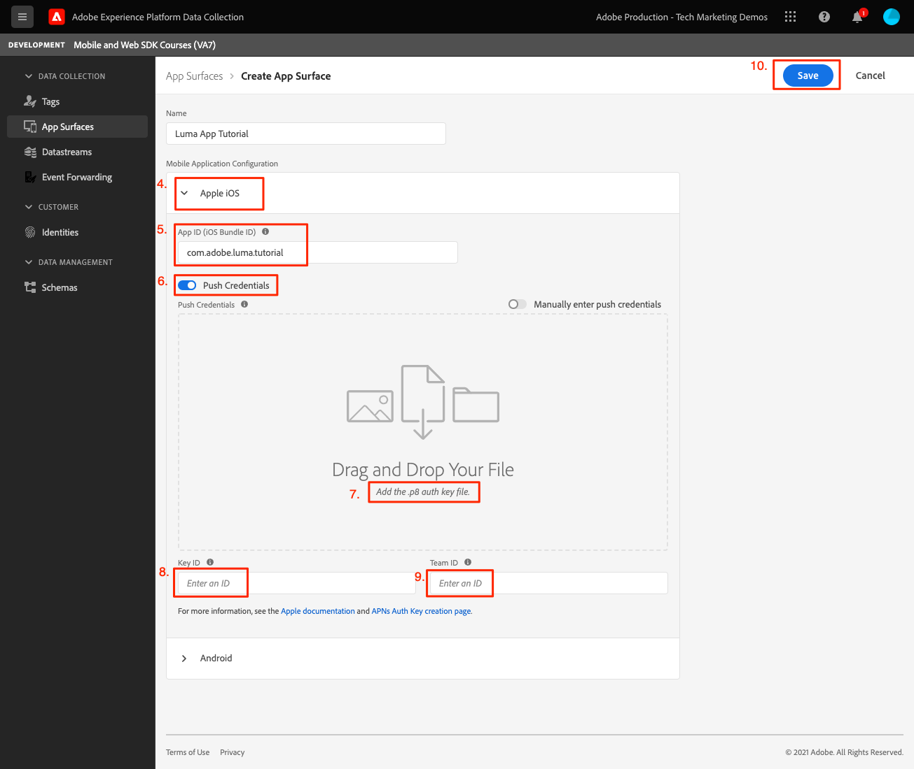
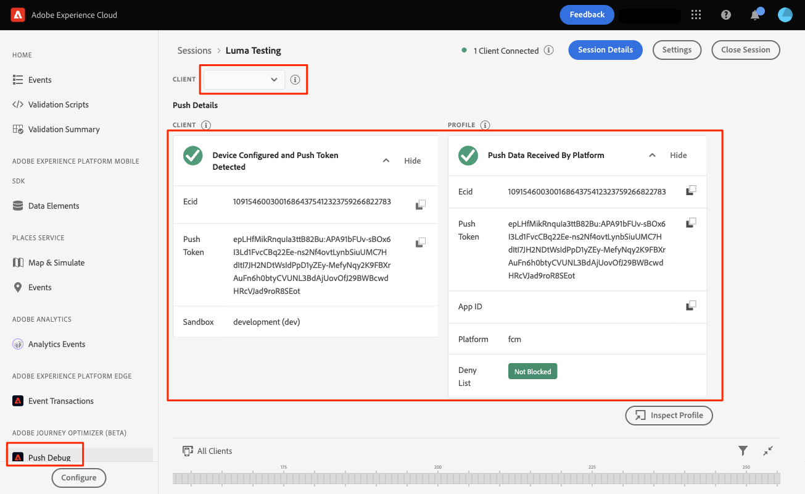

# Messaggi push Adobe Journey Optimizer

Scopri come creare messaggi push per le app mobili con Platform Mobile SDK e Adobe Journey Optimizer.

Journey Optimizer consente di creare percorsi e inviare messaggi a tipi di pubblico mirati. Prima di inviare notifiche push con Journey Optimizer, devi accertarti che siano presenti le configurazioni e le integrazioni corrette. Per comprendere il flusso di dati delle notifiche push in Adobe Journey Optimizer, consulta [la documentazione](https://experienceleague.adobe.com/docs/journey-optimizer/using/configuration/configuration-message/push-config/push-gs.html).

>[!NOTE]
>
>Questa lezione è facoltativa e si applica solo agli utenti Adobe Journey Optimizer che desiderano inviare messaggi push.


## Prerequisiti

* L’app è stata generata ed eseguita correttamente con gli SDK installati e configurati.
* Accesso a Adobe Journey Optimizer e autorizzazioni sufficienti come descritto [qui](https://experienceleague.adobe.com/docs/journey-optimizer/using/configuration/configuration-message/push-config/push-configuration.html?lang=en). È inoltre necessario disporre di autorizzazioni sufficienti per le seguenti funzionalità di Adobe Journey Optimizer.
   * Crea una superficie dell&#39;app.
   * Creare un percorso
   * Crea un messaggio.
   * Creare predefiniti per messaggi.
* Account sviluppatore Apple a pagamento con accesso sufficiente per creare certificati, identificatori e chiavi.
* Dispositivo iOS fisico per il test.

## Finalità di apprendimento

In questa lezione:

* Registra l&#39;ID app con il servizio APN (Apple Push Notification Service).
* Crea un **[!UICONTROL Superficie dell&#39;app]** in AJO.
* Aggiorna il tuo **[!UICONTROL schema]** per includere i campi dei messaggi push.
* Installa e configura il **[!UICONTROL Adobe Journey Optimizer]** estensione tag.
* Aggiorna l&#39;app per includere l&#39;estensione tag AJO.
* Convalida la configurazione in Assurance.
* Invia un messaggio di prova.


## Registrare l’ID app con APN

I passaggi seguenti non sono specifici per Adobe Experience Cloud e sono progettati per guidarti attraverso la configurazione APN.

### Crea un `.p8` chiave privata

1. Nel portale per gli sviluppatori di Apple, passa a **[!UICONTROL Chiavi]**.
1. Seleziona l’icona + per creare una chiave.
   

1. Fornisci un **[!UICONTROL Nome chiave]**.
1. Seleziona la **[!UICONTROL APN]** casella di controllo.
1. Seleziona **[!UICONTROL Continua]**.
   
1. Rivedi la configurazione e seleziona **[!UICONTROL Registro]**.
1. Scarica la `.p8` chiave privata. Viene utilizzato nella configurazione Superficie app.
1. Prendi nota del **[!UICONTROL ID chiave]**. Viene utilizzato nella configurazione Superficie app.

La documentazione aggiuntiva può essere [qui](https://help.apple.com/developer-account/#/devcdfbb56a3).

### Recupera l’ID del team per sviluppatori di Apple

1. Nel portale per gli sviluppatori di Apple, passa a **[!UICONTROL iscrizione]**.
1. Le **[!UICONTROL ID team]** è elencato insieme alle altre informazioni relative all&#39;iscrizione. Viene utilizzato nella configurazione Superficie app.

## Aggiungere le credenziali push dell&#39;app nella raccolta dati

1. Da [Interfaccia di raccolta dati](https://experience.adobe.com/data-collection/), seleziona la scheda Superfici app nel pannello a sinistra.
1. Seleziona **[!UICONTROL Creare superfici dell’app]** per creare una configurazione.
   
1. Inserisci un **[!UICONTROL Nome]** per la configurazione, ad esempio `Luma App Tutorial`  .
1. Da Configurazione applicazione mobile, seleziona **[!UICONTROL Apple iOS]**.
1. Immetti l’ID bundle dell’app mobile nel campo ID app (iOS Bundle ID) . Se segui insieme all’app Luma, quel valore è `com.adobe.luma.tutorial`.
1. Accendere **[!UICONTROL Credenziali push]** per aggiungere le credenziali.
1. Trascina e rilascia la `.p8` **Chiave di autenticazione delle notifiche push Apple** file.
1. Specifica l&#39;ID chiave, una stringa di 10 caratteri assegnata durante la creazione di `p8` chiave auth. Si trova nella scheda Tasti in **Certificati, identificatori e profili** pagina.
1. Specifica l&#39;ID team. Si tratta di un valore stringa che si trova nella variabile **iscrizione** scheda .
1. Seleziona **[!UICONTROL Salva]**.
   

## Installare l’estensione dei tag Adobe Journey Optimizer

1. Passa a [!UICONTROL Tag] > [!UICONTROL Estensioni] > [!UICONTROL Catalogo]e trova la **[!UICONTROL Adobe Journey Optimizer]** estensione.
1. Installa l&#39;estensione.
   
1. Seleziona `CJM Push Tracking Experience Event Dataset` set di dati di Adobe Experience Platform.
   
1. Seleziona **[!UICONTROL Salva nella libreria e genera]**.

>[!NOTE]
>Se non vedi &quot;CJM Push Tracking Experience Event Dataset&quot; come opzione, contatta l’assistenza clienti.

## Implementare Adobe Journey Optimizer nell’app

Come descritto nelle lezioni precedenti, l’installazione di un’estensione tag mobile fornisce solo la configurazione. Successivamente devi installare e registrare l’SDK per la messaggistica. Se questi passaggi non sono chiari, consulta la [Installare gli SDK](install-sdks.md) sezione .

>[!NOTE]
>
>Se hai completato la [Installare gli SDK](install-sdks.md) Quindi l&#39;SDK è già installato e puoi passare al passaggio #7.

1. Apri il tuo `Podfile` aggiungi la riga seguente e salva il file.

   `pod 'AEPMessaging', '~>1'`
1. Apri il terminale e passa alla cartella contenente il `Podfile`.
1. Installa l&#39;SDK eseguendo il comando `pod install`.
   
1. Apri XCode e passa a `AppDelegate.swift`.
1. Aggiungi quanto segue all’elenco delle importazioni.

   `import AEPMessaging`
1. Aggiungi `Messaging.self` all&#39;array di estensioni che si sta registrando.
1. Aggiungi la seguente funzione al file .

   ```swift
   func application(_: UIApplication, didRegisterForRemoteNotificationsWithDeviceToken deviceToken: Data) {
       MobileCore.setPushIdentifier(deviceToken)
   }
   ```

   Questa funzione recupera il token dispositivo univoco per il dispositivo su cui è installata l’app e lo invia ad Adobe/Apple per la consegna dei messaggi push.

## Convalida inviando un messaggio push di prova

1. Consulta la sezione [istruzioni di configurazione](assurance.md) sezione .
1. Installa l&#39;app sul tuo dispositivo fisico.
1. Avvia l’app utilizzando l’URL generato per l’affidabilità.
1. Invia l&#39;app in background.
1. Nell’interfaccia utente di Assurance, seleziona **[!UICONTROL Configura]**.
   
1. Seleziona la **[!UICONTROL +]** pulsante accanto a **[!UICONTROL Debug push]**.
1. Seleziona **[!UICONTROL Salva]**.
   
1. Seleziona **[!UICONTROL Debug push]** dalla navigazione a sinistra.
1. Seleziona il dispositivo dal **[!UICONTROL Elenco client]**.
1. Conferma di non ricevere errori.
   
1. Scorri verso il basso e seleziona **[!UICONTROL Invia notifica push di prova]**.
1. Conferma di non ricevere e di ricevere errori e di ricevere il messaggio sul dispositivo.
   

Avanti: **[Conclusione e fasi successive](conclusion.md)**

>[!NOTE]
>
>Grazie per aver investito il tuo tempo nell&#39;apprendimento dell&#39;SDK di Adobe Experience Platform Mobile. In caso di domande, se desideri condividere feedback generali o se hai suggerimenti su contenuti futuri, condividi questi su questo [Experience League Articolo di discussione della Comunità](https://experienceleaguecommunities.adobe.com/t5/adobe-experience-platform-launch/tutorial-discussion-implement-adobe-experience-cloud-in-mobile/td-p/443796)