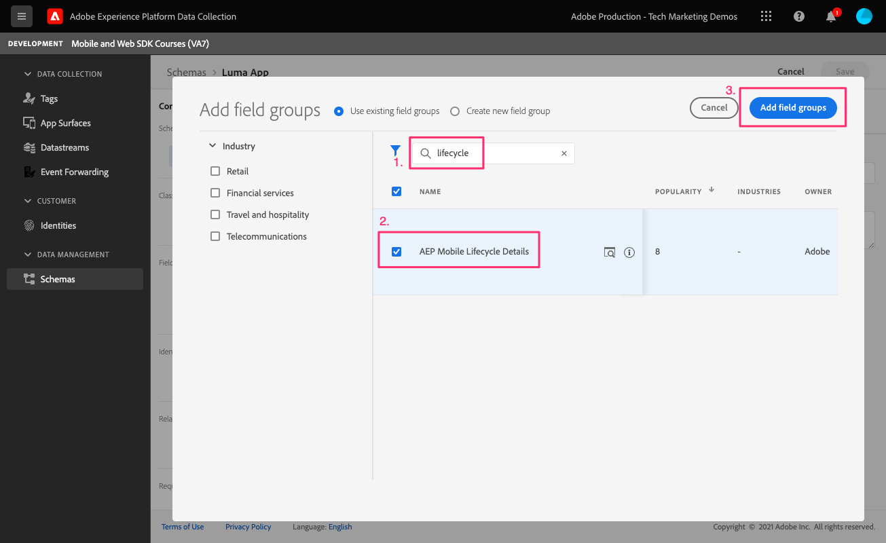

# Dati del ciclo di vita

Scopri come raccogliere i dati del ciclo di vita in un’app mobile.

>[!INFO]
>
> Questo tutorial verrà sostituito da un nuovo tutorial che utilizzerà una nuova app mobile di esempio a fine novembre 2023

L&#39;estensione del ciclo di vita Adobe Experience Platform Mobile SDK abilita la raccolta dei dati del ciclo di vita dalla tua app mobile. L’estensione Adobe Experience Platform Edge Network invia i dati del ciclo di vita alla rete Edge di Platform, dove vengono quindi inoltrati ad altre applicazioni e servizi in base alla configurazione dello stream di dati. Ulteriori informazioni su [Estensione del ciclo di vita](https://developer.adobe.com/client-sdks/documentation/lifecycle-for-edge-network/) nella documentazione del prodotto.


## Prerequisiti

* L&#39;app con gli SDK installati e configurati è stata creata ed eseguita correttamente.
* Importazione dell&#39;SDK Assurance.

  ```swift
  import AEPAssurance
  ```

* L&#39;estensione Assurance è stata registrata come descritto in [lezione precedente](install-sdks.md).

## Finalità di apprendimento

In questa lezione verranno fornite le seguenti informazioni:

* Aggiungi il gruppo di campi del ciclo di vita allo schema.
* Abilita metriche del ciclo di vita precise avviando/mettendo in pausa correttamente l’app mentre si sposta tra il primo piano e lo sfondo.
* Invia dati dall’app a Platform Edge Network.
* Convalida in Assurance.

## Aggiungi gruppo di campi del ciclo di vita allo schema

Il gruppo di campi Evento esperienza del consumatore aggiunto nel [lezione precedente](create-schema.md) contiene già i campi del ciclo di vita, quindi puoi saltare questo passaggio. Se non utilizzi il gruppo di campi Evento esperienza del consumatore nella tua app, puoi aggiungere i campi del ciclo di vita effettuando le seguenti operazioni:

1. Passa all’interfaccia dello schema come descritto in [lezione precedente](create-schema.md).
1. Apri lo schema &quot;App Luma&quot; e seleziona **[!UICONTROL Aggiungi]**.
   
1. Nella barra di ricerca, immettere &quot;lifecycle&quot;.
1. Seleziona la casella di controllo accanto a **[!UICONTROL Dettagli del ciclo di vita di AEP Mobile]**.
1. Seleziona **[!UICONTROL Aggiungi gruppi di campi]**.
   
1. Seleziona **[!UICONTROL Salva]**.
   


## Modifiche all’implementazione

Ora puoi aggiornare `AppDelegate.swift` per registrare gli eventi del ciclo di vita:

1. Quando viene avviata, se l&#39;app sta riprendendo da uno stato in background, iOS potrebbe chiamare il tuo `applicationWillEnterForeground:` metodo delegate. Add `lifecycleStart:`

   ```swift
   MobileCore.lifecycleStart(additionalContextData: nil)
   ```

1. Quando l’app entra in background, sospendi la raccolta di dati del ciclo di vita dall’app `applicationDidEnterBackground:` metodo delegate.

   ```swift
   MobileCore.lifecyclePause()
   ```

>[!NOTE]
>
>Per iOS 13 e versioni successive, consulta [documentazione](https://developer.adobe.com/client-sdks/documentation/mobile-core/lifecycle/#register-lifecycle-with-mobile-core-and-add-appropriate-startpause-calls) per un codice leggermente diverso.

## Convalida con garanzia

1. Rivedi [istruzioni di configurazione](assurance.md) e collegare il simulatore o il dispositivo ad Assurance.
1. Avvia l&#39;app.
1. Invia l&#39;app in background. Controlla `LifecyclePause`.
1. Porta l’app in primo piano. Controlla `LifecycleResume`.
   


## Inoltrare dati a Platform Edge Network

L’esercizio precedente invia gli eventi in primo piano e in background all’SDK di Mobile. Per inviare questi eventi a Platform Edge Network, segui i passaggi elencati [qui](https://developer.adobe.com/client-sdks/documentation/lifecycle-for-edge-network/#configure-a-rule-to-forward-lifecycle-metrics-to-platform). Una volta inviati a Platform Edge Network, gli eventi verranno inoltrati ad altre applicazioni e servizi in base alla configurazione dello stream di dati.

Dopo aver aggiunto la regola per inviare gli eventi del ciclo di vita a Platform Edge Network, dovresti vedere `Application Close (Background)` e `Application Launch (Foreground)` eventi contenenti dati XDM in Assurance.


Successivo: **[Tracciare gli eventi](events.md)**

>[!NOTE]
>
>Grazie per aver dedicato il tuo tempo all’apprendimento dell’SDK di Adobe Experience Platform Mobile. Se hai domande, vuoi condividere commenti generali o suggerimenti su contenuti futuri, condividili su questo [Experience League post di discussione community](https://experienceleaguecommunities.adobe.com/t5/adobe-experience-platform-launch/tutorial-discussion-implement-adobe-experience-cloud-in-mobile/td-p/443796)