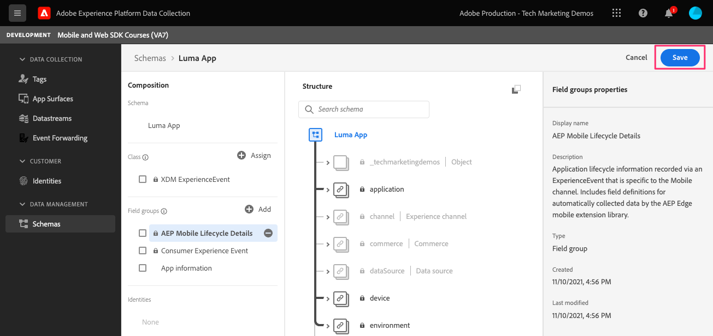
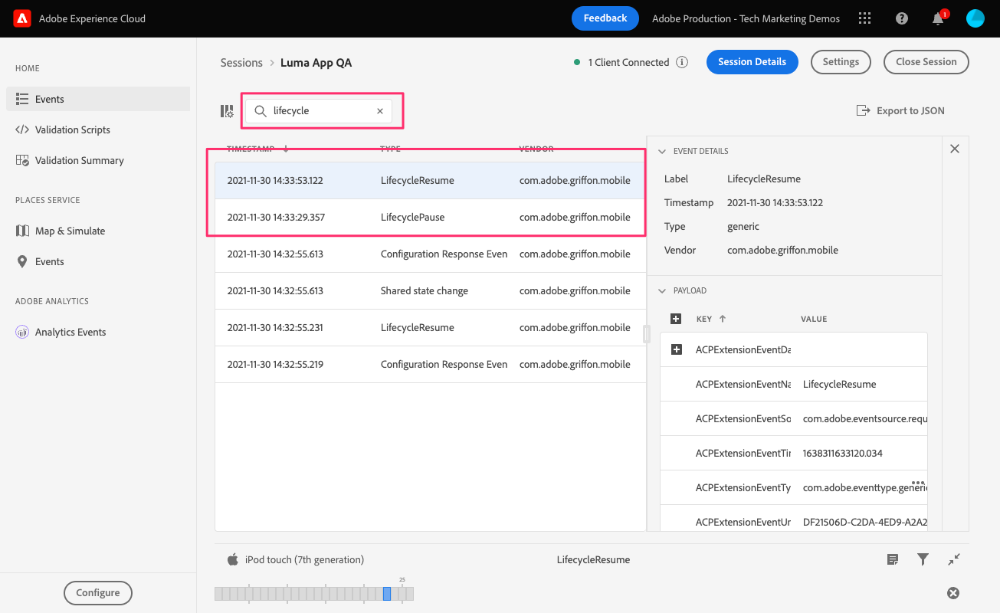

# Dati del ciclo di vita

Scopri come raccogliere i dati sul ciclo di vita in un’app mobile.

L’estensione del ciclo di vita Adobe Experience Platform Mobile SDK abilita i dati del ciclo di vita della raccolta dalla tua app mobile. L’estensione Adobe Experience Platform Edge Network invia questi dati del ciclo di vita a Platform Edge Network, per poi inoltrarli ad altre applicazioni e servizi in base alla configurazione del datastream. Ulteriori informazioni sulle [Estensione del ciclo di vita](https://aep-sdks.gitbook.io/docs/foundation-extensions/lifecycle-for-edge-network) nella documentazione del prodotto.


## Prerequisiti

* L’app è stata generata ed eseguita correttamente con gli SDK installati e configurati.
* Importazione dell’SDK di garanzia.

   ```swift
   import AEPAssurance
   ```

* È stata registrata l&#39;estensione Assurance come descritto nel [lezione precedente](install-sdks.md).

## Finalità di apprendimento

In questa lezione:

* Aggiungi il gruppo di campi del ciclo di vita allo schema.
* Abilita metriche accurate del ciclo di vita iniziando/mettendo in pausa correttamente mentre l&#39;app passa da un primo piano all&#39;altro.
* Invia dati dall’app a Platform Edge Network.
* Convalida in Assurance.

## Aggiungi gruppo di campi del ciclo di vita allo schema

Il gruppo di campi Evento esperienza consumatore aggiunto nel [lezione precedente](create-schema.md) contiene già i campi del ciclo di vita, per cui puoi saltare questo passaggio. Se non utilizzi il gruppo di campi Evento esperienza consumatore nella tua app, puoi aggiungere i campi del ciclo di vita facendo quanto segue:

1. Passa all’interfaccia dello schema come descritto in [lezione precedente](create-schema.md).
1. Apri lo schema &quot;Luma App&quot; e seleziona **[!UICONTROL Aggiungi]**.
   
1. Nella barra di ricerca, immetti &quot;lifecycle&quot; (ciclo di vita).
1. Seleziona la casella di controllo accanto a **[!UICONTROL Dettagli del ciclo di vita AEP Mobile]**.
1. Seleziona **[!UICONTROL Aggiungi gruppi di campi]**.
   
1. Seleziona **[!UICONTROL Salva]**.
   


## Modifiche all&#39;implementazione

Ora è possibile aggiornare `AppDelegate.swift` per registrare gli eventi del ciclo di vita:

1. Quando viene avviata, se l’app riprende da uno stato di background, iOS potrebbe chiamare la `applicationWillEnterForeground:` metodo delegato. Add `lifecycleStart:`

   ```swift
   MobileCore.lifecycleStart(additionalContextData: nil)
   ```

1. Quando l’app entra in background, sospendi la raccolta di dati del ciclo di vita dall’app `applicationDidEnterBackground:` metodo delegato.

   ```swift
   MobileCore.lifecyclePause()
   ```

>[!NOTE]
>
>Per iOS 13 e versioni successive, consulta [documentazione](https://aep-sdks.gitbook.io/docs/foundation-extensions/mobile-core/lifecycle#register-lifecycle-with-mobile-core-and-add-appropriate-start-pause-calls) per codice leggermente diverso.

## Convalida con affidabilità

1. Consulta la sezione [istruzioni di configurazione](assurance.md) e collegare il simulatore o il dispositivo a Assurance.
1. Avvia l&#39;app.
1. Invia l&#39;app in background. Verifica `LifecyclePause`.
1. Porta l&#39;app in primo piano. Verifica `LifecycleResume`.
   


## Inoltrare dati a Platform Edge Network

L’esercizio precedente invia gli eventi in primo piano e in background all’SDK di Mobile. Per inviare questi eventi a Platform Edge Network, segui i passaggi elencati [qui](https://aep-sdks.gitbook.io/docs/foundation-extensions/lifecycle-for-edge-network#configure-a-rule-to-forward-lifecycle-metrics-to-platform). Una volta inviati gli eventi a Platform Edge Network, verranno inoltrati ad altre applicazioni e servizi in base alla configurazione del datastream.

Dopo aver aggiunto la regola per inviare gli eventi del ciclo di vita a Platform Edge Network, dovresti visualizzare `Application Close (Background)` e `Application Launch (Foreground)` eventi contenenti dati XDM in Assurance.


Avanti: **[Tracciare gli eventi](events.md)**

>[!NOTE]
>
>Grazie per aver investito il tuo tempo nell&#39;apprendimento dell&#39;SDK di Adobe Experience Platform Mobile. In caso di domande, se desideri condividere feedback generali o se hai suggerimenti su contenuti futuri, condividi questi su questo [Experience League Articolo di discussione della Comunità](https://experienceleaguecommunities.adobe.com/t5/adobe-experience-platform-launch/tutorial-discussion-implement-adobe-experience-cloud-in-mobile/td-p/443796)